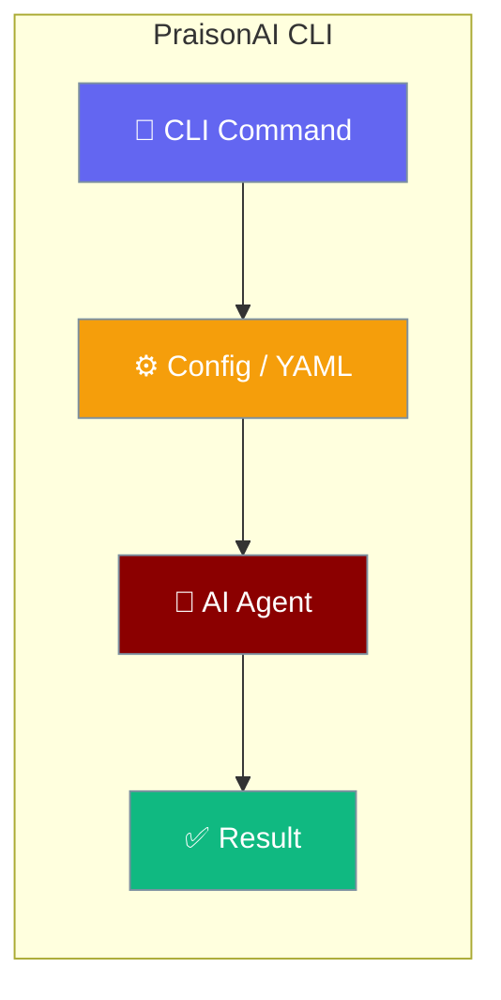
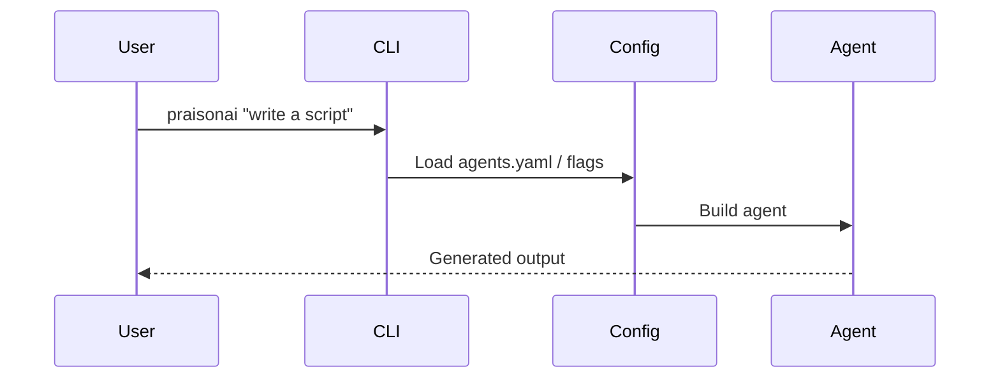

```python
from praisonaiagents import Agent

agent = Agent(name="cli-assistant", instructions="Help users with CLI commands.")
agent.start("List all available praisonai CLI commands.")
```

The user runs a `praisonai` command in the terminal; the CLI loads config and drives the agent to completion.


```mermaid
graph LR
    subgraph "PraisonAI CLI"
        Cmd[📝 CLI Command] --> Config[⚙️ Config / YAML]
        Config --> Agent[🤖 AI Agent]
        Agent --> Out[✅ Result]
    end

    classDef input fill:#6366F1,stroke:#7C90A0,color:#fff
    classDef process fill:#F59E0B,stroke:#7C90A0,color:#fff
    classDef agent fill:#8B0000,stroke:#7C90A0,color:#fff
    classDef output fill:#10B981,stroke:#7C90A0,color:#fff

    class Cmd input
    class Config process
    class Agent agent
    class Out output
```

## How It Works


```mermaid
sequenceDiagram
    participant User
    participant CLI
    participant Config
    participant Agent

    User->>CLI: praisonai "write a script"
    CLI->>Config: Load agents.yaml / flags
    Config->>Agent: Build agent
    Agent-->>User: Generated output
```

PraisonAI CLI provides a simple way to interact with AI agents directly from your terminal. You can run quick commands, specify LLM options, or use YAML configuration files for more complex scenarios.

<Frame>
  
</Frame>

## Quick Start

<Steps>
  <Step title="Install Package">
    Install the PraisonAI package:
    ```bash
    pip install praisonai
    ```
  </Step>

  <Step title="Set API Key">
    Set your OpenAI API key as an environment variable:
    ```bash
    export OPENAI_API_KEY="${OPENAI_API_KEY:?Set OPENAI_API_KEY in your shell}"
    ```
  </Step>
</Steps>

## Usage Examples

<AccordionGroup>
  <Accordion title="Simple Command" icon="terminal" defaultOpen>
    Run a simple command directly:
    ```bash
    praisonai "write a movie script in 3 lines"
    ```
  </Accordion>

  <Accordion title="With LLM Option" icon="wand-magic-sparkles" defaultOpen>
    Specify a different LLM model:
    ```bash
    praisonai "write a movie script in 3 lines" --llm gpt-4o-mini
    ```
  </Accordion>

  <Accordion title="Using YAML Config" icon="file-code" defaultOpen>
    Run agents defined in a YAML file:
    ```bash
    praisonai agents.yaml
    ```
  </Accordion>
</AccordionGroup>

## Configuration

<Tabs>
  <Tab title="Create Config">
    Initialize a new agents.yaml file for your project:
    ```bash
    praisonai --init "Create a movie script about AI"
    ```
    This will create an `agents.yaml` file with predefined configuration for your task.
    <Note>
    If no LLM provider is configured, `--init` prints provider-setup guidance (supporting OpenAI, Anthropic, Google/Gemini, Groq, Cohere, Ollama, OpenRouter and 100+ models via LiteLLM) and exits. Run [`praisonai setup`](/docs/cli/setup) first to configure a provider.
    </Note>
  </Tab>

  <Tab title="Auto Mode">
    Let PraisonAI automatically create and configure agents:
    ```bash
    praisonai --auto "Create a movie script about AI"
    ```
    This mode will analyze your task and set up appropriate agents automatically.
  </Tab>
</Tabs>

## Features

<CardGroup cols={2}>
  <Card title="Simple Commands" icon="terminal">
    Run AI tasks directly from your terminal with simple commands.
  </Card>
  <Card title="LLM Options" icon="wand-magic-sparkles">
    Choose from different LLM models for your specific needs.
  </Card>
  <Card title="YAML Support" icon="file-code">
    Use YAML files for complex agent configurations and workflows.
  </Card>
  <Card title="Auto Configuration" icon="robot">
    Automatic agent setup based on task requirements.
  </Card>
  <Card title="Model Catalogue" icon="microchip" href="/docs/features/models-cli">
    Discover, describe, and validate LLM models from the CLI.
  </Card>
</CardGroup>

## Validate CLI

Validate YAML configuration files before running:

```bash
# Validate a single file
praisonai validate agents.yaml

# Validate all YAML files in a directory
praisonai validate check . --strict

# Print the full configuration schema
praisonai validate schema

# JSON output for CI
praisonai validate agents.yaml --json
```

| Subcommand | Purpose |
|------------|---------|
| `validate <file>` | Validate a single YAML config |
| `validate check [dir]` | Scan a directory for YAML errors |
| `validate schema` | Print schema fields, types, and required markers |

See the [Validate CLI reference](/docs/cli/validate) for all flags and output formats.

---

## Discovering Models

Browse the full model catalogue, inspect capabilities and costs, or validate a model ID before running an agent:

```bash
# List all available models
praisonai models list

# Filter by provider
praisonai models list --provider openai

# Inspect a specific model
praisonai models describe gpt-4o

# Validate a model ID (shows suggestions on typos)
praisonai models validate gpt-4o-mni
```

<Card title="Model Catalogue" icon="microchip" href="/docs/features/models-cli">
  Full reference for `praisonai models list`, `describe`, and `validate`
</Card>

## Workflow CLI

Manage and execute YAML workflows directly from the command line:

```bash
# Run a YAML workflow
praisonai workflow run research.yaml

# Run with variables
praisonai workflow run research.yaml --var topic="AI trends"

# Validate a workflow
praisonai workflow validate research.yaml

# Create from template (simple, routing, parallel, loop)
praisonai workflow template routing --output my_workflow.yaml

# Auto-generate a workflow from topic
praisonai workflow auto "Research AI trends" --pattern parallel

# List available workflows
praisonai workflow list

# Show help
praisonai workflow help
```

### Workflow CLI Options

| Flag | Description |
|------|-------------|
| `--var key=value` | Set variable for YAML workflows |
| `--pattern <pattern>` | Pattern for auto-generation (sequential, parallel, routing, loop) |
| `--output <file>` | Output file for templates/auto-generation |
| `--planning` | Enable planning mode |
| `--reasoning` | Enable reasoning mode |
| `--verbose` | Enable verbose output |
| `--save` | Save output to file |

## Next Steps

<CardGroup cols={2}>
  <Card title="YAML Workflows" icon="file-code" href="/docs/features/yaml-workflows">
    Learn about YAML workflow configuration and patterns
  </Card>
  <Card title="Workflow Patterns" icon="diagram-project" href="/docs/features/workflow-patterns">
    Explore routing, parallel, loop, and repeat patterns
  </Card>
  <Card title="API Reference" icon="code" href="/api-reference">
    View the complete API documentation
  </Card>
</CardGroup>

## Best Practices

<AccordionGroup>
  <Accordion title="Validate YAML before running">
    Catch schema errors early with `praisonai validate agents.yaml` (or `praisonai validate check . --strict` for a whole directory) before executing a workflow. In CI, add `--json` for machine-readable output so a broken config fails the pipeline instead of the agent run.
  </Accordion>

  <Accordion title="Pin the model per command">
    A bare `praisonai "..."` uses the default provider. Pass `--llm` to make each invocation reproducible and cost-predictable:

    ```bash
    praisonai "write a movie script in 3 lines" --llm gpt-4o-mini
    ```

    Confirm an ID exists first with `praisonai models validate gpt-4o-mini` to avoid silent typos.
  </Accordion>

  <Accordion title="Start with --init, graduate to YAML">
    Use `praisonai --init "task"` to scaffold an `agents.yaml`, then edit and re-run with `praisonai agents.yaml`. This keeps one-off prompts fast while giving repeatable, version-controlled configs for anything you run more than once.
  </Accordion>

  <Accordion title="Use --var to keep workflows reusable">
    Parameterise workflow YAML instead of hard-coding values so one file serves many runs:

    ```bash
    praisonai workflow run research.yaml --var topic="AI trends"
    ```
  </Accordion>
</AccordionGroup>

## Related

<CardGroup cols={2}>
  <Card icon="file-code" href="/features/config-file">
    Structure agents and tasks in a reusable YAML config file.
  </Card>
  <Card icon="microchip" href="/features/models-cli">
    Discover, describe, and validate LLM models from the terminal.
  </Card>
</CardGroup>