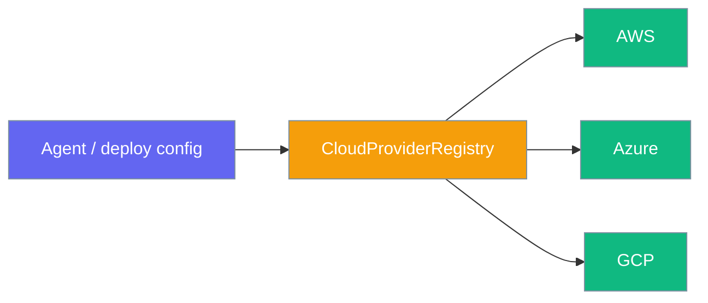
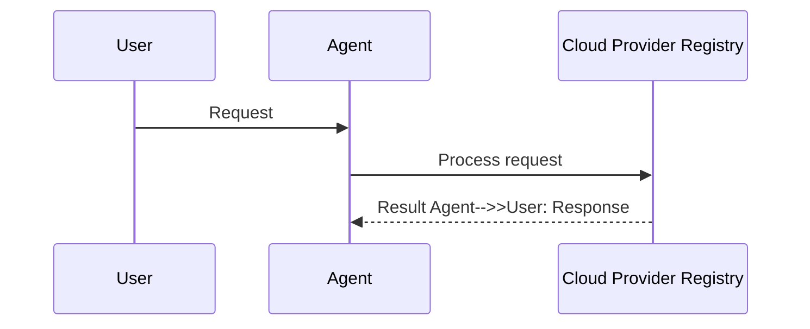

Deploy your agent to AWS, Azure or GCP with the same command — swap providers by name.


```python
from praisonaiagents import Agent

agent = Agent(name="deploy", instructions="Package this agent for cloud deployment.")
agent.start("Deploy to AWS with the default registry entry.")
```

The user picks AWS, Azure, or GCP by name; the registry resolves the same deploy command to the right cloud backend.



## How It Works




## Quick Start

<Steps>
<Step title="Deploy to a built-in provider">
Deploy with the CLI — provider name selects the backend:

```python
from praisonaiagents import Agent

agent = Agent(
    name="ProductionBot",
    instructions="You are a production assistant.",
)
```

```bash
praisonai deploy cloud --provider aws --file deploy.yaml
praisonai deploy doctor --provider azure
```
</Step>

<Step title="Register a custom cloud provider at runtime">
Override or add a provider without a pip package:

```python
from praisonai.deploy.providers._registry import CloudProviderRegistry
from praisonai.deploy.providers.base import BaseCloudProvider

class MyCloudProvider(BaseCloudProvider):
    def deploy(self, config):
        ...

registry = CloudProviderRegistry.default()
registry.register("my-cloud", MyCloudProvider)
```
</Step>

<Step title="Distribute as a pip plugin">
Ship a provider others can install:

```toml
# pyproject.toml
[project.entry-points."praisonai.deploy.providers"]
my-cloud = "my_pkg.deploy:MyCloudProvider"
```

```bash
pip install my-praisonai-cloud
praisonai deploy cloud --provider my-cloud --file deploy.yaml
```
</Step>
</Steps>

---

## Built-in Providers

| Name | Class | CLI flag |
|------|-------|----------|
| `aws` | `AWSProvider` | `--provider aws` |
| `azure` | `AzureProvider` | `--provider azure` |
| `gcp` | `GCPProvider` | `--provider gcp` |

Entry-point group: `praisonai.deploy.providers`

---

## Deploy Guides

<CardGroup cols={2}>
<Card title="AWS Deploy" icon="aws" href="/docs/deploy/cli/aws">
  CLI deploy to AWS
</Card>
<Card title="Azure Deploy" icon="microsoft" href="/docs/deploy/cli/azure">
  CLI deploy to Azure
</Card>
<Card title="GCP Deploy" icon="google" href="/docs/deploy/cli/gcp">
  CLI deploy to GCP
</Card>
</CardGroup>

---

## Best Practices

<AccordionGroup>
<Accordion title="Credential management">
Use cloud-native secret stores (AWS Secrets Manager, Azure Key Vault, GCP Secret Manager) rather than embedding credentials in `deploy.yaml`.
</Accordion>

<Accordion title="Region selection">
Pin regions in your deploy config to keep latency and data residency predictable. Run `praisonai deploy doctor --provider aws` before first deploy.
</Accordion>

<Accordion title="Cost guards">
Set resource limits and autoscaling caps in provider-specific config blocks — the registry only selects *which* provider runs; cost control stays in your YAML.
</Accordion>
</AccordionGroup>

---

## Related

<CardGroup cols={2}>
<Card title="Deploy Overview" icon="rocket" href="/docs/deploy/index">
  Full deployment guide
</Card>
<Card title="Registry Dependency Injection" icon="puzzle-piece" href="/docs/features/registry-dependency-injection">
  Isolated registries for multi-tenant deploy
</Card>
</CardGroup>
