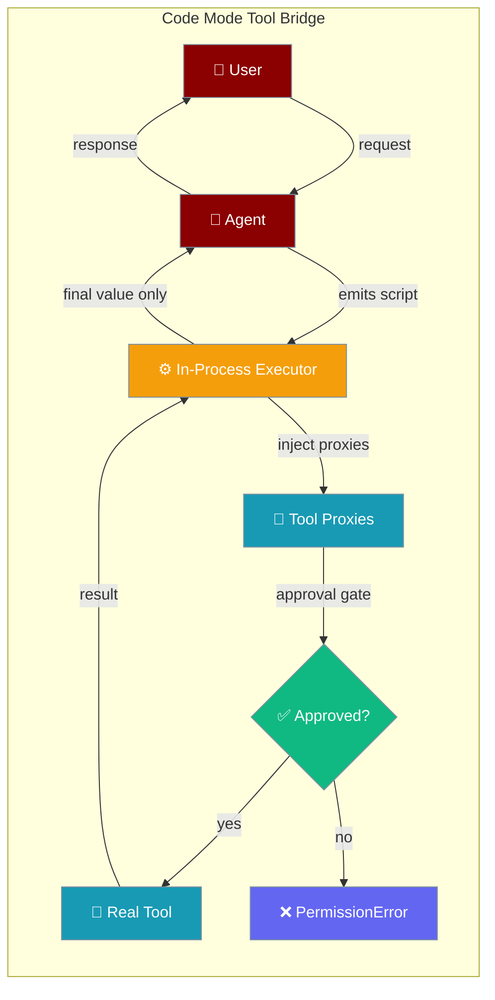
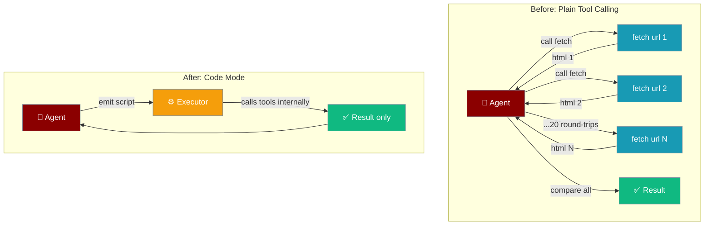
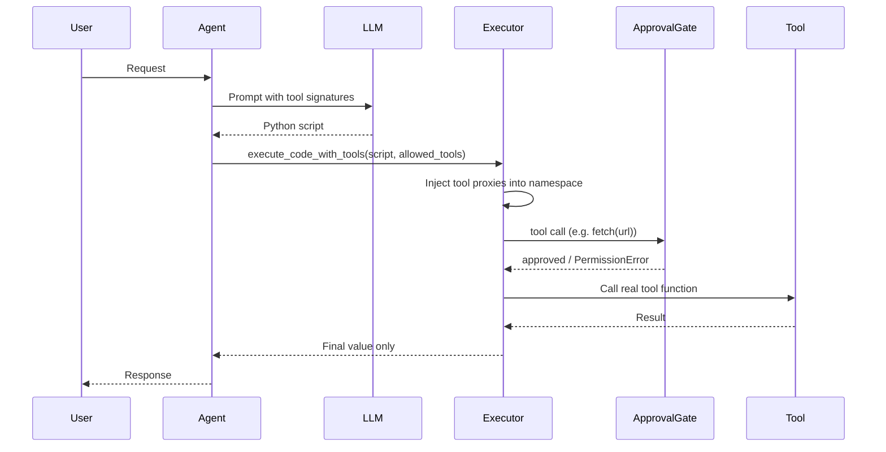
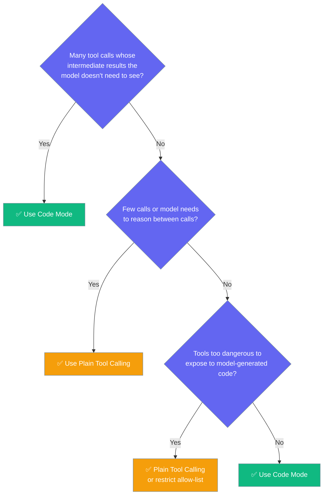

Model-generated code can call your registered tools directly, collapsing multi-step tool pipelines into a single LLM turn.



## Quick Start

<Steps>

<Step title="Enable Tool Bridge on an Agent">
Register tools on the agent and enable `code_tools` in `ExecutionConfig`.

```python
from praisonaiagents import Agent, ExecutionConfig

def fetch(url: str) -> str:
    import urllib.request
    with urllib.request.urlopen(url) as r:
        return r.read(4096).decode()

def extract_price(html: str) -> float:
    import re
    m = re.search(r'\$([0-9]+\.[0-9]{2})', html)
    return float(m.group(1)) if m else 0.0

agent = Agent(
    name="Cheapest Picker",
    instructions="Find the cheapest item across the given URLs.",
    tools=[fetch, extract_price],
    execution=ExecutionConfig(
        code_execution=True,
        code_tools=True,
        code_tools_allow=["fetch", "extract_price"],
    ),
)

agent.start("Compare prices at https://example.com/a and https://example.com/b and return the cheapest.")
```
</Step>

<Step title="Low-Level: Call the Executor Directly">
Use `execute_code_with_tools` when you need to run a script outside an agent.

```python
from praisonaiagents.tools import execute_code_with_tools

def fetch(url: str) -> str:
    return f"<price>$9.99</price>"

def extract_price(html: str) -> float:
    import re
    m = re.search(r'\$([0-9]+\.[0-9]{2})', html)
    return float(m.group(1)) if m else 0.0

result = execute_code_with_tools(
    code="""
urls = ['https://example.com/a', 'https://example.com/b']
best = min(extract_price(fetch(u)) for u in urls)
best
""",
    allowed_tools=["fetch", "extract_price"],
)
print(result["result"])   # 9.99
```
</Step>

</Steps>

---

## Why Use Code Mode?

Before code mode, fetching 20 URLs required 20 LLM round-trips and 20 page bodies entering the context window.

After code mode, the model emits one short script — `best = min(extract_price(fetch(u)) for u in urls)` — executed in a single turn. Only the final value returns to the model.



**Three wins:**
- **Fewer LLM round-trips** — one turn instead of N
- **Less context-window pollution** — intermediate results never enter the model
- **Lower cost and latency** — especially on tool-heavy pipelines

---

## How It Works



Intermediate tool results stay inside the executor and never re-enter the model's context.

---

## When to Use Code Mode



---

## Configuration Options

| Option | Type | Default | Description |
|--------|------|---------|-------------|
| `code_tools` | `bool` | `False` | When `True`, model-generated code may call the agent's registered tools via injected proxies. |
| `code_tools_allow` | `Optional[List[str]]` | `None` | Explicit per-run allow-list of tool names callable from code. `None` or empty = no tools exposed (safe default). |

Both options live on `ExecutionConfig` alongside `code_execution` and `code_mode`.

```python
from praisonaiagents import Agent, ExecutionConfig

agent = Agent(
    name="Pipeline Agent",
    instructions="Process data efficiently.",
    tools=[fetch, parse, filter_results],
    execution=ExecutionConfig(
        code_execution=True,
        code_tools=True,
        code_tools_allow=["fetch", "parse", "filter_results"],
    ),
)
```

---

## Safety

<Warning>
Code mode is **opt-in** and requires an explicit allow-list. Tools not on the allow-list cannot be called from model-generated code, even if registered on the agent.
</Warning>

- **Opt-in only** — `code_tools=False` by default; no tools are exposed unless you set `code_tools=True`.
- **Explicit allow-list required** — `code_tools_allow=None` (the default) exposes zero tools. You must name each tool.
- **Every call passes the approval gate** — `require_approval`, allow-lists, and `PRAISON_AUTO_APPROVE` env var all apply on every invocation.
- **Approval is not sticky** — a single approval does not silently unlock later calls in the same script.
- **Disallowed tool → `PermissionError`** — attempting to call a tool not on the allow-list raises `PermissionError`.
- **Unregistered tool → `NameError`** — calling a name that isn't registered raises `NameError`.
- **Reserved name `"tools"` → `ValueError`** — you cannot add `"tools"` to the allow-list; it is always the namespace object.
- **Imports and dangerous builtins remain blocked** — AST + blocklist checks from `execute_code` still apply in code mode.
- **In-process execution** — the subprocess sandbox cannot see the tool registry, so code mode deliberately runs in-process. The `ToolProxy` stores its registry and allow-list in a closure that sandboxed code cannot reach.

```python
# PermissionError: tool not on allow-list
result = execute_code_with_tools(
    code="delete_everything()",
    allowed_tools=["fetch"],   # delete_everything not listed
)

# ValueError: reserved name
execute_code_with_tools(
    code="tools.fetch('http://example.com')",
    allowed_tools=["tools"],   # raises ValueError
)
```

---

## Common Patterns

### Map/Reduce Over a URL List

```python
from praisonaiagents import Agent, ExecutionConfig

def fetch(url: str) -> str:
    import urllib.request
    with urllib.request.urlopen(url) as r:
        return r.read(2048).decode()

def extract_price(html: str) -> float:
    import re
    m = re.search(r'\$([0-9]+\.[0-9]{2})', html)
    return float(m.group(1)) if m else 0.0

agent = Agent(
    name="Price Checker",
    instructions="Return the cheapest price found across the URLs.",
    tools=[fetch, extract_price],
    execution=ExecutionConfig(
        code_execution=True,
        code_tools=True,
        code_tools_allow=["fetch", "extract_price"],
    ),
)

agent.start("Find the cheapest across https://example.com/a https://example.com/b https://example.com/c")
```

### Pipeline: Fetch → Parse → Filter → Summarize

```python
from praisonaiagents import Agent, ExecutionConfig

def fetch(url: str) -> str: ...
def parse_records(html: str) -> list: ...
def filter_active(records: list) -> list: ...
def summarize(records: list) -> str: ...

agent = Agent(
    name="Data Pipeline",
    instructions="Fetch, parse, filter active records, and summarize.",
    tools=[fetch, parse_records, filter_active, summarize],
    execution=ExecutionConfig(
        code_execution=True,
        code_tools=True,
        code_tools_allow=["fetch", "parse_records", "filter_active", "summarize"],
    ),
)

agent.start("Process https://example.com/data")
```

### Bare-Name vs Namespaced Calls

Inside the script, tools are callable two ways:

```python
from praisonaiagents.tools import execute_code_with_tools

def double(x: int) -> int:
    return x * 2

result = execute_code_with_tools(
    code="""
# Bare-name call
a = double(5)

# Namespaced call (equivalent)
b = tools.double(x=5)

a + b
""",
    allowed_tools=["double"],
)
print(result["result"])  # 20
```

---

## Best Practices

<AccordionGroup>

<Accordion title="Keep the allow-list as small as possible">
Only list the tools that the script genuinely needs. A smaller allow-list limits the blast radius if the model generates unexpected code.

```python
# Good: minimal allow-list
code_tools_allow=["fetch", "extract_price"]

# Avoid: exposing every tool
code_tools_allow=["fetch", "extract_price", "delete_record", "send_email"]
```
</Accordion>

<Accordion title="Don't allow-list tools that mutate external state without approval">
Tools that write to databases, send emails, or delete records should require explicit approval. Configure `require_approval=True` or use a webhook approval backend before allow-listing them.
</Accordion>

<Accordion title="Prefer code mode only when intermediate results are bulky or numerous">
For two or three lightweight tool calls where the model needs to reason about each result, plain tool calling is simpler and easier to debug.
</Accordion>

<Accordion title="Register helper tools instead of importing libraries in the script">
Imports in model-generated code are blocked by AST checks. Pre-register Python functions as tools so the model can call them instead of importing.

```python
# Wrong: model tries to import inside the script
# import json  # blocked!

# Right: register a helper tool
def parse_json(text: str) -> dict:
    import json
    return json.loads(text)

agent = Agent(..., tools=[parse_json], ...)
```
</Accordion>

</AccordionGroup>

---

## Related

<CardGroup cols={2}>
  <Card title="Sandbox" icon="shield-halved" href="/docs/features/sandbox">
    Secure isolated environments for code execution — note that subprocess sandboxes cannot see the tool registry.
  </Card>
  <Card title="Approval" icon="check-circle" href="/docs/features/approval">
    Configure tool approval gates that apply on every call in code mode.
  </Card>
  <Card title="Allowed Tools" icon="list-check" href="/docs/features/allowed-tools">
    Environment-level and agent-level tool allow-lists.
  </Card>
  <Card title="Code Agent" icon="code" href="/docs/features/codeagent">
    AI agents that write and execute Python code using external interpreters.
  </Card>
</CardGroup>
