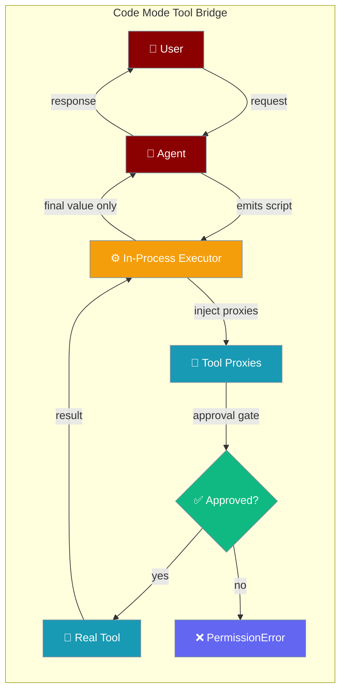
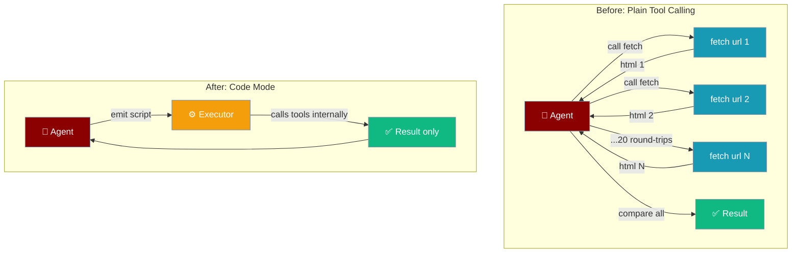
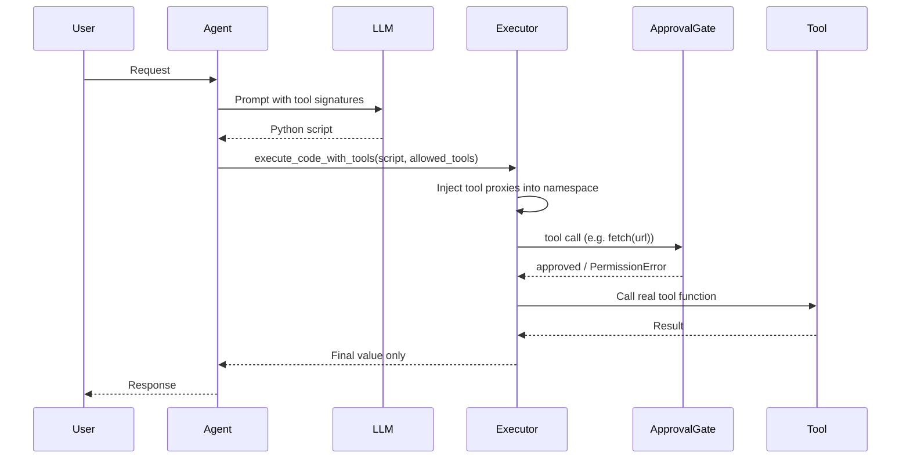
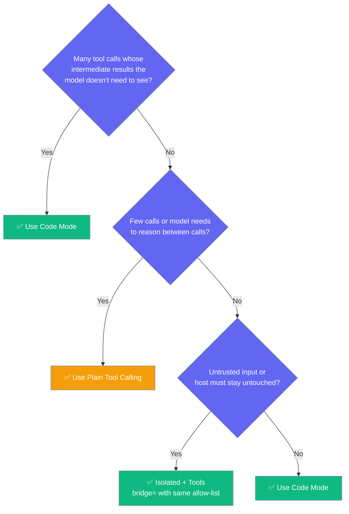
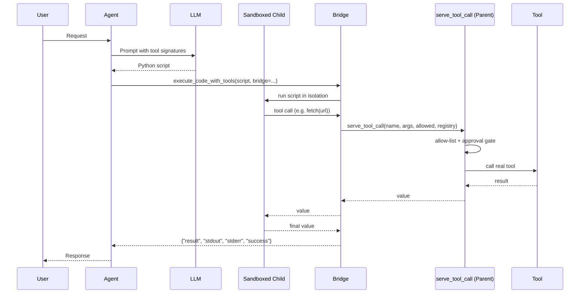

Model-generated code can call your registered tools directly, collapsing multi-step tool pipelines into a single LLM turn.

```python
from praisonaiagents import Agent, ExecutionConfig

agent = Agent(
    name="bridge-agent",
    instructions="Use code mode to chain tools in one turn.",
    execution=ExecutionConfig(code_tools=True),
)
agent.start("Fetch weather and format a summary in one script.")
```

The user asks for a multi-step task; the agent emits code that calls registered tools through the in-process bridge.


```mermaid
graph LR
    subgraph "Code Mode Tool Bridge"
        U[👤 User] -->|request| A[🤖 Agent]
        A -->|emits script| E[⚙️ In-Process Executor]
        E -->|inject proxies| P[🔗 Tool Proxies]
        P -->|approval gate| G{✅ Approved?}
        G -->|yes| T[🔧 Real Tool]
        G -->|no| ER[❌ PermissionError]
        T -->|result| E
        E -->|final value only| A
        A -->|response| U
    end

    classDef agent fill:#8B0000,stroke:#7C90A0,color:#fff
    classDef executor fill:#F59E0B,stroke:#7C90A0,color:#fff
    classDef proxy fill:#189AB4,stroke:#7C90A0,color:#fff
    classDef result fill:#10B981,stroke:#7C90A0,color:#fff
    classDef error fill:#6366F1,stroke:#7C90A0,color:#fff

    classDef agent fill:#8B0000,color:#fff
    classDef tool fill:#189AB4,color:#fff
    class U,A agent
    class E executor
    class P,T proxy
    class G,result result
    class ER error
```

## Quick Start

<Steps>

<Step title="Enable Tool Bridge on an Agent">
Register tools on the agent and enable `code_tools` in `ExecutionConfig`.

```python
from praisonaiagents import Agent, ExecutionConfig

def fetch(url: str) -> str:
    import urllib.request
    with urllib.request.urlopen(url) as r:
        return r.read(4096).decode()

def extract_price(html: str) -> float:
    import re
    m = re.search(r'\$([0-9]+\.[0-9]{2})', html)
    return float(m.group(1)) if m else 0.0

agent = Agent(
    name="Cheapest Picker",
    instructions="Find the cheapest item across the given URLs.",
    tools=[fetch, extract_price],
    execution=ExecutionConfig(
        code_execution=True,
        code_tools=True,
        code_tools_allow=["fetch", "extract_price"],
    ),
)

agent.start("Compare prices at https://example.com/a and https://example.com/b and return the cheapest.")
```
</Step>

<Step title="Low-Level: Call the Executor Directly">
Use `execute_code_with_tools` when you need to run a script outside an agent.

```python
from praisonaiagents.tools import execute_code_with_tools

def fetch(url: str) -> str:
    return f"<price>$9.99</price>"

def extract_price(html: str) -> float:
    import re
    m = re.search(r'\$([0-9]+\.[0-9]{2})', html)
    return float(m.group(1)) if m else 0.0

result = execute_code_with_tools(
    code="""
urls = ['https://example.com/a', 'https://example.com/b']
best = min(extract_price(fetch(u)) for u in urls)
best
""",
    allowed_tools=["fetch", "extract_price"],
)
print(result["result"])   # 9.99
```
</Step>

</Steps>

---

## Why Use Code Mode?

Before code mode, fetching 20 URLs required 20 LLM round-trips and 20 page bodies entering the context window.

After code mode, the model emits one short script — `best = min(extract_price(fetch(u)) for u in urls)` — executed in a single turn. Only the final value returns to the model.


```mermaid
graph TB
    subgraph "Before: Plain Tool Calling"
        A1[🤖 Agent] -->|call fetch| T1[fetch url 1]
        T1 -->|html 1| A1
        A1 -->|call fetch| T2[fetch url 2]
        T2 -->|html 2| A1
        A1 -->|...20 round-trips| TN[fetch url N]
        TN -->|html N| A1
        A1 -->|compare all| R1[✅ Result]
    end

    subgraph "After: Code Mode"
        A2[🤖 Agent] -->|emit script| E2[⚙️ Executor]
        E2 -->|calls tools internally| R2[✅ Result only]
        R2 --> A2
    end

    classDef agent fill:#8B0000,stroke:#7C90A0,color:#fff
    classDef tool fill:#189AB4,stroke:#7C90A0,color:#fff
    classDef result fill:#10B981,stroke:#7C90A0,color:#fff
    classDef exec fill:#F59E0B,stroke:#7C90A0,color:#fff

    class A1,A2 agent
    class T1,T2,TN tool
    class R1,R2 result
    class E2 exec
```

**Three wins:**
- **Fewer LLM round-trips** — one turn instead of N
- **Less context-window pollution** — intermediate results never enter the model
- **Lower cost and latency** — especially on tool-heavy pipelines

---

## How It Works


```mermaid
sequenceDiagram
    participant User
    participant Agent
    participant LLM
    participant Executor
    participant ApprovalGate
    participant Tool

    User->>Agent: Request
    Agent->>LLM: Prompt with tool signatures
    LLM-->>Agent: Python script
    Agent->>Executor: execute_code_with_tools(script, allowed_tools)
    Executor->>Executor: Inject tool proxies into namespace
    Executor->>ApprovalGate: tool call (e.g. fetch(url))
    ApprovalGate-->>Executor: approved / PermissionError
    Executor->>Tool: Call real tool function
    Tool-->>Executor: Result
    Executor-->>Agent: Final value only
    Agent-->>User: Response
```

Intermediate tool results stay inside the executor and never re-enter the model's context.

---

## When to Use Code Mode


```mermaid
graph TB
    Q1{Many tool calls whose<br/>intermediate results the<br/>model doesn't need to see?}
    Q1 -->|Yes| CM[✅ Use Code Mode]
    Q1 -->|No| Q2{Few calls or model needs<br/>to reason between calls?}
    Q2 -->|Yes| PT[✅ Use Plain Tool Calling]
    Q2 -->|No| Q3{Untrusted input or<br/>host must stay untouched?}
    Q3 -->|Yes| BR[✅ Isolated + Tools<br/>bridge= with same allow-list]
    Q3 -->|No| CM2[✅ Use Code Mode]

    classDef yes fill:#10B981,stroke:#7C90A0,color:#fff
    classDef no fill:#F59E0B,stroke:#7C90A0,color:#fff
    classDef q fill:#6366F1,stroke:#7C90A0,color:#fff

    class CM,CM2,BR yes
    class PT no
    class Q1,Q2,Q3 q
```

---

## Configuration Options

| Option | Type | Default | Description |
|--------|------|---------|-------------|
| `code_tools` | `bool` | `False` | When `True`, model-generated code may call the agent's registered tools via injected proxies. |
| `code_tools_allow` | `Optional[List[str]]` | `None` | Explicit per-run allow-list of tool names callable from code. `None` or empty = no tools exposed (safe default). |

Both options live on `ExecutionConfig` alongside `code_execution` and `code_mode`.

```python
from praisonaiagents import Agent, ExecutionConfig

agent = Agent(
    name="Pipeline Agent",
    instructions="Process data efficiently.",
    tools=[fetch, parse, filter_results],
    execution=ExecutionConfig(
        code_execution=True,
        code_tools=True,
        code_tools_allow=["fetch", "parse", "filter_results"],
    ),
)
```

---

## Safety

<Warning>
Code mode is **opt-in** and requires an explicit allow-list. Tools not on the allow-list cannot be called from model-generated code, even if registered on the agent.
</Warning>

- **Opt-in only** — `code_tools=False` by default; no tools are exposed unless you set `code_tools=True`.
- **Explicit allow-list required** — `code_tools_allow=None` (the default) exposes zero tools. You must name each tool.
- **Every call passes the approval gate** — `require_approval`, allow-lists, and `PRAISON_AUTO_APPROVE` env var all apply on every invocation.
- **Approval is not sticky** — a single approval does not silently unlock later calls in the same script.
- **Disallowed tool → `PermissionError`** — attempting to call a tool not on the allow-list raises `PermissionError`.
- **Unregistered tool → `NameError`** — calling a name that isn't registered raises `NameError`.
- **Reserved name `"tools"` → `ValueError`** — you cannot add `"tools"` to the allow-list; it is always the namespace object.
- **Imports and dangerous builtins remain blocked** — AST + blocklist checks from `execute_code` still apply in code mode.
- **Two execution paths** — code mode runs either in-process or isolated:
  - **In-process (default)** — no `bridge=`, same as today. The `ToolProxy` stores its registry and allow-list in a closure that in-process code cannot reach.
  - **Isolated + tool-capable (opt-in)** — supply a `CodeToolBridge`; the script runs under isolation and tool calls are serviced in the parent via `serve_tool_call`, gated by the **same** allow-list and approval gate. The parent never trusts the child — the allow-list, registry, timeout, and max output size are all forwarded to the bridge, so the transport is gated by the caller's policy, not its own defaults.

```python
# PermissionError: tool not on allow-list
result = execute_code_with_tools(
    code="delete_everything()",
    allowed_tools=["fetch"],   # delete_everything not listed
)

# ValueError: reserved name
execute_code_with_tools(
    code="tools.fetch('http://example.com')",
    allowed_tools=["tools"],   # raises ValueError
)
```

---

## Isolated Code with Tools (Bridge)

Run code mode inside a sandbox while still calling registered tools — same allow-list, same approval gate, no in-process execution.


```mermaid
sequenceDiagram
    participant User
    participant Agent
    participant LLM
    participant Child as Sandboxed Child
    participant Bridge
    participant Parent as serve_tool_call (Parent)
    participant Tool

    User->>Agent: Request
    Agent->>LLM: Prompt with tool signatures
    LLM-->>Agent: Python script
    Agent->>Bridge: execute_code_with_tools(script, bridge=...)
    Bridge->>Child: run script in isolation
    Child->>Bridge: tool call (e.g. fetch(url))
    Bridge->>Parent: serve_tool_call(name, args, allowed, registry)
    Parent->>Parent: allow-list + approval gate
    Parent->>Tool: call real tool
    Tool-->>Parent: result
    Parent-->>Bridge: value
    Bridge-->>Child: value
    Child-->>Bridge: final value
    Bridge-->>Agent: {"result", "stdout", "stderr", "success"}
    Agent-->>User: Response
```

Supply a `bridge=` object that implements `run_code`. The transport calls `serve_tool_call` in the parent for every tool request marshalled from the isolated child — never a weaker path than the in-process proxy.

```python
from praisonaiagents.tools import (
    execute_code_with_tools, CodeToolBridge, serve_tool_call,
)

class MySubprocessBridge:
    """Minimal bridge that runs code in a subprocess and services tool calls
    in the parent via serve_tool_call."""
    def run_code(self, code, *, allowed_tools=(), registry=None,
                 timeout=30, max_output_size=10000):
        # (transport-specific: send code to child, receive tool-call requests,
        #  answer each one via serve_tool_call in the parent)
        value = serve_tool_call(
            "fetch", ["https://example.com"], {},
            allowed=allowed_tools, registry=registry,
        )
        return {"result": value, "stdout": str(value), "stderr": "", "success": True}

result = execute_code_with_tools(
    code="print(fetch('https://example.com'))",
    allowed_tools=["fetch"],
    bridge=MySubprocessBridge(),
)
```

Concrete transports (subprocess/Docker/etc.) live in the sandbox layer as follow-ups; the contract above is all a bridge needs to satisfy.

### Bridge Contract

The `run_code` method receives the caller's policy as keyword-only params and returns a result dict.

| `run_code` param | Type | Default | Description |
|------------------|------|---------|-------------|
| `code` | `str` | — | Script to run in the isolated child. |
| `allowed_tools` | `Iterable[str]` | `()` | Forwarded allow-list — the only tools the child may call. |
| `registry` | `Optional[ToolRegistry]` | `None` | Registry to resolve tools against; defaults to the global registry. |
| `timeout` | `int` | `30` | Maximum execution time in seconds. |
| `max_output_size` | `int` | `10000` | Maximum output size in characters. |

| Returned key | Type | Description |
|--------------|------|-------------|
| `result` | `Any` | Final value of the script. |
| `stdout` | `str` | Captured standard output. |
| `stderr` | `str` | Captured standard error. |
| `success` | `bool` | Whether the run completed without error. |

<Note>
`bridge=None` (the default) is fully backward-compatible — omit it to keep today's in-process behaviour. Bridged calls pass through the **same** allow-list and `require_approval` gate, so isolation is never a weaker path. Disallowed tools raise `PermissionError`, unregistered tools raise `NameError`, and a denied approval raises `PermissionError` — exactly as in-process.
</Note>

---

## Common Patterns

### Map/Reduce Over a URL List

```python
from praisonaiagents import Agent, ExecutionConfig

def fetch(url: str) -> str:
    import urllib.request
    with urllib.request.urlopen(url) as r:
        return r.read(2048).decode()

def extract_price(html: str) -> float:
    import re
    m = re.search(r'\$([0-9]+\.[0-9]{2})', html)
    return float(m.group(1)) if m else 0.0

agent = Agent(
    name="Price Checker",
    instructions="Return the cheapest price found across the URLs.",
    tools=[fetch, extract_price],
    execution=ExecutionConfig(
        code_execution=True,
        code_tools=True,
        code_tools_allow=["fetch", "extract_price"],
    ),
)

agent.start("Find the cheapest across https://example.com/a https://example.com/b https://example.com/c")
```

### Pipeline: Fetch → Parse → Filter → Summarize

```python
from praisonaiagents import Agent, ExecutionConfig

def fetch(url: str) -> str: ...
def parse_records(html: str) -> list: ...
def filter_active(records: list) -> list: ...
def summarize(records: list) -> str: ...

agent = Agent(
    name="Data Pipeline",
    instructions="Fetch, parse, filter active records, and summarize.",
    tools=[fetch, parse_records, filter_active, summarize],
    execution=ExecutionConfig(
        code_execution=True,
        code_tools=True,
        code_tools_allow=["fetch", "parse_records", "filter_active", "summarize"],
    ),
)

agent.start("Process https://example.com/data")
```

### Bare-Name vs Namespaced Calls

Inside the script, tools are callable two ways:

```python
from praisonaiagents.tools import execute_code_with_tools

def double(x: int) -> int:
    return x * 2

result = execute_code_with_tools(
    code="""
# Bare-name call
a = double(5)

# Namespaced call (equivalent)
b = tools.double(x=5)

a + b
""",
    allowed_tools=["double"],
)
print(result["result"])  # 20
```

---

## Best Practices

<AccordionGroup>

<Accordion title="Keep the allow-list as small as possible">
Only list the tools that the script genuinely needs. A smaller allow-list limits the blast radius if the model generates unexpected code.

```python
# Good: minimal allow-list
code_tools_allow=["fetch", "extract_price"]

# Avoid: exposing every tool
code_tools_allow=["fetch", "extract_price", "delete_record", "send_email"]
```
</Accordion>

<Accordion title="Don't allow-list tools that mutate external state without approval">
Tools that write to databases, send emails, or delete records should require explicit approval. Configure `require_approval=True` or use a webhook approval backend before allow-listing them.
</Accordion>

<Accordion title="Prefer code mode only when intermediate results are bulky or numerous">
For two or three lightweight tool calls where the model needs to reason about each result, plain tool calling is simpler and easier to debug.
</Accordion>

<Accordion title="Register helper tools instead of importing libraries in the script">
Imports in model-generated code are blocked by AST checks. Pre-register Python functions as tools so the model can call them instead of importing.

```python
# Wrong: model tries to import inside the script
# import json  # blocked!

# Right: register a helper tool
def parse_json(text: str) -> dict:
    import json
    return json.loads(text)

agent = Agent(..., tools=[parse_json], ...)
```
</Accordion>

</AccordionGroup>

---

## Related

<CardGroup cols={2}>
  <Card title="Sandbox" icon="shield-halved" href="/features/sandbox">
    Secure isolated environments for code execution — pair with a `CodeToolBridge` to service tool calls from an isolated run.
  </Card>
  <Card title="Approval" icon="check-circle" href="/features/approval">
    Configure tool approval gates that apply on every call in code mode.
  </Card>
  <Card title="Allowed Tools" icon="list-check" href="/features/allowed-tools">
    Environment-level and agent-level tool allow-lists.
  </Card>
  <Card title="Code Agent" icon="code" href="/features/codeagent">
    AI agents that write and execute Python code using external interpreters.
  </Card>
</CardGroup>
