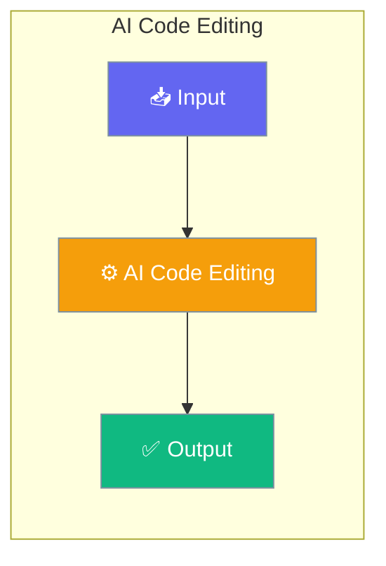

PraisonAI Code provides AI agents with powerful tools to read, write, and modify code files with surgical precision. Inspired by Kilo Code's architecture, it uses a SEARCH/REPLACE diff strategy with fuzzy matching for reliable code modifications.




## Quick Start


<Steps>
<Step title="Quick Start">
```python
from praisonai.code import (
    set_workspace,
    code_read_file,
    code_write_file,
    code_apply_diff,
    code_list_files,
    code_execute_command,
    CODE_TOOLS,
)

# Set the workspace root
set_workspace("/path/to/your/project")

# Read a file with line numbers
content = code_read_file("src/main.py")
print(content)

# Apply a precise diff
diff = """<<<<<<< SEARCH
:start_line:10
-------
def old_function():
    pass
=======
def new_function():
    return True
>>>>>>> REPLACE"""

result = code_apply_diff("src/main.py", diff)
print(result)  # "Successfully applied 1 change(s) to src/main.py"
```
</Step>
</Steps>


## Best Practices

<AccordionGroup>
  <Accordion title="Start simple">
    Enable the feature with a single parameter before adding configuration. Verify it works, then layer in options.
  </Accordion>
  <Accordion title="Use environment variables for secrets">
    Never hardcode API keys or tokens. Use `os.getenv("KEY_NAME")` to read from environment variables.
  </Accordion>
  <Accordion title="Test with minimal examples first">
    Copy the Quick Start example, run it, then extend it. This confirms your environment is set up correctly.
  </Accordion>
  <Accordion title="Check the logs">
    Set `verbose=True` on your agent to see detailed execution logs when debugging unexpected behavior.
  </Accordion>
</AccordionGroup>

## Related

<CardGroup cols={2}>
  <Card title="Features Overview" icon="grid-2" href="/docs/features">
    Browse all PraisonAI features
  </Card>
  <Card title="Quick Start" icon="rocket" href="/docs/introduction">
    Get started with PraisonAI agents
  </Card>
</CardGroup>
