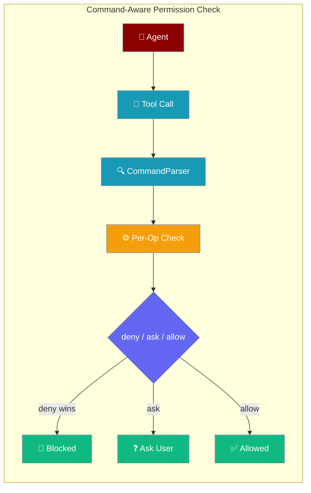
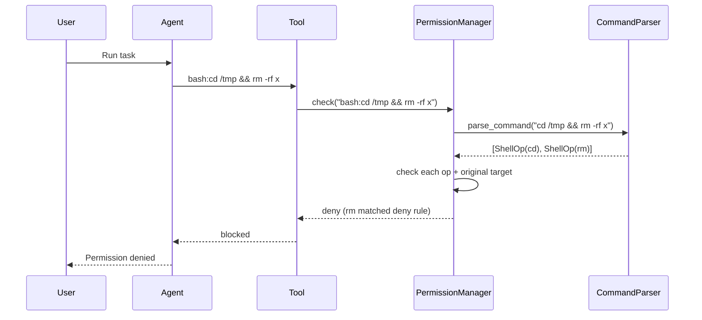

Permission checks for shell tool calls now follow the command's actual structure, so a `deny` rule fires even when the blocked command is hidden inside a compound, pipe, subshell, or substitution.

```python
from praisonaiagents import Agent
from praisonaiagents.approval.protocols import ApprovalConfig

agent = Agent(
    name="Safe Worker",
    instructions="Run shell commands safely",
    approval=ApprovalConfig(permissions={
        "bash:rm *": "deny",
        "write:/etc/*": "deny",
        "*": "allow",
    }),
)

# All of these are now blocked, even though previously only the first was:
#   cd /tmp && rm -rf x
#   ls; rm -rf x
#   echo $(rm -rf x)
#   cat foo > /etc/hosts
agent.start("Tidy up /tmp")
```



## Quick Start

<Steps>
<Step title="Block destructive commands — even in compound form">

A single `deny` rule on `bash:rm *` now catches `rm` wherever it appears:

```python
from praisonaiagents import Agent
from praisonaiagents.approval.protocols import ApprovalConfig

agent = Agent(
    name="Safe Worker",
    instructions="Run shell commands safely",
    approval=ApprovalConfig(permissions={
        "bash:rm *": "deny",
        "*": "allow",
    }),
)

agent.start("Clean up old files")
```

Commands like `cd /tmp && rm -rf x`, `ls; rm -rf x`, and `echo $(rm -rf x)` are all blocked — not just `rm -rf x` directly.

</Step>

<Step title="Protect files from redirect overwrites">

Truncating redirections (`>`, `>>`) emit a `write:` sub-target. A `write:` deny rule catches them:

```python
from praisonaiagents import Agent
from praisonaiagents.approval.protocols import ApprovalConfig

agent = Agent(
    name="Safe Worker",
    instructions="Run shell commands safely",
    approval=ApprovalConfig(permissions={
        "write:/etc/*": "deny",
        "*": "allow",
    }),
)

agent.start("Update system config")
```

`cat foo > /etc/hosts` and `echo x >> /etc/hosts` are blocked even though the command starts with `cat` / `echo`.

</Step>
</Steps>

---

## How It Works



| Step | Action |
|---|---|
| 1 | Tool call arrives as `bash:<cmd>` target |
| 2 | `command_parser.parse_command` decomposes into `ShellOp` list |
| 3 | Each op evaluated as its own sub-target (`bash:<exe> <args>` and `write:<path>`) |
| 4 | Original compound target also evaluated (legacy flat-rule compatibility) |
| 5 | Aggregate: **deny wins → ask → allow** |

---

## What Gets Decomposed

| Operator / Construct | Example | Result |
|---|---|---|
| `&&` (AND) | `cd /tmp && rm x` | `[cd, rm]` |
| `\|\|` (OR) | `ls \|\| rm x` | `[ls, rm]` |
| `;` (sequence) | `ls; rm x` | `[ls, rm]` |
| `\|` (pipe) | `cat foo \| rm x` | `[cat, rm]` |
| `&` (background) | `rm x &` | `[rm]` |
| Subshell `(...)` | `(cd /tmp && rm x)` | `[cd, rm]` |
| `$(...)` substitution | `echo $(rm -rf x)` | `[echo, rm]` |
| Backtick substitution | `` echo `rm -rf x` `` | `[echo, rm]` |
| Truncating redirect `>` | `cat foo > /etc/hosts` | `[cat] + write:/etc/hosts` |
| Append redirect `>>` | `echo x >> /etc/hosts` | `[echo] + write:/etc/hosts` |
| `>|` / `&>` / `&>>` | `cmd &> /tmp/log` | `[cmd] + write:/tmp/log` |
| fd-prefixed `2>` / `1>>` | `ls 2> err.txt` | `[ls] + write:err.txt` |
| Env-var assignment prefix | `FOO=bar rm x` | `[rm]` |

**Single-quote suppression:** `echo '$(rm -rf x)'` is a literal string — no `rm` is extracted.

**fd-to-fd redirects** like `2>&1` are never treated as write targets.

**Input redirects** (`<`, `<<`, `<<<`) — the filename is never mistaken for the executable.

---

## Evasions Now Blocked

A `deny: bash:rm *` rule now blocks **all** of these:

| Command | Previous | Now |
|---|---|---|
| `bash:rm -rf /tmp` | denied | denied (unchanged) |
| `bash:cd /tmp && rm -rf x` | **ALLOWED** | denied |
| `bash:ls; rm -rf x` | **ALLOWED** | denied |
| `bash:cat foo \| rm x` | **ALLOWED** | denied |
| `bash:echo $(rm -rf x)` | **ALLOWED** | denied |
| `bash:echo \`rm -rf x\`` | **ALLOWED** | denied |
| `bash:(cd /tmp && rm -rf x)` | **ALLOWED** | denied |
| `bash:echo '$(rm -rf x)'` (single-quoted) | denied | **allowed** (correctly — literal) |

---

## Aggregation Precedence

When a compound command produces multiple sub-operations, their results are aggregated as: **deny wins → then ask → then allow**.

```python
from praisonaiagents.permissions import PermissionManager, PermissionRule, PermissionAction

manager = PermissionManager()

manager.add_rule(PermissionRule(pattern="bash:*", action=PermissionAction.ALLOW))
manager.add_rule(PermissionRule(pattern="bash:cat *", action=PermissionAction.ASK))

result = manager.check("bash:ls && cat foo")
print(result.action)  # ASK — because cat triggered ask, and ask beats allow
```

| Sub-op results | Aggregate |
|---|---|
| Any deny | deny |
| No deny, any ask | ask |
| All allow | allow |

---

## Fallback Behaviour

For simple single commands (`bash:ls -la`) with no compound operators, the engine defers to the existing flat matcher — exact backward compatibility. On any parse failure, the whole command is treated as a single op using today's behaviour, so no existing rule is silently weakened.

---

## Common Patterns

**Block all destructive shell ops:**

```python
approval=ApprovalConfig(permissions={
    "bash:rm *": "deny",
    "bash:mv *": "deny",
    "bash:dd *": "deny",
    "*": "allow",
})
```

**Protect a config directory from redirects:**

```python
approval=ApprovalConfig(permissions={
    "write:/etc/*": "deny",
    "*": "allow",
})
```

**CI runner — deny by default, allow git only:**

```bash
praisonai run "Deploy check" \
  --permission-default deny \
  --allow 'bash:git *'
```

---

## Best Practices

<AccordionGroup>
<Accordion title="Patterns match the executable name, not the full path">
`bash:rm *` catches `rm -rf /tmp` but **not** `bash:/usr/bin/rm -rf /tmp`. Use a regex rule with `is_regex: true` for absolute-path coverage.
</Accordion>

<Accordion title="Single-quoted substitutions are literals">
`echo '$(rm -rf x)'` is correctly **not** treated as an `rm` call — the parser respects single-quote suppression. Double-quoted substitutions are still extracted.
</Accordion>

<Accordion title="Protect filesystem locations with write: patterns, not bash: patterns">
Truncating redirects produce a `write:<path>` sub-target. Use `write:/etc/*` to block overwrites — `bash:cat *` alone won't catch `cat foo > /etc/hosts`.
</Accordion>

<Accordion title="Zero overhead when permissions are off">
The command parser is lazy-imported: no parsing cost when permissions are not in use or the target is a non-shell tool.
</Accordion>
</AccordionGroup>

---

## Related

<CardGroup cols={2}>
<Card title="Declarative Permissions" icon="shield-halved" href="/docs/features/declarative-permissions">
  Pre-declare allow/deny rules in YAML, CLI, or Python
</Card>
<Card title="Permissions Module" icon="shield" href="/docs/features/permissions">
  Programmatic PermissionManager API
</Card>
<Card title="Permissions CLI" icon="terminal" href="/docs/cli/permissions">
  CLI rule management reference
</Card>
<Card title="Approval" icon="check" href="/docs/features/approval">
  Interactive approval backends
</Card>
</CardGroup>
