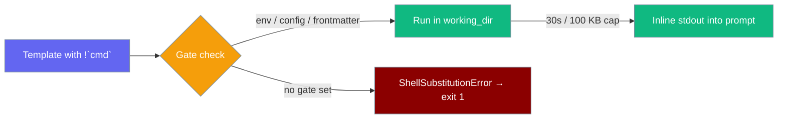
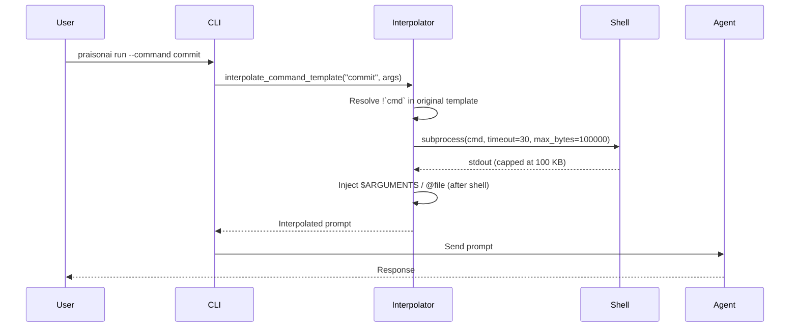
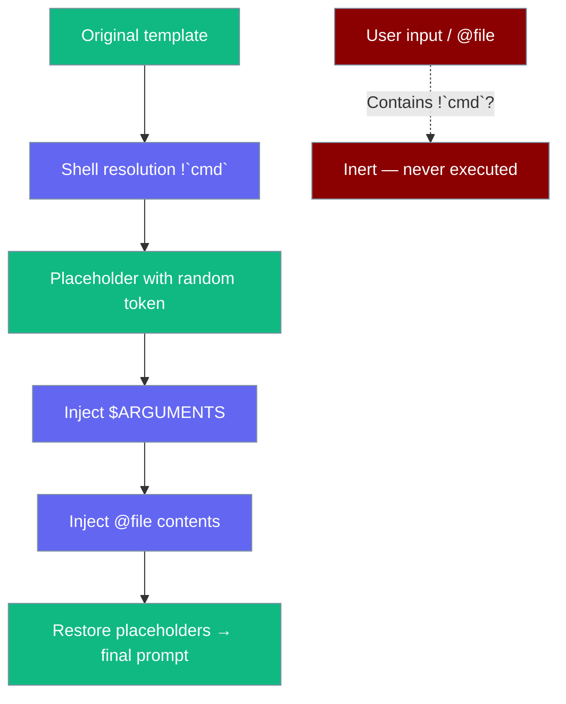

`` !`cmd` `` inlines live shell output into custom command templates — disabled by default so templates are safe to share and commit.



## Quick Start

<Steps>

<Step title="Write a /commit command using !`git diff`">

```markdown
<!-- .praisonai/commands/commit.md -->
---
description: Stage and commit with a generated message based on the live diff
allow_shell: true
---

You are a senior engineer writing a concise conventional-commit message.

Here is the staged diff:

```
!`git diff --cached`
```

Here is the unstaged diff for context:

```
!`git diff`
```

Write a single conventional-commit message that accurately describes the staged changes.
Then call `bash` to run `git commit -m "<your message>"`.
```

</Step>

<Step title="Enable via frontmatter (already set above) or env var">

The `allow_shell: true` frontmatter in the file above is sufficient. Alternatively:

```bash
export PRAISONAI_ALLOW_SHELL=true
```

</Step>

<Step title="Run the command">

```bash
praisonai run --command commit
```

</Step>

</Steps>

---

## How It Works



| Phase | What happens |
|-------|-------------|
| **Shell resolution** | `` !`cmd` `` in the original template is run; stdout is captured as opaque placeholder |
| **Argument injection** | `$ARGUMENTS` and `@file` are injected — any `` !`cmd` `` they carry is inert |
| **Agent call** | Final prompt (with real stdout) is sent to the LLM agent |

---

## Enabling shell substitution

Any one gate is sufficient. Resolution order:

| Priority | Gate | Example |
|----------|------|---------|
| 1 | `PRAISONAI_ALLOW_SHELL=true` env var | `export PRAISONAI_ALLOW_SHELL=true` |
| 2 | `commands.allow_shell: true` in project config | `.praisonai/config.yaml` |
| 3 | `allow_shell: true` frontmatter | Per-command `.md` file |
| 4 | Python API kwarg | `interpolate_command_template(..., allow_shell=True)` |

### Per-command frontmatter (narrowest — recommended)

```markdown
---
description: Show recent git log
allow_shell: true
---

Recent commits:

!`git log --oneline -10`

$ARGUMENTS
```

### Project config (all commands in this project)

```yaml
# .praisonai/config.yaml
commands:
  allow_shell: true
```

### Env var (all commands, all projects in this session)

```bash
export PRAISONAI_ALLOW_SHELL=true
praisonai run --command changelog
```

### Python API

```python
from praisonai.cli.features.custom_definitions import (
    interpolate_command_template,
    ShellSubstitutionError,
    SHELL_SUBSTITUTION_ENV,
    SHELL_SUBSTITUTION_TIMEOUT,
    SHELL_SUBSTITUTION_MAX_BYTES,
)

try:
    prompt = interpolate_command_template("commit", "", allow_shell=True)
    print(prompt)
except ShellSubstitutionError as e:
    print(f"Shell substitution failed: {e}")
```

---

## Safety bounds

| Bound | Value | Notes |
|-------|-------|-------|
| `SHELL_SUBSTITUTION_TIMEOUT` | `30` seconds | Wall-clock; non-zero exit raises `ShellSubstitutionError` |
| `SHELL_SUBSTITUTION_MAX_BYTES` | `100 000` bytes | Applied while reading stdout — noisy commands cannot buffer unbounded memory |
| Working directory | Template's `working_dir` | Commands run with `shell=True` in this directory |
| Truncation | Success-with-truncation | If output is capped at 100 KB, the command is still treated as successful |

---

## Security model



| Source | Contains `` !`cmd` `` | Executed? |
|--------|----------------------|-----------|
| Original template | Yes | **Yes** — if a gate is set |
| `$ARGUMENTS` (user input) | Yes | **No** — inert text |
| `@file` contents | Yes | **No** — inert text |
| Shell stdout | Contains `$(...)` | Inlined verbatim, not re-escaped |

The interpolator uses a per-process random token to hold captured stdout aside as opaque placeholders, so untrusted text injected via `$ARGUMENTS` or `@file` cannot forge a placeholder and impersonate shell output.

---

## Common patterns

### /commit — conventional commit from staged diff

```markdown
---
description: Generate a conventional commit from staged changes
allow_shell: true
---

You are a senior engineer writing a commit message.

Staged diff:
!`git diff --cached`

Write one conventional-commit message for these changes. Then run:
git commit -m "<your message>"
```

```bash
praisonai run --command commit
```

### /review — AI code review of the current branch

```markdown
---
description: Review uncommitted changes against main
allow_shell: true
---

Review these changes for bugs, security issues, and style:

!`git diff main...HEAD`

$ARGUMENTS
```

```bash
praisonai run --command review "Focus on the authentication module"
```

### /changelog — generate changelog from recent commits

```markdown
---
description: Generate a changelog from recent commits
allow_shell: true
---

Generate a changelog in Keep a Changelog format from these commits:

!`git log --oneline --no-merges -20`

$ARGUMENTS
```

```bash
praisonai run --command changelog "For release v2.1.0"
```

---

## Best Practices

<AccordionGroup>

<Accordion title="Prefer @file when you can">
`@file` inlines static file contents with zero execution risk. Use `` !`cmd` `` only when the data must be live at run time — like `git diff`, `date`, or a dynamic config value.
</Accordion>

<Accordion title="Use per-command frontmatter for the narrowest scope">
`allow_shell: true` in a single command's frontmatter enables shell only for that command. This is safer than enabling it globally via env var or project config, where it would apply to every command the CLI discovers.
</Accordion>

<Accordion title="Avoid PRAISONAI_ALLOW_SHELL on shared machines">
A global env var enables shell substitution for all commands in the session. On CI servers or shared machines, prefer per-command frontmatter to avoid unexpected execution from commands added later.
</Accordion>

<Accordion title="Treat injected output as untrusted">
`$ARGUMENTS` and `@file` content that contains `` !`cmd` `` is intentionally inert. The security guard runs before injection. Never store shell credentials or sensitive tokens in templates that also accept `$ARGUMENTS`.
</Accordion>

</AccordionGroup>

---

## Related

<CardGroup cols={2}>
  <Card title="Custom Agents & Commands" icon="file-code" href="/docs/features/custom-agents-commands">
    Full template syntax — $ARGUMENTS, @file, and !`cmd`
  </Card>
  <Card title="Security Environment Variables" icon="shield-check" href="/docs/features/security-environment-variables">
    PRAISONAI_ALLOW_SHELL and all security flags
  </Card>
  <Card title="Run CLI" icon="play" href="/docs/cli/run">
    praisonai run --command
  </Card>
  <Card title="Command CLI" icon="terminal" href="/docs/cli/command">
    List and preview command templates
  </Card>
</CardGroup>
