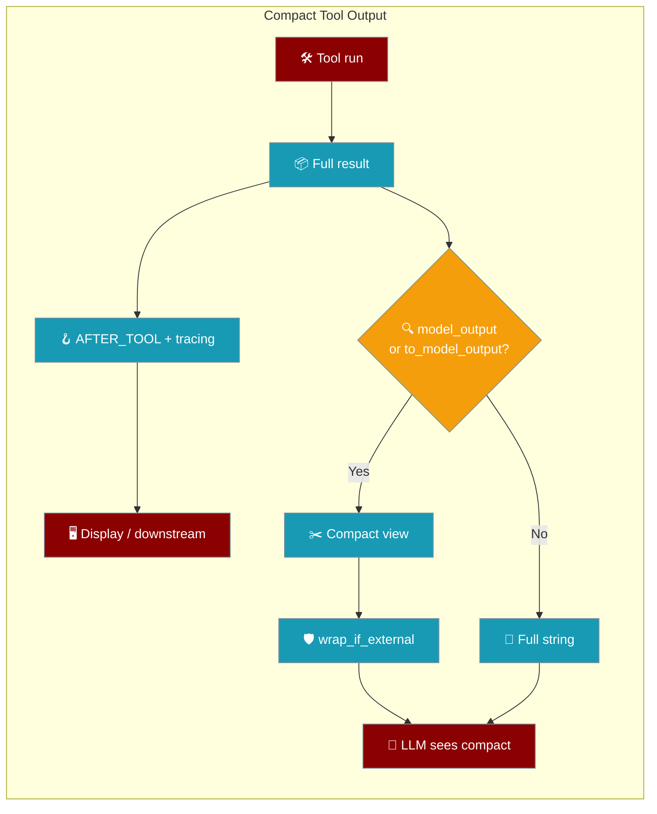
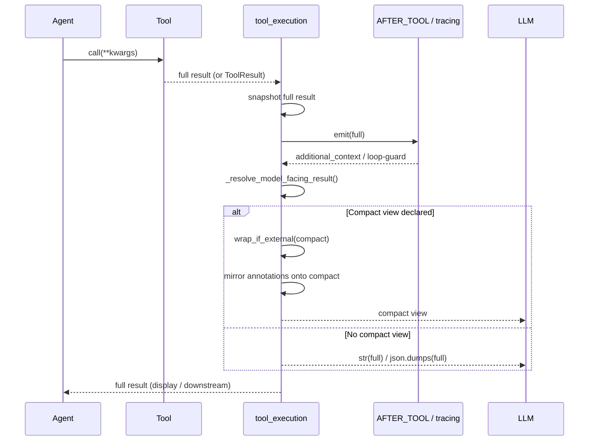
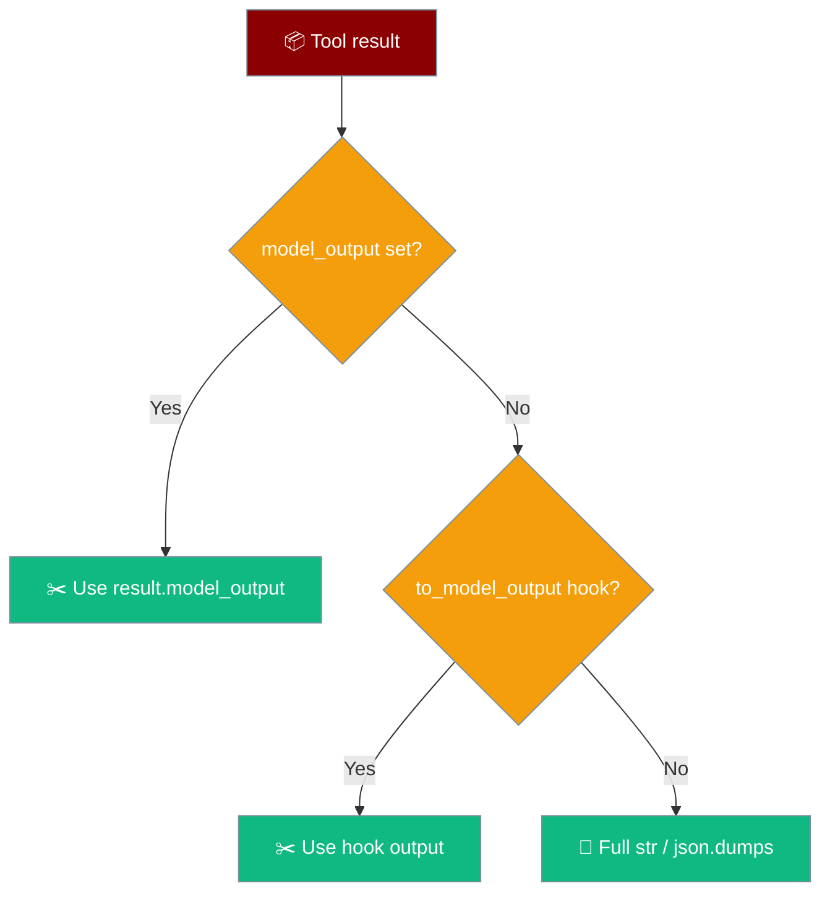

Compact tool output lets a tool return a rich full result while the model only sees a short summary — fewer tokens per tool call, no change in default behaviour.



## Quick Start

<Steps>
<Step title="@tool decorator — the simplest surface">

Pass `to_model_output` to shrink what the LLM sees.

```python
from praisonaiagents import Agent, tool

def _weather_summary(result: dict) -> str:
    return f"{result['city']}: {result['temp_c']}°C, {result['condition']}"

@tool(to_model_output=_weather_summary)
def get_weather(city: str) -> dict:
    return {
        "city": city,
        "temp_c": 22,
        "condition": "sunny",
        "hourly": [{"h": h} for h in range(24)],  # ~2 KB — NOT sent to the LLM
        "raw_provider_payload": {"noise": "x" * 5000},  # huge — NOT sent
    }

agent = Agent(
    name="Weather",
    instructions="Report the weather concisely.",
    tools=[get_weather],
)
agent.start("What's the weather in Paris?")
```

</Step>

<Step title="BaseTool subclass — override the hook">

Override `to_model_output` on the class.

```python
from praisonaiagents import Agent
from praisonaiagents.tools import BaseTool

class SearchTool(BaseTool):
    name = "search"
    description = "Search the web and return the top results"

    def run(self, query: str) -> dict:
        results = [{"title": f"Result {i}", "html": "<html>" * 500}
                   for i in range(50)]
        return {"query": query, "results": results}

    def to_model_output(self, result: dict) -> str:
        titles = [r["title"] for r in result["results"][:5]]
        return f"Top 5 for '{result['query']}':\n- " + "\n- ".join(titles)

agent = Agent(name="Researcher", tools=[SearchTool()])
agent.start("Find recent papers on retrieval-augmented generation")
```

</Step>

<Step title="Return a ToolResult carrying its own compact view">

Set `model_output` on the `ToolResult` directly.

```python
from praisonaiagents import Agent, tool
from praisonaiagents.tools import ToolResult

@tool
def analyse_logs(path: str) -> ToolResult:
    full = {"errors": 3, "warnings": 12, "lines": ["..."] * 9000}
    summary = f"{full['errors']} errors, {full['warnings']} warnings"
    return ToolResult(
        output=full,          # display / hooks / downstream get this
        model_output=summary, # LLM sees only this
    )

agent = Agent(name="LogTriage", tools=[analyse_logs])
agent.start("Triage today's logs at /var/log/app.log")
```

</Step>
</Steps>

---

## How It Works

The executor snapshots the full result for tracing and hooks, then swaps in the compact view for the LLM.



| Step | What happens |
|---|---|
| 1 | Tool runs, returns full output (or a `ToolResult`) |
| 2 | Executor snapshots the full result for tracing and the `AFTER_TOOL` hook |
| 3 | `_resolve_model_facing_result` picks `result.model_output`, else `tool.to_model_output(output)` |
| 4 | External tools: the compact override passes through `wrap_if_external()` |
| 5 | Loop-guard / additional-context notices are mirrored onto the compact view |
| 6 | LLM sees the compact view; the full payload stays with display, hooks, downstream tools |

---

## Configuration Options

| Surface | Signature | Default | Notes |
|---|---|---|---|
| `ToolResult(model_output=)` | `model_output: Any = None` | `None` | Highest precedence when the tool returns a `ToolResult`. Surfaced in `to_dict()`. |
| `@tool(to_model_output=fn)` | `Callable[[Any], Any]` | `None` | `result → compact_view`. Raise → falls back to full output. |
| `BaseTool.to_model_output(result)` | `(self, result: Any) -> Optional[Any]` | returns `None` | Override on a subclass. Receives the raw output value, not the `ToolResult`. |
| `resolve_model_output(result)` | `(Any) -> Optional[Any]` | — | Helper reading `result.model_output`. Does **not** invoke the hook. |

<Note>
No compact view declared → behaviour is exactly as before. Fully opt-in.
</Note>

### Resolution order

The executor picks the first hit, then falls back to the full string.



### Behavioural guarantees

- **Backward compatible.** No compact view → `str(result)` / `json.dumps(...)` reaches the LLM exactly as before.
- **Full result survives.** The compact view swaps in **after** tracing, the `AFTER_TOOL` hook, result-aware loop detection, and the loop-guard have all seen the full payload.
- **Annotations preserved.** `AFTER_TOOL` `additional_context` and loop-guard messages are mirrored onto the compact view so notices always reach the model.
- **Prompt-injection fence still applies.** For external tools, `wrap_if_external()` wraps the compact override too — it never bypasses security markers.
- **Multimodal untouched.** If the result has `content`, the compact view is not resolved — image/file parts flow through unchanged.
- **Overflow spill untouched.** `_output_overflow` (see [Tool Output Spill](/features/tool-output-spill)) still works; `model_output` composes with it.
- **Failure is soft.** A raising compact-view builder degrades to the full output — never crashes the tool call.

---

## Common Patterns

Turn a heavy result into a headline the model can plan on.

<Tabs>
<Tab title="Big JSON → 3-line status">

```python
from praisonaiagents import Agent, tool

def _status(result: dict) -> str:
    return f"{result['count']} records, {result['anomalies']} anomalies"

@tool(to_model_output=_status)
def fetch_metrics(day: str) -> dict:
    return {"count": 142, "anomalies": 3, "rows": [{"i": i} for i in range(142)]}

agent = Agent(name="Metrics", tools=[fetch_metrics])
agent.start("Summarise today's metrics")
```

</Tab>
<Tab title="Web-scrape → head + tail">

```python
from praisonaiagents import Agent, tool

def _head_tail(text: str) -> str:
    head, tail = text[:200], text[-200:]
    return f"{head}\n...[{len(text)} bytes]...\n{tail}"

@tool(to_model_output=_head_tail)
def read_page(url: str) -> str:
    return "PAGE " * 5000  # long HTML — LLM only sees head + tail

agent = Agent(name="Scraper", tools=[read_page])
agent.start("Read the landing page and describe it")
```

</Tab>
<Tab title="ToolResult + multimodal">

```python
from praisonaiagents import Agent, tool
from praisonaiagents.tools import ToolResult

@tool
def render_report(name: str) -> ToolResult:
    full = {"sections": ["intro", "body", "appendix"], "bytes": 40000}
    return ToolResult(
        output=full,
        model_output=f"Report '{name}' ready: {len(full['sections'])} sections",
    )

agent = Agent(name="Reporter", tools=[render_report])
agent.start("Render the quarterly report")
```

</Tab>
</Tabs>

Opt-out is the default — no hook means the LLM sees the full string, as today.

```python
from praisonaiagents import tool

@tool
def echo(text: str) -> str:
    return text  # no to_model_output → LLM sees the full string
```

---

## User-Interaction Flow

1. A user asks the agent to summarise a large API response.
2. Without `to_model_output`: the whole 20 KB JSON enters the LLM context on every turn → token cost and slow re-planning.
3. With `to_model_output`: the LLM sees `"142 records, 3 anomalies"`; the full JSON stays available for the display panel and any downstream tool the agent chains next.
4. Same answer, a fraction of the tokens, unchanged code elsewhere.

---

## Best Practices

<AccordionGroup>
<Accordion title="Summarise, don't truncate blindly">
Return the headline the model needs to decide the next step — counts, status, top items — not a raw byte-slice that hides the signal.
</Accordion>

<Accordion title="Keep the full payload for downstream tools">
The full `output` still reaches display, hooks, and the next tool. Never fold data the agent chains on into the compact view only.
</Accordion>

<Accordion title="Make the builder total and cheap">
The hook runs on every call. Keep it fast and side-effect free — a raise falls back to the full output, but that silently loses the token savings.
</Accordion>

<Accordion title="Prefer ToolResult(model_output=) when you already emit a ToolResult">
It has the highest precedence and keeps the compact view next to the data that produced it. Reach for `@tool(to_model_output=fn)` for plain-return functions.
</Accordion>
</AccordionGroup>

---

## Related

<CardGroup cols={2}>
<Card title="Tool Output Spill" icon="file-arrow-down" href="/features/tool-output-spill">
  Persist large execute_command output to disk artifacts
</Card>
<Card title="Multimodal Tool Output" icon="image" href="/features/multimodal-tool-output">
  Rich image/file parts alongside the text output
</Card>
<Card title="Runtime Tool Result Middleware" icon="filter" href="/features/runtime-tool-result-middleware">
  Cross-cutting transforms on tool results
</Card>
<Card title="Tool Output Store" icon="database" href="/features/tool-output-store">
  Recover full outputs for arbitrary tool return values
</Card>
</CardGroup>
