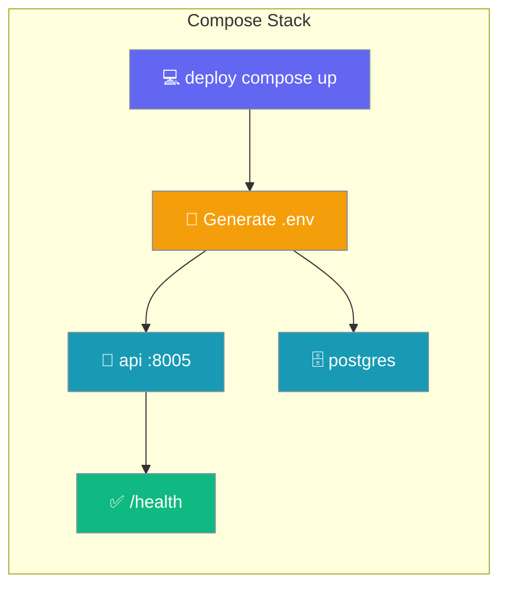
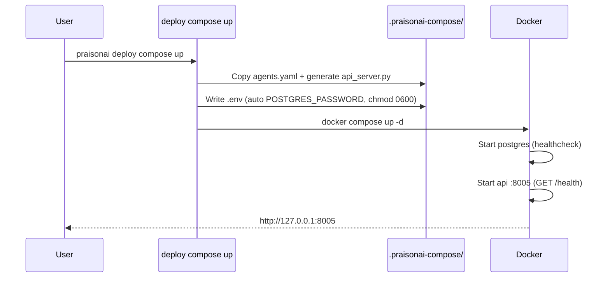

Run your agents behind a production-like API with a pgvector Postgres database using a single command.



<Warning>
The compose stack ships in the git checkout, **not** in the PyPI wheel (`MANIFEST.in` excludes `infra/`). Run from a full monorepo checkout, or point the CLI at the stack with `PRAISONAI_INFRA_ROOT` / `PRAISONAI_COMPOSE_STACK`.
</Warning>

## Quick Start

<Steps>
<Step title="Scaffold an agents.yaml">
Start from the compose starter (or bring your own `agents.yaml`).

```bash
praisonai deploy create --template docker-compose
```
</Step>

<Step title="Start the stack">
The first run auto-generates a strong `POSTGRES_PASSWORD` and launches both services in the background.

```bash
praisonai deploy compose up
```

The API is served at `http://127.0.0.1:8005`.
</Step>

<Step title="Call your agent">
Hit the health endpoint, then chat.

```bash
curl http://127.0.0.1:8005/health
```
</Step>

<Step title="Stop the stack">
Stop the containers; add `-v` to also drop the Postgres volume.

```bash
praisonai deploy compose down
```
</Step>
</Steps>

---

## How It Works

`compose up` copies your `agents.yaml` into `.praisonai-compose/`, generates `api_server.py`, writes a locked-down `.env`, then runs `docker compose up`.



| Service | Image | Port | Notes |
|---------|-------|------|-------|
| `postgres` | `pgvector/pgvector:pg16` | `${POSTGRES_BIND:-127.0.0.1}:5432` | Healthchecked; **loopback-bound by default**. |
| `api` | `ghcr.io/mervinpraison/praisonai:latest` | `8005` | Runs `api_server.py`; healthcheck on `/health`. |

The named volume `postgres_data` persists the database between restarts.

---

## Commands

Two subcommands manage the stack.

| Command | Flag | Default | Description |
|---------|------|---------|-------------|
| `compose up` | `--file` / `-f` | `agents.yaml` | Agents file to serve. |
| | `--stack-dir` | *(resolved)* | Override the compose stack template directory. |
| | `--foreground` | `False` | Run in the foreground (no `-d`). |
| | `--json` | `False` | Machine-readable output. |
| `compose down` | `--file` / `-f` | `agents.yaml` | Agents file (for project directory resolution). |
| | `--stack-dir` | *(resolved)* | Override the compose stack template directory. |
| | `--volumes` / `-v` | `False` | Also remove the named `postgres_data` volume. |
| | `--json` | `False` | Machine-readable output. |

Both commands wrap `docker compose` with a **600 s** timeout so first-run image pulls complete without hanging on an unresponsive Docker daemon.

---

## Environment Variables

The generated `.env` drives both services. Defaults come from the stack's `docker-compose.yml`.

| Variable | Default | Description |
|----------|---------|-------------|
| `AGENTS_FILE` | `./agents.yaml` | Agents file mounted into the API container. |
| `API_PORT` | `8005` | Host port for the API. |
| `POSTGRES_BIND` | `127.0.0.1` | Host interface Postgres binds to. Loopback by default. |
| `POSTGRES_PORT` | `5432` | Host port for Postgres. |
| `POSTGRES_USER` | `praisonai` | Database user. |
| `POSTGRES_DB` | `praisonai` | Database name. |
| `POSTGRES_PASSWORD` | *(required)* | Compose fails fast if unset; CLI auto-generates one on first run. |
| `PRAISONAI_IMAGE` | `ghcr.io/mervinpraison/praisonai:latest` | API image (pin a tag for production). |
| `OPENAI_API_KEY` | *(empty)* | LLM provider key. |
| `ANTHROPIC_API_KEY` | *(empty)* | LLM provider key. |
| `GOOGLE_API_KEY` | *(empty)* | LLM provider key. |
| `PRAISONAI_API_TOKEN` | *(empty)* | Bearer token clients send to the API. |
| `PRAISONAI_API_AUTH` | `enabled` | Toggle API bearer-token auth. |
| `DATABASE_URL` | *(auto)* | Composed from the Postgres variables above. |

---

## Security

The stack ships secure-by-default; three safeguards matter most.

<AccordionGroup>
<Accordion title="POSTGRES_PASSWORD is required — no repo default">
The shipped stack has **no default password**, so Postgres never starts with a repo-known credential. Compose uses the `:?` operator and fails fast if it is unset. On the first `compose up`, the CLI writes a strong `secrets.token_urlsafe(24)` value into `.praisonai-compose/.env`.
</Accordion>

<Accordion title="Postgres binds to loopback by default">
`POSTGRES_BIND` defaults to `127.0.0.1`, so the database is not reachable on all host interfaces. Set it explicitly (e.g. `POSTGRES_BIND=0.0.0.0`) only when you intend to expose it.
</Accordion>

<Accordion title="The generated .env is chmod 0600">
Because `.env` holds the database password and API token, the CLI restricts it to owner read/write on POSIX systems.
</Accordion>
</AccordionGroup>

---

## Path Resolution & Overrides

The CLI finds the stack automatically in a checkout, with explicit overrides.

| Override | Purpose |
|----------|---------|
| `--stack-dir` | Point at a directory containing `docker-compose.yml`. |
| `PRAISONAI_COMPOSE_STACK` | Env override for the stack directory. |
| `PRAISONAI_INFRA_ROOT` | Env override for the whole `infra/` tree. |

<Note>
A legacy monorepo-root `deploy/` layout still resolves as a one-release compatibility fallback. Prefer the new `praisonai deploy compose` commands.
</Note>

---

## Best Practices

<AccordionGroup>
<Accordion title="Pin PRAISONAI_IMAGE in production">
The default image tag is `latest`, which drifts. Pin a released tag in `.env` for reproducible deployments.
</Accordion>

<Accordion title="Keep auth enabled when exposing the API">
Leave `PRAISONAI_API_AUTH=enabled` and set `PRAISONAI_API_TOKEN`. Clients then send `Authorization: Bearer <token>`.
</Accordion>

<Accordion title="Use --volumes only when you mean it">
`compose down -v` drops the `postgres_data` volume and all stored data. Omit `-v` to keep the database between runs.
</Accordion>
</AccordionGroup>

---

## Related

<CardGroup cols={2}>
<Card title="Deploy Templates" icon="file-code" href="/docs/features/create-templates">
  Scaffold this stack and cloud projects.
</Card>
<Card title="Helm Chart — Agents API" icon="ship" href="/docs/features/helm-chart-agents-api">
  The Kubernetes equivalent of this stack.
</Card>
</CardGroup>
