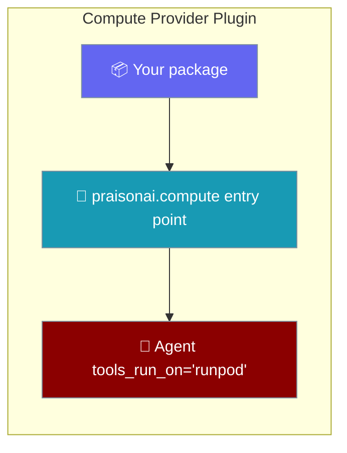
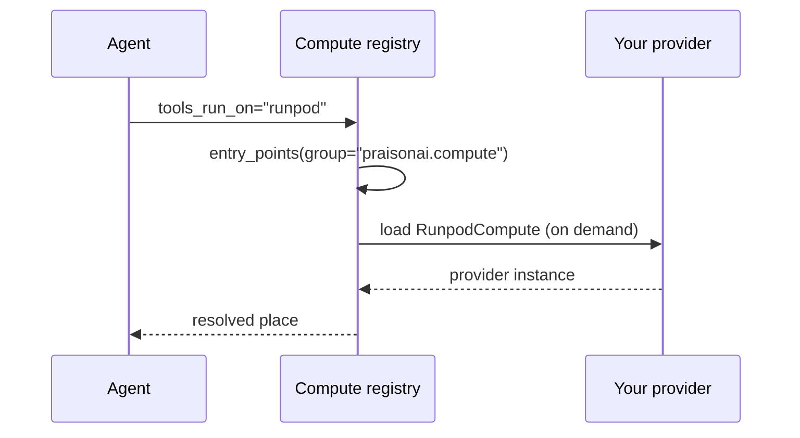

Ship a compute backend in its own package and register it under the `praisonai.compute` entry-point group — `run_on=`, `compute=`, and `tools_run_on=` pick it up with no change to the main repo.



## Quick Start

<Steps>
<Step title="Declare the entry point">
Point the `praisonai.compute` group at a class in your package.

```toml
# pyproject.toml — in your plugin package
[project.entry-points."praisonai.compute"]
runpod = "praisonai_compute_runpod:RunpodCompute"
```
</Step>

<Step title="Implement the protocol">
Satisfy `ComputeProviderProtocol`. Set an optional `display_name` for a friendly phrase.

```python
# praisonai_compute_runpod/__init__.py

class RunpodCompute:
    display_name = "a Runpod cloud sandbox"  # optional, used in explanations

    async def provision(self, config):
        ...  # start an instance, return an InstanceInfo

    async def execute(self, instance_id, command, timeout=300):
        ...  # run a command, return {"stdout", "stderr", "exit_code"}

    async def shutdown(self, instance_id):
        ...  # tear the instance down

    @property
    def is_available(self):
        return True  # credentials present, SDK importable, etc.
```
</Step>

<Step title="Use it like a built-in">
After `pip install`, the name resolves anywhere a compute place is accepted.

```python
from praisonaiagents import Agent

agent = Agent(name="runner", instructions="Run code", tools_run_on="runpod")
agent.start("Print the Python version")
```
</Step>
</Steps>

---

## How It Works

Providers are discovered from the entry-point group and loaded on demand — only when a caller names one.



| Behaviour | What happens |
|---|---|
| Discovery | Names come from `importlib.metadata.entry_points(group="praisonai.compute")` — no file in the main repo changes. |
| Friendly phrase | A `display_name` class attribute is used in `where_does_it_run()` and `repr(agent)`; without it, the bare name is shown. |
| Failure isolation | Providers load lazily, so a broken plugin fails only for the caller that names it — everyone else is unaffected. |
| `managed ps` | Derives its list from the registry, so a contributed place is listed and stopped automatically — no extra wiring. |

---

## Protocol Reference

Implement these on your provider class. `display_name` is optional; the rest are required.

| Member | Kind | Purpose |
|---|---|---|
| `provision(config)` | `async` | Start one instance and return its `InstanceInfo`. |
| `execute(instance_id, command, timeout=300)` | `async` | Run a command; return `{"stdout", "stderr", "exit_code"}`. |
| `shutdown(instance_id)` | `async` | Tear the instance down. |
| `is_available` | property | `True` when the backend can run (credentials, SDK, daemon). |
| `display_name` | class attr | Optional phrase used in explanations instead of the bare name. |

<Note>
`run_on=` hosts the **whole loop** on a compute place, while `tools_run_on=` moves only the tools. A contributed provider works with both, plus per-agent `compute=`. See [Placement](/features/placement#where-run-on-and-compute-can-point).
</Note>

---

## Best Practices

<AccordionGroup>
<Accordion title="Set display_name for readable explanations">
A bare provider name reads awkwardly in `where_does_it_run()`. Set `display_name = "a Runpod cloud sandbox"` on the class so the phrase reads naturally everywhere the place is described.
</Accordion>

<Accordion title="Make is_available cheap and honest">
`is_available` is checked before your provider runs. Return `False` when a required key or SDK is missing rather than raising — the caller gets a clear "unavailable" instead of a stack trace.
</Accordion>

<Accordion title="Keep imports lazy">
Import heavy SDK dependencies inside your methods, not at module top level. Providers load on demand, so a missing optional dependency should fail only when the provider is actually used.
</Accordion>

<Accordion title="Ship the extra alongside the entry point">
Declare an optional install extra for your provider's SDK so users can `pip install your-package[runpod]`. This keeps the base install light and the failure mode obvious.
</Accordion>
</AccordionGroup>

---

## Related

<CardGroup cols={2}>
<Card title="Placement" icon="map-pin" href="/features/placement">
Where the whole agent, its tools, and its code calls run.
</Card>
<Card title="Sandbox Backends" icon="shield" href="/features/sandbox-backends">
The sibling `praisonai.sandbox` entry-point group for `Agent(sandbox=…)`.
</Card>
<Card title="Managed Backend Plugins" icon="cloud" href="/features/managed-backend-plugins">
Register a hosted agent runtime under `praisonai.managed_backends`.
</Card>
<Card title="Reclaim Stray Sandboxes" icon="broom" href="/features/reclaim-stray-sandboxes">
`managed ps` lists contributed places automatically.
</Card>
</CardGroup>
