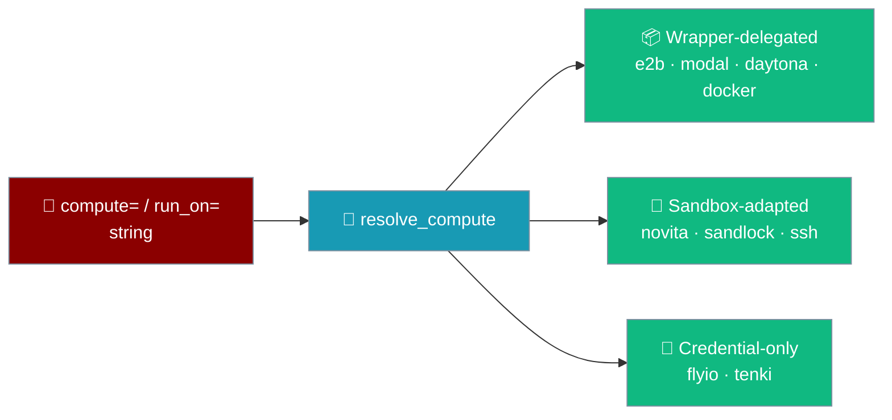
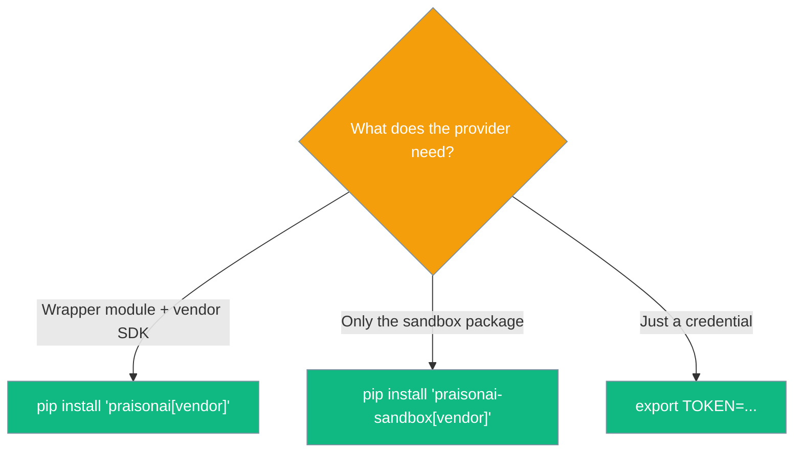
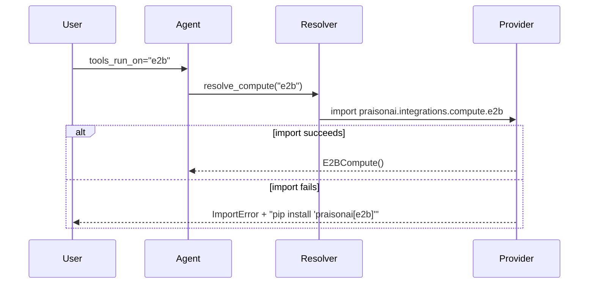

Pass a string like `compute="e2b"` and PraisonAI resolves it to a provider; if the provider isn't installed, the SDK raises `ImportError` with the exact command to fix it.



## Quick Start

<Steps>
<Step title="Pick a provider by name">
```python
from praisonaiagents import Agent

agent = Agent(name="runner", tools_run_on="e2b")  # or docker, modal, daytona, novita, ssh, flyio, tenki
agent.start("Print the Python version.")
```
</Step>

<Step title="Not installed? Follow the hint">
```text
ImportError: compute='e2b' requires praisonai.integrations.compute.e2b.
pip install 'praisonai[e2b]'
```
</Step>
</Steps>

---

## Provider matrix

Every name resolves to one of three families, each with its own install shape.

| Name | Family | Install / requirement | Extra env var |
|---|---|---|---|
| `e2b` | wrapper-delegated | `pip install 'praisonai[e2b]'` | `E2B_API_KEY` |
| `modal` | wrapper-delegated | `pip install 'praisonai[modal]'` | Modal auth |
| `daytona` | wrapper-delegated | `pip install 'praisonai[daytona]'` | `DAYTONA_API_KEY` |
| `docker` | wrapper-delegated | `pip install 'praisonai[docker]'` | (local daemon) |
| `novita` | sandbox-adapted | `pip install 'praisonai-sandbox[novita]'` | `NOVITA_API_KEY` |
| `sandlock` | sandbox-adapted | `pip install 'praisonai-sandbox[sandlock]'` | Linux ≥ 6.12 with landlock |
| `ssh` | sandbox-adapted | `pip install 'praisonai-sandbox[ssh]'` | SSH access |
| `flyio` | credential-only | (no pip install) | `FLY_API_TOKEN` |
| `tenki` | credential-only | (no pip install) | `TENKI_API_KEY` / `TENKI_AUTH_TOKEN` |

<Note>
All install hints are single-quoted (`pip install 'praisonai[e2b]'`) to match what the SDK prints and to avoid `zsh: no matches found: praisonai[e2b]` on copy-paste. As of [PR #4073](https://github.com/MervinPraison/PraisonAI/pull/4073) the `e2b`, `docker`, and `daytona` extras are real — earlier releases printed those commands but installed nothing.
</Note>

---

## Why three families?

The install shape follows what each provider needs at runtime.



| Family | Members | Why |
|---|---|---|
| **Wrapper-delegated** | `e2b`, `modal`, `daytona`, `docker` | Need both the `praisonai.integrations.compute.*` module **and** the vendor SDK. `praisonai[<vendor>]` pulls the wrapper and delegates to `praisonai-sandbox[<vendor>]` for the SDK — the sandbox package alone would leave the module import failing. |
| **Sandbox-adapted** | `novita`, `sandlock`, `ssh` | Live only in `praisonai-sandbox` and reach the compute path via `SandboxComputeAdapter` — the wrapper isn't needed. |
| **Credential-only** | `flyio`, `tenki` | Speak plain HTTP through `aiohttp` (already required by `praisonaiagents`). No vendor SDK, so exporting the credential is the whole install step. |

---

## How resolution works

`resolve_compute()` maps the string to a provider, then imports it lazily so a missing SDK only fails when you actually use that name.



---

## Common Patterns

### Switch provider from an env var

Read the target from configuration so the agent code never changes.

```python
import os
from praisonaiagents import Agent

agent = Agent(name="runner", tools_run_on=os.environ.get("RUN_ON", "docker"))
agent.start("Run the test suite.")
```

### Credential-only providers need no install

Fly.io and Tenki resolve with just a token exported.

```python
import os
from praisonaiagents import Agent

os.environ["TENKI_API_KEY"] = "your-tenki-api-key"  # or FLY_API_TOKEN for flyio
agent = Agent(name="runner", tools_run_on="tenki")
agent.start("Print the kernel version.")
```

---

## Best Practices

<AccordionGroup>
<Accordion title="Single-quote every install command">
Shells like zsh treat `praisonai[e2b]` as a glob. Copy-paste `pip install 'praisonai[e2b]'` exactly as the SDK prints it to avoid `no matches found`.
</Accordion>

<Accordion title="Upgrade before trusting cached advice">
If `pip` warns `does not provide the extra 'e2b'`, you are on a pre-[PR #4073](https://github.com/MervinPraison/PraisonAI/pull/4073) release where the extra was absent or empty. Upgrade `praisonai` — the fix makes the extra real.
</Accordion>

<Accordion title="Use praisonai-sandbox for sandbox-adapted names">
`novita`, `sandlock`, and `ssh` resolve through `SandboxComputeAdapter`, so the sandbox package alone is enough — `pip install 'praisonai-sandbox[<vendor>]'`.
</Accordion>

<Accordion title="Pass an SSH object, not the bare name">
`ssh` needs connection details a plain string cannot carry. Pass `SSHSandbox(host='...', user='...')` to `compute=` so it can carry the host.
</Accordion>
</AccordionGroup>

---

## Related

<CardGroup cols={2}>
<Card title="Hosted Compute Runtimes" icon="cloud" href="/features/hosted-agent-compute-runtimes">
`HostedAgent(provider="...")` for full-loop hosting.
</Card>
<Card title="Sandbox Backends" icon="box" href="/features/sandbox-backends">
The sandbox-side view of the same registry.
</Card>
<Card title="Compute Provider Plugins" icon="puzzle-piece" href="/features/compute-provider-plugins">
Ship your own provider via the `praisonai.compute` entry-point.
</Card>
<Card title="Tenki Cloud" icon="cloud" href="/features/managed-agents-tenki">
Credential-only compute with disposable microVMs.
</Card>
</CardGroup>
