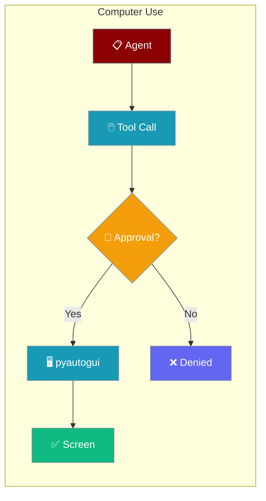
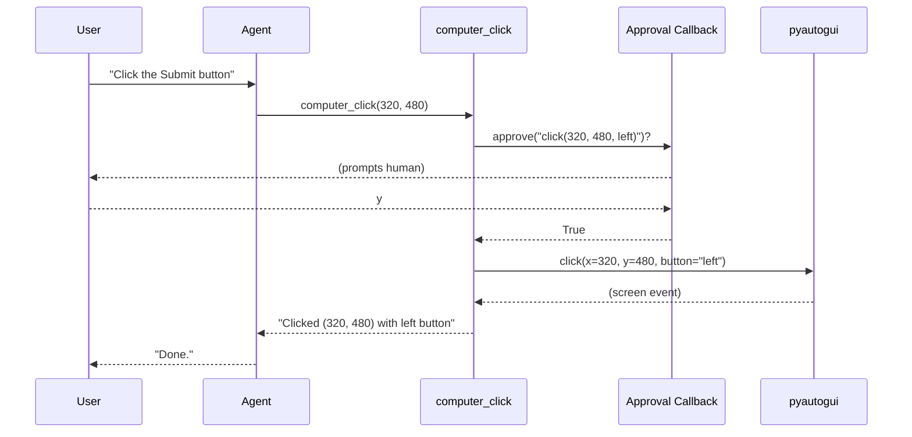

Computer Use tools let an agent take screenshots and control the mouse, keyboard, and scroll — gated by a human approval callback so nothing runs without your say-so.



## Quick Start

<Steps>
<Step title="Simple Usage">
Read-only tools never require approval, so an observer agent works out of the box.

```python
from praisonaiagents import Agent
from praisonaiagents.tools import computer_screenshot, computer_screen_size

agent = Agent(
    name="observer",
    instructions="Describe what's on screen.",
    tools=[computer_screenshot, computer_screen_size],
)
agent.start("What size is the screen and what's on it?")
```
</Step>

<Step title="With Configuration">
Register an approval callback, then add the control tools. Every click, type, key, and scroll passes through the callback first.

```python
from praisonaiagents import Agent
from praisonaiagents.tools import (
    computer_screenshot, computer_click, computer_type,
    computer_key, computer_scroll, computer_move,
    set_computer_approval,
)

set_computer_approval(lambda action: input(f"Approve {action}? (y/n) ") == "y")

agent = Agent(
    name="assistant",
    instructions="You can control the computer to help the user.",
    tools=[
        computer_screenshot, computer_click, computer_type,
        computer_key, computer_scroll, computer_move,
    ],
)
agent.start("Take a screenshot and describe what's on screen")
```
</Step>
</Steps>

---

## How It Works



| Step | What happens |
|---|---|
| Agent calls a control tool | Tool builds a human-readable action string (`"click(320, 480, left)"`) |
| Approval gate | If no callback is registered, returns `"Action denied: …"` immediately |
| Backend load | `pyautogui` is lazy-imported on first use |
| Missing backend | Returns `"Computer Use backend unavailable: …"` — no exception |

---

## Configuration Options

Every tool returns a string — errors are reported as messages, never raised.

**Tools:**

| Tool | Parameters | Approval | Returns |
|------|-----------|:---:|---------|
| `computer_screenshot` | `path: str = ""` | Only if `path` set | `"Screenshot captured (WxH)"` (+ `" and saved to PATH"`) |
| `computer_screen_size` | — | Never | `"WIDTHxHEIGHT"` |
| `computer_move` | `x: int, y: int` | Yes | `"Moved to (x, y)"` |
| `computer_click` | `x: int, y: int, button: str = "left"` | Yes | `"Clicked (x, y) with BUTTON button"` |
| `computer_type` | `text: str` | Yes | `"Typed N characters"` or `"Typed N of M characters (non-ASCII skipped)"` |
| `computer_key` | `key: str` | Yes | `"Pressed KEY"` on success, or `"Key press failed: empty or invalid key string 'KEY'"` when `key` is empty / whitespace-only |
| `computer_scroll` | `direction: str = "down", amount: int = 3` | Yes | `"Scrolled DIRECTION by N"` on success, or `"Scroll failed: invalid direction 'DIRECTION' (expected 'up' or 'down')"` when `direction` is not `"up"` or `"down"` |

**Approval Callback:**

| Option | Type | Default | Description |
|--------|------|---------|-------------|
| `callback` | `Optional[Callable[[str], bool]]` | `None` (control denied) | Called with the action string (e.g. `"click(100, 200, left)"`) — return `True` to allow, `False` (or raise) to deny |

`set_computer_approval` sets a process-wide singleton behind a lock. Call it once and every later tool call in the process uses the same gate. Pass `None` to revoke — control actions then default back to deny.

---

## Common Patterns

**Read-only observer** — no approval callback, so the agent can look but not touch.

```python
from praisonaiagents import Agent
from praisonaiagents.tools import computer_screenshot, computer_screen_size

agent = Agent(
    name="observer",
    instructions="Report the screen size and describe what's visible.",
    tools=[computer_screenshot, computer_screen_size],
)
agent.start("Describe the current screen")
```

**Selective auto-approve** — allow only screenshots-to-disk and cursor moves, deny clicks and typing. Pattern-match on the action string.

```python
from praisonaiagents import Agent
from praisonaiagents.tools import (
    computer_screenshot, computer_move, computer_click,
    computer_type, set_computer_approval,
)

def allow_safe(action: str) -> bool:
    return action.startswith("screenshot_save(") or action.startswith("move(")

set_computer_approval(allow_safe)

agent = Agent(
    name="safe-driver",
    instructions="Save screenshots and move the cursor to point things out.",
    tools=[computer_screenshot, computer_move, computer_click, computer_type],
)
agent.start("Save a screenshot to /tmp/shot.png and move the cursor to it")
```

**Interactive approval** — prompt a human for every control action during local development.

```python
from praisonaiagents import Agent
from praisonaiagents.tools import (
    computer_screenshot, computer_click, computer_type, set_computer_approval,
)

set_computer_approval(lambda action: input(f"Approve {action}? (y/n) ") == "y")

agent = Agent(
    name="assistant",
    instructions="Help the user by controlling the screen.",
    tools=[computer_screenshot, computer_click, computer_type],
)
agent.start("Open the search box and type 'hello'")
```

---

## Best Practices

<AccordionGroup>
<Accordion title="Register approval before building the Agent">
Call `set_computer_approval(...)` at process start, before you construct the `Agent`. Control tools default to *deny* — an agent that starts without a callback will silently refuse every click, type, key, and scroll.
</Accordion>

<Accordion title="Pattern-match on the action string">
The callback receives a stable, human-readable action string like `click(320, 480, left)` or `type('hello')`. Pattern-match on this — the tool name is not passed separately.
</Accordion>

<Accordion title="Surface the non-ASCII typing message">
Emoji, accented letters, and other non-printable characters are dropped by the backend. `computer_type` reports `"Typed N of M characters (non-ASCII skipped)"` when this happens — surface that message to the user rather than assuming the whole string was typed.
</Accordion>

<Accordion title="Screenshots without a path are ungated">
`computer_screenshot()` with no `path` is read-only and ungated. `computer_screenshot(path="/tmp/x.png")` writes to disk and goes through the approval gate as `screenshot_save('/tmp/x.png')` — an agent cannot overwrite arbitrary files without approval.
</Accordion>

<Accordion title="Invalid keys and directions are rejected, not silently normalised">
`computer_key("")` returns `"Key press failed: empty or invalid key string ''"` — the backend is never called. `computer_scroll(direction="sideways")` returns `"Scroll failed: invalid direction 'sideways' (expected 'up' or 'down')"` — it does not default to `"down"`. If your callback pattern-matches on the return string, handle these failure prefixes explicitly.
</Accordion>

<Accordion title="Expect no-ops in headless or CI environments">
A missing display returns the same `"Computer Use backend unavailable: ..."` message as a missing package. On Linux `pyautogui` needs an X11 display; in CI containers and on headless boxes these tools no-op — don't gate business logic on their success.
</Accordion>
</AccordionGroup>

---

## Related

<CardGroup cols={2}>
  <Card title="Approval" icon="shield-check" href="/docs/features/approval">
    Broader human-in-the-loop approval patterns for gating agent tool calls.
  </Card>
  <Card title="Allowed Tools" icon="wrench" href="/docs/features/allowed-tools">
    Restrict which tools an agent is permitted to call.
  </Card>
</CardGroup>
