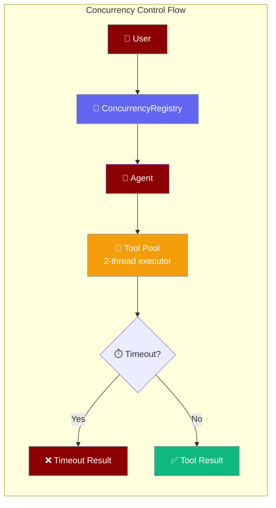
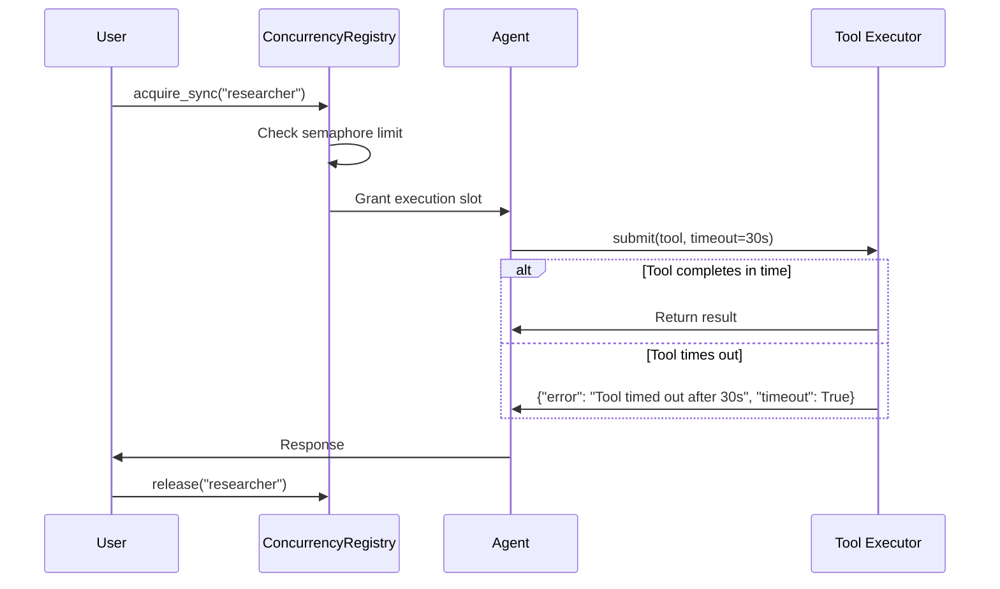
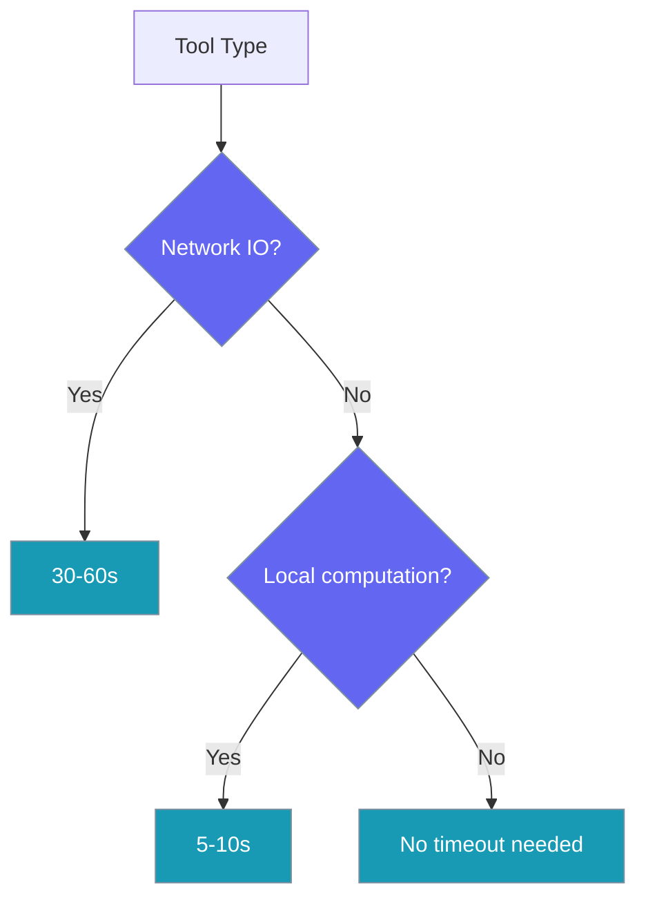

Concurrency controls let you limit parallel agent execution and set timeouts for tool calls to prevent resource exhaustion.

```python
from praisonaiagents import Agent

agent = Agent(
    name="worker",
    instructions="Respect concurrency limits across tool calls",
)

agent.start("Process these jobs without overloading APIs")
```

The user runs parallel work; concurrency controls cap simultaneous operations and tool timeouts.




## Quick Start

<Steps>
<Step title="Limit parallel runs of an agent">
Control how many instances of the same agent can run concurrently:

```python
from praisonaiagents import Agent
from praisonaiagents.agent.concurrency import ConcurrencyRegistry

registry = ConcurrencyRegistry()
registry.set_limit("researcher", 2)  # at most 2 concurrent runs

agent = Agent(name="researcher", instructions="Research topics")

# Sync context
registry.acquire_sync("researcher")
try:
    agent.start("Research Mars exploration")
finally:
    registry.release("researcher")
```
</Step>

<Step title="Same, async">
Use async context for better resource utilization:

```python
await registry.acquire("researcher")
try:
    await agent.astart("Research Mars exploration")
finally:
    registry.release("researcher")
```
</Step>

<Step title="Bound tool time with ToolConfig">
Prevent slow tools from blocking agent execution:

```python
from praisonaiagents import Agent
from praisonaiagents.config.feature_configs import ToolConfig

agent = Agent(
    name="Assistant",
    instructions="Use tools to help users",
    tools=["get_weather"],
    tool_config=ToolConfig(timeout=30),  # seconds; slow tools return a timeout dict
)
agent.start("What's the weather in Tokyo?")
```
</Step>
</Steps>

---

## How It Works



| Component | Purpose | Thread Safety |
|-----------|---------|---------------|
| `ConcurrencyRegistry` | Limits parallel agent runs | ✅ Thread-safe |
| Tool Executor | Runs tools with timeout | ✅ Per-agent pool |
| Plugin APIs | Enable/disable plugins | ✅ Lock-protected |

---

## Sync vs Async Rule

The concurrency registry enforces strict separation between sync and async contexts:

| Context | Method | What happens if you mix |
|---------|--------|-------------------------|
| **Sync** | `registry.acquire_sync(name)` | ✅ Works correctly |
| **Async** | `await registry.acquire(name)` | ✅ Works correctly |
| **Mixed** | `acquire_sync()` in async | ❌ Raises `RuntimeError` |

<Warning>
Calling `acquire_sync()` from an async context raises `RuntimeError("acquire_sync('<agent_name>') cannot be called with a running event loop; use async acquire() in async contexts.")`. Use `await acquire()` instead.
</Warning>

**Example error:**
```python
async def bad_example():
    registry.acquire_sync("agent")  # RuntimeError!

async def good_example():
    await registry.acquire("agent")  # ✅ Correct
```

---

## Tool Timeout Behavior

When `tool_config=ToolConfig(timeout=...)` is set, tools run in a dedicated executor with these characteristics:

*In YAML the field name is still `tool_timeout:`; in Python use `tool_config=ToolConfig(timeout=…)`.*

```mermaid
graph TB
    subgraph "Two-Layer Tool Timeout"
        Call[Tool Call] --> WrapShim[Wrapper Shim<br/>tool_timeout enforced]
        WrapShim --> Check{Has timeout?}
        Check -->|No| Direct[Direct execution]
        Check -->|Yes| Pool[Per-agent 2-thread pool]
        Pool --> Submit[submit(tool, timeout)]
        Submit --> Wait{Within timeout?}
        Wait -->|Yes| Result[Return result]
        WrapShim -.->|wrapper timeout| Dict1[raise ToolTimeoutError]
        Wait -->|No| Dict2[{"error": "Tool timed out after Ns", "timeout": true}]
    end
    
    classDef call fill:#8B0000,stroke:#7C90A0,color:#fff
    classDef safety fill:#189AB4,stroke:#7C90A0,color:#fff
    classDef process fill:#F59E0B,stroke:#7C90A0,color:#fff
    classDef result fill:#10B981,stroke:#7C90A0,color:#fff
    classDef error fill:#8B0000,stroke:#7C90A0,color:#fff
    
    class Call call
    class WrapShim safety
    class Check,Pool,Submit process
    class Direct,Result result
    class Dict1,Dict2 error
```

### Timeout Return Shape

On timeout, each layer surfaces the timeout differently:

| Layer | Trigger | Behaviour |
|---|---|---|
| SDK Agent executor | `Agent(tool_config=ToolConfig(timeout=30))` directly in Python | `{"error": "Tool timed out after 30s", "timeout": True}` (seconds) |
| Wrapper boundary | YAML `tool_timeout: 30` or CLI `--tool-timeout 30` (`framework: praisonai`) | **Raises `praisonai.agents_generator.ToolTimeoutError`** (a `TimeoutError` subclass) with `tool_name`, `timeout_seconds`, and `background_work_may_continue` (seconds). Framework adapters catch it and translate it per framework. See [Async Tool Safety → Wrapper-Level Timeout](/features/async-tool-safety#wrapper-level-timeout-yaml-framework-praisonai). |
| SDK tool-call executor | `Agent(llm={"tool_timeout_ms": 30000})` | Returns `ToolResult` with `error=praisonaiagents.tools.ToolTimeoutError` and `error_kind="timeout"` (milliseconds). See [Tool Call Executor Timeout](/features/tool-call-executor-timeout). |

### Effective Timeout Precedence

When multiple `tool_timeout` values are declared, the wrapper resolves a single **effective** timeout applied to every tool in the shared tool dict:

1. **CLI wins.** An explicit `--tool-timeout N` on the command line (or `cli_config={"tool_timeout": N}` when embedding) is used verbatim.
2. **Otherwise, the tightest (smallest) per-role/per-agent value.** The wrapper picks `min(tool_timeout)` across every entry under `roles:` and `agents:` in the YAML. This is safe-by-default — the strictest declared limit wins so no tool can run longer than the tightest declared cap. The wrapper emits a warning on every agent whose declared value is overridden by the effective (tighter) timeout.
3. **Otherwise, no wrapping.** If nothing declares a timeout, tools run without wrapper-layer enforcement (the SDK executor-layer enforcement still applies if `tool_config=ToolConfig(timeout=…)` is set in Python).

The resolver is `AgentsGenerator._resolve_effective_tool_timeout(config)` — see `praisonai/agents_generator.py`.

<Warning>
As of [PR #3176](https://github.com/MervinPraison/PraisonAI/pull/3176) the resolution was reversed from `max()` to `min()` — the tightest declared value now wins. If you previously relied on a slow-tool role keeping a longer timeout, declare its value explicitly or raise the CLI `--tool-timeout` override.
</Warning>

<Warning>
YAML boolean values are ignored, not coerced. Because `bool` subclasses `int` in Python, `tool_timeout: yes` or `tool_timeout: true` used to silently become a 1-second cap on every tool. As of PR #2609 the resolver explicitly rejects `bool` values — such entries are treated as "not declared" and fall through to the next precedence level. Use an integer or float (e.g. `tool_timeout: 30`).
</Warning>

### Executor Details

- **One executor per `Agent` instance** (lazy creation)
- **`max_workers=2`** threads per agent
- **Thread name prefix:** `tool-<agent_name>` — useful for log filtering
- **Reused across calls** — no resource leak

**Which timeout to choose:**


---

## Common Patterns

### Limit FastAPI Route Concurrency

```python
from praisonaiagents import Agent
from praisonaiagents.agent.concurrency import ConcurrencyRegistry

registry = ConcurrencyRegistry()
registry.set_limit("chat_agent", 5)

@app.post("/chat")
async def chat_endpoint(message: str):
    await registry.acquire("chat_agent")
    try:
        agent = Agent(name="chat_agent", instructions="Help users")
        response = await agent.astart(message)
        return {"response": response}
    finally:
        registry.release("chat_agent")
```

### Async Context Manager Helper

```python
from contextlib import asynccontextmanager

@asynccontextmanager
async def throttled_agent(name: str, max_concurrent: int = 3):
    registry = ConcurrencyRegistry()
    registry.set_limit(name, max_concurrent)
    await registry.acquire(name)
    try:
        yield
    finally:
        registry.release(name)

# Usage
async with throttled_agent("researcher", 2):
    agent = Agent(name="researcher", instructions="Research topics")
    result = await agent.astart("Study quantum computing")
```

### Timeout Selection by Tool Type

```python
from praisonaiagents import Agent
from praisonaiagents.config.feature_configs import ToolConfig

def get_agent_with_timeouts():
    return Agent(
        name="MultiTool Assistant",
        instructions="Help with various tasks",
        tools=[
            "web_search",      # Network IO
            "file_processor",  # Local computation  
            "simple_math"      # Fast operation
        ],
        tool_config=ToolConfig(timeout=45)  # Good balance for mixed workload
    )
```

---

## Best Practices

<AccordionGroup>
<Accordion title="Always release in finally blocks">
Prevents deadlocks when exceptions occur:

```python
registry.acquire_sync("agent")
try:
    # Agent work here
    agent.start("task")
finally:
    registry.release("agent")  # Always runs
```
</Accordion>

<Accordion title="Don't mix sync and async acquire">
Keep acquisition method consistent with execution context:

```python
# ✅ Good - sync context, sync acquire
def sync_handler():
    registry.acquire_sync("agent")
    try:
        agent.start("task")
    finally:
        registry.release("agent")

# ✅ Good - async context, async acquire  
async def async_handler():
    await registry.acquire("agent")
    try:
        await agent.astart("task")
    finally:
        registry.release("agent")
```
</Accordion>

<Accordion title="Set tool_timeout for network tools">
Any tool that does network IO should have a timeout:

```python
from praisonaiagents import Agent
from praisonaiagents.config.feature_configs import ToolConfig

# Tools that need timeouts
network_tools = ["web_search", "api_call", "download_file"]
local_tools = ["calculate", "format_text", "parse_json"]

agent = Agent(
    name="Assistant",
    tools=network_tools + local_tools,
    tool_config=ToolConfig(timeout=30)  # Protects against slow network
)
```
</Accordion>

<Accordion title="Use thread names for debugging">
Filter logs by agent name using the thread prefix:

```bash
# Filter tool execution logs by agent
grep "tool-researcher" app.log

# Or in Python logging
import logging
logging.basicConfig(format='%(threadName)s: %(message)s')
```
</Accordion>
</AccordionGroup>

---

## Retries

Tool failures can be automatically retried using the retry policy feature. This works alongside timeouts to handle transient errors:

```python
from praisonaiagents import Agent
from praisonaiagents.config.feature_configs import ToolConfig
from praisonaiagents.tools.retry import RetryPolicy

# Enable retry with defaults
agent = Agent(
    name="resilient_agent",
    tools=[web_search, api_tool],
    tool_retry_policy=RetryPolicy()
)

# Using consolidated tool config (preferred)
agent = Agent(
    name="modern_agent",
    tools=[flaky_tool],
    tool_config=ToolConfig(
        timeout=30,
        parallel=True,
        retry_policy=RetryPolicy(
            max_attempts=3,
            retry_on={"timeout", "rate_limit", "connection_error"},
            backoff_factor=2.0,
            jitter=True
        )
    )
)
```

For complete retry configuration and error handling strategies, see [Tool Retry Policy](/docs/features/tool-retry-policy).

---

## Related

<CardGroup cols={2}>
<Card title="Tool Retry Policy" icon="rotate" href="/docs/features/tool-retry-policy">
  Automatically retry failed tool calls with exponential backoff
</Card>
<Card title="Tool Configuration" icon="wrench" href="/docs/configuration/tool-config">
  Tool timeout settings and performance tuning  
</Card>
<Card title="Async Bridge" icon="arrows-left-right" href="/docs/features/async-bridge">
  Safe sync↔async boundary crossing utilities
</Card>
<Card title="Thread Safety" icon="lock" href="/docs/features/thread-safety">
  Chat history and state protection mechanisms
</Card>
</CardGroup>