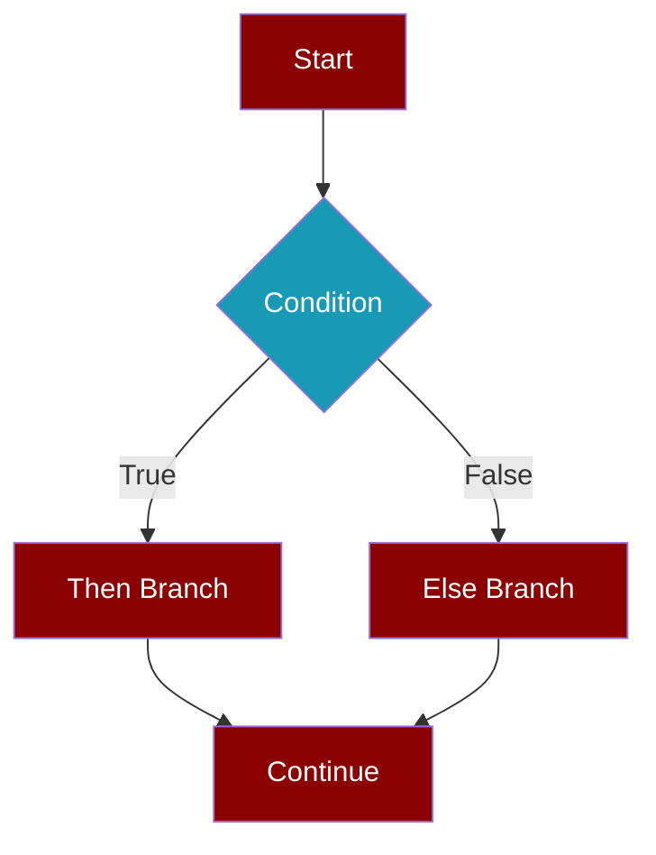
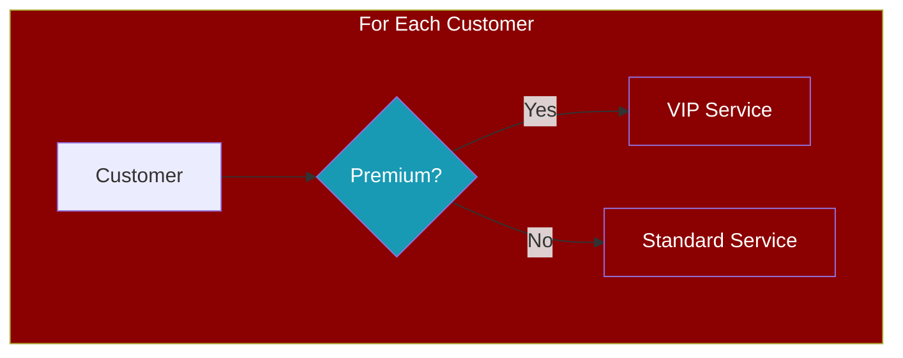
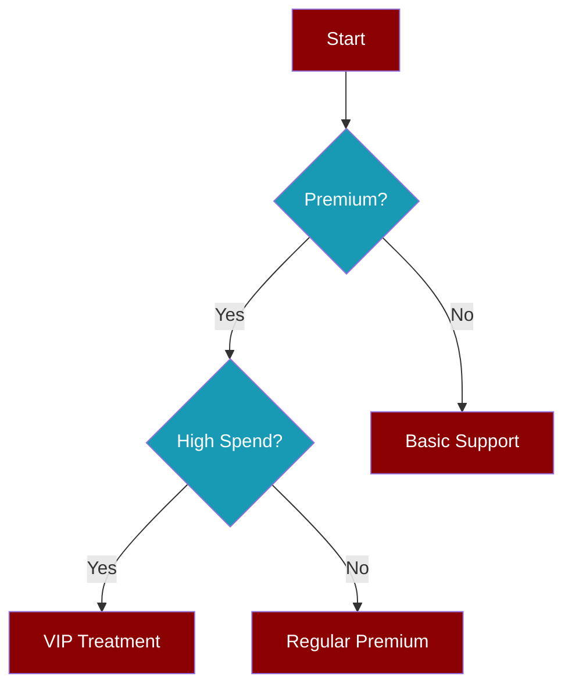

Conditional branching lets you create dynamic workflows that take different paths based on runtime conditions. Use the `if:` pattern to evaluate variables and route execution accordingly.



## Quick Start

<CodeGroup>
```python Python
from praisonaiagents import AgentFlow, WorkflowContext, StepResult
from praisonaiagents.workflows import if_

def approve(ctx: WorkflowContext) -> StepResult:
    return StepResult(output="Approved!")

def reject(ctx: WorkflowContext) -> StepResult:
    return StepResult(output="Rejected!")

workflow = AgentFlow(
    steps=[
        if_(
            condition="{{score}} >= 70",
            then_steps=[approve],
            else_steps=[reject]
        )
    ],
    variables={"score": 85}
)
result = workflow.start("Evaluate")
# Output: "Approved!"
```

```yaml YAML
workflow:
  variables:
    score: 85
    
  steps:
    - if:
        condition: "{{score}} >= 70"
        then:
          - agent: approver
            action: "Approve the application"
        else:
          - agent: rejector
            action: "Reject the application"
```
</CodeGroup>

## Condition Syntax

<CardGroup cols={2}>
  <Card title="Numeric Comparisons" icon="calculator">
    `>`, `<`, `>=`, `<=`, `==`, `!=`
  </Card>
  <Card title="String Equality" icon="equals">
    `==`, `!=` for exact matches
  </Card>
  <Card title="Contains Check" icon="magnifying-glass">
    `in` or `contains` keywords
  </Card>
  <Card title="Boolean Values" icon="toggle-on">
    `true`, `false` for flags
  </Card>
</CardGroup>

### Numeric Comparisons

Compare numbers using standard operators:

```python
# Greater than
if_(condition="{{score}} > 80", then_steps=[...])

# Less than or equal
if_(condition="{{count}} <= 10", then_steps=[...])

# Equal
if_(condition="{{age}} == 18", then_steps=[...])

# Not equal
if_(condition="{{status_code}} != 200", then_steps=[...])
```

### String Equality

Match exact string values:

```python
# String equals
if_(
    condition="{{status}} == approved",
    then_steps=[process_approved],
    else_steps=[process_pending]
)

# String not equals
if_(
    condition="{{tier}} != free",
    then_steps=[premium_features]
)
```

### Contains Check

Check if a string contains a substring:

```python
# Using 'in' keyword
if_(
    condition="error in {{message}}",
    then_steps=[handle_error],
    else_steps=[continue_normal]
)

# Using 'contains' keyword
if_(
    condition="{{response}} contains success",
    then_steps=[celebrate]
)
```

### Nested Property Access

Access nested object properties:

```python
workflow = AgentFlow(
    steps=[
        if_(
            condition="{{user.subscription.tier}} == premium",
            then_steps=[premium_service]
        )
    ],
    variables={
        "user": {
            "name": "Alice",
            "subscription": {"tier": "premium"}
        }
    }
)
```

## If Without Else

The `else_steps` parameter is optional. If omitted, nothing happens when the condition is false:

```python
# Only send notification if opted in
workflow = AgentFlow(
    steps=[
        if_(
            condition="{{notify}} == true",
            then_steps=[send_notification]
            # No else - just skip if false
        ),
        continue_workflow  # Always runs
    ],
    variables={"notify": "true"}
)
```

## If Inside Loop

Combine conditional branching with loops for per-item decisions:



<Tabs>
  <Tab title="Python">
```python
from praisonaiagents import AgentFlow, WorkflowContext, StepResult
from praisonaiagents.workflows import if_, loop

def vip_service(ctx: WorkflowContext) -> StepResult:
    customer = ctx.variables.get("customer", {})
    return StepResult(output=f"VIP service for {customer['name']}")

def standard_service(ctx: WorkflowContext) -> StepResult:
    customer = ctx.variables.get("customer", {})
    return StepResult(output=f"Standard service for {customer['name']}")

workflow = AgentFlow(
    steps=[
        loop(
            steps=[
                if_(
                    condition="{{customer.tier}} == premium",
                    then_steps=[vip_service],
                    else_steps=[standard_service]
                )
            ],
            over="customers",
            var_name="customer"
        )
    ],
    variables={
        "customers": [
            {"name": "Alice", "tier": "premium"},
            {"name": "Bob", "tier": "standard"},
            {"name": "Charlie", "tier": "premium"}
        ]
    }
)
workflow.start("Assign services")
```
  </Tab>
  <Tab title="YAML">
```yaml
workflow:
  variables:
    customers:
      - name: Alice
        tier: premium
      - name: Bob
        tier: standard
      - name: Charlie
        tier: premium
  
  steps:
    - loop:
        over: customers
        var_name: customer
        steps:
          - if:
              condition: "{{customer.tier}} == premium"
              then:
                - agent: vip_handler
                  action: "Provide VIP service to {{customer.name}}"
              else:
                - agent: standard_handler
                  action: "Provide standard service to {{customer.name}}"
```
  </Tab>
</Tabs>

## Nested Conditions

Create decision trees with nested if statements:

```python
workflow = AgentFlow(
    steps=[
        if_(
            condition="{{tier}} == premium",
            then_steps=[
                # Nested condition for premium users
                if_(
                    condition="{{spend}} > 10000",
                    then_steps=[vip_treatment],
                    else_steps=[regular_premium]
                )
            ],
            else_steps=[basic_support]
        )
    ],
    variables={"tier": "premium", "spend": 15000}
)
```



## API Reference

### if_() Function

```python
def if_(
    condition: str,
    then_steps: List[Any],
    else_steps: Optional[List[Any]] = None
) -> If
```

<ParamField path="condition" type="string" required>
  Condition expression with `{{variable}}` placeholders
</ParamField>

<ParamField path="then_steps" type="list" required>
  Steps to execute when condition is true
</ParamField>

<ParamField path="else_steps" type="list">
  Steps to execute when condition is false (optional)
</ParamField>

### If Class

```python
from praisonaiagents.workflows import If

conditional = If(
    condition="{{score}} > 80",
    then_steps=[approve],
    else_steps=[reject]
)
```

### MAX_NESTING_DEPTH

```python
from praisonaiagents.workflows import MAX_NESTING_DEPTH

print(MAX_NESTING_DEPTH)  # 5
```

<Note>
Nested conditions count toward the maximum nesting depth of 5 levels.
</Note>

## Best Practices

<AccordionGroup>
  <Accordion title="Use Clear Condition Names">
    Make conditions readable: `{{user.is_verified}} == true` is clearer than `{{v}} == 1`
  </Accordion>
  
  <Accordion title="Provide Default Values">
    Handle missing variables gracefully - undefined variables evaluate to empty strings
  </Accordion>
  
  <Accordion title="Keep Branches Simple">
    Each branch should do one thing well. Complex logic should be in separate functions.
  </Accordion>
  
  <Accordion title="Test Both Branches">
    Always test both the true and false paths of your conditions
  </Accordion>
</AccordionGroup>

## Related

<CardGroup cols={2}>
  <Card title="Nested Workflows" icon="layer-group" href="/features/nested-workflows">
    Combine patterns for complex pipelines
  </Card>
  <Card title="Workflow Routing" icon="route" href="/features/workflow-routing">
    Route based on output content
  </Card>
  <Card title="Workflow Loops" icon="arrows-rotate" href="/features/workflow-loop">
    Iterate over collections
  </Card>
  <Card title="YAML Workflows" icon="file-code" href="/features/yaml-workflows">
    Define workflows in YAML format
  </Card>
</CardGroup>
