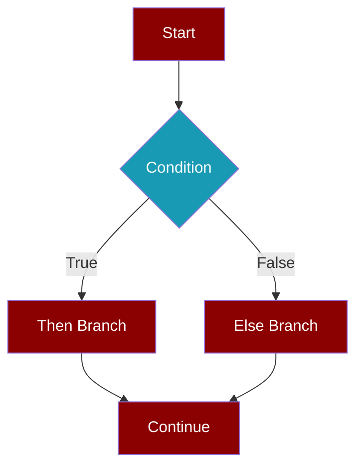

Conditional branching lets you create dynamic workflows that take different paths based on runtime conditions. Use the `if:` pattern to evaluate variables and route execution accordingly.


```mermaid
flowchart TD
    A[Start] --> B{Condition}
    B -->|True| C[Then Branch]
    B -->|False| D[Else Branch]
    C --> E[Continue]
    D --> E
    
    style A fill:#8B0000,color:#fff
    style B fill:#189AB4,color:#fff
    style C fill:#8B0000,color:#fff
    style D fill:#8B0000,color:#fff
    style E fill:#8B0000,color:#fff
```

## Quick Start


<Steps>
<Step title="Simple Usage">
<CodeGroup>
```python Python
from praisonaiagents import AgentFlow, WorkflowContext, StepResult, if_

def approve(ctx: WorkflowContext) -> StepResult:
    return StepResult(output="Approved!")

def reject(ctx: WorkflowContext) -> StepResult:
    return StepResult(output="Rejected!")

workflow = AgentFlow(
    steps=[
        if_(
            condition="{{score}} >= 70",
            then_steps=[approve],
            else_steps=[reject]
        )
    ],
    variables={"score": 85}
)
result = workflow.start("Evaluate")
# Output: "Approved!"
```
</Step>

<Step title="With Configuration">
```yaml YAML
workflow:
  variables:
    score: 85
    
  steps:
    - if:
        condition: "{{score}} >= 70"
        then:
          - agent: approver
            action: "Approve the application"
        else:
          - agent: rejector
            action: "Reject the application"
```
</CodeGroup>
</Step>
</Steps>


## Best Practices

<AccordionGroup>
  <Accordion title="Start simple">
    Enable the feature with a single parameter before adding configuration. Verify it works, then layer in options.
  </Accordion>
  <Accordion title="Use environment variables for secrets">
    Never hardcode API keys or tokens. Use `os.getenv("KEY_NAME")` to read from environment variables.
  </Accordion>
  <Accordion title="Test with minimal examples first">
    Copy the Quick Start example, run it, then extend it. This confirms your environment is set up correctly.
  </Accordion>
  <Accordion title="Check the logs">
    Set `verbose=True` on your agent to see detailed execution logs when debugging unexpected behavior.
  </Accordion>
</AccordionGroup>

## Related

<CardGroup cols={2}>
  <Card title="Features Overview" icon="grid-2" href="/docs/features">
    Browse all PraisonAI features
  </Card>
  <Card title="Quick Start" icon="rocket" href="/docs/introduction">
    Get started with PraisonAI agents
  </Card>
</CardGroup>
