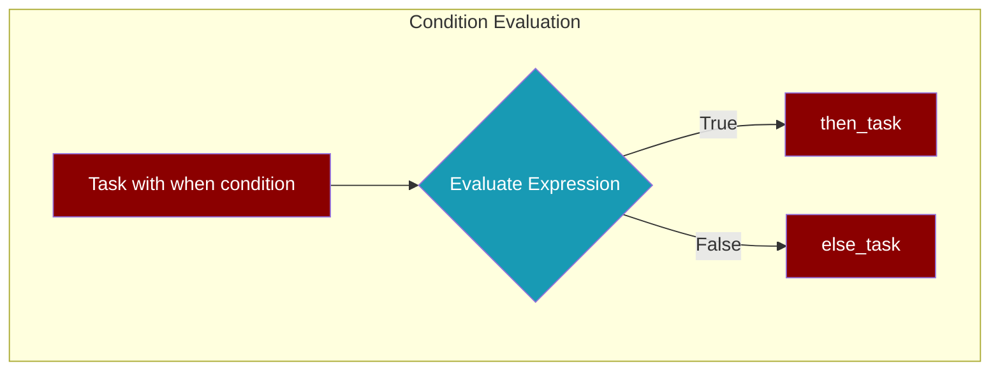

<Info>
PraisonAI now provides a **unified condition syntax** that works the same way in both `AgentFlow` (pipelines) and `Task` (multi-agent teams).
</Info>

## Overview

Conditional execution allows you to control workflow branching based on variables, scores, or other runtime values. PraisonAI supports:

- **String expression conditions** - Simple `{{variable}}` syntax for comparisons
- **Dictionary routing** - Map decision values to next tasks
- **Callable conditions** - Custom Python functions

## Quick Start

<CodeGroup>
```python Task with when (Recommended)
from praisonaiagents import Task

# Simple condition with then/else routing
task = Task(
    name="score_check",
    description="Check if score passes threshold",
    when="{{score}} > 80",
    then_task="approve",
    else_task="reject"
)

# Evaluate the condition
result = task.evaluate_when({"score": 90})  # True
next_task = task.get_next_task({"score": 90})  # "approve"
```

```python AgentFlow with when()
from praisonaiagents import AgentFlow, Agent, when

agent = Agent(name="worker", instructions="Process data")

flow = AgentFlow(
    agents=[agent],
    steps=[
        when(
            condition="{{score}} >= 50",
            then_steps=["high_score_handler"],
            else_steps=["low_score_handler"]
        )
    ],
    variables={"score": 75}
)
```
</CodeGroup>

## Condition Syntax

### String Expression Conditions

Use `{{variable}}` placeholders with comparison operators:

| Operator | Example | Description |
|----------|---------|-------------|
| `>` | `{{score}} > 80` | Greater than |
| `>=` | `{{score}} >= 80` | Greater than or equal |
| `<` | `{{score}} < 50` | Less than |
| `<=` | `{{score}} <= 50` | Less than or equal |
| `==` | `{{status}} == approved` | Equal to |
| `!=` | `{{status}} != rejected` | Not equal to |
| `in` | `{{word}} in {{text}}` | Contains (substring) |
| `contains` | `{{list}} contains {{item}}` | Contains (list) |

<Tip>
String comparisons don't require quotes: `{{status}} == approved` works correctly.
</Tip>

### Examples

```python
# Numeric comparisons
"{{score}} > 80"
"{{count}} >= 10"
"{{price}} < 100.50"

# String comparisons
"{{status}} == approved"
"{{category}} != spam"

# Contains checks
"{{text}} contains error"
"{{tags}} in important"

# Boolean checks
"{{is_valid}}"  # True if truthy
```

## Task Condition Parameters

### `when` Parameter

The `when` parameter accepts a string expression condition:

```python
from praisonaiagents import Task

task = Task(
    name="quality_check",
    description="Check content quality",
    when="{{quality_score}} >= 7",
    then_task="publish",
    else_task="revise"
)
```

### `then_task` and `else_task`

Route to different tasks based on condition result:

```python
task = Task(
    name="review",
    description="Review submission",
    when="{{approved}} == true",
    then_task="finalize",    # Run if condition is True
    else_task="request_changes"  # Run if condition is False
)
```

### `routing` Parameter (Advanced)

For LLM-driven decisions, use the `routing` parameter (formerly `condition`):

```python
task = Task(
    name="decision_task",
    description="Decide next action based on content",
    task_type="decision",
    routing={
        "approved": ["publish_task"],
        "rejected": ["edit_task"],
        "needs_review": ["review_task"]
    }
)
```

<Note>
The `condition` parameter still works for backward compatibility, but `routing` is preferred for clarity.
</Note>

### `should_run` Callable

For complex logic, use a callable:

```python
def check_prerequisites(context):
    return context.get("data_ready", False) and context.get("approved", False)

task = Task(
    name="process",
    description="Process data",
    should_run=check_prerequisites
)
```

## AgentFlow Conditions

### `when()` Function

```python
from praisonaiagents import when

flow = AgentFlow(
    steps=[
        "step1",
        when(
            condition="{{result}} == success",
            then_steps=["success_handler"],
            else_steps=["error_handler"]
        ),
        "final_step"
    ]
)
```

### Nested Conditions

```python
flow = AgentFlow(
    steps=[
        when(
            condition="{{score}} >= 80",
            then_steps=[
                when(
                    condition="{{premium}} == true",
                    then_steps=["premium_path"],
                    else_steps=["standard_path"]
                )
            ],
            else_steps=["low_score_path"]
        )
    ]
)
```

## Flow Diagram



## Best Practices

<AccordionGroup>
<Accordion title="Use simple conditions">
Keep conditions readable and simple. Complex logic should go in `should_run` callables.

```python
# ✅ Good - Simple and clear
when="{{score}} > 80"

# ❌ Avoid - Too complex
when="{{score}} > 80 and {{status}} == approved and {{count}} < 10"
```
</Accordion>

<Accordion title="Provide both then_task and else_task">
Always specify both branches to make the flow explicit:

```python
# ✅ Good - Both branches defined
Task(
    when="{{approved}}",
    then_task="proceed",
    else_task="wait"
)

# ⚠️ Incomplete - Missing else branch
Task(
    when="{{approved}}",
    then_task="proceed"
)
```
</Accordion>

<Accordion title="Use routing for LLM decisions">
When the LLM needs to make a decision, use `routing` with `task_type="decision"`:

```python
Task(
    name="classifier",
    description="Classify the input",
    task_type="decision",
    routing={
        "positive": ["positive_handler"],
        "negative": ["negative_handler"],
        "neutral": ["neutral_handler"]
    }
)
```
</Accordion>
</AccordionGroup>

## Migration Guide

### From `condition` to `routing`

```python
# Old syntax (still works)
Task(condition={"yes": ["next"], "no": ["stop"]})

# New syntax (recommended)
Task(routing={"yes": ["next"], "no": ["stop"]})
```

### Adding `when` to existing Tasks

```python
# Before - Using should_run callable
Task(
    should_run=lambda ctx: ctx.get("score", 0) > 80
)

# After - Using when expression (simpler)
Task(
    when="{{score}} > 80"
)
```

## API Reference

### Task Parameters

| Parameter | Type | Description |
|-----------|------|-------------|
| `when` | `str` | String expression condition |
| `then_task` | `str` | Task name to run if condition is True |
| `else_task` | `str` | Task name to run if condition is False |
| `routing` | `Dict[str, List[str]]` | Map decision values to task names |
| `should_run` | `Callable` | Custom condition function |

### Task Methods

| Method | Returns | Description |
|--------|---------|-------------|
| `evaluate_when(context)` | `bool` | Evaluate the `when` condition |
| `get_next_task(context)` | `str` | Get next task based on condition |

## Related

<CardGroup cols={2}>
  <Card title="AgentFlow" icon="diagram-project" href="/features/agentflow">
    Learn about deterministic pipelines
  </Card>
  <Card title="AgentTeam" icon="users" href="/features/agentteam">
    Multi-agent task orchestration
  </Card>
</CardGroup>
