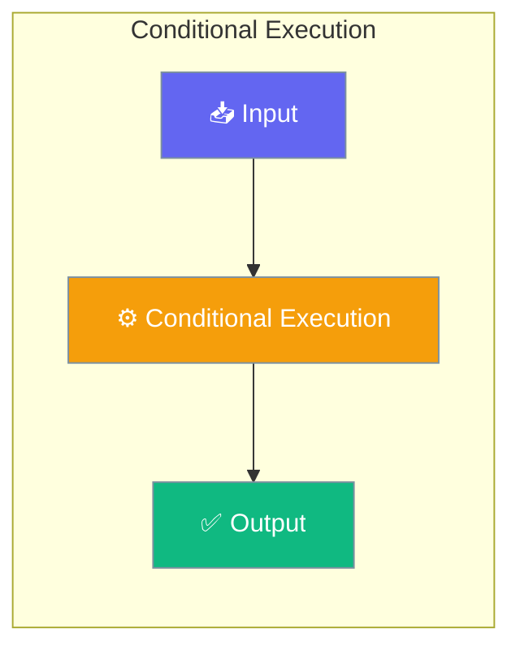

<Info>
PraisonAI now provides a **unified condition syntax** that works the same way in both `AgentFlow` (pipelines) and `Task` (multi-agent teams).
</Info>


```mermaid
graph LR
    subgraph "Conditional Execution"
        A[📥 Input] --> B[⚙️ Conditional Execution]
        B --> C[✅ Output]
    end

    classDef input fill:#6366F1,stroke:#7C90A0,color:#fff
    classDef process fill:#F59E0B,stroke:#7C90A0,color:#fff
    classDef output fill:#10B981,stroke:#7C90A0,color:#fff

    class A input
    class B process
    class C output
```


## Overview

Conditional execution allows you to control workflow branching based on variables, scores, or other runtime values. PraisonAI supports:

- **String expression conditions** - Simple `{{variable}}` syntax for comparisons
- **Dictionary routing** - Map decision values to next tasks
- **Callable conditions** - Custom Python functions

## Quick Start


<Steps>
<Step title="Simple Usage">
<CodeGroup>
```python Task with when (Recommended)
from praisonaiagents import Task

# Simple condition with then/else routing
task = Task(
    name="score_check",
    description="Check if score passes threshold",
    when="{{score}} > 80",
    then_task="approve",
    else_task="reject"
)

# Evaluate the condition
result = task.evaluate_when({"score": 90})  # True
next_task = task.get_next_task({"score": 90})  # "approve"
```
</Step>

<Step title="With Configuration">
```python AgentFlow with when()
from praisonaiagents import AgentFlow, Agent, when

agent = Agent(name="worker", instructions="Process data")

flow = AgentFlow(
    agents=[agent],
    steps=[
        when(
            condition="{{score}} >= 50",
            then_steps=["high_score_handler"],
            else_steps=["low_score_handler"]
        )
    ],
    variables={"score": 75}
)
```
</CodeGroup>
</Step>
</Steps>


## Best Practices

<AccordionGroup>
  <Accordion title="Start simple">
    Enable the feature with a single parameter before adding configuration. Verify it works, then layer in options.
  </Accordion>
  <Accordion title="Use environment variables for secrets">
    Never hardcode API keys or tokens. Use `os.getenv("KEY_NAME")` to read from environment variables.
  </Accordion>
  <Accordion title="Test with minimal examples first">
    Copy the Quick Start example, run it, then extend it. This confirms your environment is set up correctly.
  </Accordion>
  <Accordion title="Check the logs">
    Set `verbose=True` on your agent to see detailed execution logs when debugging unexpected behavior.
  </Accordion>
</AccordionGroup>

## Related

<CardGroup cols={2}>
  <Card title="Features Overview" icon="grid-2" href="/docs/features">
    Browse all PraisonAI features
  </Card>
  <Card title="Quick Start" icon="rocket" href="/docs/introduction">
    Get started with PraisonAI agents
  </Card>
</CardGroup>
