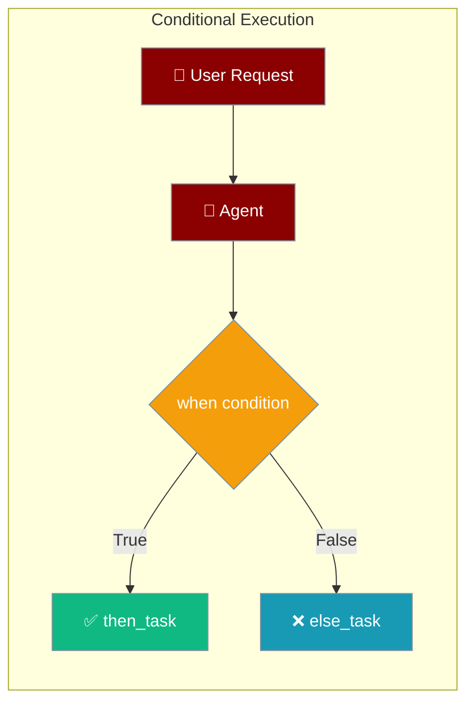
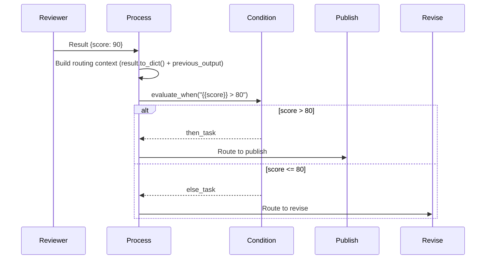
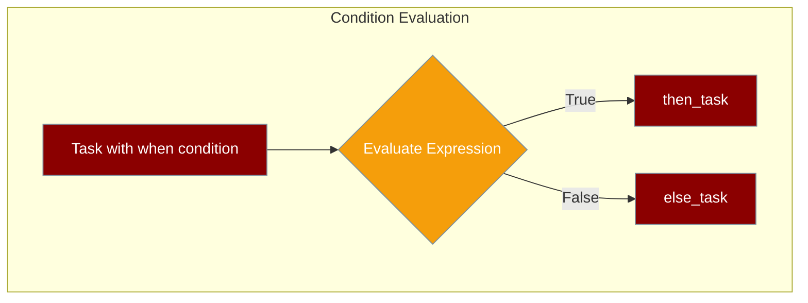
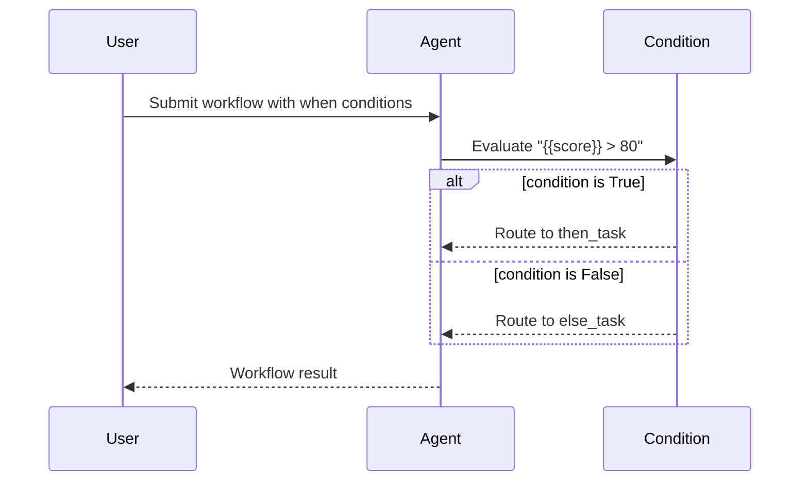

Conditional execution gates tasks and workflow steps on runtime values using one `when` syntax that works in both `AgentFlow` pipelines and `Task` teams.

<Note>
**Runtime support:** `Task(when=..., then_task=..., else_task=...)` and `Task(routing=...)` are wired into the markdown workflow engine (`WorkflowManager`, `.praisonai/workflows/*.md`). Run them with `praisonai workflow run <file>.md` or `WorkflowManager.execute(...)` — the runtime that honours these fields. See [Markdown Workflow Branches](/features/markdown-workflow-branches) for a runnable branch example.
</Note>

```python
from praisonaiagents import Agent, Task, when

agent = Agent(name="conditional", instructions="Run tasks only when conditions match.")
agent.start("Execute the follow-up step if the score is above 0.8.")
```

The user defines workflows; `when` expressions gate tasks and AgentFlow steps on runtime variables.

<Note>
**Since PraisonAI PR [#4020](https://github.com/MervinPraison/PraisonAI/pull/4020)**, `when`/`then_task`/`else_task` routing is wired into `PraisonAIAgents`. On earlier releases the API existed on `Task` but the `Process` orchestrator never consulted it — `when`-only tasks silently stalled or fell through to unrelated tasks.
</Note>


```mermaid
graph LR
    subgraph "Conditional Execution"
        In[📝 User Request] --> Agent[🤖 Agent]
        Agent --> Cond{when condition}
        Cond -->|True| Then[✅ then_task]
        Cond -->|False| Else[❌ else_task]
    end

    classDef agent fill:#8B0000,stroke:#7C90A0,color:#fff
    classDef process fill:#189AB4,stroke:#7C90A0,color:#fff
    classDef success fill:#10B981,stroke:#7C90A0,color:#fff
    classDef decision fill:#F59E0B,stroke:#7C90A0,color:#fff

    class In,Agent agent
    class Cond decision
    class Then success
    class Else process
```

## Overview

Conditional execution allows you to control workflow branching based on variables, scores, or other runtime values. PraisonAI supports:

- **String expression conditions** - Simple `{{variable}}` syntax for comparisons
- **Dictionary routing** - Map decision values to next tasks
- **Callable conditions** - Custom Python functions

## Quick Start

<Steps>
<Step title="Task or AgentFlow">
<CodeGroup>
```python Task with when (Recommended)
from praisonaiagents import Task

# Simple condition with then/else routing
task = Task(
    name="score_check",
    description="Check if score passes threshold",
    when="{{score}} > 80",
    then_task="approve",
    else_task="reject"
)

# Evaluate the condition
result = task.evaluate_when({"score": 90})  # True
next_task = task.get_next_task({"score": 90})  # "approve"
```

```python AgentFlow with when()
from praisonaiagents import AgentFlow, Agent, when

agent = Agent(name="worker", instructions="Process data")

flow = AgentFlow(
    agents=[agent],
    steps=[
        when(
            condition="{{score}} >= 50",
            then_steps=["high_score_handler"],
            else_steps=["low_score_handler"]
        )
    ],
    variables={"score": 75}
)
```
</CodeGroup>
</Step>
</Steps>

## Condition Syntax

### String Expression Conditions

Use `{{variable}}` placeholders with comparison operators:

| Operator | Example | Description |
|----------|---------|-------------|
| `>` | `{{score}} > 80` | Greater than |
| `>=` | `{{score}} >= 80` | Greater than or equal |
| `<` | `{{score}} < 50` | Less than |
| `<=` | `{{score}} <= 50` | Less than or equal |
| `==` | `{{status}} == approved` | Equal to |
| `!=` | `{{status}} != rejected` | Not equal to |
| `in` | `{{word}} in {{text}}` | Contains (substring) |
| `contains` | `{{list}} contains {{item}}` | Contains (list) |

<Tip>
String comparisons don't require quotes: `{{status}} == approved` works correctly.
</Tip>

### Examples

```python
# Numeric comparisons
"{{score}} > 80"
"{{count}} >= 10"
"{{price}} < 100.50"

# String comparisons
"{{status}} == approved"
"{{category}} != spam"

# Contains checks
"{{text}} contains error"
"{{tags}} in important"

# Boolean checks
"{{is_valid}}"  # True if truthy
```

## Task Condition Parameters

### `when` Parameter

The `when` parameter accepts a string expression condition:

```python
from praisonaiagents import Task

task = Task(
    name="quality_check",
    description="Check content quality",
    when="{{quality_score}} >= 7",
    then_task="publish",
    else_task="revise"
)
```

### `then_task` and `else_task`

Route to different tasks based on condition result:

```python
task = Task(
    name="review",
    description="Review submission",
    when="{{approved}} == true",
    then_task="finalize",    # Run if condition is True
    else_task="request_changes"  # Run if condition is False
)
```

### `routing` Parameter (Advanced)

For LLM-driven decisions, use the `routing` parameter (formerly `condition`). Pass a bare dict, or the `TaskRoutingConfig` dataclass for clarity:

```python
from praisonaiagents import Task
from praisonaiagents.workflows.workflow_configs import TaskRoutingConfig

# Dict form (still supported)
Task(
    name="decide",
    description="Decide next action based on content",
    routing={"approved": ["publish"], "rejected": ["edit"]},
)

# Dataclass form (recommended for clarity)
Task(
    name="decide",
    description="Decide next action based on content",
    routing=TaskRoutingConfig(
        branches={"approved": ["publish"], "rejected": ["edit"]},
        next_steps=["cleanup"],
    ),
)
```

<Note>
`TaskRoutingConfig(...)` unpacks onto `Task.branch_condition` and `Task.next_steps` — the attributes the executor reads — so `Task.condition` stays a plain dict/str.
</Note>

#### Precedence Ladder

The `routing` parameter resolves in this order (only the last two forms are supported today):

```python
# Dict (map decision value → next steps)
Task(routing={"approved": ["publish"], "rejected": ["edit"]})

# Config class (full control over branches + next_steps)
Task(routing=TaskRoutingConfig(
    branches={"approved": ["publish"]},
    next_steps=["cleanup"],
))
```

**Precedence:** `Bool > String > Dict > Config` — the markdown engine honours the `Dict` and `Config` forms.

<Note>
The `condition` parameter still works for backward compatibility, but `routing` is preferred for clarity.
</Note>

#### End-to-End Markdown Example

A branch actually being taken in a markdown workflow:

````markdown classify_and_route.md
---
name: classify_and_route
---

## step1
Classify the request.

```branch
success: [handle_success]
failure: [handle_failure]
```

## handle_failure
Escalate.

## handle_success
Reply.
````

```bash
praisonai workflow run .praisonai/workflows/classify_and_route.md
```

When `step1`'s output contains `success`, execution jumps to `handle_success`, skipping `handle_failure`.

### `should_run` Callable

For complex logic, use a callable:

```python
def check_prerequisites(context):
    return context.get("data_ready", False) and context.get("approved", False)

task = Task(
    name="process",
    description="Process data",
    should_run=check_prerequisites
)
```

## AgentFlow Conditions

### `when()` Function

```python
from praisonaiagents import when

flow = AgentFlow(
    steps=[
        "step1",
        when(
            condition="{{result}} == success",
            then_steps=["success_handler"],
            else_steps=["error_handler"]
        ),
        "final_step"
    ]
)
```

### Nested Conditions

```python
flow = AgentFlow(
    steps=[
        when(
            condition="{{score}} >= 80",
            then_steps=[
                when(
                    condition="{{premium}} == true",
                    then_steps=["premium_path"],
                    else_steps=["standard_path"]
                )
            ],
            else_steps=["low_score_path"]
        )
    ]
)
```

## Multi-agent Workflows (PraisonAIAgents)

`when`/`then_task`/`else_task` also routes multi-agent workflows built with `PraisonAIAgents`.

```python
from praisonaiagents import Agent, Task, PraisonAIAgents

reviewer  = Agent(name="reviewer",  instructions="Score the draft 0-100 as JSON: {\"score\": <int>}")
publisher = Agent(name="publisher", instructions="Publish the approved draft")
writer    = Agent(name="writer",    instructions="Revise the draft")

review  = Task(name="review",  description="Score the draft", agent=reviewer)
publish = Task(name="publish", description="Publish it",       agent=publisher)
revise  = Task(name="revise",  description="Revise the draft", agent=writer)

gate = Task(
    name="gate",
    description="Route based on score",
    agent=reviewer,
    when="{{score}} > 80",
    then_task="publish",
    else_task="revise",
)

PraisonAIAgents(
    agents=[reviewer, publisher, writer],
    tasks=[review, gate, publish, revise],
).start()
```


```mermaid
sequenceDiagram
    participant Reviewer
    participant Process
    participant Condition
    participant Publish
    participant Revise

    Reviewer->>Process: Result {score: 90}
    Process->>Process: Build routing context (result.to_dict() + previous_output)
    Process->>Condition: evaluate_when("{{score}} > 80")
    alt score > 80
        Condition-->>Process: then_task
        Process->>Publish: Route to publish
    else score <= 80
        Condition-->>Process: else_task
        Process->>Revise: Route to revise
    end
```

<Note>
**How the routing context is built** — the `when` expression is evaluated against the **current** task (the one that just completed), not the target:

- The context is `result.to_dict()` (from `json_dict` / `pydantic`) merged with `previous_output = result.raw`.
- Access structured fields as `{{field_name}}` (e.g. `{{score}}` when the agent returns `{"score": 90}`).
- Access raw text as `{{previous_output}}`.
</Note>

<Note>
**Priority** — when both `when` and `next_tasks` are set on the same task, `when`-routing wins.
</Note>

<Note>
**Clean termination** — if the taken branch resolves to `None` (e.g. only `then_task` is set and the condition is false, with no `next_tasks` fallback), the workflow ends cleanly on that path. It does **not** pick an unrelated not-started task.
</Note>

## Flow Diagram


```mermaid
graph TB
    subgraph Condition["Condition Evaluation"]
        A[Task with when condition] --> B{Evaluate Expression}
        B -->|True| C[then_task]
        B -->|False| D[else_task]
    end

    classDef task fill:#8B0000,stroke:#7C90A0,color:#fff
    classDef decision fill:#F59E0B,stroke:#7C90A0,color:#fff

    class A,C,D task
    class B decision
```

## How It Works


```mermaid
sequenceDiagram
    participant User
    participant Agent
    participant Condition

    User->>Agent: Submit workflow with when conditions
    Agent->>Condition: Evaluate "{{score}} > 80"
    alt condition is True
        Condition-->>Agent: Route to then_task
    else condition is False
        Condition-->>Agent: Route to else_task
    end
    Agent-->>User: Workflow result
```

---

## Best Practices

<AccordionGroup>
<Accordion title="Use simple conditions">
Keep conditions readable and simple. Complex logic should go in `should_run` callables.

```python
# ✅ Good - Simple and clear
when="{{score}} > 80"

# ❌ Avoid - Too complex
when="{{score}} > 80 and {{status}} == approved and {{count}} < 10"
```
</Accordion>

<Accordion title="Provide both then_task and else_task">
Specify both branches when you want an explicit fork:

```python
# ✅ Both branches defined - explicit fork
Task(
    when="{{approved}}",
    then_task="proceed",
    else_task="wait"
)

# ✅ One-branch routing (early-exit) - intentional shape
# When the condition is false, the branch resolves to None and the
# workflow ends cleanly on this path instead of picking an unrelated task.
Task(
    when="{{approved}}",
    then_task="proceed"
)
```
</Accordion>

<Accordion title="Use routing for LLM decisions">
When the LLM needs to make a decision, use `routing` with `task_type="decision"`:

```python
Task(
    name="classifier",
    description="Classify the input",
    task_type="decision",
    routing={
        "positive": ["positive_handler"],
        "negative": ["negative_handler"],
        "neutral": ["neutral_handler"]
    }
)
```
</Accordion>
</AccordionGroup>

## Migration Guide

### From `condition` to `routing`

```python
# Old syntax (still works)
Task(condition={"yes": ["next"], "no": ["stop"]})

# New syntax (recommended)
Task(routing={"yes": ["next"], "no": ["stop"]})
```

### Adding `when` to existing Tasks

```python
# Before - Using should_run callable
Task(
    should_run=lambda ctx: ctx.get("score", 0) > 80
)

# After - Using when expression (simpler)
Task(
    when="{{score}} > 80"
)
```

## API Reference

### Task Parameters

| Parameter | Type | Description |
|-----------|------|-------------|
| `when` | `str` | String expression condition |
| `then_task` | `str` | Task name to run if condition is True |
| `else_task` | `str` | Task name to run if condition is False |
| `routing` | `Dict[str, List[str]]` \| `TaskRoutingConfig` | Map decision values to task names; `TaskRoutingConfig` unpacks to `branch_condition` / `next_steps` |
| `should_run` | `Callable` | Custom condition function |

### Task Methods

| Method | Returns | Description |
|--------|---------|-------------|
| `evaluate_when(context)` | `bool` | Evaluate the `when` condition |
| `get_next_task(context)` | `str` | Get next task based on condition |

## Related

<CardGroup cols={2}>
  <Card title="Markdown Workflow Branches" icon="code-branch" href="/features/markdown-workflow-branches">
    Route markdown-workflow steps on output
  </Card>
  <Card title="Tasks" icon="list-check" href="/concepts/tasks">
    Task fields including when / then_task / else_task
  </Card>
  <Card title="AgentFlow" icon="diagram-project" href="/features/agentflow">
    Learn about deterministic pipelines
  </Card>
  <Card title="AgentTeam" icon="users" href="/features/agentteam">
    Multi-agent task orchestration
  </Card>
</CardGroup>
