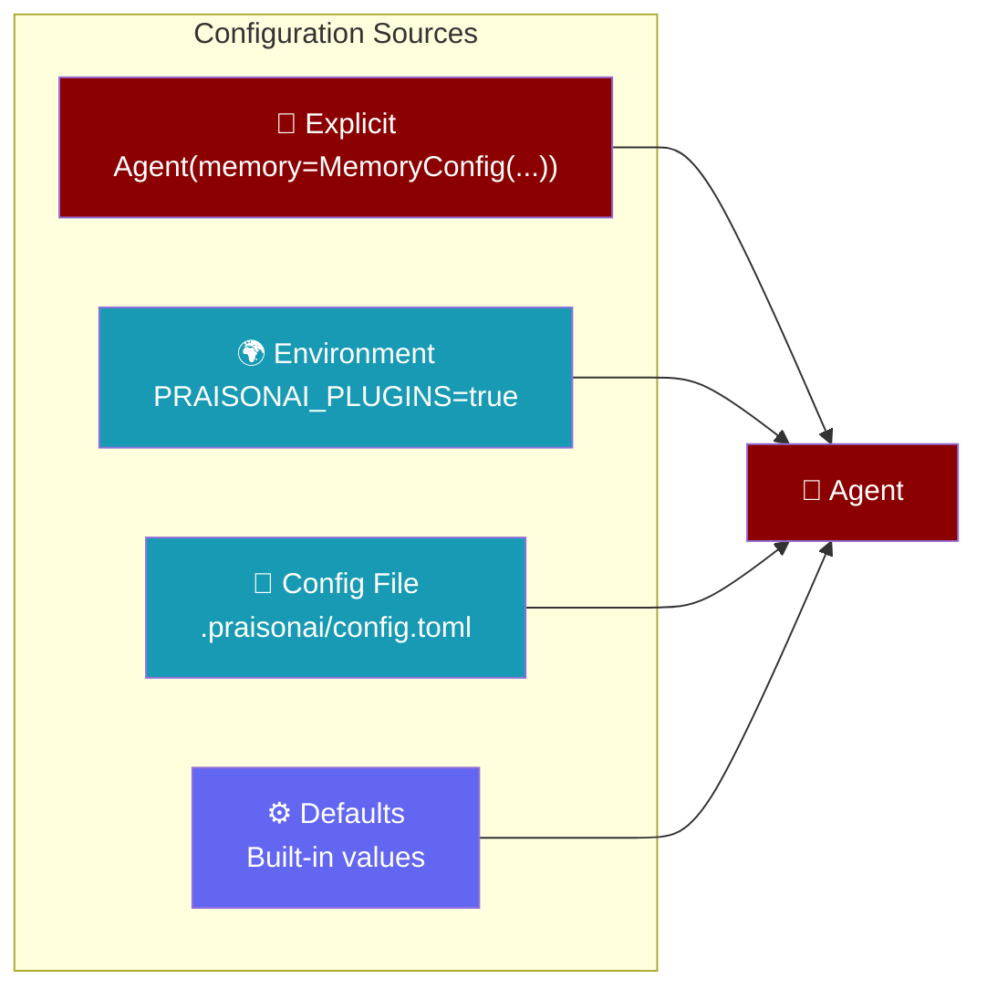
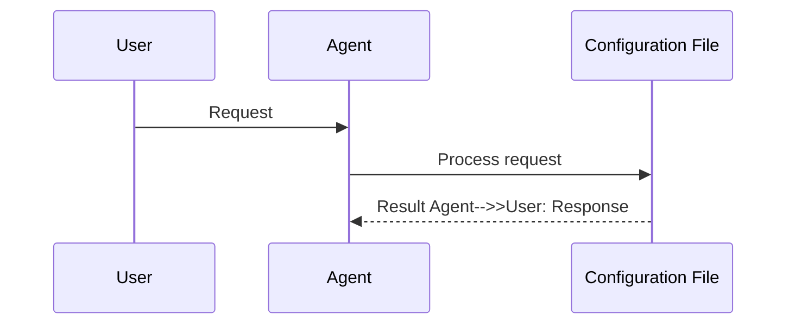
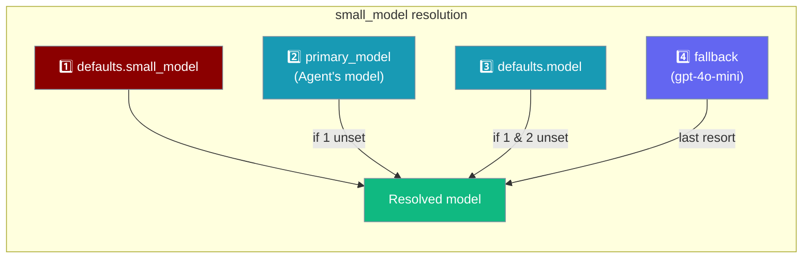
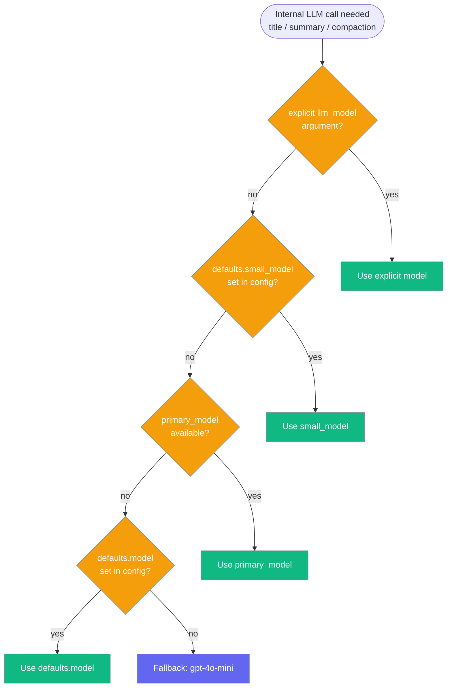
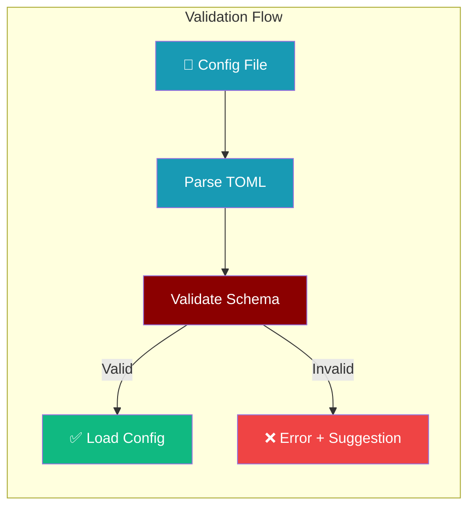
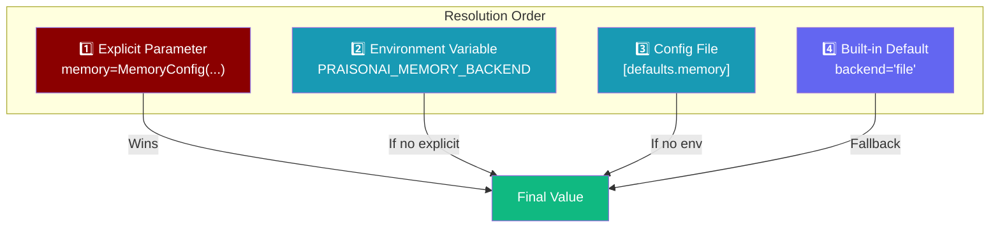

Set default values for all Agent parameters using a configuration file. When you pass `True` to a feature, it uses your configured defaults.

```python
from praisonaiagents import Agent

agent = Agent(name="configured", instructions="Use defaults from config.toml.")
agent.start("Hello — apply my saved model and memory settings.")
```

The user sets defaults in `.praisonai/config.toml`; explicit Agent parameters still override the file.


```mermaid
graph LR
    subgraph "Configuration Sources"
        direction TB
        A["📝 Explicit<br/>Agent(memory=MemoryConfig(...))"]
        B["🌍 Environment<br/>PRAISONAI_PLUGINS=true"]
        C["📄 Config File<br/>.praisonai/config.toml"]
        D["⚙️ Defaults<br/>Built-in values"]
    end
    
    A --> AGENT["🤖 Agent"]
    B --> AGENT
    C --> AGENT
    D --> AGENT
    
    style A fill:#8B0000,color:#fff
    style B fill:#189AB4,color:#fff
    style C fill:#189AB4,color:#fff
    style D fill:#6366F1,color:#fff
    style AGENT fill:#8B0000,color:#fff
```

## How It Works


```mermaid
sequenceDiagram
    participant User
    participant Agent
    participant Feature as Configuration File

    User->>Agent: Request
    Agent->>Feature: Process request
    Feature-->>Agent: Result    Agent-->>User: Response
```

    classDef agent fill:#8B0000,color:#fff
    classDef tool fill:#189AB4,color:#fff

**Precedence (highest to lowest):**
1. Explicit parameters in code
2. Environment variables
3. Config file
4. Built-in defaults

<CardGroup cols={2}>
  <Card title="Project Config" icon="folder">
    `.praisonai/config.toml` — project-specific defaults
  </Card>
  <Card title="Root Config" icon="file">
    `praisonai.toml` — project root alternative
  </Card>
  <Card title="User Global" icon="user">
    `~/.praisonai/config.toml` — applies across projects
  </Card>
  <Card title="Environment Override" icon="globe">
    `PRAISONAI_*` env vars beat config file values
  </Card>
</CardGroup>

---

## Quick Start

<Steps>
<Step title="Create Config File">
Create `.praisonai/config.toml` in your project:

```toml
[defaults]
model = "gpt-4o-mini"

[defaults.memory]
enabled = true
backend = "sqlite"
```
</Step>

<Step title="Use in Code">
```python
from praisonaiagents import Agent

# memory=True now uses your config defaults (sqlite backend)
agent = Agent(
    name="Assistant",
    instructions="Help users",
    memory=True  # Uses [defaults.memory] settings
)
```

<Info>
PraisonAI now validates field names automatically — see [Automatic Field Validation](./yaml-configuration-reference#automatic-field-validation) for typo detection and suggestions.
</Info>
</Step>
</Steps>

---

## Config File Locations

Config files are searched in this order:

| Location | Scope |
|----------|-------|
| `.praisonai/config.toml` · `.yaml` · `.yml` | Project-specific |
| `praisonai.toml` · `.yaml` · `.yml` | Project root |
| `~/.praisonai/config.toml` · `.yaml` · `.yml` | User global |

---

## Small Model for Cheap Internal Calls

`small_model` routes internal LLM calls (session title generation today; summarisation/compaction going forward) to a cheaper model than your primary `model`.

```yaml
# .praisonai/config.yaml
defaults:
  model: gpt-4o            # primary — used by your agents
  small_model: gpt-4o-mini # cheap auxiliary — internal calls
```

When unset, behaviour is byte-identical to today: internal calls fall back to `gpt-4o-mini`.

**Resolution precedence** (highest first):


```mermaid
graph LR
    S["defaults.small_model"] --> P["primary_model<br/>(running agent's model)"]
    P --> M["defaults.model"]
    M --> D["gpt-4o-mini<br/>(built-in fallback)"]

    classDef cfg fill:#6366F1,stroke:#7C90A0,color:#fff
    classDef fb fill:#F59E0B,stroke:#7C90A0,color:#fff
    classDef def fill:#10B981,stroke:#7C90A0,color:#fff

    class S,M cfg
    class P fb
    class D def
```

| Field | Type | Default | Description |
|-------|------|---------|-------------|
| `small_model` | `str` | `None` (falls back to `gpt-4o-mini`) | Cheap auxiliary model for internal LLM calls. Falls back to `primary_model`, then `defaults.model`, then `gpt-4o-mini`. |

<Note>
An explicit `llm_model=` at the call site (e.g. `generate_title(..., llm_model="gpt-4o")`) always wins over `small_model`.
</Note>

<Info>
The CLI/JSON-schema namespace `agent.small_model` is honoured too — both `defaults.small_model` and `agent.small_model` read the same config file.
</Info>

---

## Full Configuration Reference

<Tabs>
<Tab title="Plugins">

<CodeGroup>
```toml config.toml
[plugins]
# Enable all plugins: true
# Enable specific: ["logging", "metrics"]
# Disable: false
enabled = false

# Auto-discover from default directories
auto_discover = true

# Plugin directories to scan
directories = [
    "./.praisonai/plugins/",
    "~/.praisonai/plugins/"
]
```

```yaml config.yaml
plugins:
  enabled: true
  auto_discover: true
  directories:
    - ./.praisonai/plugins/
    - ~/.praisonai/plugins/
  pii_guardrail:          # per-plugin option block
    redact: [email, phone]
  memory_watchdog:
    interval: 30
    enabled: false        # disable just this plugin
```
</CodeGroup>

<Note>
Both formats are discovered — `.praisonai/config.toml` and `.praisonai/config.yaml` (plus `.yml`) share the same search walk. A per-plugin `<name>: { ... }` block also implicitly opts that plugin in unless it sets `enabled: false`.
</Note>

<Note>
When `[plugins] enabled = true` (or `PRAISONAI_PLUGINS=true`), constructing any `Agent(...)` calls `plugins.maybe_enable_from_config()` internally — you don't need to call `plugins.enable()` yourself. Per-plugin option maps are delivered automatically to each plugin's `on_config(options)` hook. See [Plugins → Configure from config.yaml](/docs/features/plugins#configure-plugins-from-praisonai-config-yaml) for the full per-plugin surface.
</Note>
</Tab>

<Tab title="LLM Defaults">
<CodeGroup>
```toml config.toml
[defaults]
# Primary LLM model — used by every agent unless overridden
model = "gpt-4o"

# Cheap/fast auxiliary model for internal LLM calls
# (session-title generation; summarisation/compaction planned).
# When unset, falls back to `model`, then a built-in default.
small_model = "gpt-4o-mini"

# Custom endpoint (for local LLMs)
# base_url = "http://localhost:11434/v1"

# Feature flags
allow_delegation = false
allow_code_execution = false
code_execution_mode = "safe"
```

```yaml config.yaml
defaults:
  model: gpt-4o
  small_model: gpt-4o-mini
  # base_url: http://localhost:11434/v1
```
</CodeGroup>

<Note>
`small_model` is used by PraisonAI for cheap internal LLM calls (currently session-title generation; summarisation/compaction in future). When unset, PraisonAI falls back to your primary `model` — so single-provider users (Anthropic, Ollama, on-prem) no longer make unexpected OpenAI calls.
</Note>
</Tab>

<Tab title="Memory">
```toml
[defaults.memory]
enabled = false
backend = "file"  # file, sqlite, redis, postgres, mongodb
auto_memory = false
history = false
history_limit = 10

[defaults.memory.learn]
enabled = false
persona = true
insights = true
patterns = false
```
</Tab>

<Tab title="Knowledge">
```toml
[defaults.knowledge]
enabled = false
embedder = "openai"
chunking_strategy = "semantic"
chunk_size = 1000
chunk_overlap = 200
retrieval_k = 5
rerank = false
```
</Tab>

<Tab title="Planning & Reflection">
```toml
[defaults.planning]
enabled = false
reasoning = false
auto_approve = false

[defaults.reflection]
enabled = false
min_iterations = 1
max_iterations = 3
```
</Tab>

<Tab title="Output & Execution">
```toml
[defaults.output]
preset = "silent"  # silent, actions, verbose, json
verbose = false
stream = false
metrics = false

[defaults.execution]
max_iter = 20
max_retry_limit = 2
# retry_initial_delay = 1.0
# retry_backoff_factor = 2.0
# retry_jitter = 0.1
```
</Tab>
</Tabs>

---

## Cheap auxiliary model for internal calls

`small_model` sets a cheap/fast model for PraisonAI's internal LLM calls (session-title generation today; summarisation/compaction in future), independent of your agent's primary `model`.

| Field | Type | Default | Description |
|-------|------|---------|-------------|
| `defaults.small_model` | `str` (optional) | `None` (falls back to primary `model`, then `gpt-4o-mini`) | Cheap/fast auxiliary model used for internal LLM calls. Honoured under both `[defaults]` (typed loader) and `[agent]` (CLI/JSON-schema) namespaces of the same config file. |

Resolution order for `get_small_model(primary_model, fallback)`:

1. `defaults.small_model` (or `agent.small_model` CLI namespace) — if set.
2. `primary_model` — the running agent's model, if any.
3. `defaults.model` (or `agent.model`) — if set.
4. `fallback` — preserves today's hardcoded `gpt-4o-mini` when nothing is configured.

---

## Usage Examples

<AccordionGroup>
<Accordion title="Cheap auxiliary model for internal calls" icon="dollar-sign">
Use a cheap/fast model for internal work (session titles, summarisation) while keeping a powerful primary model for the agent itself.


```mermaid
flowchart LR
    subgraph "small_model resolution"
        A["1️⃣ defaults.small_model"] --> R["Resolved model"]
        B["2️⃣ primary_model<br/>(Agent's model)"] -->|if 1 unset| R
        C["3️⃣ defaults.model"] -->|if 1 & 2 unset| R
        D["4️⃣ fallback<br/>(gpt-4o-mini)"] -->|last resort| R
    end
    classDef primary fill:#8B0000,stroke:#7C90A0,color:#fff
    classDef secondary fill:#189AB4,stroke:#7C90A0,color:#fff
    classDef fallback fill:#6366F1,stroke:#7C90A0,color:#fff
    classDef result fill:#10B981,stroke:#7C90A0,color:#fff
    class A primary
    class B,C secondary
    class D fallback
    class R result
```

```toml
# .praisonai/config.toml
[defaults]
model = "gpt-4o"            # primary — used for the agent
small_model = "gpt-4o-mini" # cheap auxiliary — used for internal calls
```

```python
from praisonaiagents import Agent

# Agent runs on gpt-4o; session titles use gpt-4o-mini automatically.
agent = Agent(
    name="Assistant",
    instructions="Help users"
)
```

Single-provider setups work the same way:

```toml
# Anthropic-only setup — no OpenAI calls anywhere
[defaults]
model = "anthropic/claude-3-5-sonnet-latest"
small_model = "anthropic/claude-3-5-haiku-latest"
```

```toml
# Ollama-only setup — everything runs locally
[defaults]
model = "ollama/llama3.1:70b"
small_model = "ollama/llama3.1:8b"
base_url = "http://localhost:11434/v1"
```

Explicit `Agent(...)` kwargs still override the config file, same as `model`.
</Accordion>

<Accordion title="Memory with PostgreSQL" icon="database">
```toml
# .praisonai/config.toml
[defaults.memory]
enabled = true
backend = "postgres"

[defaults.memory.learn]
enabled = true
persona = true
insights = true
```

```python
from praisonaiagents import Agent

# memory=True now uses PostgreSQL
agent = Agent(
    name="Assistant",
    instructions="Help users",
    memory=True
)
```
</Accordion>

<Accordion title="Knowledge with Reranking" icon="book">
```toml
# .praisonai/config.toml
[defaults.knowledge]
enabled = true
embedder = "openai"
retrieval_k = 10
rerank = true
rerank_model = "cohere"
```

```python
from praisonaiagents import Agent

# knowledge=True uses reranking
agent = Agent(
    name="Researcher",
    instructions="Research topics",
    knowledge=True
)
```
</Accordion>

<Accordion title="Verbose Output Mode" icon="terminal">
```toml
# .praisonai/config.toml
[defaults.output]
preset = "verbose"
verbose = true
markdown = true
stream = true
```

```python
from praisonaiagents import Agent

# All agents now use verbose output by default
agent = Agent(
    name="Assistant",
    instructions="Help users"
)
```
</Accordion>

<Accordion title="Local LLM (Ollama)" icon="server">
```toml
# .praisonai/config.toml
[defaults]
model = "llama3"
base_url = "http://localhost:11434/v1"
```

```python
from praisonaiagents import Agent

# Uses local Ollama by default
agent = Agent(
    name="Local Assistant",
    instructions="Help users"
)
```
</Accordion>
</AccordionGroup>

---

## Programmatic Access

Access config values programmatically:

```python
from praisonaiagents.config.loader import (
    get_config,
    get_default,
    get_small_model,          # NEW
    get_plugins_config,
    get_plugin_options,
    is_plugins_enabled,
)

# Get entire config
config = get_config()
print(config.plugins.enabled)
print(config.defaults.model)

# Get specific default with fallback
model = get_default("model", "gpt-4o-mini")
memory_backend = get_default("memory.backend", "file")

# Resolve the cheap auxiliary model with fallback chain:
#   defaults.small_model  ->  primary_model  ->  defaults.model  ->  fallback
small = get_small_model(primary_model="gpt-4o", fallback="gpt-4o-mini")
print(small)

# Check plugins status
if is_plugins_enabled():
    print("Plugins are enabled")

# Read per-plugin option maps ({plugin_name: options_dict})
options = get_plugin_options()
print(options.get("pii_guardrail", {}))
```

---

## Auxiliary / Small Model Resolution

`small_model` routes PraisonAI's internal LLM calls — session-title generation today, summarisation and compaction going forward — to a cheap, fast, or local model without changing your agent's primary model.

```yaml
# .praisonai/config.yaml
defaults:
  model: gpt-4o          # user-facing quality
  small_model: gpt-4o-mini  # cheap background work
```

Set `small_model` to a local model to keep background calls off third-party APIs:

```yaml
defaults:
  model: gpt-4o
  small_model: ollama/llama3
  base_url: http://localhost:11434/v1
```

The resolver picks the first available source top to bottom:


```mermaid
flowchart TB
    START([Internal LLM call needed<br/>title / summary / compaction])
    Q1{explicit llm_model<br/>argument?}
    Q2{defaults.small_model<br/>set in config?}
    Q3{primary_model<br/>available?}
    Q4{defaults.model<br/>set in config?}
    USE_EXPLICIT[Use explicit model]
    USE_SMALL[Use small_model]
    USE_PRIMARY[Use primary_model]
    USE_DEFAULT_MODEL[Use defaults.model]
    USE_FALLBACK[Fallback: gpt-4o-mini]

    START --> Q1
    Q1 -->|yes| USE_EXPLICIT
    Q1 -->|no| Q2
    Q2 -->|yes| USE_SMALL
    Q2 -->|no| Q3
    Q3 -->|yes| USE_PRIMARY
    Q3 -->|no| Q4
    Q4 -->|yes| USE_DEFAULT_MODEL
    Q4 -->|no| USE_FALLBACK

    classDef question fill:#F59E0B,stroke:#7C90A0,color:#fff
    classDef result fill:#10B981,stroke:#7C90A0,color:#fff
    classDef fallback fill:#6366F1,stroke:#7C90A0,color:#fff

    class Q1,Q2,Q3,Q4 question
    class USE_EXPLICIT,USE_SMALL,USE_PRIMARY,USE_DEFAULT_MODEL result
    class USE_FALLBACK fallback
```

Precedence: **explicit `llm_model` > `defaults.small_model` > `primary_model` > `defaults.model` > built-in `gpt-4o-mini`**.

Resolve the auxiliary model programmatically:

```python
from praisonaiagents.config.loader import get_small_model

# Resolves according to config + primary hint + fallback
model = get_small_model(primary_model="gpt-4o", fallback="gpt-4o-mini")
```

The CLI/schema namespace `agent.small_model` reaches the same resolver, so both `[defaults]` and `[agent]` in the same config file work.

<Note>
`small_model` is fully additive. When it is unset **and** no primary model is available, the resolver returns `gpt-4o-mini` — reproducing the previous hardcoded behaviour exactly.
</Note>

---

## Config Validation

<Info>
Config files are validated automatically. Invalid keys trigger helpful error messages with suggestions.
</Info>

```python
from praisonaiagents import validate_config, ConfigValidationError

# Validate a config dict
config = {
    "plugins": {"enabled": True},
    "defaults": {"modell": "gpt-4o"}  # Typo!
}

errors = validate_config(config)
# Output: ["[defaults] Unknown key 'modell'. Did you mean 'model'?"]

# Or raise on error
try:
    validate_config(config, raise_on_error=True)
except ConfigValidationError as e:
    print(e.errors)
```


```mermaid
flowchart LR
    subgraph "Validation Flow"
        CONFIG["📄 Config File"] --> PARSE["Parse TOML"]
        PARSE --> VALIDATE["Validate Schema"]
        VALIDATE --> |"Valid"| LOAD["✅ Load Config"]
        VALIDATE --> |"Invalid"| ERROR["❌ Error + Suggestion"]
    end
    
    style CONFIG fill:#189AB4,color:#fff
    style PARSE fill:#189AB4,color:#fff
    style VALIDATE fill:#8B0000,color:#fff
    style LOAD fill:#10B981,color:#fff
    style ERROR fill:#EF4444,color:#fff
```

---

## Override Precedence

Explicit parameters always override config defaults:

```python
from praisonaiagents import Agent, MemoryConfig

# Config file has: backend = "sqlite"
# But explicit config wins:
agent = Agent(
    name="Assistant",
    instructions="Help users",
    memory=MemoryConfig(backend="postgres")  # Uses postgres, not sqlite
)
```


```mermaid
flowchart TB
    subgraph "Resolution Order"
        EXPLICIT["1️⃣ Explicit Parameter<br/>memory=MemoryConfig(...)"]
        ENV["2️⃣ Environment Variable<br/>PRAISONAI_MEMORY_BACKEND"]
        CONFIG["3️⃣ Config File<br/>[defaults.memory]"]
        DEFAULT["4️⃣ Built-in Default<br/>backend='file'"]
    end
    
    EXPLICIT --> |"Wins"| RESULT["Final Value"]
    ENV --> |"If no explicit"| RESULT
    CONFIG --> |"If no env"| RESULT
    DEFAULT --> |"Fallback"| RESULT
    
    style EXPLICIT fill:#8B0000,color:#fff
    style ENV fill:#189AB4,color:#fff
    style CONFIG fill:#189AB4,color:#fff
    style DEFAULT fill:#6366F1,color:#fff
    style RESULT fill:#10B981,color:#fff
```

---

## Sample Config File

<Expandable title="Complete config.toml template">
```toml
# PraisonAI Agents Configuration
# Copy to .praisonai/config.toml

[plugins]
enabled = false
auto_discover = true
directories = ["./.praisonai/plugins/", "~/.praisonai/plugins/"]

[defaults]
model = "gpt-4o"
small_model = "gpt-4o-mini"  # cheap auxiliary model; falls back to `model` when unset
allow_delegation = false
allow_code_execution = false
code_execution_mode = "safe"

[defaults.memory]
enabled = false
backend = "file"
auto_memory = false
history = false
history_limit = 10

[defaults.memory.learn]
enabled = false
persona = true
insights = true
patterns = false

[defaults.knowledge]
enabled = false
embedder = "openai"
chunking_strategy = "semantic"
chunk_size = 1000
retrieval_k = 5
rerank = false

[defaults.planning]
enabled = false
reasoning = false
auto_approve = false

[defaults.reflection]
enabled = false
min_iterations = 1
max_iterations = 3

[defaults.web]
enabled = false
search = true
fetch = true
search_provider = "duckduckgo"
max_results = 5

[defaults.output]
preset = "silent"
verbose = false
stream = false
metrics = false

[defaults.execution]
max_iter = 20
max_retry_limit = 2
# retry_initial_delay = 1.0
# retry_backoff_factor = 2.0
# retry_jitter = 0.1

[defaults.caching]
enabled = true
prompt_caching = false

[defaults.autonomy]
level = "suggest"
escalation_enabled = true
doom_loop_detection = true
```
</Expandable>

## Best Practices

<AccordionGroup>
  <Accordion title="Set org-wide defaults, override per agent">
    Put values every project should share (model, memory backend, output preset) in `.praisonai/config.toml`, and let explicit `Agent(...)` parameters override them where a specific agent needs something different. Explicit parameters always win over the file, so the config is a floor, not a cage.
  </Accordion>

  <Accordion title="Remember the precedence order">
    Configuration resolves as **Explicit Agent parameter > Environment variable > Config file > Built-in default**. When a setting seems ignored, check for a higher-precedence source (an env var like `PRAISONAI_PLUGINS=true` or an explicit kwarg) before editing the TOML.
  </Accordion>

  <Accordion title="Keep the file in version control">
    Commit `.praisonai/config.toml` so every teammate and CI run starts from the same defaults. Keep secrets (API keys) in environment variables, not the config file, so the file stays safe to share.
  </Accordion>

  <Accordion title="Enable features conservatively">
    Most feature defaults ship disabled (`enabled = false`) for a reason — turning on memory, knowledge, or reflection globally adds latency and cost to every agent. Enable them in the config only when the whole project needs them; otherwise flip them on per agent.
  </Accordion>
</AccordionGroup>

## Related

<CardGroup cols={2}>
  <Card icon="terminal" href="/features/cli">
    Run agents and YAML configs directly from your terminal.
  </Card>
  <Card icon="file-code" href="/features/yaml-configuration-reference">
    See every field available in YAML agent and task configuration.
  </Card>
  <Card title="Plugins" icon="puzzle-piece" href="/docs/features/plugins">
    Auto-enable plugins from `[plugins]` on Agent init.
  </Card>
  <Card title="Tool Discovery" icon="list-tree" href="/docs/features/tool-discovery-order">
    How Agent resolves tool names at runtime.
  </Card>
</CardGroup>
