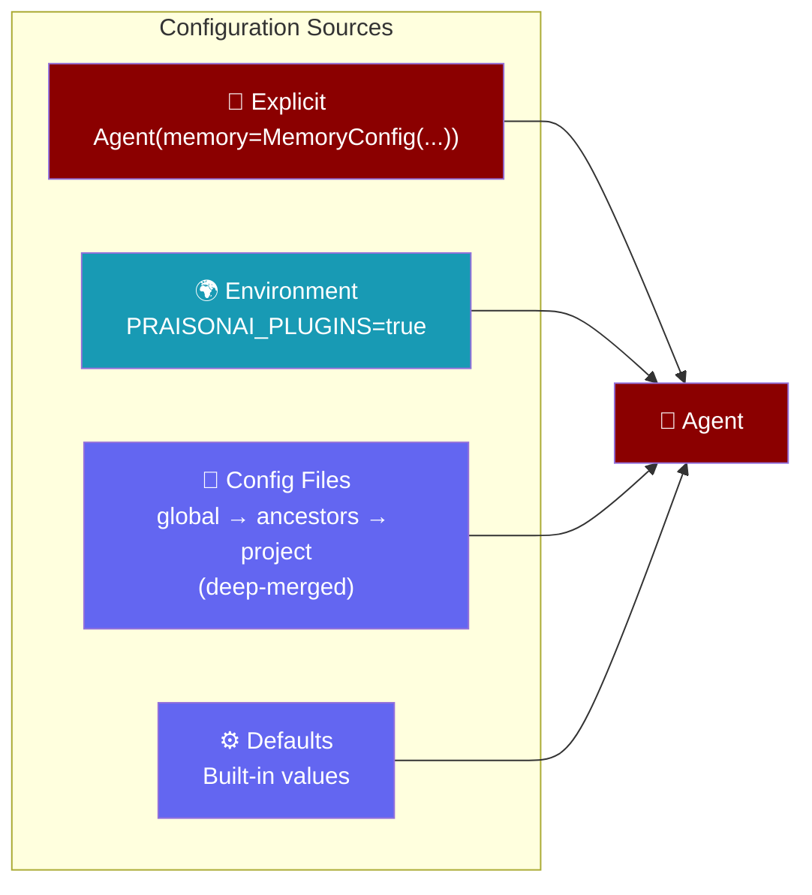
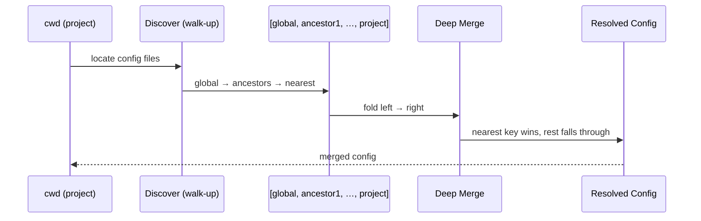
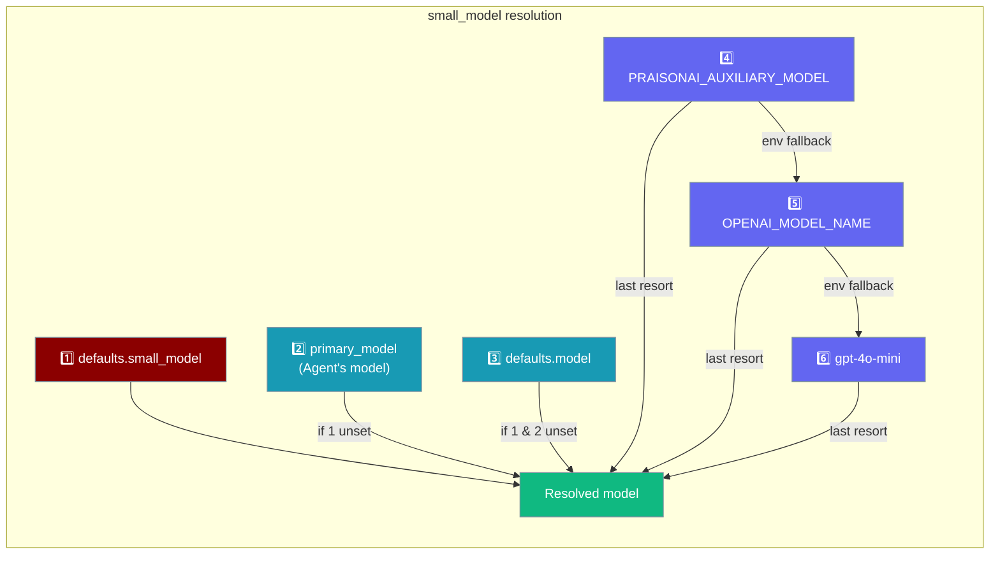
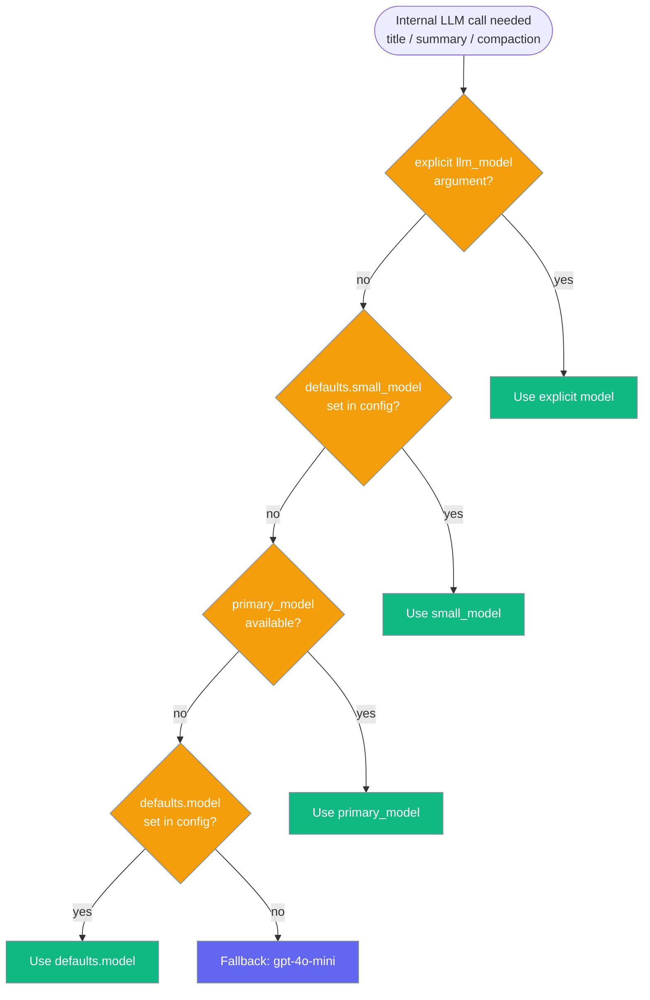
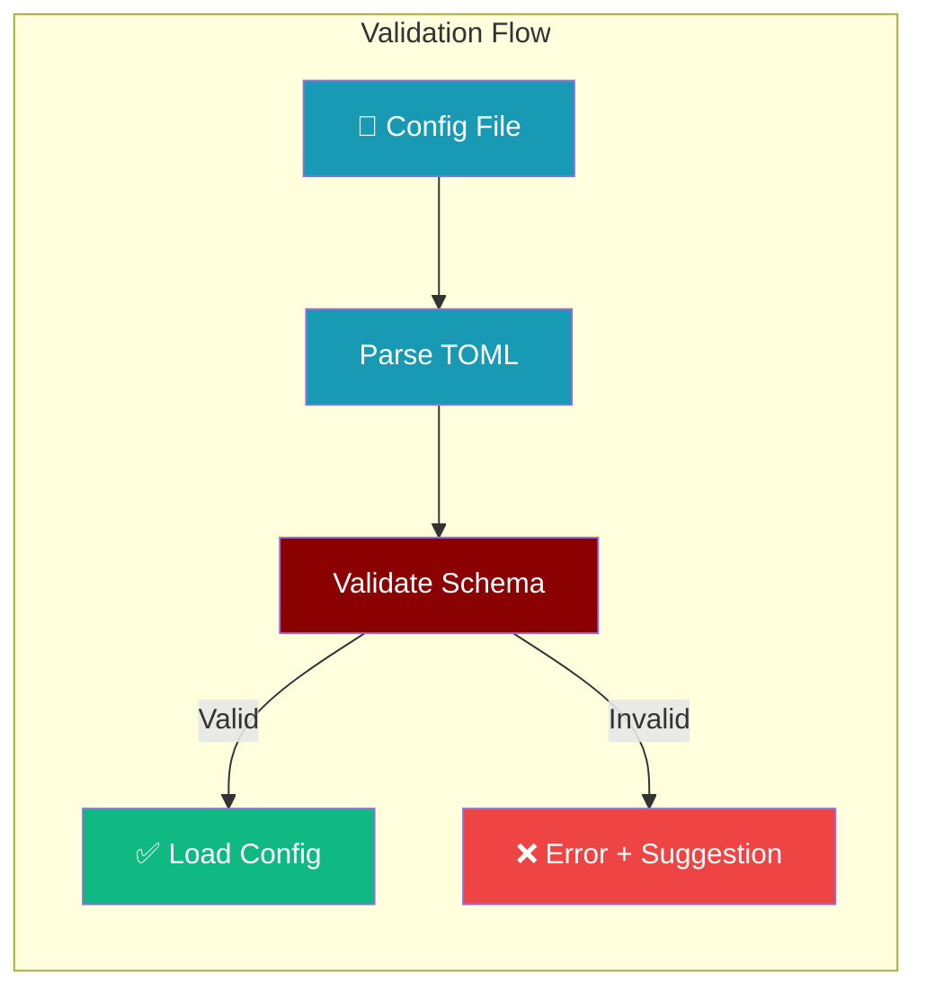
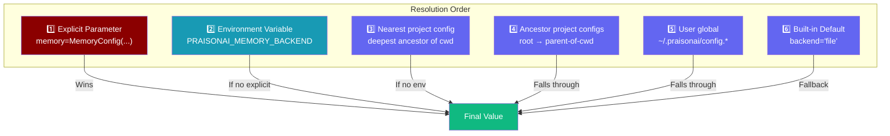

Set default values for all Agent parameters using a configuration file. When you pass `True` to a feature, it uses your configured defaults.

```python
from praisonaiagents import Agent

agent = Agent(name="configured", instructions="Use defaults from config.toml.")
agent.start("Hello — apply my saved model and memory settings.")
```

The user sets defaults in `.praisonai/config.toml`; explicit Agent parameters still override the file. Config files are **deep-merged** across the whole precedence chain — your global `~/.praisonai/config.*` supplies defaults, and every project config down to your current directory overrides only the keys it sets.


```mermaid
graph LR
    subgraph "Configuration Sources"
        direction TB
        A["📝 Explicit<br/>Agent(memory=MemoryConfig(...))"]
        B["🌍 Environment<br/>PRAISONAI_PLUGINS=true"]
        C["📄 Config Files<br/>global → ancestors → project<br/>(deep-merged)"]
        D["⚙️ Defaults<br/>Built-in values"]
    end
    
    A --> AGENT["🤖 Agent"]
    B --> AGENT
    C --> AGENT
    D --> AGENT
    
    style A fill:#8B0000,color:#fff
    style B fill:#189AB4,color:#fff
    style C fill:#6366F1,color:#fff
    style D fill:#6366F1,color:#fff
    style AGENT fill:#8B0000,color:#fff
```

## How It Works

PraisonAI discovers every config file from your global home down to your current directory, then deep-merges them so unset keys fall through and the nearest project file wins for keys it sets.


```mermaid
sequenceDiagram
    participant CWD as cwd (project)
    participant Discover as Discover (walk-up)
    participant Files as [global, ancestor1, …, project]
    participant Merge as Deep Merge
    participant Resolved as Resolved Config

    CWD->>Discover: locate config files
    Discover->>Files: global → ancestors → nearest
    Files->>Merge: fold left → right
    Merge->>Resolved: nearest key wins, rest falls through
    Resolved-->>CWD: merged config
```

**Precedence (highest to lowest):**
1. Explicit parameters in code
2. Environment variables
3. Nearest project config (deepest ancestor of `cwd`)
4. Ancestor project configs (root → parent-of-`cwd`)
5. User global (`~/.praisonai/config.*`)
6. Built-in defaults

<CardGroup cols={2}>
  <Card title="Nearest Project Config" icon="folder">
    `.praisonai/config.toml` nearest to `cwd` — wins for keys it sets
  </Card>
  <Card title="Ancestor Configs" icon="folder-tree">
    Any `.praisonai/config.*` in a parent directory — merged underneath
  </Card>
  <Card title="User Global" icon="user">
    `~/.praisonai/config.toml` — lowest, supplies defaults for all
  </Card>
  <Card title="Environment Override" icon="globe">
    `PRAISONAI_*` env vars beat every config file value
  </Card>
</CardGroup>

---

## Quick Start

<Steps>
<Step title="Create Config File">
Create `.praisonai/config.toml` in your project:

```toml
[defaults]
model = "gpt-4o-mini"

[defaults.memory]
enabled = true
backend = "sqlite"
```
</Step>

<Step title="Use in Code">
```python
from praisonaiagents import Agent

# memory=True now uses your config defaults (sqlite backend)
agent = Agent(
    name="Assistant",
    instructions="Help users",
    memory=True  # Uses [defaults.memory] settings
)
```

<Info>
PraisonAI now validates field names automatically — see [Automatic Field Validation](./yaml-configuration-reference#automatic-field-validation) for typo detection and suggestions.
</Info>
</Step>
</Steps>

---

## Config File Locations

Every config file found from your home directory down to `cwd` is **deep-merged**. Unset keys fall through to a lower layer; the nearest project file wins for the keys it sets.

**Discovery order (lowest → highest precedence):**

| Order | Location | Scope |
|-------|----------|-------|
| 1 (lowest) | `~/.praisonai/config.toml` · `.yaml` · `.yml` | User global — defaults for every project |
| 2 … n-1 | `.praisonai/config.*` · `praisonai.*` in each **ancestor** of `cwd` | Walked root → `cwd` |
| n (highest) | `.praisonai/config.*` · `praisonai.*` nearest to `cwd` | Nearest project file wins |

Within a single directory, the **first matching filename** supplies that layer, in this order:

```
.praisonai/config.toml → .praisonai/config.yaml → .praisonai/config.yml
→ praisonai.toml → praisonai.yaml → praisonai.yml
```

---

## Deep Merge Semantics

Config files merge recursively — a project override for one key keeps every other key from the layers below.

| Value shape | Behaviour |
|-------------|-----------|
| Both sides are a mapping (`dict`) | Recurse key-by-key |
| Scalar, list, or `None` | The higher layer **replaces** the lower — no list concatenation |

Merge inputs are never mutated, so loading is safe to repeat and caching still works via `clear_config_cache()`.

```yaml
# ~/.praisonai/config.yaml (global)
defaults:
  model: anthropic/claude-3-5-sonnet-latest
  small_model: anthropic/claude-3-5-haiku-latest
plugins:
  pii_guardrail:
    redact: [email, phone]

# .praisonai/config.yaml (project) — one key
plugins:
  enabled: true

# merged result
defaults:
  model: anthropic/claude-3-5-sonnet-latest   # kept from global
  small_model: anthropic/claude-3-5-haiku-latest
plugins:
  enabled: true                               # added by project
  pii_guardrail:
    redact: [email, phone]                    # kept from global
```

Lists replace, they never concatenate:

```yaml
# global
plugins:
  enabled: [a, b]

# project
plugins:
  enabled: [c]

# merged → [c], NOT [a, b, c]
```

<Note>
**Single-file fast path:** when only one config file exists (global-only *or* project-only), the resolved dict is byte-identical to parsing that file alone — 100% backward compatible with the pre-merge behaviour.
</Note>

---

## Ancestor Discovery

Project configs are discovered by walking **up** from `Path.cwd()` through every parent to the filesystem root. Each directory contributes its own `.praisonai/config.*` (or root-level `praisonai.*`), and the **nearest** one to `cwd` wins for the keys it sets. The global `~/.praisonai/config.*` always sits underneath.

Running `praisonai run …` from `~/work/monorepo/apps/frontend/`:

```
~/.praisonai/config.yaml                              ← global   (lowest)
~/work/monorepo/.praisonai/config.yaml                ← ancestor (middle)
~/work/monorepo/apps/frontend/.praisonai/config.yaml  ← nearest  (highest, wins)
```

All three are deep-merged. A repo-root config sets defaults for every package; a package-level config overrides just the keys it names (e.g. `model`); the global user config still supplies everything neither one sets.

---

## Small Model for Cheap Internal Calls

`small_model` routes internal, non-user-facing LLM calls — session-title generation, context compaction/summarisation, and LLM guardrail validation — to a cheaper model than your primary `model`.

```yaml
# .praisonai/config.yaml
defaults:
  model: gpt-4o            # primary — used by your agents
  small_model: gpt-4o-mini # cheap auxiliary — internal calls
```

When unset, behaviour is byte-identical to today: internal calls fall back to `gpt-4o-mini`.

**Resolution precedence** (highest first):


```mermaid
graph LR
    S["defaults.small_model"] --> P["primary_model<br/>(running agent's model)"]
    P --> M["defaults.model"]
    M --> D["gpt-4o-mini<br/>(built-in fallback)"]

    classDef cfg fill:#6366F1,stroke:#7C90A0,color:#fff
    classDef fb fill:#F59E0B,stroke:#7C90A0,color:#fff
    classDef def fill:#10B981,stroke:#7C90A0,color:#fff

    class S,M cfg
    class P fb
    class D def
```

| Field | Type | Default | Description |
|-------|------|---------|-------------|
| `small_model` | `str` | `None` (falls back to `gpt-4o-mini`) | Cheap auxiliary model for internal LLM calls. Falls back to `primary_model`, then `defaults.model`, then `gpt-4o-mini`. |

<Note>
An explicit `llm_model=` at the call site (e.g. `generate_title(..., llm_model="gpt-4o")`) always wins over `small_model`.
</Note>

<Info>
The CLI/JSON-schema namespace `agent.small_model` is honoured too — both `defaults.small_model` and `agent.small_model` read the same config file.
</Info>

---

## Full Configuration Reference

<Warning>
**Since PraisonAI PR [#4020](https://github.com/MervinPraison/PraisonAI/pull/4020)**, these `[defaults]` keys were **removed** because they were silently ignored: `api_key`, `context`, `hooks`, `templates`. If your config file uses them, `validate_config()` now fails loudly with `Unknown key '<name>'` — remove them or move them to the correct location:

- `api_key` — pass via environment variable (`OPENAI_API_KEY`, etc.), not the config file
- `context` — use `Agent(context=...)` per agent
- `hooks` — see [Hooks](/features/hooks)
- `templates` — see [Templates](/features/templates) (per agent)
</Warning>

<Tabs>
<Tab title="Plugins">

<CodeGroup>
```toml config.toml
[plugins]
# Enable all plugins: true
# Enable specific: ["logging", "metrics"]
# Disable: false
enabled = false

# Auto-discover from default directories
auto_discover = true

# Plugin directories to scan
directories = [
    "./.praisonai/plugins/",
    "~/.praisonai/plugins/"
]
```

```yaml config.yaml
plugins:
  enabled: true
  auto_discover: true
  directories:
    - ./.praisonai/plugins/
    - ~/.praisonai/plugins/
  pii_guardrail:          # per-plugin option block
    redact: [email, phone]
  memory_watchdog:
    interval: 30
    enabled: false        # disable just this plugin
```
</CodeGroup>

<Note>
Both formats are discovered — `.praisonai/config.toml` and `.praisonai/config.yaml` (plus `.yml`) share the same search walk. A per-plugin `<name>: { ... }` block also implicitly opts that plugin in unless it sets `enabled: false`.
</Note>

<Note>
When `[plugins] enabled = true` (or `PRAISONAI_PLUGINS=true`), constructing any `Agent(...)` calls `plugins.maybe_enable_from_config()` internally — you don't need to call `plugins.enable()` yourself. Per-plugin option maps are delivered automatically to each plugin's `on_config(options)` hook. See [Plugins → Configure from config.yaml](/docs/features/plugins#configure-plugins-from-praisonai-config-yaml) for the full per-plugin surface.
</Note>
</Tab>

<Tab title="LLM Defaults">
<CodeGroup>
```toml config.toml
[defaults]
# Primary LLM model — used by every agent unless overridden
model = "gpt-4o"

# Cheap/fast auxiliary model for internal LLM calls
# (session-title generation, context compaction/summarisation,
# and LLM guardrail validation). Falls back to `model` when unset,
# then to a built-in default.
small_model = "gpt-4o-mini"

# Custom endpoint (for local LLMs)
# base_url = "http://localhost:11434/v1"

# Feature flags
allow_delegation = false
allow_code_execution = false
code_execution_mode = "safe"
```

```yaml config.yaml
defaults:
  model: gpt-4o
  small_model: gpt-4o-mini
  # base_url: http://localhost:11434/v1
```
</CodeGroup>

<Note>
`small_model` is used by PraisonAI for cheap internal LLM calls — session-title generation, context compaction/summarisation, and LLM guardrail validation. When unset, PraisonAI falls back to your primary `model` — so single-provider users (Anthropic, Ollama, on-prem) no longer make unexpected OpenAI calls.
</Note>
</Tab>

<Tab title="Memory">
```toml
[defaults.memory]
enabled = false
backend = "file"  # file, sqlite, chroma, mem0, mongodb, dakera, in_memory
auto_memory = false
history = false
history_limit = 10

[defaults.memory.learn]
enabled = false
persona = true
insights = true
patterns = false
```
</Tab>

<Tab title="Knowledge">
```toml
[defaults.knowledge]
enabled = false
embedder = "openai"
chunking_strategy = "semantic"
chunk_size = 1000
chunk_overlap = 200
retrieval_k = 5
rerank = false
```
</Tab>

<Tab title="Planning & Reflection">
```toml
[defaults.planning]
enabled = false
reasoning = false
auto_approve = false

[defaults.reflection]
enabled = false
min_iterations = 1
max_iterations = 3
```
</Tab>

<Tab title="Output & Execution">
```toml
[defaults.output]
preset = "silent"  # silent, actions, verbose, json
verbose = false
stream = false
metrics = false

[defaults.execution]
max_iter = 20
max_retry_limit = 2
# retry_initial_delay = 1.0
# retry_backoff_factor = 2.0
# retry_jitter = 0.1
```
</Tab>

<Tab title="Guardrails">
```toml
[defaults.guardrails]
enabled = true
max_retries = 3
on_fail = "retry"          # "retry" | "skip" | "raise"
# llm_validator = "Response must be professional and under 200 words"
```
</Tab>

<Tab title="Retry">
```toml
[defaults.retry]
enabled = true
max_attempts = 3
initial_delay = 1.0
backoff_factor = 2.0
jitter = 0.1
```
</Tab>
</Tabs>

---

## Cheap auxiliary model for internal calls

`small_model` sets a cheap/fast model for PraisonAI's internal LLM calls — session-title generation, context compaction/summarisation, and LLM guardrail validation — independent of your agent's primary `model`.

| Field | Type | Default | Description |
|-------|------|---------|-------------|
| `defaults.small_model` | `str` (optional) | `None` (falls back to primary `model`, then `gpt-4o-mini`) | Cheap/fast auxiliary model used for internal LLM calls. Honoured under both `[defaults]` (typed loader) and `[agent]` (CLI/JSON-schema) namespaces of the same config file. |

Resolution order for `get_small_model(primary_model, fallback)`:

1. `defaults.small_model` (or `agent.small_model` CLI namespace) — if set.
2. `primary_model` — the running agent's model, if any.
3. `defaults.model` (or `agent.model`) — if set.
4. `fallback` — preserves today's hardcoded `gpt-4o-mini` when nothing is configured.

### Env-var fallback (new in PR #4812)

Call sites outside the config-file loader (memory quality scoring, context compaction/summarisation, `lite` helpers, workflow routing, task callbacks, learn-manager extraction) resolve their auxiliary model through a parallel env-var ladder. This is what lets you run **fully locally** without having to set `defaults.small_model` in a config file.

| Precedence | Source | Set via |
|---|---|---|
| 1 | Explicit `llm=…` argument on the call site | Code — e.g. `Memory(llm="ollama/qwen3:0.6b")` |
| 2 | `PRAISONAI_AUXILIARY_MODEL` env var | `export PRAISONAI_AUXILIARY_MODEL=ollama/qwen3:0.6b` |
| 3 | `OPENAI_MODEL_NAME` env var | `export OPENAI_MODEL_NAME=ollama/llama3.3:70b` |
| 4 | `"gpt-4o-mini"` (unchanged legacy default) | — |

**Why a dedicated variable?** A local setup usually wants a *smaller* model for internal helper calls than for the agent itself. Pointing `OPENAI_MODEL_NAME` at a 70B local model should not make every internal summarisation call use it:

```bash
# unset:                                              -> gpt-4o-mini
export OPENAI_MODEL_NAME=ollama/llama3.3:70b       # -> ollama/llama3.3:70b for everything
export PRAISONAI_AUXILIARY_MODEL=ollama/qwen3:0.6b # -> agent stays on 70B; helpers use 0.6b
```

Empty or whitespace-only env values are ignored, so `OPENAI_MODEL_NAME=" "` does not override the default.

The env-var resolver covers **8 modules**: `memory/memory.py`, `memory/learn/manager.py`, `context/compressor.py`, `context/optimizer.py`, `workflows/workflows.py`, `lite/__init__.py`, `task/task.py`, and `session/title.py`.

**Deliberately not routed** — cost tables (`utils/cost_utils.py`, `llm/_cost.py`, where the name selects a *price*, not a model), docstring examples, and public dataclass field defaults. Setting `PRAISONAI_AUXILIARY_MODEL` does **not** change pricing behaviour.

**Session-title generation** is the one call site that combines both ladders: config-file `defaults.small_model` still wins over env vars there (its `fallback` is now `PRAISONAI_AUXILIARY_MODEL` → `OPENAI_MODEL_NAME` → `"gpt-4o-mini"` instead of a hardcoded literal).

---

## Usage Examples

<AccordionGroup>
<Accordion title="Guardrail safety net for the whole project" icon="shield">
Set a config-wide guardrail so every Agent gets it unless it passes its own.

```toml
# .praisonai/config.toml
[defaults.guardrails]
llm_validator = "Response must be professional and contain no PII"
max_retries = 3
```

```python
from praisonaiagents import Agent

# Every Agent gets the config-wide guardrail unless it passes its own.
agent = Agent(name="Assistant", instructions="Help users")
agent.start("Draft a customer-facing reply")
```

<Note>
Precedence: an explicit `guardrails=` on the Agent still wins; `None` (the default) now resolves through `defaults.guardrails`; `False` still opts out entirely.
</Note>
</Accordion>

<Accordion title="Cheap auxiliary model for internal calls" icon="dollar-sign">
Use a cheap/fast model for internal work (session titles, compaction/summarisation, LLM guardrails) while keeping a powerful primary model for the agent itself.


```mermaid
flowchart LR
    subgraph "small_model resolution"
        A["1️⃣ defaults.small_model"] --> R["Resolved model"]
        B["2️⃣ primary_model<br/>(Agent's model)"] -->|if 1 unset| R
        C["3️⃣ defaults.model"] -->|if 1 & 2 unset| R
        D["4️⃣ PRAISONAI_AUXILIARY_MODEL"] -->|env fallback| E["5️⃣ OPENAI_MODEL_NAME"]
        E -->|env fallback| F["6️⃣ gpt-4o-mini"]
        D -->|last resort| R
        E -->|last resort| R
        F -->|last resort| R
    end
    classDef primary fill:#8B0000,stroke:#7C90A0,color:#fff
    classDef secondary fill:#189AB4,stroke:#7C90A0,color:#fff
    classDef fallback fill:#6366F1,stroke:#7C90A0,color:#fff
    classDef result fill:#10B981,stroke:#7C90A0,color:#fff
    class A primary
    class B,C secondary
    class D,E,F fallback
    class R result
```

```toml
# .praisonai/config.toml
[defaults]
model = "gpt-4o"            # primary — used for the agent
small_model = "gpt-4o-mini" # cheap auxiliary — used for internal calls
```

```python
from praisonaiagents import Agent

# Agent runs on gpt-4o; session titles use gpt-4o-mini automatically.
agent = Agent(
    name="Assistant",
    instructions="Help users"
)
```

Single-provider setups work the same way:

```toml
# Anthropic-only setup — no OpenAI calls anywhere
[defaults]
model = "anthropic/claude-3-5-sonnet-latest"
small_model = "anthropic/claude-3-5-haiku-latest"
```

```toml
# Ollama-only setup — everything runs locally
[defaults]
model = "ollama/llama3.1:70b"
small_model = "ollama/llama3.1:8b"
base_url = "http://localhost:11434/v1"
```

Explicit `Agent(...)` kwargs still override the config file, same as `model`.
</Accordion>

<Accordion title="Cheap validator for LLM guardrails" icon="shield-halved">
`small_model` also routes LLM-based guardrail validation. A guardrail expressed as a natural-language string uses the auxiliary model automatically — no code change on the agent.

```toml
# .praisonai/config.toml
[defaults]
model = "gpt-4o"                 # primary agent model
small_model = "gpt-4o-mini"      # cheap validator for guardrails, titles, compaction
```

```python
from praisonaiagents import Agent

# Guardrail validation runs on gpt-4o-mini; the agent still runs on gpt-4o.
agent = Agent(
    name="Writer",
    instructions="Write professional articles",
    guardrails="Ensure the response is professional, accurate, and at least 150 words",
)
agent.start("Write a launch announcement")
```

An explicit `llm_instance` passed to `GuardrailConfig` (with its own `api_key`, `base_url`, or `client`) always wins — the reroute only applies when the guardrail would otherwise fall back to the bare primary model-name string.
</Accordion>

<Accordion title="Memory with PostgreSQL" icon="database">
Postgres and Redis are **not** memory backends — pass a live store with `db(database_url=...)` (Postgres) or `db(state_url=...)` (Redis). Set durable defaults (like `learn`) in the config file, then attach the store in code.

```toml
# .praisonai/config.toml
[defaults.memory]
enabled = true

[defaults.memory.learn]
enabled = true
persona = true
insights = true
```

```python
from praisonaiagents import Agent, MemoryConfig, db

# Redis/Postgres go through db(database_url=...), not backend="postgres"
agent = Agent(
    name="Assistant",
    instructions="Help users",
    memory=MemoryConfig(db=db(database_url="postgresql://localhost:5432/praisonai")),
)
```
</Accordion>

<Accordion title="Knowledge with Reranking" icon="book">
```toml
# .praisonai/config.toml
[defaults.knowledge]
enabled = true
embedder = "openai"
retrieval_k = 10
rerank = true
rerank_model = "cohere"
```

```python
from praisonaiagents import Agent

# knowledge=True uses reranking
agent = Agent(
    name="Researcher",
    instructions="Research topics",
    knowledge=True
)
```
</Accordion>

<Accordion title="Verbose Output Mode" icon="terminal">
```toml
# .praisonai/config.toml
[defaults.output]
preset = "verbose"
verbose = true
markdown = true
stream = true
```

```python
from praisonaiagents import Agent

# All agents now use verbose output by default
agent = Agent(
    name="Assistant",
    instructions="Help users"
)
```
</Accordion>

<Accordion title="Local LLM (Ollama)" icon="server">
```toml
# .praisonai/config.toml
[defaults]
model = "llama3"
base_url = "http://localhost:11434/v1"
```

```python
from praisonaiagents import Agent

# Uses local Ollama by default
agent = Agent(
    name="Local Assistant",
    instructions="Help users"
)
```
</Accordion>
</AccordionGroup>

---

## Programmatic Access

`get_config()` and `get_default()` return the **merged view** across global, ancestor, and project files.

`set_plugin_enabled(name, enabled)` writes to the **highest-precedence existing file** (the one that actually wins the merge) — or creates a project-local `.praisonai/config.yaml` when none exist — so CLI writes always land in the same file the runtime reads. It seeds from the target file only (not the merged view), so writes round-trip cleanly without persisting inherited keys.

```python
from praisonaiagents.config.loader import (
    get_config,
    get_default,
    get_small_model,          # NEW
    get_plugins_config,
    get_plugin_options,
    is_plugins_enabled,
    set_plugin_enabled,       # writes to the highest-precedence file
)

# Get entire config (merged across global → ancestors → project)
config = get_config()
print(config.plugins.enabled)
print(config.defaults.model)

# Get specific default with fallback
model = get_default("model", "gpt-4o-mini")
memory_backend = get_default("memory.backend", "file")

# Config-wide guardrails / retry defaults (loaded dicts, or None)
guardrails = get_default("guardrails", None)
retry = get_default("retry", None)

# Resolve the cheap auxiliary model with fallback chain:
#   defaults.small_model  ->  primary_model  ->  defaults.model  ->  fallback
small = get_small_model(primary_model="gpt-4o", fallback="gpt-4o-mini")
print(small)

# Check plugins status
if is_plugins_enabled():
    print("Plugins are enabled")

# Read per-plugin option maps ({plugin_name: options_dict})
options = get_plugin_options()
print(options.get("pii_guardrail", {}))

# Persist a plugin's enabled state to the highest-precedence file
# (or create .praisonai/config.yaml if none exists yet)
target = set_plugin_enabled("pii_guardrail", True)
print(f"Wrote to {target}")
```

---

## Auxiliary / Small Model Resolution

`small_model` routes PraisonAI's internal LLM calls — session-title generation, context compaction/summarisation, and LLM guardrail validation — to a cheap, fast, or local model without changing your agent's primary model.

```yaml
# .praisonai/config.yaml
defaults:
  model: gpt-4o          # user-facing quality
  small_model: gpt-4o-mini  # cheap background work: titles, compaction, guardrails
```

Set `small_model` to a local model to keep background calls off third-party APIs:

```yaml
defaults:
  model: gpt-4o
  small_model: ollama/llama3
  base_url: http://localhost:11434/v1
```

The resolver picks the first available source top to bottom:


```mermaid
flowchart TB
    START([Internal LLM call needed<br/>title / summary / compaction])
    Q1{explicit llm_model<br/>argument?}
    Q2{defaults.small_model<br/>set in config?}
    Q3{primary_model<br/>available?}
    Q4{defaults.model<br/>set in config?}
    USE_EXPLICIT[Use explicit model]
    USE_SMALL[Use small_model]
    USE_PRIMARY[Use primary_model]
    USE_DEFAULT_MODEL[Use defaults.model]
    USE_FALLBACK[Fallback: gpt-4o-mini]

    START --> Q1
    Q1 -->|yes| USE_EXPLICIT
    Q1 -->|no| Q2
    Q2 -->|yes| USE_SMALL
    Q2 -->|no| Q3
    Q3 -->|yes| USE_PRIMARY
    Q3 -->|no| Q4
    Q4 -->|yes| USE_DEFAULT_MODEL
    Q4 -->|no| USE_FALLBACK

    classDef question fill:#F59E0B,stroke:#7C90A0,color:#fff
    classDef result fill:#10B981,stroke:#7C90A0,color:#fff
    classDef fallback fill:#6366F1,stroke:#7C90A0,color:#fff

    class Q1,Q2,Q3,Q4 question
    class USE_EXPLICIT,USE_SMALL,USE_PRIMARY,USE_DEFAULT_MODEL result
    class USE_FALLBACK fallback
```

Precedence: **explicit `llm_model` > `defaults.small_model` > `primary_model` > `defaults.model` > built-in `gpt-4o-mini`**.

Resolve the auxiliary model programmatically:

```python
from praisonaiagents.config.loader import get_small_model

# Resolves according to config + primary hint + fallback
model = get_small_model(primary_model="gpt-4o", fallback="gpt-4o-mini")
```

The CLI/schema namespace `agent.small_model` reaches the same resolver, so both `[defaults]` and `[agent]` in the same config file work.

<Note>
`small_model` is fully additive. When it is unset **and** no primary model is available, the resolver returns `gpt-4o-mini` — reproducing the previous hardcoded behaviour exactly.
</Note>

### What `small_model` drives

The resolved `small_model` is used for cheap, non-user-facing LLM calls:

- **Session titles** — generating short titles for conversations
- **Context summarisation / compaction** — the `ContextCompactor` LLM-summarize path (`Agent._create_llm_summarize_fn`)
- **LLM guardrail validation** — `Agent(guardrail=...)` and `Task(guardrail=...)` when the guardrail is a natural-language string (no explicit `LLM` instance passed)

An explicit `LLM` instance or per-call model override **always wins** over `small_model`. Leaving `small_model` unset resolves to the primary model — single-provider setups (Anthropic-only, Ollama, on-prem) make **zero** unexpected third-party calls.

---

## Config Validation

<Info>
Config files are validated automatically. Invalid keys trigger helpful error messages with suggestions.
</Info>

```python
from praisonaiagents import validate_config, ConfigValidationError

# Validate a config dict
config = {
    "plugins": {"enabled": True},
    "defaults": {"modell": "gpt-4o"}  # Typo!
}

errors = validate_config(config)
# Output: ["[defaults] Unknown key 'modell'. Did you mean 'model'?"]

# Or raise on error
try:
    validate_config(config, raise_on_error=True)
except ConfigValidationError as e:
    print(e.errors)
```


```mermaid
flowchart LR
    subgraph "Validation Flow"
        CONFIG["📄 Config File"] --> PARSE["Parse TOML"]
        PARSE --> VALIDATE["Validate Schema"]
        VALIDATE --> |"Valid"| LOAD["✅ Load Config"]
        VALIDATE --> |"Invalid"| ERROR["❌ Error + Suggestion"]
    end
    
    style CONFIG fill:#189AB4,color:#fff
    style PARSE fill:#189AB4,color:#fff
    style VALIDATE fill:#8B0000,color:#fff
    style LOAD fill:#10B981,color:#fff
    style ERROR fill:#EF4444,color:#fff
```

---

## Override Precedence

Explicit parameters always override config defaults:

```python
from praisonaiagents import Agent, MemoryConfig

# Config file has: backend = "sqlite"
# But explicit config wins:
agent = Agent(
    name="Assistant",
    instructions="Help users",
    memory=MemoryConfig(backend="chroma")  # Uses chroma, not sqlite
)
```


```mermaid
flowchart TB
    subgraph "Resolution Order"
        EXPLICIT["1️⃣ Explicit Parameter<br/>memory=MemoryConfig(...)"]
        ENV["2️⃣ Environment Variable<br/>PRAISONAI_MEMORY_BACKEND"]
        NEAREST["3️⃣ Nearest project config<br/>deepest ancestor of cwd"]
        ANCESTOR["4️⃣ Ancestor project configs<br/>root → parent-of-cwd"]
        GLOBAL["5️⃣ User global<br/>~/.praisonai/config.*"]
        DEFAULT["6️⃣ Built-in Default<br/>backend='file'"]
    end
    
    EXPLICIT --> |"Wins"| RESULT["Final Value"]
    ENV --> |"If no explicit"| RESULT
    NEAREST --> |"If no env"| RESULT
    ANCESTOR --> |"Falls through"| RESULT
    GLOBAL --> |"Falls through"| RESULT
    DEFAULT --> |"Fallback"| RESULT
    
    style EXPLICIT fill:#8B0000,color:#fff
    style ENV fill:#189AB4,color:#fff
    style NEAREST fill:#6366F1,color:#fff
    style ANCESTOR fill:#6366F1,color:#fff
    style GLOBAL fill:#6366F1,color:#fff
    style DEFAULT fill:#6366F1,color:#fff
    style RESULT fill:#10B981,color:#fff
```

The three config-file layers (nearest → ancestor → global) are **deep-merged**, not first-wins: a key set only in the global file still applies when no project file overrides it.

---

## Sample Config File

<Expandable title="Complete config.toml template">
```toml
# PraisonAI Agents Configuration
# Copy to .praisonai/config.toml

[plugins]
enabled = false
auto_discover = true
directories = ["./.praisonai/plugins/", "~/.praisonai/plugins/"]

[defaults]
model = "gpt-4o"
small_model = "gpt-4o-mini"  # cheap auxiliary model; falls back to `model` when unset
allow_delegation = false
allow_code_execution = false
code_execution_mode = "safe"

[defaults.memory]
enabled = false
backend = "file"
auto_memory = false
history = false
history_limit = 10

[defaults.memory.learn]
enabled = false
persona = true
insights = true
patterns = false

[defaults.knowledge]
enabled = false
embedder = "openai"
chunking_strategy = "semantic"
chunk_size = 1000
retrieval_k = 5
rerank = false

[defaults.planning]
enabled = false
reasoning = false
auto_approve = false

[defaults.reflection]
enabled = false
min_iterations = 1
max_iterations = 3

[defaults.web]
enabled = false
search = true
fetch = true
search_provider = "duckduckgo"
max_results = 5

[defaults.output]
preset = "silent"
verbose = false
stream = false
metrics = false

[defaults.execution]
max_iter = 20
max_retry_limit = 2
# retry_initial_delay = 1.0
# retry_backoff_factor = 2.0
# retry_jitter = 0.1

[defaults.guardrails]
enabled = true
max_retries = 3
on_fail = "retry"          # "retry" | "skip" | "raise"
# llm_validator = "Response must be professional and under 200 words"

[defaults.retry]
enabled = true
max_attempts = 3
initial_delay = 1.0
backoff_factor = 2.0
jitter = 0.1

[defaults.caching]
enabled = true
prompt_caching = false

[defaults.autonomy]
level = "suggest"
escalation_enabled = true
doom_loop_detection = true
```
</Expandable>

## Best Practices

<AccordionGroup>
  <Accordion title="Set org-wide defaults, override per agent">
    Put values every project should share (model, memory backend, output preset) in `.praisonai/config.toml`, and let explicit `Agent(...)` parameters override them where a specific agent needs something different. Explicit parameters always win over the file, so the config is a floor, not a cage.
  </Accordion>

  <Accordion title="Remember the precedence order">
    Configuration resolves as **Explicit Agent parameter > Environment variable > Nearest project config > Ancestor configs > User global > Built-in default**. The config-file layers are deep-merged, so when a setting seems ignored, check for a higher-precedence source (an env var like `PRAISONAI_PLUGINS=true`, an explicit kwarg, or a nearer project file) before editing a lower layer.
  </Accordion>

  <Accordion title="Split defaults across global and project">
    Put reusable defaults — `model`, `small_model`, plugin options, telemetry — in `~/.praisonai/config.yaml`, and keep only project-specific overrides in `.praisonai/config.yaml`. Deep-merge folds them together, so the project file stays tiny.

    ```yaml
    # ~/.praisonai/config.yaml (global — reusable defaults)
    defaults:
      model: anthropic/claude-3-5-sonnet-latest
      small_model: anthropic/claude-3-5-haiku-latest

    # .praisonai/config.yaml (project — just the override)
    plugins:
      enabled: true
    ```
  </Accordion>

  <Accordion title="CLI writes land in the winning file">
    `set_plugin_enabled()` (and the CLI plugin toggles) write to the **highest-precedence existing config file** — the one that actually wins the merge — or create `.praisonai/config.yaml` when none exist. This avoids editing a lower-precedence global whose change would be silently overridden on reload.
  </Accordion>

  <Accordion title="Keep the file in version control">
    Commit `.praisonai/config.toml` so every teammate and CI run starts from the same defaults. Keep secrets (API keys) in environment variables, not the config file, so the file stays safe to share.
  </Accordion>

  <Accordion title="Enable features conservatively">
    Most feature defaults ship disabled (`enabled = false`) for a reason — turning on memory, knowledge, or reflection globally adds latency and cost to every agent. Enable them in the config only when the whole project needs them; otherwise flip them on per agent.
  </Accordion>
</AccordionGroup>

## Related

<CardGroup cols={2}>
  <Card icon="terminal" href="/features/cli">
    Run agents and YAML configs directly from your terminal.
  </Card>
  <Card icon="file-code" href="/features/yaml-configuration-reference">
    See every field available in YAML agent and task configuration.
  </Card>
  <Card title="Plugins" icon="puzzle-piece" href="/features/plugins">
    Auto-enable plugins from `[plugins]` on Agent init.
  </Card>
  <Card title="Tool Discovery" icon="list-tree" href="/features/tool-discovery-order">
    How Agent resolves tool names at runtime.
  </Card>
</CardGroup>
