```mermaid
flowchart LR
    subgraph "Validation Flow"
        CONFIG["📄 Config File"] --> PARSE["Parse TOML"]
        PARSE --> VALIDATE["Validate Schema"]
        VALIDATE --> |"Valid"| LOAD["✅ Load Config"]
        VALIDATE --> |"Invalid"| ERROR["❌ Error + Suggestion"]
    end
    
    style CONFIG fill:#189AB4,color:#fff
    style PARSE fill:#189AB4,color:#fff
    style VALIDATE fill:#8B0000,color:#fff
    style LOAD fill:#10B981,color:#fff
    style ERROR fill:#EF4444,color:#fff
```

```mermaid
flowchart TB
    subgraph "Resolution Order"
        EXPLICIT["1️⃣ Explicit Parameter<br/>memory=MemoryConfig(...)"]
        ENV["2️⃣ Environment Variable<br/>PRAISONAI_MEMORY_BACKEND"]
        CONFIG["3️⃣ Config File<br/>[defaults.memory]"]
        DEFAULT["4️⃣ Built-in Default<br/>backend='file'"]
    end
    
    EXPLICIT --> |"Wins"| RESULT["Final Value"]
    ENV --> |"If no explicit"| RESULT
    CONFIG --> |"If no env"| RESULT
    DEFAULT --> |"Fallback"| RESULT
    
    style EXPLICIT fill:#8B0000,color:#fff
    style ENV fill:#189AB4,color:#fff
    style CONFIG fill:#189AB4,color:#fff
    style DEFAULT fill:#6366F1,color:#fff
    style RESULT fill:#10B981,color:#fff
```

Set default values for all Agent parameters using a configuration file. When you pass `True` to a feature, it uses your configured defaults.

```mermaid
graph LR
    subgraph "Configuration Sources"
        direction TB
        A["📝 Explicit<br/>Agent(memory=MemoryConfig(...))"]
        B["🌍 Environment<br/>PRAISONAI_PLUGINS=true"]
        C["📄 Config File<br/>.praisonai/config.toml"]
        D["⚙️ Defaults<br/>Built-in values"]
    end
    
    A --> AGENT["🤖 Agent"]
    B --> AGENT
    C --> AGENT
    D --> AGENT
    
    style A fill:#8B0000,color:#fff
    style B fill:#189AB4,color:#fff
    style C fill:#189AB4,color:#fff
    style D fill:#6366F1,color:#fff
    style AGENT fill:#8B0000,color:#fff
```



**Precedence (highest to lowest):**
1. Explicit parameters in code
2. Environment variables
3. Config file
4. Built-in defaults

---

## Quick Start

<Steps>
<Step title="Create Config File">
Create `.praisonai/config.toml` in your project:

```toml
[defaults]
model = "gpt-4o-mini"

[defaults.memory]
enabled = true
backend = "sqlite"
```
</Step>

<Step title="Use in Code">
```python
from praisonaiagents import Agent

# memory=True now uses your config defaults (sqlite backend)
agent = Agent(
    name="Assistant",
    instructions="Help users",
    memory=True  # Uses [defaults.memory] settings
)
```
</Step>
</Steps>

---

## Config File Locations

Config files are searched in this order:

| Location | Scope |
|----------|-------|
| `.praisonai/config.toml` | Project-specific |
| `praisonai.toml` | Project root |
| `~/.praisonai/config.toml` | User global |

---

## Full Configuration Reference

<Tabs>
<Tab title="Plugins">
```toml
[plugins]
# Enable all plugins: true
# Enable specific: ["logging", "metrics"]
# Disable: false
enabled = false

# Auto-discover from default directories
auto_discover = true

# Plugin directories to scan
directories = [
    "./.praisonai/plugins/",
    "~/.praisonai/plugins/"
]
```
</Tab>

<Tab title="LLM Defaults">
```toml
[defaults]
# Default LLM model
model = "gpt-4o-mini"

# Custom endpoint (for local LLMs)
# base_url = "http://localhost:11434/v1"

# Feature flags
allow_delegation = false
allow_code_execution = false
code_execution_mode = "safe"
```
</Tab>

<Tab title="Memory">
```toml
[defaults.memory]
enabled = false
backend = "file"  # file, sqlite, redis, postgres, mongodb
auto_memory = false
history = false
history_limit = 10

[defaults.memory.learn]
enabled = false
persona = true
insights = true
patterns = false
```
</Tab>

<Tab title="Knowledge">
```toml
[defaults.knowledge]
enabled = false
embedder = "openai"
chunking_strategy = "semantic"
chunk_size = 1000
chunk_overlap = 200
retrieval_k = 5
rerank = false
```
</Tab>

<Tab title="Planning & Reflection">
```toml
[defaults.planning]
enabled = false
reasoning = false
auto_approve = false

[defaults.reflection]
enabled = false
min_iterations = 1
max_iterations = 3
```
</Tab>

<Tab title="Output & Execution">
```toml
[defaults.output]
preset = "silent"  # silent, actions, verbose, json
verbose = false
stream = false
metrics = false

[defaults.execution]
max_iter = 20
max_retry_limit = 2
```
</Tab>
</Tabs>

---

## Usage Examples

<AccordionGroup>
<Accordion title="Memory with PostgreSQL" icon="database">
```toml
# .praisonai/config.toml
[defaults.memory]
enabled = true
backend = "postgres"

[defaults.memory.learn]
enabled = true
persona = true
insights = true
```

```python
from praisonaiagents import Agent

# memory=True now uses PostgreSQL
agent = Agent(
    name="Assistant",
    instructions="Help users",
    memory=True
)
```
</Accordion>

<Accordion title="Knowledge with Reranking" icon="book">
```toml
# .praisonai/config.toml
[defaults.knowledge]
enabled = true
embedder = "openai"
retrieval_k = 10
rerank = true
rerank_model = "cohere"
```

```python
from praisonaiagents import Agent

# knowledge=True uses reranking
agent = Agent(
    name="Researcher",
    instructions="Research topics",
    knowledge=True
)
```
</Accordion>

<Accordion title="Verbose Output Mode" icon="terminal">
```toml
# .praisonai/config.toml
[defaults.output]
preset = "verbose"
verbose = true
markdown = true
stream = true
```

```python
from praisonaiagents import Agent

# All agents now use verbose output by default
agent = Agent(
    name="Assistant",
    instructions="Help users"
)
```
</Accordion>

<Accordion title="Local LLM (Ollama)" icon="server">
```toml
# .praisonai/config.toml
[defaults]
model = "llama3"
base_url = "http://localhost:11434/v1"
```

```python
from praisonaiagents import Agent

# Uses local Ollama by default
agent = Agent(
    name="Local Assistant",
    instructions="Help users"
)
```
</Accordion>
</AccordionGroup>

---

## Programmatic Access

Access config values programmatically:

```python
from praisonaiagents.config.loader import (
    get_config,
    get_default,
    get_plugins_config,
    is_plugins_enabled,
)

# Get entire config
config = get_config()
print(config.plugins.enabled)
print(config.defaults.model)

# Get specific default with fallback
model = get_default("model", "gpt-4o-mini")
memory_backend = get_default("memory.backend", "file")

# Check plugins status
if is_plugins_enabled():
    print("Plugins are enabled")
```

---

## Config Validation

<Info>
Config files are validated automatically. Invalid keys trigger helpful error messages with suggestions.
</Info>

```python
from praisonaiagents import validate_config, ConfigValidationError

# Validate a config dict
config = {
    "plugins": {"enabled": True},
    "defaults": {"modell": "gpt-4o"}  # Typo!
}

errors = validate_config(config)
# Output: ["[defaults] Unknown key 'modell'. Did you mean 'model'?"]

# Or raise on error
try:
    validate_config(config, raise_on_error=True)
except ConfigValidationError as e:
    print(e.errors)
```



---

## Override Precedence

Explicit parameters always override config defaults:

```python
from praisonaiagents import Agent, MemoryConfig

# Config file has: backend = "sqlite"
# But explicit config wins:
agent = Agent(
    name="Assistant",
    instructions="Help users",
    memory=MemoryConfig(backend="postgres")  # Uses postgres, not sqlite
)
```



---

## Sample Config File

<Expandable title="Complete config.toml template">
```toml
# PraisonAI Agents Configuration
# Copy to .praisonai/config.toml

[plugins]
enabled = false
auto_discover = true
directories = ["./.praisonai/plugins/", "~/.praisonai/plugins/"]

[defaults]
model = "gpt-4o-mini"
allow_delegation = false
allow_code_execution = false
code_execution_mode = "safe"

[defaults.memory]
enabled = false
backend = "file"
auto_memory = false
history = false
history_limit = 10

[defaults.memory.learn]
enabled = false
persona = true
insights = true
patterns = false

[defaults.knowledge]
enabled = false
embedder = "openai"
chunking_strategy = "semantic"
chunk_size = 1000
retrieval_k = 5
rerank = false

[defaults.planning]
enabled = false
reasoning = false
auto_approve = false

[defaults.reflection]
enabled = false
min_iterations = 1
max_iterations = 3

[defaults.web]
enabled = false
search = true
fetch = true
search_provider = "duckduckgo"
max_results = 5

[defaults.output]
preset = "silent"
verbose = false
stream = false
metrics = false

[defaults.execution]
max_iter = 20
max_retry_limit = 2

[defaults.caching]
enabled = true
prompt_caching = false

[defaults.autonomy]
level = "suggest"
escalation_enabled = true
doom_loop_detection = true
```
</Expandable>
