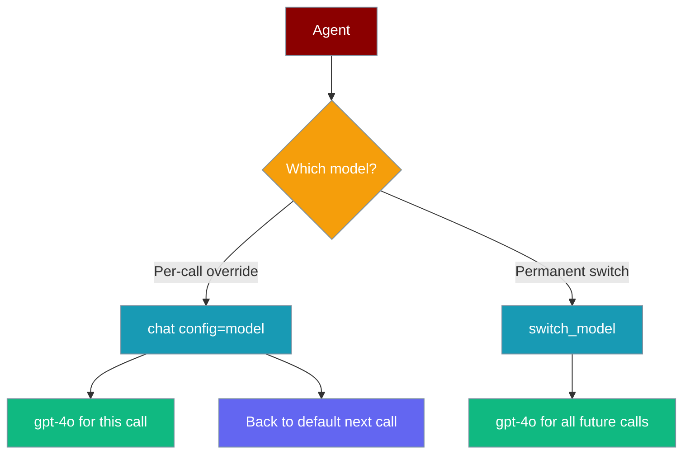
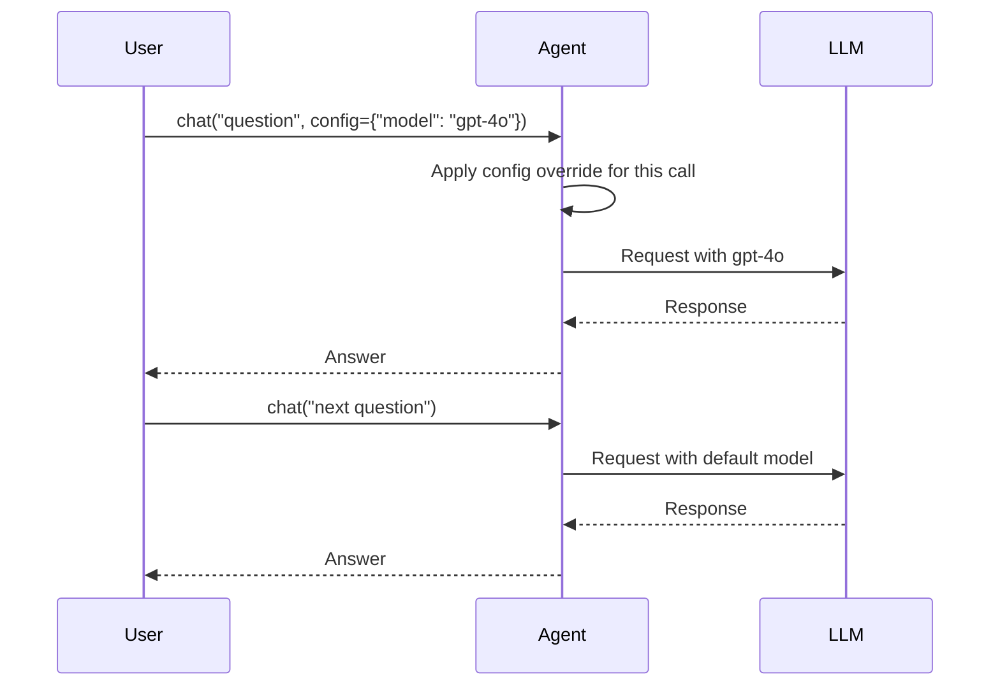

One agent, many models — override the LLM for a single call with `config=`, or permanently swap it with `switch_model()`, all while keeping your conversation history intact.



## Quick Start

<Steps>
<Step title="Override model for a single call">

```python
from praisonaiagents import Agent

agent = Agent(
    name="FlexBot",
    instructions="Answer questions helpfully.",
    llm="gpt-4o-mini"
)

cheap = agent.chat("Summarize this paragraph.")

expensive = agent.chat(
    "Write a detailed technical analysis.",
    config={"model": "gpt-4o"}
)
```

The agent uses `gpt-4o-mini` by default. Passing `config={"model": "gpt-4o"}` upgrades just that one call. The next call reverts to `gpt-4o-mini`.

</Step>

<Step title="Permanently switch the agent's model">

```python
from praisonaiagents import Agent

agent = Agent(
    name="AdaptiveBot",
    instructions="Help with various tasks.",
    llm="gpt-4o-mini"
)

agent.chat("Quick question: what's 2 + 2?")

agent.switch_model("gpt-4o")

agent.chat("Now write a 500-word essay on climate change.")
```

`switch_model()` updates the agent in place. All future calls use the new model, and the conversation history is fully preserved.

</Step>
</Steps>

---

## How It Works



Per-call config overrides are isolated to that single invocation and never mutate the agent's defaults. This makes them safe for concurrent use — multiple threads can call the same agent with different models simultaneously.

`switch_model()` updates `agent.llm` and recreates the internal LLM instance. Conversation history stored in `agent._chat_history` is untouched.

---

## Configuration Options

**`chat()` config keys:**

| Key | Type | Description |
|-----|------|-------------|
| `model` | `str` | Override model name for this call (e.g. `"gpt-4o"`, `"claude-3-5-sonnet"`) |
| `temperature` | `float` | Override temperature for this call |
| `provider` | `str` | Override provider (e.g. `"openai"`, `"anthropic"`) |

```python
response = agent.chat(
    "Write a creative story.",
    config={
        "model": "gpt-4o",
        "temperature": 0.9,
    }
)
```

**`switch_model()` signature:**

```python
agent.switch_model("gpt-4o")
```

Accepts any model string supported by LiteLLM (same format as the `llm=` constructor argument).

<Card title="Agent Config TypeScript Reference" icon="code" href="/docs/sdk/reference/typescript/classes/AgentConfig">
  TypeScript agent configuration
</Card>
<Card title="Agent Rust Reference" icon="code" href="/docs/sdk/reference/rust/structs/AgentConfig">
  Rust agent configuration
</Card>

---

## Common Patterns

**Route by task complexity:**

```python
from praisonaiagents import Agent

agent = Agent(name="Router", instructions="Answer questions.", llm="gpt-4o-mini")

def ask(prompt: str, complex: bool = False) -> str:
    if complex:
        return agent.chat(prompt, config={"model": "gpt-4o"})
    return agent.chat(prompt)

simple = ask("What is 10 * 5?")
detailed = ask("Explain quantum entanglement.", complex=True)
```

**Override temperature for creative tasks:**

```python
agent = Agent(name="Writer", instructions="Write content.", llm="gpt-4o-mini")

factual = agent.chat("What year was Python created?")

creative = agent.chat(
    "Write a haiku about debugging.",
    config={"temperature": 1.2}
)
```

**Escalate on failure:**

```python
def safe_chat(agent, prompt):
    try:
        return agent.chat(prompt)
    except Exception:
        return agent.chat(prompt, config={"model": "gpt-4o"})
```

---

## Best Practices

<AccordionGroup>
<Accordion title="Use per-call config for cost optimization">
  Default to a fast, cheap model and escalate to a powerful model only for complex requests. This gives you the best cost-to-quality ratio without managing multiple agents.
</Accordion>

<Accordion title="Use switch_model for long-running sessions">
  When a user explicitly asks to use a different model, call `switch_model()` so all subsequent turns in that session use the new model automatically. Per-call config is better for one-off overrides.
</Accordion>

<Accordion title="Per-call config is thread-safe">
  Config overrides are applied within the scope of a single `chat()` call and never persist to agent state. Multiple concurrent callers can override different models on the same agent instance safely.
</Accordion>

<Accordion title="Conversation history survives model switches">
  `switch_model()` only changes the model — it does not clear `agent._chat_history`. The new model receives the full conversation context from previous turns.
</Accordion>
</AccordionGroup>

---

## Related

<CardGroup cols={2}>
<Card title="Model Failover" icon="arrow-rotate-right" href="/docs/features/model-failover">
  Automatic fallback when a model call fails
</Card>
<Card title="Model Router" icon="route" href="/docs/features/model-router">
  Dynamic model selection based on task type
</Card>
</CardGroup>
