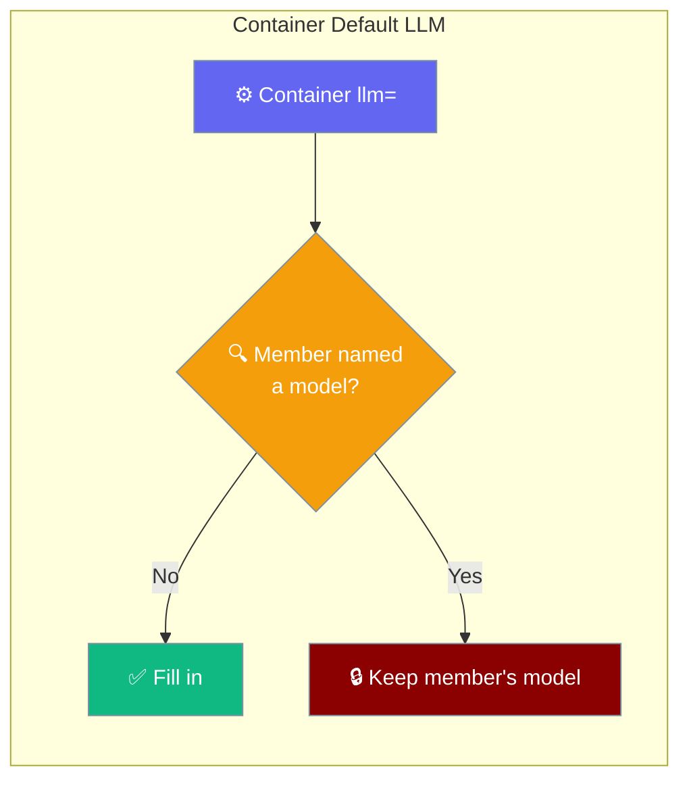
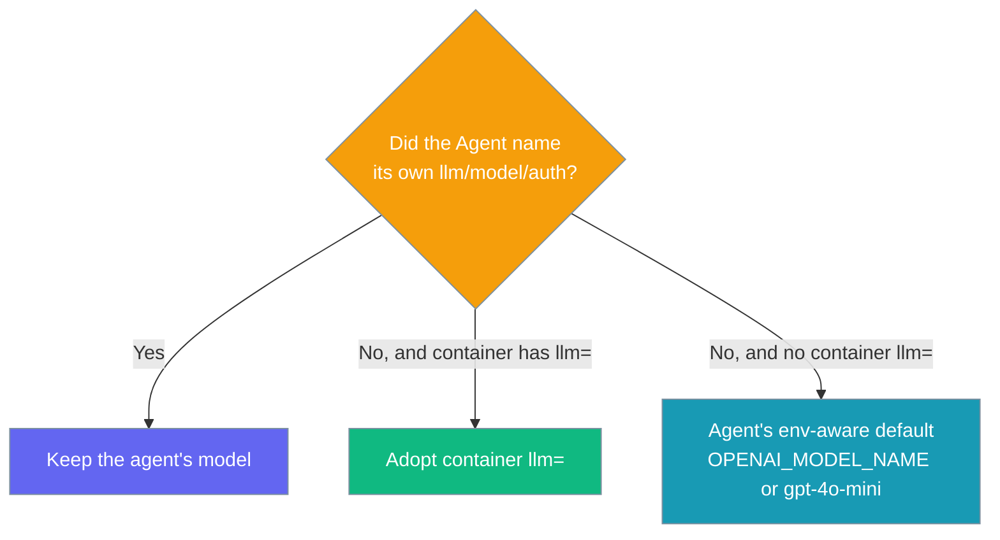

One `model=` on `AgentTeam` or `AgentFlow` becomes the default model for every member that never named one, while any agent that pinned its own model keeps it.

<Note>
`model=` is the canonical name; `llm=` is a deprecated alias for it. Passing both raises `TypeError`. See [Model Parameter](/features/model-parameter).
</Note>



## Quick Start

<Steps>
<Step title="One team, one model">

```python
from praisonaiagents import Agent, AgentTeam

researcher = Agent(name="Researcher", instructions="Research.")
writer     = Agent(name="Writer",     instructions="Write.")

team = AgentTeam(
    agents=[researcher, writer],
    model="anthropic/claude-sonnet-4-5",
)
team.start("Summarise the latest AI safety research")
```

The team's `model=` flows to every member that didn't pick its own.

</Step>
<Step title="Same rule for a flow">

```python
from praisonaiagents import Agent
from praisonaiagents.workflows import AgentFlow

researcher = Agent(name="Researcher", instructions="Research.")
writer     = Agent(name="Writer",     instructions="Write.")

flow = AgentFlow(
    steps=[researcher, writer],
    model="anthropic/claude-sonnet-4-5",
)
flow.start("Summarise the latest AI safety research")
```

`AgentFlow(model=…)` fills in ready-made steps the same way `AgentTeam` does.

</Step>
</Steps>

---

## How It Works

The container's `llm=` is a **default**, not an override. A member that named its own `llm=` / `model=` / `auth=` keeps it; a member with no model adopts the container's.



A pinned member keeps its model even when the container names another:

```python
from praisonaiagents import Agent, AgentTeam

pinned = Agent(name="Reasoner",   instructions="Think hard.", llm="gpt-4o")
cheap  = Agent(name="Summariser", instructions="Summarise.")

team = AgentTeam(
    agents=[pinned, cheap],
    llm="anthropic/claude-sonnet-4-5",
)
# pinned.llm == "gpt-4o"                       (kept)
# cheap.llm  == "anthropic/claude-sonnet-4-5"  (filled in)
```

<Note>
`llm=` on the container is a **default**. If a member was constructed with its own `llm=` / `model=` / `auth=`, the container never overrides it. Otherwise the container's `llm=` becomes the member's model.
</Note>

---

## `manager_llm` Is Separate

`manager_llm=` is the hierarchical manager's own model and never touches the members.

```python
from praisonaiagents import Agent, AgentTeam

member = Agent(name="Worker", instructions="Do the work.")

team = AgentTeam(
    agents=[member],
    llm="anthropic/claude-sonnet-4-5",  # member default
    manager_llm="gpt-4o",               # hierarchical manager only
)
# team.manager_llm == "gpt-4o"                       (manager keeps its own model)
# member.llm       == "anthropic/claude-sonnet-4-5"  (member fills in)
```

<Warning>
`manager_llm=` sets the model for the hierarchical manager agent only. It is never propagated to member agents — use `llm=` for that.
</Warning>

---

## AgentFlow's Fallback Is Not Propagated

`AgentFlow` falls back to `"gpt-4o-mini"` internally when it needs a model to run, but that fallback is **not** a caller's choice — so it is never pushed onto steps.

```python
from praisonaiagents import Agent
from praisonaiagents.workflows import AgentFlow

researcher = Agent(name="Researcher", instructions="Research.")

# No container llm= — each step keeps its own env-aware default,
# NOT the flow's "gpt-4o-mini" run-time fallback.
flow = AgentFlow(steps=[researcher])
flow.start("Summarise the latest AI safety research")
```

An `AgentFlow(steps=[…])` with no `llm=` leaves each step's model to `Agent`'s own env-aware default (`OPENAI_MODEL_NAME`, else `gpt-4o-mini`).

---

## Common Patterns

Pin one member, let the rest follow the container — no code change needed to see the split.

```python
from praisonaiagents import Agent, AgentTeam

reasoner = Agent(name="Reasoner",   instructions="Think hard.", llm="gpt-4o")
writer   = Agent(name="Writer",     instructions="Write.")
editor   = Agent(name="Editor",     instructions="Edit.")

team = AgentTeam(
    agents=[reasoner, writer, editor],
    llm="anthropic/claude-sonnet-4-5",
)
team.start("Draft and polish a launch post")
# reasoner calls gpt-4o; writer and editor call anthropic/claude-sonnet-4-5
```

<CardGroup cols={2}>
  <Card title="Panel agents are skipped" icon="grip">
    A panel descriptor (`panel:<name>`) is not a model name, so the fill-in leaves it alone.
  </Card>
  <Card title="`auth=` counts as pinned" icon="key">
    A subscription seat pins the vendor, so a team default of another vendor never overrides it.
  </Card>
  <Card title="List or dict rosters" icon="list">
    `AgentTeam` accepts a list or a dict (multi-group teams); both forms are filled in.
  </Card>
  <Card title="Non-Agent members skipped" icon="filter">
    Members without `_apply_default_llm` are duck-typed and left untouched.
  </Card>
</CardGroup>

A member used before the container fills it in caches a dispatcher bound to the old model; the fill-in drops that cache so the next call rebuilds against the new model. Pinned members keep their dispatcher.

---

## Configuration Options

| Param | Container | Behaviour |
|-------|-----------|-----------|
| `llm` | `AgentTeam`, `AgentFlow` | Default model for members that never named one. A member with its own `llm=` / `model=` / `auth=` keeps it. |
| `manager_llm` | `AgentTeam` | Hierarchical manager's own model. Never propagated to members. |

---

## Best Practices

<AccordionGroup>
  <Accordion title="Set the vendor once at the container level">
    Put `llm=` on `AgentTeam` / `AgentFlow` and pin per-agent only where the job justifies a different model.
  </Accordion>
  <Accordion title="Give the manager its own model">
    Use `manager_llm=` for the hierarchical manager — don't try to reuse the team default there.
  </Accordion>
  <Accordion title="Prefer container llm= for whole-team agreement">
    When every member should share a vendor, one container `llm=` beats repeating `llm=` on each `Agent`.
  </Accordion>
  <Accordion title="Upgrade if llm= did nothing before">
    Earlier versions stored the container `llm=` but never read it. Upgrade to the version that ships this fill-in so the parameter actually reaches members.
  </Accordion>
</AccordionGroup>

---

## Related

<CardGroup cols={2}>
  <Card icon="users" href="/features/agentteam-supported-params" title="AgentTeam Params">
    Which params apply at the team level.
  </Card>
  <Card icon="sliders" href="/features/agentteam-parameter-scope" title="Parameter Scope">
    Team-level vs per-agent parameter scope.
  </Card>
  <Card icon="users" href="/concepts/agentteam" title="AgentTeam">
    Multi-agent teams overview.
  </Card>
  <Card icon="diagram-project" href="/concepts/agentflow" title="AgentFlow">
    Deterministic step pipelines.
  </Card>
</CardGroup>
