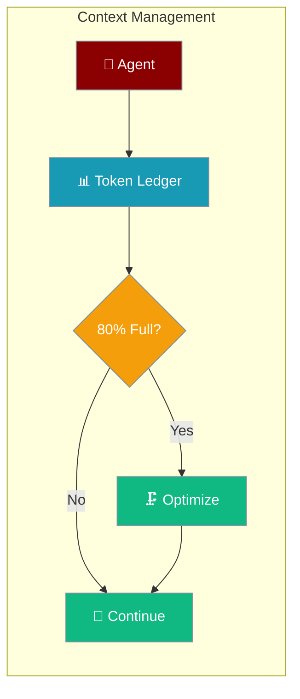
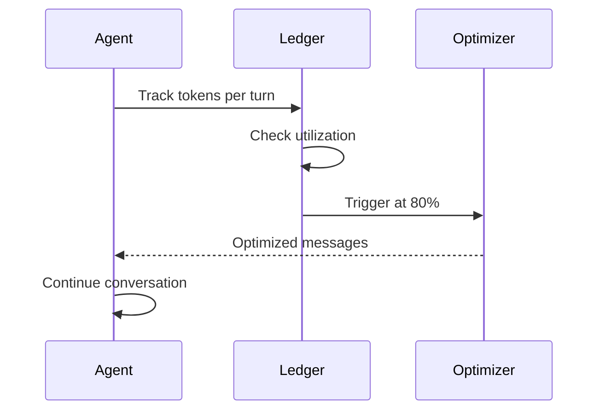

Context Management API provides CLI commands and configuration to control how agents handle token budgets, optimization, and monitoring.



## Quick Start

<Steps>
<Step title="Enable context management">
```python
from praisonaiagents import Agent, ManagerConfig

agent = Agent(
    instructions="You are a helpful assistant.",
    context=ManagerConfig(
        output_reserve=16000,
        strategy="smart",
    ),
)
```
</Step>

<Step title="Start with monitoring">
```bash
praisonai chat --context-monitor --context-strategy smart
```
</Step>
</Steps>

---

## How It Works



---

## CLI Flags

### Auto-Compaction

```bash
praisonai chat --context-auto-compact
praisonai chat --no-context-auto-compact
```

### Strategy

```bash
praisonai chat --context-strategy smart
```

Options: `smart`, `truncate`, `sliding_window`, `summarize`, `prune_tools`

### Threshold

```bash
praisonai chat --context-threshold 0.8
```

### Monitoring

```bash
praisonai chat --context-monitor
praisonai chat --context-monitor-path ./debug/context.txt
praisonai chat --context-monitor-format json
praisonai chat --context-monitor-frequency turn
```

### Redaction

```bash
praisonai chat --context-redact
praisonai chat --no-context-redact
```

---

## Interactive Commands

| Command | Description |
|---------|-------------|
| `/context` | Show context stats summary |
| `/context stats` | Token ledger table |
| `/context budget` | Budget allocation details |
| `/context dump` | Write snapshot to disk now |
| `/context on` | Enable monitoring |
| `/context off` | Disable monitoring |
| `/context compact` | Trigger optimization now |
| `/context history` | Show optimization history |

---

## Environment Variables

```bash
PRAISONAI_CONTEXT_AUTO_COMPACT=true
PRAISONAI_CONTEXT_STRATEGY=smart
PRAISONAI_CONTEXT_THRESHOLD=0.8
PRAISONAI_CONTEXT_OUTPUT_RESERVE=8000
PRAISONAI_CONTEXT_MONITOR=true
PRAISONAI_CONTEXT_MONITOR_PATH=./context.txt
PRAISONAI_CONTEXT_MONITOR_FORMAT=human
PRAISONAI_CONTEXT_MONITOR_FREQUENCY=turn
PRAISONAI_CONTEXT_REDACT=true
```

---

## Configuration File

```yaml
context:
  auto_compact: true
  compact_threshold: 0.8
  strategy: smart
  output_reserve: 8000

  monitor:
    enabled: false
    path: ./context.txt
    format: human
    frequency: turn
    redact_sensitive: true
```

---

## Precedence Order

1. **CLI flags** (`--context-strategy smart`)
2. **Environment variables** (`PRAISONAI_CONTEXT_STRATEGY=smart`)
3. **Config file** (`config.yaml`)
4. **Defaults**

---

## Python SDK

```python
from praisonaiagents import (
    ContextBudgeter,
    ContextLedger,
    ContextLedgerManager,
    get_optimizer,
    OptimizerStrategy,
    ContextMonitor,
)

budgeter = ContextBudgeter(model="gpt-4o-mini")
ledger = ContextLedgerManager()
optimizer = get_optimizer(OptimizerStrategy.SMART)
monitor = ContextMonitor(enabled=True, path="./context.txt")
```

---

## Best Practices

<AccordionGroup>
<Accordion title="Use smart strategy for most workloads">
The `smart` strategy combines multiple techniques (sliding window, prune tools, summarize) and picks the best approach for each situation.

```bash
praisonai chat --context-strategy smart
```
</Accordion>

<Accordion title="Set threshold to 0.8 for headroom">
Triggering optimization at 80% leaves room for the model's response without hitting the limit.
</Accordion>

<Accordion title="Enable monitoring during development">
Use `--context-monitor` while building your agent to understand token usage patterns before deploying.
</Accordion>

<Accordion title="Always enable redaction for sensitive data">
Default redaction masks API keys, tokens, and PII in monitoring snapshots. Keep it enabled in production.
</Accordion>
</AccordionGroup>

---

## Related

<CardGroup cols={2}>
<Card title="Context Budgeter" icon="coins" href="/features/context-budgeter">
  Model-aware token budget allocation
</Card>
<Card title="Context Monitor" icon="chart-line" href="/features/context-monitor">
  Real-time context usage monitoring
</Card>
</CardGroup>
