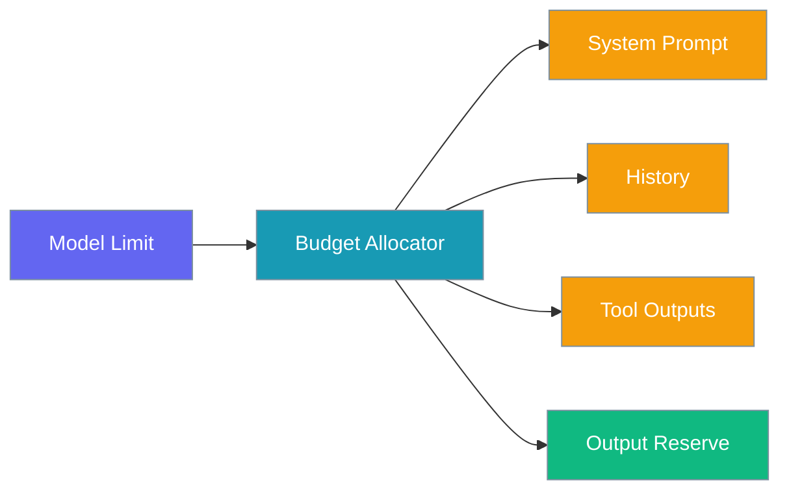
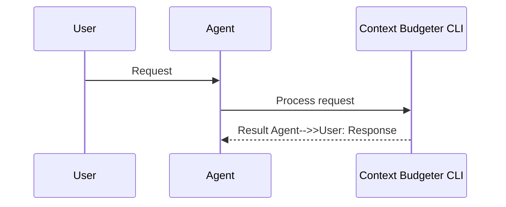

Reserve output tokens and inspect per-segment budgets so long agent runs don't exhaust context before the model can reply.

```python
from praisonaiagents import Agent

agent = Agent(name="budget-cli", instructions="Respect output token reserves.")
agent.start("Run a long task without exhausting the context budget.")
```

The user runs the agent from the CLI and checks `/context budget` to see segment allocation.



## How It Works




## Quick Start

<Steps>
<Step title="Run an agent, then inspect budget">

```python
from praisonaiagents import Agent

agent = Agent(
    name="Assistant",
    instructions="Answer helpfully within context limits.",
)

agent.start("Summarise the key points of context budgeting")
```

From the CLI session:

```bash
praisonai chat
> /context budget
```

</Step>

<Step title="Increase output reserve for long replies">

```bash
praisonai chat --context-output-reserve 16000
```

Default output reserve is 8000 tokens. Raise it when the model truncates final answers.

</Step>
</Steps>

## CLI Flags

| Flag | Default | Description |
|------|---------|-------------|
| `--context-output-reserve` | `8000` | Tokens reserved for model output |

## Interactive Commands

```bash
> /context budget   # Allocation breakdown
> /context stats    # Current usage vs budget
```

Example `/context budget` output:

```
Budget Allocation
  Model Limit:     128,000
  Output Reserve:  8,000
  Usable:          120,000

  Segment Budgets:
    System Prompt: 2,000
    History:       84,616
    Tool Outputs:  20,000
    ...
```

## config.yaml

```yaml
context:
  output_reserve: 8000
  default_tool_output_max: 10000
```

Environment variable: `PRAISONAI_CONTEXT_OUTPUT_RESERVE`.

## Best Practices

<AccordionGroup>
<Accordion title="Raise output reserve before raising compaction threshold">
If replies are cut off, increase `--context-output-reserve` first — compaction may not be the issue.
</Accordion>

<Accordion title="Check /context stats after heavy tool use">
Tool outputs consume the largest share; stats show which segment is filling fastest.
</Accordion>

<Accordion title="Pair with token estimation mode">
Use [Token Estimation CLI](/docs/features/context-token-estimation-cli) accurate mode when validating budget numbers.
</Accordion>
</AccordionGroup>

## Related

<CardGroup cols={2}>
  <Card title="Token Estimation CLI" icon="calculator" href="/docs/features/context-token-estimation-cli">
    Configure estimation accuracy
  </Card>
  <Card title="Context Compaction" icon="compress" href="/docs/features/context-compaction">
    Automatic overflow protection
  </Card>
</CardGroup>
