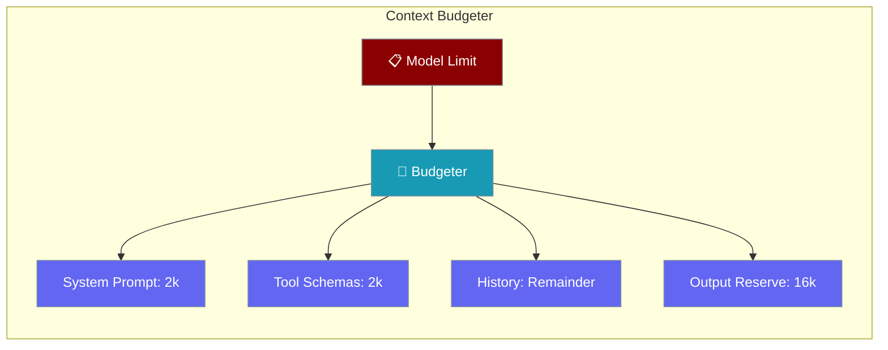
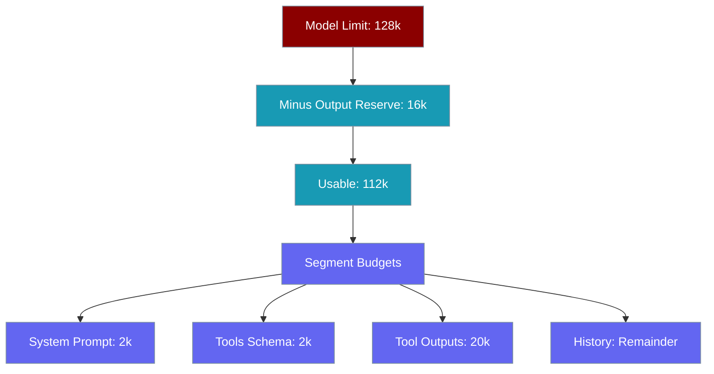

Context Budgeter calculates how many tokens each part of the agent's context can use, based on the model's limit.



## Quick Start

<Steps>
<Step title="Agent-level configuration">
```python
from praisonaiagents import Agent, ManagerConfig

agent = Agent(
    instructions="You are helpful.",
    context=ManagerConfig(
        output_reserve=16000,
    ),
)

budget = agent.context_manager.get_budget()
print(f"Usable context: {budget.usable:,} tokens")
```
</Step>

<Step title="Standalone budgeter">
```python
from praisonaiagents import ContextBudgeter

budgeter = ContextBudgeter(model="gpt-4o-mini")
budget = budgeter.allocate()

print(f"Model limit: {budget.model_limit:,} tokens")
print(f"Output reserve: {budget.output_reserve:,} tokens")
print(f"Usable context: {budget.usable:,} tokens")
```
</Step>
</Steps>

---

## How It Works



---

## Model Limits

| Model | Context Limit | Default Output Reserve |
|-------|---------------|----------------------|
| gpt-4o | 128,000 | 16,384 |
| gpt-4o-mini | 128,000 | 16,384 |
| gpt-4-turbo | 128,000 | 4,096 |
| claude-3-opus | 200,000 | 8,192 |
| claude-3-sonnet | 200,000 | 8,192 |
| gemini-1.5-pro | 2,097,152 | 8,192 |
| gemini-1.5-flash | 1,048,576 | 8,192 |

```python
from praisonaiagents import get_model_limit, get_output_reserve

limit = get_model_limit("gpt-4o-mini")
reserve = get_output_reserve("gpt-4o-mini")
```

---

## Default Budget Allocation

| Segment | Default Budget | Purpose |
|---------|---------------|---------|
| System Prompt | 2,000 | Agent instructions |
| Rules | 500 | Workspace rules |
| Skills | 500 | Skill definitions |
| Memory | 1,000 | Persistent memory |
| Tools Schema | 2,000 | Tool definitions |
| Tool Outputs | 20,000 | Tool call results |
| Buffer | 1,000 | Safety margin |
| History | Remainder | Conversation history |

---

## Common Patterns

### Custom budgets

```python
from praisonaiagents import ContextBudgeter

budgeter = ContextBudgeter(
    model="gpt-4o",
    system_prompt_budget=3000,
    memory_budget=5000,
    tool_outputs_budget=30000,
)
budget = budgeter.allocate()
```

### Overflow detection

```python
from praisonaiagents import ContextBudgeter

budgeter = ContextBudgeter(model="gpt-4o-mini")

current_tokens = 100000
is_overflow = budgeter.check_overflow(current_tokens)
utilization = budgeter.get_utilization(current_tokens)
remaining = budgeter.get_remaining(current_tokens)
print(f"Utilization: {utilization:.1%}")
```

### Threshold-based triggers

```python
budgeter = ContextBudgeter(model="gpt-4o-mini")
budget = budgeter.allocate()

threshold = 0.8
trigger_at = int(budget.usable * threshold)

current_tokens = 95000
if current_tokens > trigger_at:
    print("Time to optimize!")
```

---

## Best Practices

<AccordionGroup>
<Accordion title="Reserve enough tokens for model output">
Too small an output reserve causes truncated responses. Use at least 4,096 for short responses, 16,384 for detailed ones.

```python
budgeter = ContextBudgeter(model="gpt-4o", output_reserve=16384)
```
</Accordion>

<Accordion title="Increase tool_outputs_budget for tool-heavy agents">
Agents using many tools need more space for tool results. Increase from the default 20k if you see tool output truncation.
</Accordion>

<Accordion title="Monitor utilization before it hits 100%">
Check `budgeter.get_utilization()` and trigger optimization at 80% to avoid context overflow errors.

```python
if budgeter.get_utilization(current_tokens) > 0.8:
    pass
```
</Accordion>

<Accordion title="Use get_model_limit for dynamic configuration">
Detect the model's limit at runtime rather than hardcoding it to work across different deployments.

```python
limit = get_model_limit(agent.llm)
```
</Accordion>
</AccordionGroup>

---

## Related

<CardGroup cols={2}>
<Card title="Context Ledger" icon="book" href="/features/context-ledger">
  Track actual token usage per segment
</Card>
<Card title="Context API" icon="terminal" href="/features/context-api">
  CLI commands and configuration reference
</Card>
</CardGroup>
