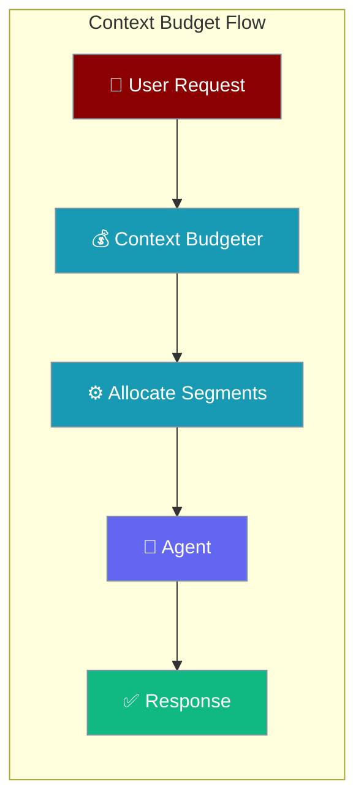
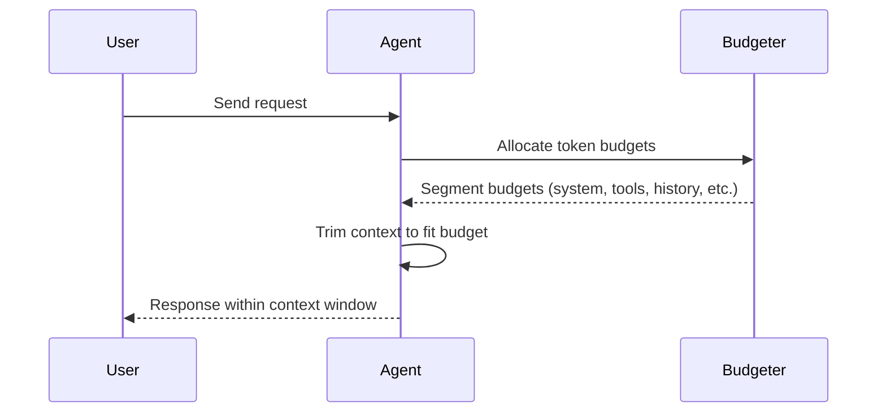

The Context Budgeter allocates token budgets across context segments based on model limits and configurable priorities.


```python
from praisonaiagents import Agent, ManagerConfig

agent = Agent(
    name="budget-agent",
    instructions="Stay within token budgets.",
    context=ManagerConfig(output_reserve=16000),
)
agent.start("Summarise this thread without using the full window.")
```

The user configures segment priorities; the budgeter allocates tokens before each model call.



## Quick Start

<Steps>
<Step title="Configure via Agent">

```python
from praisonaiagents import Agent
from praisonaiagents import ManagerConfig

agent = Agent(
    instructions="You are helpful.",
    context=ManagerConfig(output_reserve=16000),
)

budget = agent.context_manager.get_budget()
print(f"Usable context: {budget.usable:,} tokens")
```

</Step>

<Step title="Use the budgeter directly">

```python
from praisonaiagents.context import ContextBudgeter

budgeter = ContextBudgeter(model="gpt-4o-mini")
budget = budgeter.allocate()
print(f"Usable context: {budget.usable:,} tokens")
```

</Step>
</Steps>

## Model Limits

| Model | Context Limit | Default Output Reserve |
|-------|---------------|----------------------|
| gpt-4o | 128,000 | 16,384 |
| gpt-4o-mini | 128,000 | 16,384 |
| gpt-4-turbo | 128,000 | 4,096 |
| claude-3-opus | 200,000 | 8,192 |
| claude-3-sonnet | 200,000 | 8,192 |
| gemini-1.5-pro | 2,097,152 | 8,192 |
| gemini-1.5-flash | 1,048,576 | 8,192 |

```python
from praisonaiagents.context import get_model_limit, get_output_reserve

limit = get_model_limit("gpt-4o-mini")  # 128000
reserve = get_output_reserve("gpt-4o-mini")  # 16384
```

## Budget Allocation

Default segment budgets:

| Segment | Default Budget | Purpose |
|---------|---------------|---------|
| System Prompt | 2,000 | Agent instructions |
| Rules | 500 | Workspace rules |
| Skills | 500 | Skill definitions |
| Memory | 1,000 | Persistent memory |
| Tools Schema | 2,000 | Tool definitions |
| Tool Outputs | 20,000 | Tool call results |
| Buffer | 1,000 | Safety margin |
| History | Remainder | Conversation history |

## Custom Budgets

```python
from praisonaiagents.context import ContextBudgeter

budgeter = ContextBudgeter(
    model="gpt-4o",
    system_prompt_budget=3000,
    rules_budget=1000,
    skills_budget=500,
    memory_budget=5000,
    tools_schema_budget=3000,
    tool_outputs_budget=30000,
    buffer_budget=2000,
)
budget = budgeter.allocate()
```

## Overflow Detection

```python
from praisonaiagents.context import ContextBudgeter

budgeter = ContextBudgeter(model="gpt-4o-mini")

# Check if current usage exceeds budget
current_tokens = 100000
is_overflow = budgeter.check_overflow(current_tokens)

# Get utilization percentage
utilization = budgeter.get_utilization(current_tokens)
print(f"Utilization: {utilization:.1%}")

# Get remaining capacity
remaining = budgeter.get_remaining(current_tokens)
print(f"Remaining: {remaining:,} tokens")
```

## Threshold-Based Triggers

```python
from praisonaiagents.context import ContextBudgeter

budgeter = ContextBudgeter(model="gpt-4o-mini")
budget = budgeter.allocate()

# Trigger optimization at 80% utilization
threshold = 0.8
trigger_at = int(budget.usable * threshold)

current_tokens = 95000
if current_tokens > trigger_at:
    print("Time to optimize!")
```

## CLI Configuration

```bash
# Set output reserve
praisonai chat --context-output-reserve 10000

# Set optimization threshold
praisonai chat --context-threshold 0.8
```

## Environment Variables

```bash
PRAISONAI_CONTEXT_OUTPUT_RESERVE=8000
PRAISONAI_CONTEXT_THRESHOLD=0.8
```

## Serialization

```python
from praisonaiagents.context import ContextBudgeter

budgeter = ContextBudgeter(model="gpt-4o-mini")
budget_dict = budgeter.to_dict()

# Returns:
# {
#     'model': 'gpt-4o-mini',
#     'model_limit': 128000,
#     'output_reserve': 16384,
#     'usable': 111616,
#     'allocation': {...}
# }
```

## How It Works



---

## Best Practices

<AccordionGroup>
  <Accordion title="Reserve output tokens explicitly">
    Set `output_reserve` for the model's reply so retrieval and history do not consume the full window.
  </Accordion>
  <Accordion title="Align budget with your model limit">
    Pass the correct model name so limits match the provider's context window.
  </Accordion>
  <Accordion title="Monitor utilisation above 80%">
    Trigger compaction or retrieval trimming before hard overflow — do not wait for API errors.
  </Accordion>
  <Accordion title="Segment large tool results">
    Allocate per-segment budgets when tools return bulky JSON or file contents.
  </Accordion>
</AccordionGroup>

## Related

<CardGroup cols={2}>
<Card title="Context Ledger" icon="book" href="/docs/features/context-ledger">
  Track actual token usage by segment
</Card>
<Card title="Context Optimizer" icon="compress" href="/docs/features/optimizer">
  Reduce context when over budget
</Card>
</CardGroup>
