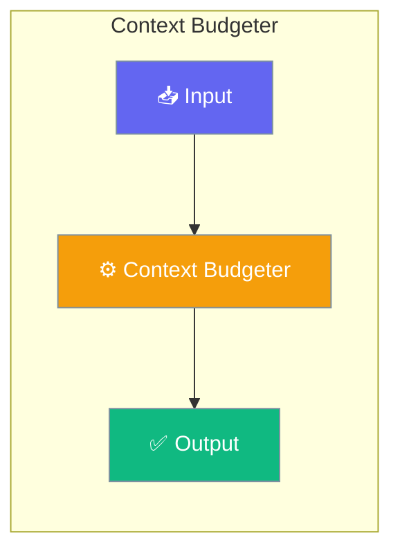

# Context Budgeter

The Context Budgeter allocates token budgets across context segments based on model limits and configurable priorities.




## Agent-Centric Quick Start

```python
from praisonaiagents import Agent
from praisonaiagents import ManagerConfig

# Configure output reserve via context param
agent = Agent(
    instructions="You are helpful.",
    context=ManagerConfig(
        output_reserve=16000,  # Reserve 16k tokens for output
    ),
)

# Access budget info
budget = agent.context_manager.get_budget()
print(f"Usable context: {budget.usable:,} tokens")
```

## Low-Level API

```python
from praisonaiagents import ContextBudgeter, get_model_limit

# Create budgeter for your model
budgeter = ContextBudgeter(model="gpt-4o-mini")
budget = budgeter.allocate()

print(f"Model limit: {budget.model_limit:,} tokens")
print(f"Output reserve: {budget.output_reserve:,} tokens")
print(f"Usable context: {budget.usable:,} tokens")
```

## Model Limits

| Model | Context Limit | Default Output Reserve |
|-------|---------------|----------------------|
| gpt-4o | 128,000 | 16,384 |
| gpt-4o-mini | 128,000 | 16,384 |
| gpt-4-turbo | 128,000 | 4,096 |
| claude-3-opus | 200,000 | 8,192 |
| claude-3-sonnet | 200,000 | 8,192 |
| gemini-1.5-pro | 2,097,152 | 8,192 |
| gemini-1.5-flash | 1,048,576 | 8,192 |

```python
from praisonaiagents import get_model_limit, get_output_reserve

limit = get_model_limit("gpt-4o-mini")  # 128000
reserve = get_output_reserve("gpt-4o-mini")  # 16384
```

## Budget Allocation

Default segment budgets:

| Segment | Default Budget | Purpose |
|---------|---------------|---------|
| System Prompt | 2,000 | Agent instructions |
| Rules | 500 | Workspace rules |
| Skills | 500 | Skill definitions |
| Memory | 1,000 | Persistent memory |
| Tools Schema | 2,000 | Tool definitions |
| Tool Outputs | 20,000 | Tool call results |
| Buffer | 1,000 | Safety margin |
| History | Remainder | Conversation history |

## Custom Budgets

```python
budgeter = ContextBudgeter(
    model="gpt-4o",
    system_prompt_budget=3000,
    rules_budget=1000,
    skills_budget=500,
    memory_budget=5000,
    tools_schema_budget=3000,
    tool_outputs_budget=30000,
    buffer_budget=2000,
)
budget = budgeter.allocate()
```

## Overflow Detection

```python
budgeter = ContextBudgeter(model="gpt-4o-mini")

# Check if current usage exceeds budget
current_tokens = 100000
is_overflow = budgeter.check_overflow(current_tokens)

# Get utilization percentage
utilization = budgeter.get_utilization(current_tokens)
print(f"Utilization: {utilization:.1%}")

# Get remaining capacity
remaining = budgeter.get_remaining(current_tokens)
print(f"Remaining: {remaining:,} tokens")
```

## Threshold-Based Triggers

```python
budgeter = ContextBudgeter(model="gpt-4o-mini")
budget = budgeter.allocate()

# Trigger optimization at 80% utilization
threshold = 0.8
trigger_at = int(budget.usable * threshold)

current_tokens = 95000
if current_tokens > trigger_at:
    print("Time to optimize!")
```

## CLI Configuration

```bash
# Set output reserve
praisonai chat --context-output-reserve 10000

# Set optimization threshold
praisonai chat --context-threshold 0.8
```

## Environment Variables

```bash
PRAISONAI_CONTEXT_OUTPUT_RESERVE=8000
PRAISONAI_CONTEXT_THRESHOLD=0.8
```

## Serialization

```python
budgeter = ContextBudgeter(model="gpt-4o-mini")
budget_dict = budgeter.to_dict()

# Returns:
# {
#     'model': 'gpt-4o-mini',
#     'model_limit': 128000,
#     'output_reserve': 16384,
#     'usable': 111616,
#     'allocation': {...}
# }
```

## Next Steps

- [Context Ledger](/docs/features/context-ledger) - Track actual token usage
- [Context Optimizer](/docs/features/optimizer) - Reduce when over budget

## Best Practices

<AccordionGroup>
  <Accordion title="Start simple">
    Enable the feature with a single parameter before adding configuration. Verify it works, then layer in options.
  </Accordion>
  <Accordion title="Use environment variables for secrets">
    Never hardcode API keys or tokens. Use `os.getenv("KEY_NAME")` to read from environment variables.
  </Accordion>
  <Accordion title="Test with minimal examples first">
    Copy the Quick Start example, run it, then extend it. This confirms your environment is set up correctly.
  </Accordion>
  <Accordion title="Check the logs">
    Set `verbose=True` on your agent to see detailed execution logs when debugging unexpected behavior.
  </Accordion>
</AccordionGroup>

## Related

<CardGroup cols={2}>
  <Card title="Features Overview" icon="grid-2" href="/docs/features">
    Browse all PraisonAI features
  </Card>
  <Card title="Quick Start" icon="rocket" href="/docs/introduction">
    Get started with PraisonAI agents
  </Card>
</CardGroup>
