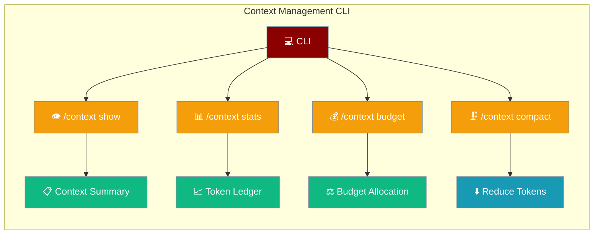

```python
from praisonaiagents import Agent

agent = Agent(name="context-cli", instructions="Use context management CLI commands.")
agent.start("Show the current context window usage and compression stats.")
```


Complete reference for all context management CLI commands and flags.



## Quick Start

<Steps>
<Step title="Interactive CLI">
Launch chat or code mode, then inspect context:

```bash
praisonai chat
> /context
> /context stats
```
</Step>

<Step title="Compact When Full">
Reduce token usage without losing key history:

```bash
> /context compact
> /context compact --strategy smart
```
</Step>
</Steps>

## Interactive Commands

Use these commands in `praisonai chat` or `praisonai code` interactive mode.

### /context

Show context summary and statistics.

```bash
> /context
```

**Output:**
```
Context Summary
  Model:          gpt-4o-mini
  Model Limit:    128,000 tokens
  Output Reserve: 8,000 tokens
  Usable Budget:  120,000 tokens
  Current Usage:  15,234 tokens (12.7%)
  Turns:          8
  Messages:       16
  Auto-Compact:   enabled
  Monitoring:     disabled
```

### /context show

Alias for `/context`. Shows summary view.

```bash
> /context show
```

### /context stats

Show detailed token ledger by segment.

```bash
> /context stats
```

**Output:**
```
Token Ledger
Segment              Tokens     Budget     Used
--------------------------------------------------
system_prompt         1,200      2,000    60.0%
history              12,500     84,616    14.8%
tools_schema          1,534      2,000    76.7%
--------------------------------------------------
TOTAL                15,234    120,000    12.7%
```

### /context budget

Show budget allocation details.

```bash
> /context budget
```

**Output:**
```
Budget Allocation
  Model Limit:     128,000
  Output Reserve:  8,000
  Usable:          120,000

  Segment Budgets:
    System Prompt: 2,000
    Rules:         500
    Skills:        500
    Memory:        1,000
    Tool Schemas:  2,000
    Tool Outputs:  20,000
    History:       84,616
    Buffer:        1,000
```

### /context dump

Write context snapshot to disk immediately.

```bash
> /context dump
```

**Output:**
```
✓ Context snapshot written to: ./context.txt
```

### /context on

Enable context monitoring.

```bash
> /context on
```

**Output:**
```
✓ Context monitoring enabled
Output: ./context.txt
```

### /context off

Disable context monitoring.

```bash
> /context off
```

### /context path \<path\>

Set monitor output path.

```bash
> /context path ./debug/context.json
```

### /context format \<human|json\>

Set monitor output format.

```bash
> /context format json
```

### /context frequency \<turn|tool_call|manual|overflow\>

Set monitor update frequency.

```bash
> /context frequency overflow
```

| Frequency | Description |
|-----------|-------------|
| `turn` | Write after each turn (default) |
| `tool_call` | Write after each tool call |
| `manual` | Only write on `/context dump` |
| `overflow` | Write when approaching limit |

### /context compact

Trigger manual context optimization.

```bash
> /context compact
```

**Output:**
```
Optimizing context...
✓ Optimized: 45,000 → 30,000 tokens
Saved 15,000 tokens (33.3%)
Strategy: smart
```

### /context history

Show optimization event history.

```bash
> /context history
```

**Output:**
```
Optimization History
Time                     Event                Tokens       Saved
----------------------------------------------------------------------
2024-01-07T12:00:00      overflow_detected       45,000          -
2024-01-07T12:00:01      auto_compact           45,000     -15,000
2024-01-07T12:05:00      snapshot               30,000          -

Showing last 3 of 3 events
```

### /context config

Show resolved configuration with precedence info.

```bash
> /context config
```

**Output:**
```
Resolved Configuration
Precedence: CLI > ENV > config.yaml > defaults
Source: env

Auto-Compaction:
  auto_compact:           True
  compact_threshold:      0.8
  strategy:               smart
  compression_min_gain:   5.0%

Budget:
  output_reserve:         8,000
  default_tool_max:       10,000

Estimation:
  estimation_mode:        heuristic
  log_mismatch:           False

Monitoring:
  monitor_enabled:        False
  monitor_path:           ./context.txt
  monitor_format:         human
  monitor_frequency:      turn
  monitor_write_mode:     sync
  redact_sensitive:       True

Effective Budget:
  model_limit:            128,000
  usable:                 120,000
  history_budget:         84,616
```

## CLI Flags

Use these flags when starting `praisonai chat` or `praisonai code`.

### Auto-Compaction

```bash
# Enable auto-compaction (default)
praisonai chat --context-auto-compact

# Disable auto-compaction
praisonai chat --no-context-auto-compact
```

### Strategy

```bash
praisonai chat --context-strategy smart
```

Options: `smart`, `truncate`, `sliding_window`, `summarize`, `prune_tools`

### Threshold

```bash
praisonai chat --context-threshold 0.8
```

Value: 0.0 to 1.0 (default: 0.8)

### Monitoring

```bash
# Enable monitoring
praisonai chat --context-monitor

# Set output path
praisonai chat --context-monitor-path ./debug/context.json

# Set format
praisonai chat --context-monitor-format json

# Set frequency
praisonai chat --context-monitor-frequency overflow
```

### Redaction

```bash
# Enable redaction (default)
praisonai chat --context-redact

# Disable redaction
praisonai chat --no-context-redact
```

### Output Reserve

```bash
praisonai chat --context-output-reserve 16000
```

### Estimation Mode

```bash
praisonai chat --context-estimation-mode validated
```

Options: `heuristic`, `accurate`, `validated`

### Mismatch Logging

```bash
praisonai chat --context-log-mismatch
```

### Snapshot Timing

```bash
praisonai chat --context-snapshot-timing both
```

Options: `pre_optimization`, `post_optimization`, `both`

### Write Mode

```bash
praisonai chat --context-write-mode async
```

Options: `sync`, `async`

### Show Config

```bash
praisonai chat --context-show-config
```

Shows resolved configuration and exits.

## Environment Variables

```bash
# Auto-compaction
export PRAISONAI_CONTEXT_AUTO_COMPACT=true
export PRAISONAI_CONTEXT_THRESHOLD=0.8
export PRAISONAI_CONTEXT_STRATEGY=smart

# Monitoring
export PRAISONAI_CONTEXT_MONITOR=false
export PRAISONAI_CONTEXT_MONITOR_PATH=./context.txt
export PRAISONAI_CONTEXT_MONITOR_FORMAT=human
export PRAISONAI_CONTEXT_MONITOR_FREQUENCY=turn

# Redaction
export PRAISONAI_CONTEXT_REDACT=true

# Budget
export PRAISONAI_CONTEXT_OUTPUT_RESERVE=8000

# Estimation
export PRAISONAI_CONTEXT_ESTIMATION_MODE=heuristic
```

## config.yaml

```yaml
context:
  auto_compact: true
  compact_threshold: 0.8
  strategy: smart
  output_reserve: 8000
  
  monitor:
    enabled: false
    path: ./context.txt
    format: human
    frequency: turn
    write_mode: sync
  
  redact_sensitive: true
  
  estimation:
    mode: heuristic
    log_mismatch: false
```

## Precedence

Configuration is resolved in this order (highest to lowest):

1. **CLI flags** - `--context-*` flags
2. **Environment variables** - `PRAISONAI_CONTEXT_*`
3. **config.yaml** - `context:` section
4. **Defaults** - Built-in defaults

## Troubleshooting

### Context overflow errors

```bash
# Lower threshold to trigger earlier
praisonai chat --context-threshold 0.7

# Use more aggressive strategy
praisonai chat --context-strategy truncate
```

### Monitor not updating

```bash
# Check if enabled
> /context config

# Enable and set frequency
> /context on
> /context frequency turn
```

### Sensitive data in snapshots

```bash
# Ensure redaction is enabled
praisonai chat --context-redact

# Check patterns in snapshot
> /context dump
```

## Best Practices

<AccordionGroup>
  <Accordion title="Monitor Context Usage Regularly">
    Run `/context stats` at the start of long sessions to understand your token budget before it fills up. Proactive monitoring prevents unexpected compaction mid-task.
  </Accordion>
  <Accordion title="Set Threshold Below 90%">
    Use `--context-threshold 0.8` (80%) rather than the default. This leaves enough headroom for the compaction response itself without triggering at the very last moment.
  </Accordion>
  <Accordion title="Use Compact Strategy for Long Sessions">
    The `compact` strategy summarizes old turns intelligently. Use `truncate` only when you need to preserve exact recent messages and can afford to lose early conversation history.
  </Accordion>
  <Accordion title="Enable Redaction for Sensitive Data">
    Always pass `--context-redact` when your conversations may contain API keys, passwords, or PII. Redaction patterns are applied before any snapshot is written to disk.
  </Accordion>
</AccordionGroup>

## Related

<CardGroup cols={2}>
  <Card title="Context Compression" icon="compress" href="/docs/features/context-compression">
    Automatic context window management and compaction
  </Card>
  <Card title="Context Budgeter" icon="coins" href="/docs/features/context-budgeter">
    Configure token budget allocation per segment
  </Card>
</CardGroup>
