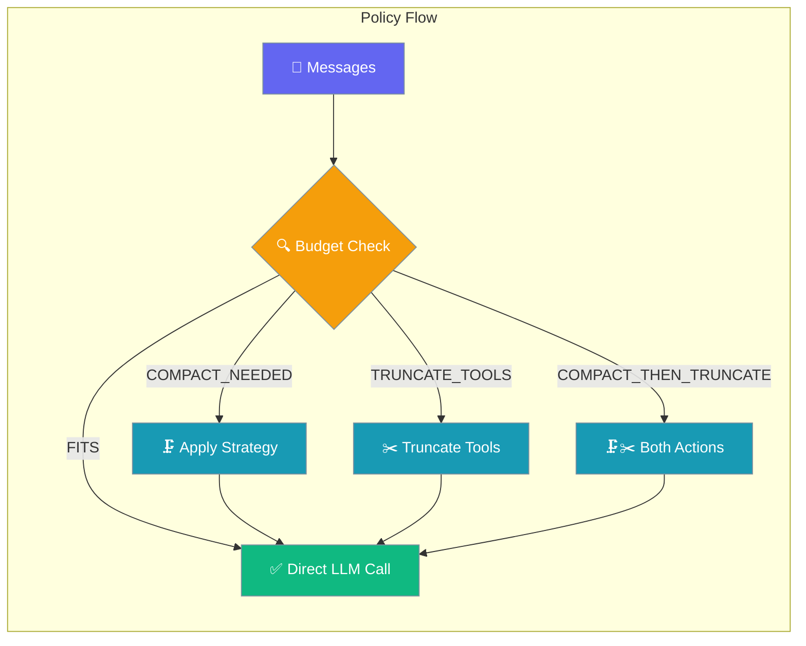
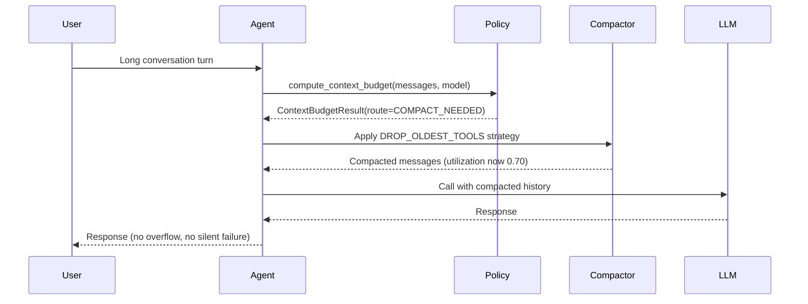
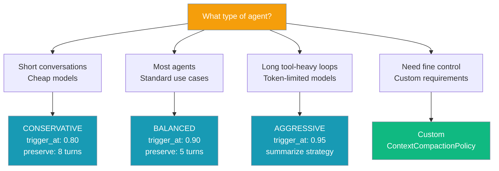

Context Compaction Policy proactively routes long agent runs through token-budget checks before each LLM call, picking the right compaction strategy before context overflow happens.

```python
from praisonaiagents import Agent, ExecutionConfig

agent = Agent(
    name="LongRunner",
    instructions="Handle long multi-turn research sessions.",
    execution=ExecutionConfig(context_compaction=True),
)
agent.start("Continue our three-hour research thread.")
```

The user runs long sessions; policy checks token budgets before each LLM call and compacts when needed.



## Quick Start

<Steps>
<Step title="Enable with defaults (one line)">
```python
from praisonaiagents import Agent, ExecutionConfig

agent = Agent(
    name="LongRunner",
    instructions="Handle long multi-turn research sessions.",
    execution=ExecutionConfig(context_compaction=True),
)

agent.start("Research the entire history of large language models...")
```
</Step>

<Step title="Pick a preset">
<Tabs>
<Tab title="Conservative">
```python
from praisonaiagents import Agent, ExecutionConfig, CONSERVATIVE_POLICY

agent = Agent(
    name="CautiousAgent",
    execution=ExecutionConfig(context_compaction=CONSERVATIVE_POLICY),
)
```
</Tab>

<Tab title="Balanced (Default)">
```python
from praisonaiagents import Agent, ExecutionConfig, BALANCED_POLICY

agent = Agent(
    name="StandardAgent",
    execution=ExecutionConfig(context_compaction=BALANCED_POLICY),
)
```
</Tab>

<Tab title="Aggressive">
```python
from praisonaiagents import Agent, ExecutionConfig, AGGRESSIVE_POLICY

agent = Agent(
    name="ToolHeavyAgent",
    execution=ExecutionConfig(context_compaction=AGGRESSIVE_POLICY),
)
```
</Tab>
</Tabs>
</Step>

<Step title="Custom policy">
```python
from praisonaiagents import Agent, ExecutionConfig, ContextCompactionPolicy

agent = Agent(
    name="CustomAgent",
    execution=ExecutionConfig(
        context_compaction=ContextCompactionPolicy(
            trigger_at=0.85,
            strategy="summarise",
            preserve_last_n_turns=8,
            target_utilization=0.65,
        )
    ),
)
```
</Step>
</Steps>

---

## How It Works



| Phase | Trigger | What happens |
|-------|---------|--------------|
| `FITS` | utilization < `trigger_at` | No action; messages pass through |
| `COMPACT_NEEDED` | utilization ≥ `trigger_at` | Strategy runs against history |
| `TRUNCATE_TOOLS` | Any tool output > 1000 chars + `aggressive_tool_truncation=True` | Tool outputs truncated head 300 / tail 200 with marker |
| `COMPACT_THEN_TRUNCATE` | utilization ≥ 0.95 | Both compaction and tool truncation |

---

## Choose Your Policy



---

## Configuration Options

| Option | Type | Default | Description |
|--------|------|---------|-------------|
| `trigger_at` | `float` | `0.90` | Context utilization fraction that triggers compaction. Range `[0.1, 0.99]`. Must be > `target_utilization`. |
| `strategy` | `str` \| `CompactionStrategy` | `"drop_oldest_tools"` | One of `"truncate"`, `"summarise"`, `"drop_oldest_tools"`, `"sliding_window"`. |
| `preserve_last_n_turns` | `int` | `5` | Conversation turns at the tail that compaction never touches. |
| `max_compaction_attempts` | `int` | `2` | Maximum compaction passes per LLM call. |
| `target_utilization` | `float` | `0.70` | Post-compaction utilization target. Range `[0.1, 0.95]`. |
| `aggressive_tool_truncation` | `bool` | `True` | When `True`, tool outputs > 1000 chars get truncated to head 300 / tail 200. |
| `model_overrides` | `dict[str, dict]` \| `None` | `None` | Per-model overrides (e.g. `{"gpt-4o-mini": {"trigger_at": 0.75}}`). |

---

## Presets

### CONSERVATIVE_POLICY
```python
CONSERVATIVE_POLICY = ContextCompactionPolicyAdapter(
    trigger_at=0.80,
    strategy=CompactionStrategy.DROP_OLDEST_TOOLS,
    preserve_last_n_turns=8,
    target_utilization=0.60,
)
```
**When to use**: Short conversations, cheap models where early compaction doesn't impact cost significantly.

### BALANCED_POLICY (Default)
```python
BALANCED_POLICY = ContextCompactionPolicyAdapter(
    trigger_at=0.90,
    strategy=CompactionStrategy.DROP_OLDEST_TOOLS,
    preserve_last_n_turns=5,
    target_utilization=0.70,
)
```
**When to use**: Most agents and standard use cases.

### AGGRESSIVE_POLICY
```python
AGGRESSIVE_POLICY = ContextCompactionPolicyAdapter(
    trigger_at=0.95,
    strategy=CompactionStrategy.SUMMARISE,
    preserve_last_n_turns=3,
    target_utilization=0.75,
    aggressive_tool_truncation=True,
)
```
**When to use**: Long tool-heavy loops or token-limited models where maximum context utilization is critical.

---

## Routes (`CompactionRoute` enum)

| Route | Value | Action |
|-------|-------|--------|
| `FITS` | `"fits"` | No action — context within budget |
| `COMPACT_NEEDED` | `"compact_needed"` | Run strategy on history |
| `TRUNCATE_TOOLS` | `"truncate_tools"` | Shrink tool outputs only |
| `COMPACT_THEN_TRUNCATE` | `"compact_then_truncate"` | Both — last-resort recovery |

---

## Strategies (`CompactionStrategy` enum)

| Strategy | Value | Description | Maps to Legacy |
|----------|-------|-------------|----------------|
| `TRUNCATE` | `"truncate"` | Remove oldest messages | `TRUNCATE` |
| `SUMMARISE` | `"summarise"` | LLM-based summarization of old messages | `SUMMARIZE` |
| `DROP_OLDEST_TOOLS` | `"drop_oldest_tools"` | Remove old tool outputs first | `PRUNE` |
| `SLIDING_WINDOW` | `"sliding_window"` | Keep recent messages only | `SLIDING` |

---

## Tool Output Truncation

When `aggressive_tool_truncation=True` and any tool message content exceeds 1000 characters:

- **Threshold**: 1000 chars
- **Keep**: Head 300 chars + tail 200 chars  
- **Marker**: `...[truncated N chars for context budget]...`

Set `aggressive_tool_truncation=False` to disable this behavior.

---

## Model Overrides

Use `model_overrides` to apply different settings per model:

```python
ContextCompactionPolicy(
    trigger_at=0.90,
    model_overrides={
        "gpt-4o-mini": {"trigger_at": 0.80, "target_utilization": 0.60},
        "claude-haiku-4-5": {"trigger_at": 0.85},
    },
)
```

The override values take precedence over the base configuration for the specified models.

---

## YAML / dict configuration

Policies serialize via `to_dict()` / `from_dict()` for CLI/YAML support:

```yaml
execution:
  context_compaction:
    trigger_at: 0.85
    strategy: drop_oldest_tools
    preserve_last_n_turns: 5
    target_utilization: 0.65
    aggressive_tool_truncation: true
```

Strategy accepts a plain string in dict/YAML form.

---

## Deprecation Notice

<Warning>
**ExecutionConfig.context_compaction will default to True in the next release for proactive context overflow protection. To disable, explicitly set context_compaction=False. To use the new default early, set context_compaction=True.**

**Today the default is `False`** — set it to `True` (or pass a policy) to opt in early.
</Warning>

---

## Common Patterns

### Use BALANCED for most agents
```python
from praisonaiagents import Agent, ExecutionConfig

agent = Agent(
    name="StandardAgent",
    execution=ExecutionConfig(context_compaction=True),  # Uses BALANCED_POLICY
)
```

### Use AGGRESSIVE for token-tight models
```python
from praisonaiagents import Agent, ExecutionConfig, AGGRESSIVE_POLICY

agent = Agent(
    name="TokenTightAgent", 
    llm="gpt-4o-mini",
    execution=ExecutionConfig(context_compaction=AGGRESSIVE_POLICY),
)
```

### Per-model overrides for multi-model agents
```python
from praisonaiagents import Agent, ExecutionConfig, ContextCompactionPolicy

policy = ContextCompactionPolicy(
    trigger_at=0.90,
    model_overrides={
        "gpt-4o-mini": {"trigger_at": 0.75},
        "gpt-4o": {"trigger_at": 0.95},
    }
)

agent = Agent(
    name="MultiModelAgent",
    execution=ExecutionConfig(context_compaction=policy),
)
```

---

## Best Practices

<AccordionGroup>
<Accordion title="Set trigger_at lower than your model's hard limit ratio">
The default 0.90 is fine for 128k models. For smaller context windows, consider lowering to 0.80-0.85 to ensure sufficient headroom.
</Accordion>

<Accordion title="Keep preserve_last_n_turns >= 3">
This ensures the agent doesn't lose the active sub-task or recent conversation context that's critical for coherent responses.
</Accordion>

<Accordion title="Use model_overrides for mixed-model workflows">
If your agent swaps between cheap and large models, set different thresholds to optimize token usage for each model type.
</Accordion>

<Accordion title="aggressive_tool_truncation=True is the right default">
For tool-heavy agents (code execution, web search, RAG), large tool outputs often contain redundant information. Truncation preserves the essential parts.
</Accordion>
</AccordionGroup>

---

## Related

<CardGroup cols={2}>
<Card title="Context Compaction" icon="compress" href="/docs/features/context-compaction">
  The reactive CompactionConfig system
</Card>
<Card title="Execution Config" icon="play" href="/docs/configuration/execution-config">
  Agent execution configuration options
</Card>
<Card title="LLM Context Compression" icon="brain" href="/docs/features/llm-context-compression">
  LLM-driven message-history compression
</Card>
<Card title="Intelligent Conversation Compaction" icon="comments" href="/docs/features/intelligent-conversation-compaction">
  Smart conversation summarization
</Card>
</CardGroup>