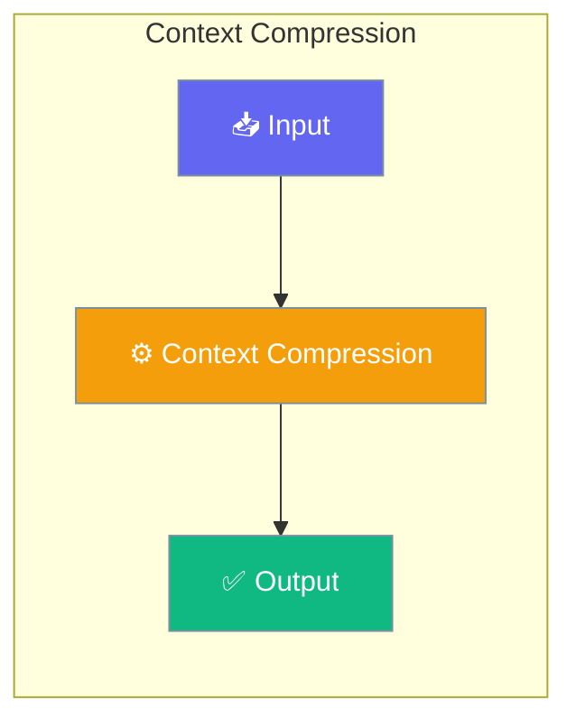

# Context Compression

<Note>
This page documents `praisonaiagents.rag.ContextCompressor` for compressing retrieved RAG chunks. For compressing *conversation history* in long agent runs, see [LLM Context Compression](/features/llm-context-compression).
</Note>

Context compression reduces retrieved content to fit within token budgets while preserving query-relevant information.




## Overview

The ContextCompressor provides:
- **Deduplication** of similar content
- **Query-focused extraction** of relevant sentences
- **Token-aware truncation** to fit budgets
- **LLM summarization fallback** for aggressive compression

## Quick Start


<Steps>
<Step title="Quick Start">
```python
from praisonaiagents.rag import ContextCompressor

compressor = ContextCompressor(
    max_tokens=4000,
    target_ratio=0.5,
)

chunks = [
    "Long document content here...",
    "Another document with similar content...",
    "More relevant information...",
]

result = compressor.compress(chunks, query="API authentication")

print(f"Original tokens: {result.original_tokens}")
print(f"Compressed tokens: {result.compressed_tokens}")
print(f"Compression ratio: {result.compressed_tokens / result.original_tokens:.2f}")
```
</Step>
</Steps>


## Best Practices

<AccordionGroup>
  <Accordion title="Start simple">
    Enable the feature with a single parameter before adding configuration. Verify it works, then layer in options.
  </Accordion>
  <Accordion title="Use environment variables for secrets">
    Never hardcode API keys or tokens. Use `os.getenv("KEY_NAME")` to read from environment variables.
  </Accordion>
  <Accordion title="Test with minimal examples first">
    Copy the Quick Start example, run it, then extend it. This confirms your environment is set up correctly.
  </Accordion>
  <Accordion title="Check the logs">
    Set `verbose=True` on your agent to see detailed execution logs when debugging unexpected behavior.
  </Accordion>
</AccordionGroup>

## Related

<CardGroup cols={2}>
  <Card title="Features Overview" icon="grid-2" href="/docs/features">
    Browse all PraisonAI features
  </Card>
  <Card title="Quick Start" icon="rocket" href="/docs/introduction">
    Get started with PraisonAI agents
  </Card>
</CardGroup>
