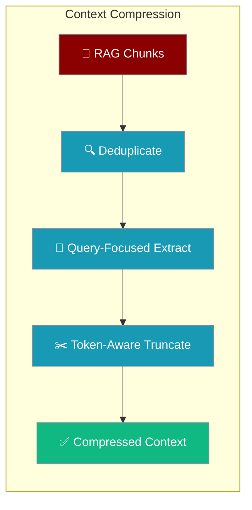
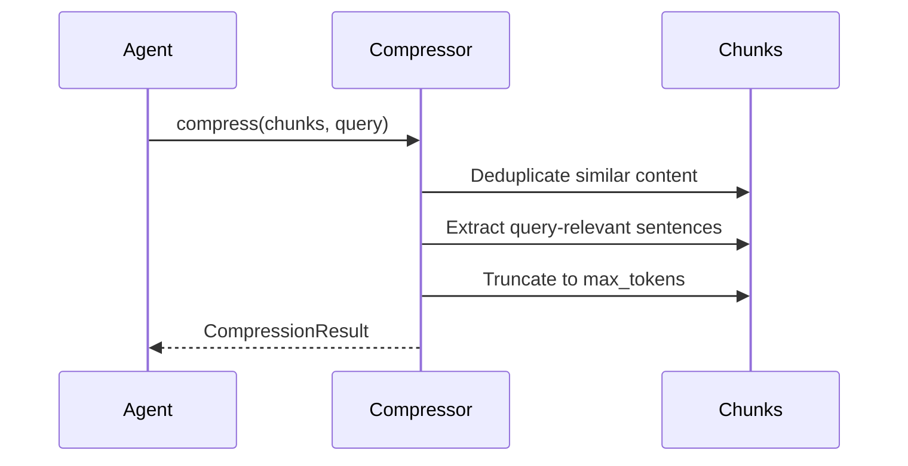

<Note>
This page documents `praisonaiagents.rag.ContextCompressor` for compressing retrieved RAG chunks. For compressing *conversation history* in long agent runs, see [LLM Context Compression](/features/llm-context-compression).
</Note>

Context Compression reduces retrieved RAG chunks to fit token budgets while preserving query-relevant information.



## Quick Start

<Steps>
<Step title="Compress RAG chunks">
```python
from praisonaiagents.rag import ContextCompressor

compressor = ContextCompressor(
    max_tokens=4000,
    target_ratio=0.5,
)

chunks = [
    "Long document content here...",
    "Another document with similar content...",
    "More relevant information...",
]

result = compressor.compress(chunks, query="API authentication")
print(f"Original: {result.original_tokens} tokens")
print(f"Compressed: {result.compressed_tokens} tokens")
```
</Step>

<Step title="Use with an agent">
```python
from praisonaiagents import Agent

agent = Agent(
    name="CompressedRetriever",
    instructions="Answer questions using the knowledge base.",
    knowledge={
        "sources": ["./docs"],
        "retrieval_k": 10,
    }
)

response = agent.chat("Summarize the authentication methods")
```
</Step>
</Steps>

---

## How It Works



---

## Compression Strategies

### Deduplication

Removes duplicate or near-duplicate content:

```python
compressor = ContextCompressor(
    deduplicate=True,
    similarity_threshold=0.9,
)

result = compressor.compress(chunks)
```

### Query-Focused Extraction

Extracts sentences most relevant to the query:

```python
compressor = ContextCompressor(
    max_tokens=2000,
    extraction_method="query_focused",
)

result = compressor.compress(
    chunks,
    query="How do I authenticate with the API?",
)
```

### Truncation

Simple truncation to fit token budget:

```python
compressor = ContextCompressor(
    max_tokens=1000,
    truncation_strategy="end",  # or "start", "middle"
)

result = compressor.compress(chunks)
```

### LLM Summarization

Uses LLM for aggressive compression:

```python
compressor = ContextCompressor(
    max_tokens=500,
    use_llm_summarization=True,
    summarization_model="gpt-4o-mini",
)

result = compressor.compress(chunks, query=query)
```

## Compression Results

### CompressionResult Structure

```python
from dataclasses import dataclass
from typing import List

@dataclass
class CompressionResult:
    chunks: List[str]
    original_tokens: int
    compressed_tokens: int
    method_used: str
    metadata: dict = None
```

### Working with Results

```python
result = compressor.compress(chunks, query=query)

print(f"Method used: {result.method_used}")
print(f"Original: {result.original_tokens} tokens")
print(f"Compressed: {result.compressed_tokens} tokens")
print(f"Ratio: {result.compressed_tokens / result.original_tokens:.2%}")

# Use compressed chunks
for chunk in result.chunks:
    print(chunk[:200] + "...")
```

## CLI Usage

```bash
# Search with compression
praisonai knowledge search "query" --compress

# Specify compression ratio
praisonai knowledge search "query" --compress --compression-ratio 0.3

# Specify max tokens
praisonai knowledge search "query" --compress --max-context-tokens 2000

# Verbose output
praisonai knowledge search "query" --compress --verbose
```

## Integration with Agents

```python
from praisonaiagents import Agent

agent = Agent(
    name="CompressedRetriever",
    instructions="Answer questions using the knowledge base.",
    knowledge={
        "sources": ["./docs"],
        "retrieval_k": 10,
    }
)

response = agent.chat("Summarize the authentication methods")
```

## ContextCompressor Options

| Option | Type | Default | Description |
|--------|------|---------|-------------|
| `max_tokens` | `int` | `4000` | Maximum output tokens |
| `target_ratio` | `float` | `0.5` | Target compression ratio |
| `deduplicate` | `bool` | `True` | Remove near-duplicate content |
| `similarity_threshold` | `float` | `0.9` | Deduplication similarity cutoff |
| `use_llm_summarization` | `bool` | `False` | Use LLM for aggressive compression |
| `summarization_model` | `str` | `"gpt-4o-mini"` | Model for LLM summarization |

---

## Best Practices

<AccordionGroup>
<Accordion title="Always pass a query for better relevance">
Query-focused extraction identifies the sentences most relevant to the user's question, improving answer quality.

```python
result = compressor.compress(chunks, query="How do I authenticate?")
```
</Accordion>

<Accordion title="Enable deduplication for large corpora">
Knowledge bases often contain duplicate or near-duplicate content. Deduplication at `similarity_threshold=0.9` removes redundancy without losing unique information.
</Accordion>

<Accordion title="Use LLM summarization only when necessary">
LLM summarization is the most aggressive but slowest method. Use it only when token limits are very tight.

```python
compressor = ContextCompressor(max_tokens=500, use_llm_summarization=True)
```
</Accordion>

<Accordion title="Monitor compression ratio for quality">
A ratio below 0.3 (70% reduction) may sacrifice too much relevance. Monitor and adjust `target_ratio` as needed.

```python
print(f"Ratio: {result.compressed_tokens / result.original_tokens:.2%}")
```
</Accordion>
</AccordionGroup>

---

## Related

<CardGroup cols={2}>
<Card title="Context Budgeter" icon="coins" href="/features/context-budgeter">
  Token budget allocation for context management
</Card>
<Card title="Quality-Based RAG" icon="star" href="/features/quality-based-rag">
  Quality-scored retrieval for better answers
</Card>
</CardGroup>

<Note>
Memory backends can implement the `on_pre_compress` hook to extract and persist important facts before compression. See [Memory Lifecycle Hooks](/docs/features/memory-lifecycle-hooks) for details.
</Note>
