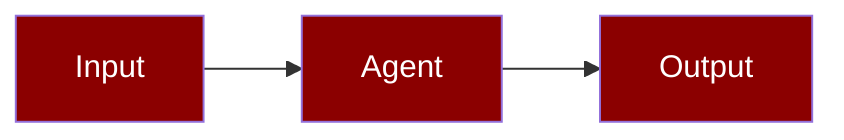

# Context Compression

<Note>
This page documents `praisonaiagents.rag.ContextCompressor` for compressing retrieved RAG chunks. For compressing *conversation history* in long agent runs, see [LLM Context Compression](/features/llm-context-compression).
</Note>

Context compression reduces retrieved content to fit within token budgets while preserving query-relevant information.




## Overview

The ContextCompressor provides:
- **Deduplication** of similar content
- **Query-focused extraction** of relevant sentences
- **Token-aware truncation** to fit budgets
- **LLM summarization fallback** for aggressive compression

## Quick Start

<Steps>
<Step title="Compress retrieved chunks">

```python
from praisonaiagents.rag import ContextCompressor

compressor = ContextCompressor(max_tokens=4000, target_ratio=0.5)
chunks = ["Long document content here...", "Another document..."]

result = compressor.compress(chunks, query="API authentication")
print(f"Saved {result.original_tokens - result.compressed_tokens} tokens")
```

</Step>

<Step title="Search with compression via CLI">

```bash
praisonai knowledge search "query" --compress --max-context-tokens 2000
```

</Step>
</Steps>

## Compression Strategies

### Deduplication

Removes duplicate or near-duplicate content:

```python
compressor = ContextCompressor(
    deduplicate=True,
    similarity_threshold=0.9,
)

result = compressor.compress(chunks)
```

### Query-Focused Extraction

Extracts sentences most relevant to the query:

```python
compressor = ContextCompressor(
    max_tokens=2000,
    extraction_method="query_focused",
)

result = compressor.compress(
    chunks,
    query="How do I authenticate with the API?",
)
```

### Truncation

Simple truncation to fit token budget:

```python
compressor = ContextCompressor(
    max_tokens=1000,
    truncation_strategy="end",  # or "start", "middle"
)

result = compressor.compress(chunks)
```

### LLM Summarization

Uses LLM for aggressive compression:

```python
compressor = ContextCompressor(
    max_tokens=500,
    use_llm_summarization=True,
    summarization_model="gpt-4o-mini",
)

result = compressor.compress(chunks, query=query)
```

## Compression Results

### CompressionResult Structure

```python
from dataclasses import dataclass
from typing import List

@dataclass
class CompressionResult:
    chunks: List[str]
    original_tokens: int
    compressed_tokens: int
    method_used: str
    metadata: dict = None
```

### Working with Results

```python
result = compressor.compress(chunks, query=query)

print(f"Method used: {result.method_used}")
print(f"Original: {result.original_tokens} tokens")
print(f"Compressed: {result.compressed_tokens} tokens")
print(f"Ratio: {result.compressed_tokens / result.original_tokens:.2%}")

# Use compressed chunks
for chunk in result.chunks:
    print(chunk[:200] + "...")
```

## CLI Usage

```bash
# Search with compression
praisonai knowledge search "query" --compress

# Specify compression ratio
praisonai knowledge search "query" --compress --compression-ratio 0.3

# Specify max tokens
praisonai knowledge search "query" --compress --max-context-tokens 2000

# Verbose output
praisonai knowledge search "query" --compress --verbose
```

## Integration with Agents

```python
from praisonaiagents import Agent

agent = Agent(
    name="CompressedRetriever",
    instructions="Answer questions using the knowledge base.",
    knowledge={
        "sources": ["./docs"],
        "retrieval_k": 10,
    }
)

response = agent.chat("Summarize the authentication methods")
```

## Best Practices

<AccordionGroup>
  <Accordion title="Enable LLM summarisation for long chats">
    `llm_summarize=True` preserves decisions and facts better than blunt truncation.
  </Accordion>
  <Accordion title="Hook memory before compress">
    Use `on_pre_compress` to persist important facts before messages are discarded.
  </Accordion>
  <Accordion title="Pair with smart retrieval">
    Re-fetch compressed-away details via hybrid search instead of keeping everything inline.
  </Accordion>
  <Accordion title="Log compression events">
    Review observability history to confirm compression helps rather than hurts answer quality.
  </Accordion>
</AccordionGroup>

## API Reference

### ContextCompressor

```python
class ContextCompressor:
    def __init__(
        self,
        max_tokens: int = 4000,
        target_ratio: float = 0.5,
        deduplicate: bool = True,
        similarity_threshold: float = 0.9,
        use_llm_summarization: bool = False,
        summarization_model: str = "gpt-4o-mini",
    ):
        """Initialize context compressor."""
    
    def compress(
        self,
        chunks: List[str],
        query: str = None,
    ) -> CompressionResult:
        """Compress chunks to fit token budget."""
    
    def estimate_tokens(self, text: str) -> int:
        """Estimate token count for text."""
```

### CompressionResult

```python
@dataclass
class CompressionResult:
    chunks: List[str]
    original_tokens: int
    compressed_tokens: int
    method_used: str
    metadata: dict = None
```

<Note>
Memory backends can implement the `on_pre_compress` hook to extract and persist important facts before compression discards messages. See [Memory Lifecycle Hooks](/docs/features/memory-lifecycle-hooks) for details.
</Note>

## Related

<CardGroup cols={2}>
<Card title="Smart Retrieval" icon="magnifying-glass" href="/docs/features/smart-retrieval">
  Hybrid search before compression
</Card>
<Card title="Token Budgeting" icon="coins" href="/docs/features/token-budgeting">
  Set budgets for retrieved context
</Card>
</CardGroup>
