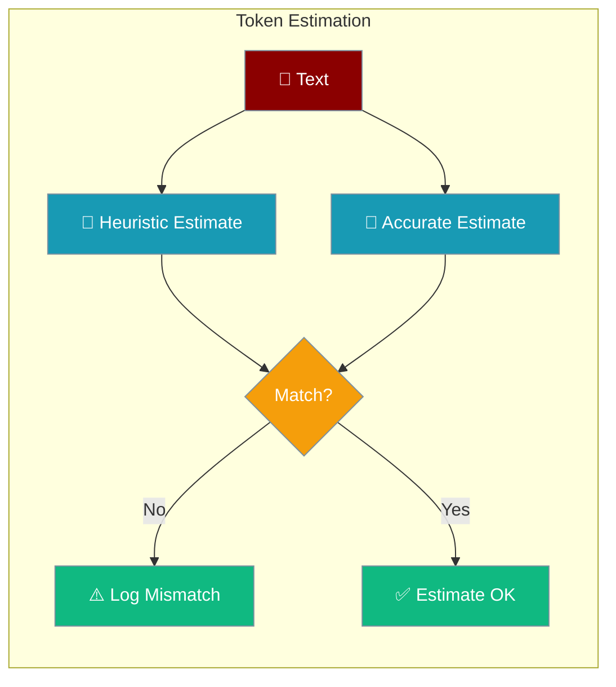

Token estimation validation compares heuristic estimates against accurate counts to catch estimation errors before they cause context overflows.



## Quick Start

<Steps>
<Step title="Enable validation mode">
```python
from praisonaiagents import ContextManager, ManagerConfig, EstimationMode

config = ManagerConfig(
    estimation_mode=EstimationMode.VALIDATED,
    log_estimation_mismatch=True,
    mismatch_threshold_pct=15.0,
)

manager = ContextManager(model="gpt-4o-mini", config=config)

tokens, metrics = manager.estimate_tokens(text, validate=True)

if metrics:
    print(f"Heuristic: {metrics.heuristic_estimate}")
    print(f"Accurate: {metrics.accurate_estimate}")
    print(f"Error: {metrics.error_pct:.1f}%")
```
</Step>

<Step title="Via environment variable">
```bash
export PRAISONAI_CONTEXT_ESTIMATION_MODE=validated
export PRAISONAI_CONTEXT_LOG_MISMATCH=true
```
</Step>
</Steps>

## Estimation Modes

| Mode | Description | Performance |
|------|-------------|-------------|
| `HEURISTIC` | Fast character-based estimate | Fastest |
| `ACCURATE` | Use tiktoken if available | Slower |
| `VALIDATED` | Compare both, log mismatches | Slowest |

## Configuration

```python
config = ManagerConfig(
    estimation_mode=EstimationMode.VALIDATED,
    log_estimation_mismatch=True,      # Log when mismatch > threshold
    mismatch_threshold_pct=15.0,       # 15% threshold
)
```

### Environment Variables

```bash
export PRAISONAI_CONTEXT_ESTIMATION_MODE=validated
export PRAISONAI_CONTEXT_LOG_MISMATCH=true
```

## EstimationMetrics

```python
@dataclass
class EstimationMetrics:
    heuristic_estimate: int    # Fast estimate
    accurate_estimate: int     # Tiktoken count
    error_pct: float          # Percentage error
    estimator_used: EstimationMode
```

## Mismatch Logging

When `log_estimation_mismatch=True` and error exceeds threshold:

```
WARNING: Token estimation mismatch: heuristic=1250, accurate=1100, error=13.6%
```

## Estimation Caching

Estimates are cached by content hash:

```python
# First call - computes estimate
tokens1, _ = manager.estimate_tokens(text)

# Second call - uses cache
tokens2, _ = manager.estimate_tokens(text)

# Cache key is MD5 hash of text
```

## Heuristic Algorithm

The heuristic uses character-based estimation:

```python
# ASCII characters: ~0.25 tokens per char
# Non-ASCII: ~1.3 tokens per char
# Plus overhead for message structure
```

## Accurate Estimation

When tiktoken is available:

```python
# Uses model-specific tokenizer
# Falls back to heuristic if unavailable
```

## CLI Usage

```bash
# View estimation mode in config
praisonai chat
> /context config

# Shows:
# Estimation:
#   estimation_mode:        validated
#   log_mismatch:           True
```

## Best Practices

<AccordionGroup>
<Accordion title="Use heuristic in production, validated in development">
Heuristic estimation is fast and accurate enough for production. Switch to `VALIDATED` mode temporarily when debugging unexpected context overflows.
</Accordion>

<Accordion title="Set mismatch threshold to 15-20%">
A threshold of 15% catches meaningful estimation errors without generating too much noise in logs.

```python
config = ManagerConfig(mismatch_threshold_pct=15.0)
```
</Accordion>

<Accordion title="Estimates are cached by content hash">
Repeated calls with the same text use the cache, making estimation cheap for large history arrays.
</Accordion>

<Accordion title="Tiktoken falls back to heuristic if unavailable">
If tiktoken is not installed, `ACCURATE` mode silently falls back to heuristic. Install tiktoken for true accurate counts.
</Accordion>
</AccordionGroup>

---

## Related

<CardGroup cols={2}>
<Card title="Context Budgeter" icon="coins" href="/features/context-budgeter">
  Model-aware token budget allocation
</Card>
<Card title="Context Ledger" icon="book" href="/features/context-ledger">
  Per-segment token usage tracking
</Card>
</CardGroup>
