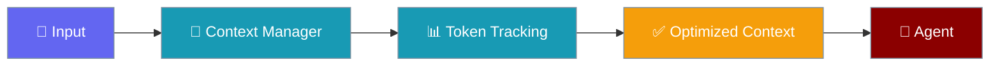

Token estimation validation compares heuristic estimates against accurate counts, logging mismatches for debugging.




## Quick Start

<Steps>
<Step title="Basic Usage">
```python
from praisonaiagents import ContextManager, ManagerConfig, EstimationMode

config = ManagerConfig(
    estimation_mode=EstimationMode.VALIDATED,
    log_estimation_mismatch=True,
    mismatch_threshold_pct=15.0,
)

manager = ContextManager(model="gpt-4o-mini", config=config)

# Estimate with validation
tokens, metrics = manager.estimate_tokens(text, validate=True)

if metrics:
    print(f"Heuristic: {metrics.heuristic_estimate}")
    print(f"Accurate: {metrics.accurate_estimate}")
    print(f"Error: {metrics.error_pct:.1f}%")
```
</Step>
</Steps>


## Estimation Modes

| Mode | Description | Performance |
|------|-------------|-------------|
| `HEURISTIC` | Fast character-based estimate | Fastest |
| `ACCURATE` | Use tiktoken if available | Slower |
| `VALIDATED` | Compare both, log mismatches | Slowest |

## Configuration

```python
config = ManagerConfig(
    estimation_mode=EstimationMode.VALIDATED,
    log_estimation_mismatch=True,      # Log when mismatch > threshold
    mismatch_threshold_pct=15.0,       # 15% threshold
)
```

### Environment Variables

```bash
export PRAISONAI_CONTEXT_ESTIMATION_MODE=validated
export PRAISONAI_CONTEXT_LOG_MISMATCH=true
```

## EstimationMetrics

```python
@dataclass
class EstimationMetrics:
    heuristic_estimate: int    # Fast estimate
    accurate_estimate: int     # Tiktoken count
    error_pct: float          # Percentage error
    estimator_used: EstimationMode
```

## Mismatch Logging

When `log_estimation_mismatch=True` and error exceeds threshold:

```
WARNING: Token estimation mismatch: heuristic=1250, accurate=1100, error=13.6%
```

## Estimation Caching

Estimates are cached by content hash:

```python
# First call - computes estimate
tokens1, _ = manager.estimate_tokens(text)

# Second call - uses cache
tokens2, _ = manager.estimate_tokens(text)

# Cache key is MD5 hash of text
```

## Heuristic Algorithm

The heuristic uses character-based estimation:

```python
# ASCII characters: ~0.25 tokens per char
# Non-ASCII: ~1.3 tokens per char
# Plus overhead for message structure
```

## Accurate Estimation

When tiktoken is available:

```python
# Uses model-specific tokenizer
# Falls back to heuristic if unavailable
```

## CLI Usage

```bash
# View estimation mode in config
praisonai chat
> /context config

# Shows:
# Estimation:
#   estimation_mode:        validated
#   log_mismatch:           True
```

## Best Practices

1. **Use heuristic for production** - Fast and good enough
2. **Use validated for debugging** - Find estimation issues
3. **Set reasonable threshold** - 15-20% is typical
4. **Monitor mismatch logs** - Identify problematic content
## Best Practices

<AccordionGroup>
<Accordion title="Set budgets before overflowing">
Configure context budgets proactively — waiting until the context window fills causes silent truncation or errors.
</Accordion>
<Accordion title="Use compression for long sessions">
Enable context compression for conversations expected to exceed 50% of the model's context window.
</Accordion>
<Accordion title="Monitor token counts">
Use the context monitor during development to understand real usage before deploying to production.
</Accordion>
</AccordionGroup>

## Related

<CardGroup cols={2}>
<Card title="Token Estimation" icon="calculator" href="/docs/features/context-token-estimation">
  Estimate token counts
</Card>
<Card title="Context Budgeter" icon="gauge" href="/docs/features/context-budgeter">
  Budget context
</Card>
</CardGroup>
