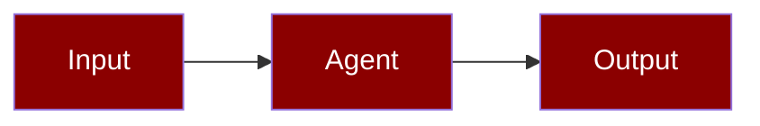

Token estimation validation compares heuristic estimates against accurate counts, logging mismatches for debugging.




## Quick Start

<Steps>
<Step title="Enable validated estimation">

```python
from praisonaiagents import ContextManager, ManagerConfig, EstimationMode

config = ManagerConfig(
    estimation_mode=EstimationMode.VALIDATED,
    log_estimation_mismatch=True,
    mismatch_threshold_pct=15.0,
)

manager = ContextManager(model="gpt-4o-mini", config=config)
tokens, metrics = manager.estimate_tokens(text, validate=True)
```

</Step>

<Step title="Review mismatch logs">

```bash
praisonai chat
> /context config
```

</Step>
</Steps>

## Estimation Modes

| Mode | Description | Performance |
|------|-------------|-------------|
| `HEURISTIC` | Fast character-based estimate | Fastest |
| `ACCURATE` | Use tiktoken if available | Slower |
| `VALIDATED` | Compare both, log mismatches | Slowest |

## Configuration

```python
config = ManagerConfig(
    estimation_mode=EstimationMode.VALIDATED,
    log_estimation_mismatch=True,      # Log when mismatch > threshold
    mismatch_threshold_pct=15.0,       # 15% threshold
)
```

### Environment Variables

```bash
export PRAISONAI_CONTEXT_ESTIMATION_MODE=validated
export PRAISONAI_CONTEXT_LOG_MISMATCH=true
```

## EstimationMetrics

```python
@dataclass
class EstimationMetrics:
    heuristic_estimate: int    # Fast estimate
    accurate_estimate: int     # Tiktoken count
    error_pct: float          # Percentage error
    estimator_used: EstimationMode
```

## Mismatch Logging

When `log_estimation_mismatch=True` and error exceeds threshold:

```
WARNING: Token estimation mismatch: heuristic=1250, accurate=1100, error=13.6%
```

## Estimation Caching

Estimates are cached by content hash:

```python
# First call - computes estimate
tokens1, _ = manager.estimate_tokens(text)

# Second call - uses cache
tokens2, _ = manager.estimate_tokens(text)

# Cache key is MD5 hash of text
```

## Heuristic Algorithm

The heuristic uses character-based estimation:

```python
# ASCII characters: ~0.25 tokens per char
# Non-ASCII: ~1.3 tokens per char
# Plus overhead for message structure
```

## Accurate Estimation

When tiktoken is available:

```python
# Uses model-specific tokenizer
# Falls back to heuristic if unavailable
```

## CLI Usage

```bash
# View estimation mode in config
praisonai chat
> /context config

# Shows:
# Estimation:
#   estimation_mode:        validated
#   log_mismatch:           True
```

## Best Practices

<AccordionGroup>
  <Accordion title="Use heuristic mode in production">
    Heuristic estimation is fast and sufficient for most runs — reserve validated mode for debugging.
  </Accordion>
  <Accordion title="Set a sensible mismatch threshold">
    Fifteen to twenty percent is a typical threshold before logging estimation drift.
  </Accordion>
  <Accordion title="Monitor mismatch logs">
    Spikes often indicate unusual Unicode, code blocks, or tool payloads — fix content, not just the estimator.
  </Accordion>
  <Accordion title="Enable tiktoken when available">
    Model-specific tokenisers improve accuracy for billing-sensitive workloads.
  </Accordion>
</AccordionGroup>

## Related

<CardGroup cols={2}>
<Card title="Token Estimation" icon="calculator" href="/docs/features/context-token-estimation">
  Fast offline token counting
</Card>
<Card title="Context Observability" icon="chart-line" href="/docs/features/context-observability">
  Track optimisation events and history
</Card>
</CardGroup>
