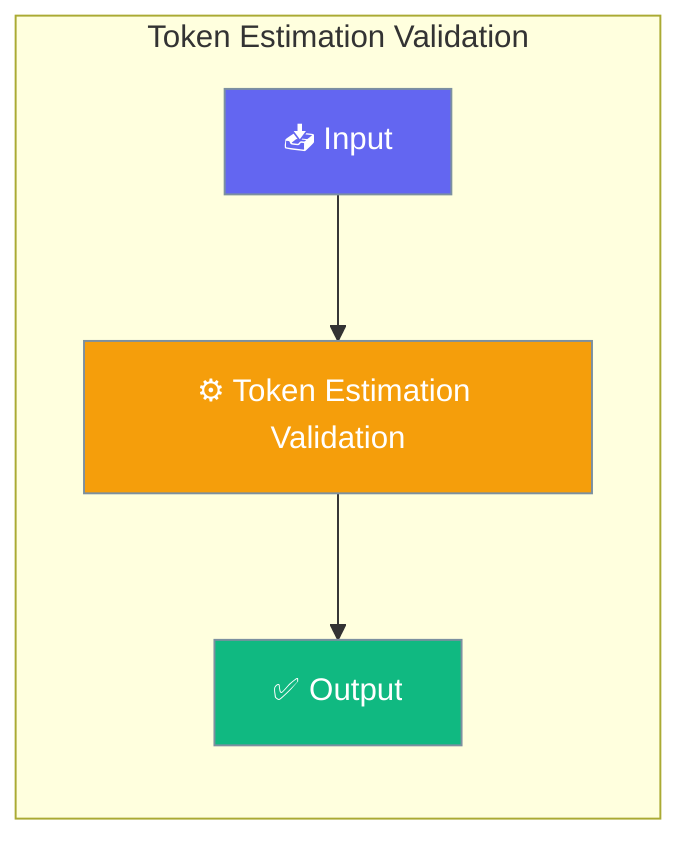

Token estimation validation compares heuristic estimates against accurate counts, logging mismatches for debugging.




## Quick Start


<Steps>
<Step title="Quick Start">
```python
from praisonaiagents import ContextManager, ManagerConfig, EstimationMode

config = ManagerConfig(
    estimation_mode=EstimationMode.VALIDATED,
    log_estimation_mismatch=True,
    mismatch_threshold_pct=15.0,
)

manager = ContextManager(model="gpt-4o-mini", config=config)

# Estimate with validation
tokens, metrics = manager.estimate_tokens(text, validate=True)

if metrics:
    print(f"Heuristic: {metrics.heuristic_estimate}")
    print(f"Accurate: {metrics.accurate_estimate}")
    print(f"Error: {metrics.error_pct:.1f}%")
```
</Step>
</Steps>


## Best Practices

<AccordionGroup>
  <Accordion title="Start simple">
    Enable the feature with a single parameter before adding configuration. Verify it works, then layer in options.
  </Accordion>
  <Accordion title="Use environment variables for secrets">
    Never hardcode API keys or tokens. Use `os.getenv("KEY_NAME")` to read from environment variables.
  </Accordion>
  <Accordion title="Test with minimal examples first">
    Copy the Quick Start example, run it, then extend it. This confirms your environment is set up correctly.
  </Accordion>
  <Accordion title="Check the logs">
    Set `verbose=True` on your agent to see detailed execution logs when debugging unexpected behavior.
  </Accordion>
</AccordionGroup>

## Related

<CardGroup cols={2}>
  <Card title="Features Overview" icon="grid-2" href="/docs/features">
    Browse all PraisonAI features
  </Card>
  <Card title="Quick Start" icon="rocket" href="/docs/introduction">
    Get started with PraisonAI agents
  </Card>
</CardGroup>
