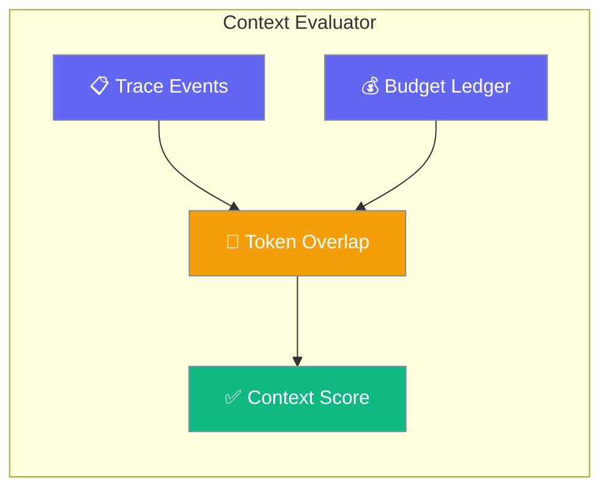
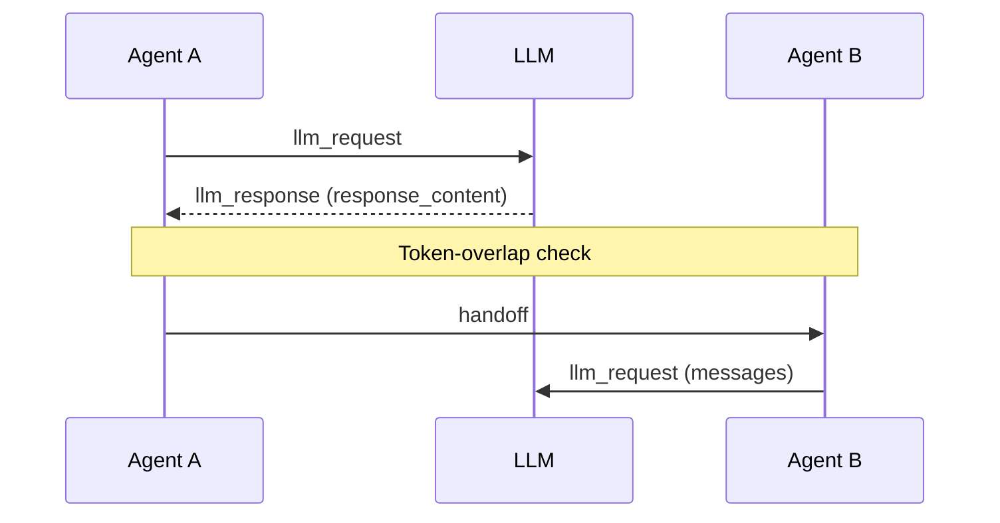
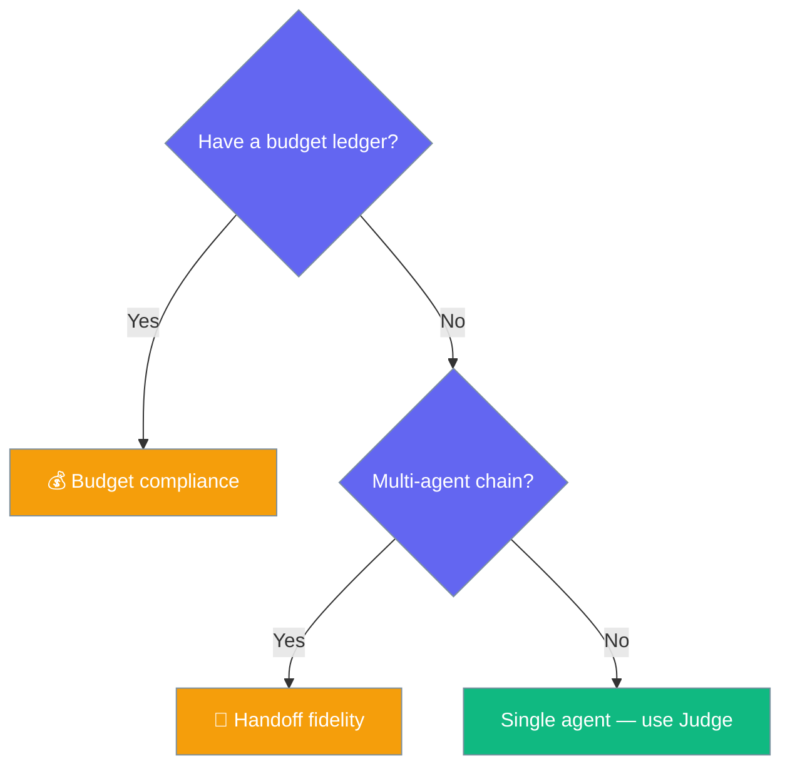

Context Evaluator scores how much of one agent's output reaches the next agent — plus whether each agent stayed inside its token budget — all without a live LLM call.



## Quick Start

<Steps>
<Step title="Score a 2-agent workflow">
```python
from praisonaiagents import Agent, Task, PraisonAIAgents
from praisonaiagents.eval import ContextEvaluator

researcher = Agent(name="researcher", instructions="Research the topic")
writer     = Agent(name="writer",     instructions="Write the final report")

research = Task(description="Research AI agents", agent=researcher)
report   = Task(description="Write the report", agent=writer)

workflow = PraisonAIAgents(agents=[researcher, writer], tasks=[research, report])
workflow.start()

result = ContextEvaluator(
    trace_events=workflow.trace_events,
    agent_order=["researcher", "writer"],
).run(print_summary=True)

print(result.overall_score)   # 0-10
```
</Step>

<Step title="Add a token-budget ledger">
```python
from praisonaiagents.eval import ContextEvaluator

result = ContextEvaluator(
    trace_events=workflow.trace_events,
    agent_order=["researcher", "writer"],
    budget_ledger=[
        {"agent_name": "researcher", "used_tokens": 8_200, "budget_tokens": 10_000},
        {"agent_name": "writer",     "used_tokens": 4_100, "budget_tokens": 6_000},
    ],
).run(print_summary=True)

print(result.handoff_score)   # context flow (0-10)
print(result.budget_score)    # budget compliance (0-10)
```
</Step>

<Step title="Run inside an EvalSuite">
```python
from praisonaiagents.eval import ContextEvaluator, EvalSuite, AccuracyEvaluator

suite = EvalSuite(evaluators=[
    ContextEvaluator(
        trace_events=workflow.trace_events,
        agent_order=["researcher", "writer"],
    ),
    AccuracyEvaluator(agent=writer, input_text="Summarize AI agents", expected_output="..."),
])
report = suite.run()
```
</Step>
</Steps>

---

## How It Works

Context Evaluator reads the workflow trace and measures how much of each agent's response tokens survive into the next agent's request.



| Signal | Source event | Score |
|--------|--------------|-------|
| Exact content match | `llm_response` → `llm_request` | `10/10` |
| Partial overlap | token intersection | `min(10, overlap × 12 + 2)` |
| Below `5` | low overlap | flags `content_loss_detected=True` |
| Budget met | `used <= budget` | `10/10` |
| Over budget | overrun | `max(1, 10 - overrun × 10)` |
| No budget (`0`) | neutral | `5.0` |

---

## When to choose which dimension

Pick the dimensions that match the data you have.



---

## Configuration Options

Full parameter narrative lives in the [SDK source](https://github.com/MervinPraison/PraisonAI/blob/main/src/praisonai-agents/praisonaiagents/eval/context_eval.py).

| Option | Type | Default | Description |
|--------|------|---------|-------------|
| `trace_events` | `list[Any]` | `None` | Trace events, each with `event_type` / `agent_name` / `data` (objects or dicts) |
| `agent_order` | `list[str]` | `None` | Ordered agent names for the handoff chain (needs ≥ 2 for handoff scoring) |
| `budget_ledger` | `list[dict]` | `None` | List of `{"agent_name", "used_tokens", "budget_tokens"}` dicts |
| `name` | `str` | `None` | Evaluation name |
| `save_results_path` | `str` | `None` | Path to persist result JSON |
| `verbose` | `bool` | `False` | Enable verbose logging |

**Methods**

| Method | Returns | Purpose |
|--------|---------|---------|
| `evaluate_handoff()` | `list[ContextHandoffResult]` | Token overlap for each adjacent agent pair |
| `evaluate_budget()` | `list[BudgetComplianceResult]` | Budget adherence per ledger entry |
| `run(print_summary=False)` | `ContextEvalResult` | Runs both and aggregates |

**`ContextEvalResult`** properties: `handoff_score`, `budget_score`, `overall_score` (average of dimensions present), `content_loss_detected`, plus `to_dict()`.

---

## Common Patterns

Gate a workflow in CI, catch handoff regressions, or combine with the Harness Evaluator.

<Tabs>
  <Tab title="CI gate">
    ```python
    import sys
    from praisonaiagents.eval import ContextEvaluator

    result = ContextEvaluator(
        trace_events=workflow.trace_events,
        agent_order=["researcher", "writer"],
    ).run()

    if result.overall_score < 8:
        sys.exit(1)
    ```
  </Tab>
  <Tab title="Context + accuracy suite">
    ```python
    from praisonaiagents.eval import ContextEvaluator, EvalSuite, AccuracyEvaluator

    suite = EvalSuite(evaluators=[
        ContextEvaluator(
            trace_events=workflow.trace_events,
            agent_order=["researcher", "writer"],
            budget_ledger=[
                {"agent_name": "researcher", "used_tokens": 8_200, "budget_tokens": 10_000},
                {"agent_name": "writer",     "used_tokens": 4_100, "budget_tokens": 6_000},
            ],
        ),
        AccuracyEvaluator(agent=writer, input_text="...", expected_output="..."),
    ])
    report = suite.run()
    ```
  </Tab>
</Tabs>

---

## Best Practices

<AccordionGroup>
  <Accordion title="Feed the full trace, not just the final message">
    Handoff scoring needs both `llm_request` and `llm_response` events for each agent. Pass the complete `workflow.trace_events`, not a single summary string.
  </Accordion>
  <Accordion title="Match agent_order to your workflow order">
    Scoring walks adjacent pairs in `agent_order`. List the agents in the exact sequence they run so each handoff is compared correctly.
  </Accordion>
  <Accordion title="A budget of 0 or None is neutral, not a fail">
    Entries with `budget_tokens` of `0` score a neutral `5.0`. Set a real budget only where you want a gate.
  </Accordion>
  <Accordion title="LLM-free and deterministic — safe in CI">
    No live model call runs, so scores are reproducible and require no API key.
  </Accordion>
</AccordionGroup>

---

## Related

<CardGroup cols={2}>
  <Card title="Evaluation Loop" icon="rotate" href="/docs/eval/evaluation-loop">
    Iterative agent → judge → improve loop
  </Card>
  <Card title="Judge" icon="gavel" href="/docs/eval/judge">
    LLM-as-judge for evaluating outputs
  </Card>
  <Card title="Harness Evaluator" icon="flask" href="/docs/features/harness-evaluator">
    Score Interactive Test Harness traces
  </Card>
</CardGroup>
