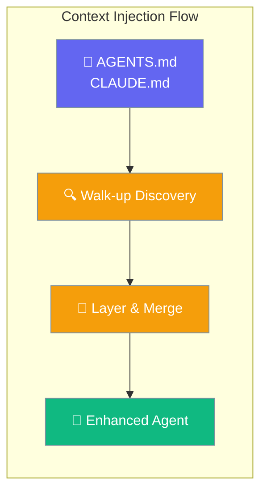
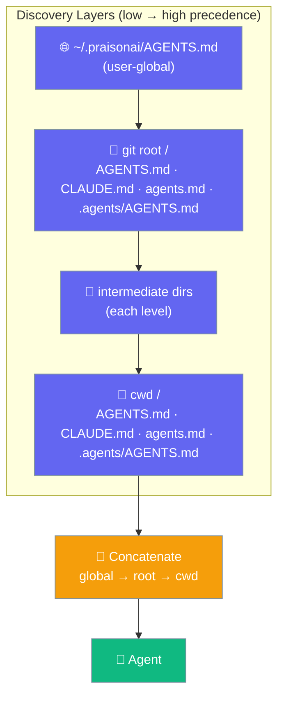
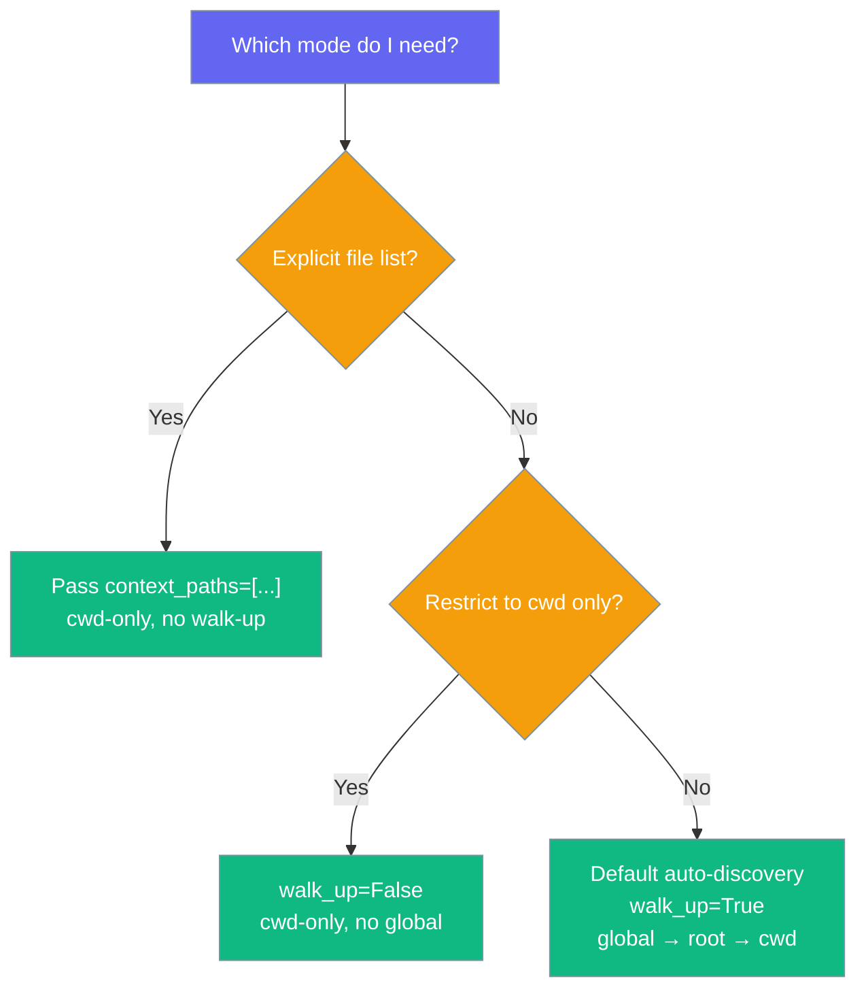

Context files automatically inject markdown content into your agent's instructions — drop an `AGENTS.md` in your project root and every run sees it, no config needed.



## Quick Start

<Steps>
<Step title="Drop an AGENTS.md in your project root">

```markdown
# AGENTS.md
## Company Guidelines
- Always be professional and helpful
- Focus on customer satisfaction
- Use clear, concise language

## Product Information
Our main products include:
- AI Assistant Platform
- Workflow Automation Tools
```

</Step>

<Step title="Run from any subdirectory — instructions load automatically">

```bash
# From the project root
praisonai run "Help a customer"

# Or from a nested package — the root AGENTS.md is still found
cd packages/frontend
praisonai run "Build a login form"
```

Or use the Python API:

```python
from praisonaiagents import Agent
from praisonai.integration import configure_host

agent = Agent(
    name="Customer Support",
    instructions="Help customers with their questions"
)

# No context_paths needed — auto-discovery picks up AGENTS.md
configure_host(agents=[agent], style="dashboard")
```

</Step>
</Steps>

---

## How It Works

`load_context_files()` walks up from your current directory to the git root, collecting candidates at each level and concatenating them with the nearest file winning (appended last):



The merged content is prepended to the agent's instructions:

```
{original_instructions}

Context:
{layered_context_from_all_levels}
```

---

## CLI Auto-loading

As of PraisonAI PR #2358, `praisonai chat`, `praisonai run`, `praisonai code`, and `praisonai tui` automatically discover and inject AGENTS.md-style project context into the system prompt — no flag required.

```mermaid
sequenceDiagram
    participant User
    participant CLI as praisonai CLI
    participant Loader as load_context_files
    participant Agent as Agent backstory

    User->>CLI: praisonai chat / run / code / tui
    CLI->>Loader: walk_up=True, cwd=workspace
    Loader-->>CLI: merged context (≤8000 chars)
    CLI->>Agent: prepend "# Project Context\n{context}"
    Agent-->>User: response with project awareness

    classDef user fill:#6366F1,stroke:#7C90A0,color:#fff
    classDef cli fill:#8B0000,stroke:#7C90A0,color:#fff
    classDef loader fill:#189AB4,stroke:#7C90A0,color:#fff
    classDef agent fill:#10B981,stroke:#7C90A0,color:#fff

    class User user
    class CLI cli
    class Loader loader
    class Agent agent
```

### Opt-out

<Steps>
<Step title="CLI flag">

Pass `--no-context` to any of the four commands to skip all project-context loading for that invocation:

```bash
praisonai chat --no-context
praisonai run --no-context "Quick one-off task"
praisonai code --no-context
```

</Step>

<Step title="Environment variable">

Set `PRAISON_NO_CONTEXT=true` in your shell or CI environment to disable auto-loading globally:

```bash
export PRAISON_NO_CONTEXT=true
praisonai run "task"   # context skipped
```

</Step>

<Step title="InteractiveConfig field">

When using the interactive core programmatically:

```python
from praisonai.cli.interactive.config import InteractiveConfig

config = InteractiveConfig(no_context=True)
```

</Step>

<Step title="configure_host() param">

In host integrations, pass `no_context=True` directly or via `agent_kwargs` for backward compatibility:

```python
configure_host(no_context=True)
# or
configure_host(agent_kwargs={"no_context": True})
```

</Step>
</Steps>

### Opt-out matrix

| Surface | Opt-out |
|---------|---------|
| CLI flag | `--no-context` |
| Env var | `PRAISON_NO_CONTEXT=true` |
| `InteractiveConfig` field | `no_context=True` |
| `configure_host()` param | `no_context=True` (or `agent_kwargs={"no_context": True}`) |

### Token budget and truncation

The default budget is **8000 characters**. When discovered context exceeds the budget, it is truncated and `\n... [project context truncated]` is appended. Override via:

- `InteractiveConfig(context_token_budget=16000)` for interactive sessions
- `configure_host(context_token_budget=16000)` for host integrations

<Note>
Discovery runs once per session and the result is cached. Editing `AGENTS.md` mid-session requires restarting the CLI to pick up changes.
</Note>

---

## Configuration Options

### Default File Discovery

When no `context_paths` is given, these filenames are checked at every directory level:

| Path | Description |
|------|-------------|
| `CLAUDE.local.md` | Local overrides (highest precedence, git-ignored) |
| `AGENTS.md` | Primary agent context file (Codex CLI compatible) |
| `agents.md` | Alternative casing |
| `.agents/AGENTS.md` | Hidden directory structure |
| `CLAUDE.md` | Claude Code memory file |
| `GEMINI.md` | Gemini CLI context file |

### Discovery Scope

| Layer | Location | Precedence |
|-------|----------|------------|
| User-global | `~/.praisonai/AGENTS.md` | Lowest (loaded first) |
| Git/project root | Root-level candidates | Low |
| Intermediate dirs | Each dir between root and cwd | Medium |
| cwd | Current working directory candidates | Highest (loaded last) |

<Note>
When no git root is found, the walk-up is **capped at 10 levels** to avoid scanning unrelated system directories.
</Note>

### `walk_up` Parameter

| Value | Behavior |
|-------|----------|
| `True` _(default)_ | Walk up to git/project root, include `~/.praisonai/AGENTS.md` |
| `False` | Read only from `cwd`, skip global file |

The `walk_up` parameter is ignored when you pass an explicit `paths` list.

### Explicit Paths (Backward Compatible)

Pass `context_paths` to skip auto-discovery entirely — files are read from `cwd` only:

```python
configure_host(
    context_paths=[
        "docs/guidelines.md",
        "config/style-guide.md", 
        "knowledge/product-info.md"
    ]
)
```

### Choosing a Mode



### Context Loading Behavior

```python
from praisonai.integration.context_files import load_context_files

# Auto-discovery (default): walks up, includes global file
context = load_context_files()

# Restrict to cwd only (no walk-up, no global)
context = load_context_files(walk_up=False)

# Explicit paths: cwd-only, no walk-up (backward compatible)
context = load_context_files(paths=["AGENTS.md", "STYLE.md"])
```

De-duplication is automatic: if `cwd` equals the git root, the same file is read only once (matched by inode, safe on case-insensitive volumes).

---

## File Structure Examples

### Basic AGENTS.md

```markdown
# Agent Context

## Role Definition
You are a customer support specialist with deep knowledge of our products.

## Communication Style
- Be friendly and professional
- Use active voice
- Keep responses under 150 words unless detailed explanation needed

## Knowledge Areas
- Product features and pricing
- Technical troubleshooting
- Account management procedures
```

### Monorepo Layering

Place org-wide guidelines at the repo root and package-specific overrides closer to the working directory:

```
monorepo/
├── AGENTS.md              # Org-wide guidelines (lowest project precedence)
├── packages/
│   ├── frontend/
│   │   └── AGENTS.md      # Frontend overrides (higher precedence)
│   └── backend/
│       └── AGENTS.md      # Backend overrides (higher precedence)
```

Running from inside `packages/frontend/` automatically merges both files — root guidelines first, frontend overrides last (winning):

```bash
cd packages/frontend
praisonai run "Add a login form"
# Loads: monorepo/AGENTS.md → packages/frontend/AGENTS.md
```

No `context_paths` configuration needed.

### User-Global Instructions

`~/.praisonai/AGENTS.md` applies across all your projects as the lowest-priority layer:

```markdown
# ~/.praisonai/AGENTS.md
## Personal Preferences
- Always respond in British English
- Prefer async/await over callbacks
- Include type hints in all Python code
```

Every project you work in inherits these preferences unless overridden by a project-level file.

---

## Common Patterns

### Environment-Specific Context

```python
import os
from praisonaiagents import Agent
from praisonai.integration import configure_host

agent = Agent(name="Assistant", instructions="You are helpful.")

env = os.getenv("ENVIRONMENT", "development")
context_files = ["AGENTS.md"]

if env == "production":
    context_files.append("production-guidelines.md")
else:
    context_files.append("dev-guidelines.md")

configure_host(agents=[agent], context_paths=context_files)
```

### Conditional Context Loading

```python
def get_context_files(agent_type):
    base_files = ["AGENTS.md"]
    
    if agent_type == "support":
        base_files.append("support-protocols.md")
    elif agent_type == "sales":
        base_files.append("sales-playbook.md")
    
    return base_files

configure_host(context_paths=get_context_files("support"))
```

### CI / Snapshot Testing

When you don't want ancestor files to influence a test run, disable walk-up:

```python
from praisonai.integration.context_files import load_context_files

# Only reads files in the current test directory
context = load_context_files(walk_up=False)
```

---

## Best Practices

<AccordionGroup>

<Accordion title="File Organization">
Structure your context files for maintainability:

```
context/
├── base/
│   ├── guidelines.md     # Universal principles
│   └── style.md         # Communication style
├── roles/
│   ├── support.md       # Role-specific context
│   └── sales.md         # Role-specific context  
└── knowledge/
    ├── products.md      # Product information
    └── policies.md      # Company policies
```
</Accordion>

<Accordion title="Content Structure">
Keep context files focused and well-organized:

```markdown
# Context File Template

## Core Role
Brief description of the agent's primary function

## Guidelines  
- Key behavioral guidelines
- Communication principles
- Quality standards

## Knowledge Areas
Relevant domain knowledge the agent should reference

## Examples
Sample interactions or responses when helpful
```
</Accordion>

<Accordion title="When to use walk_up=False">
Disable walk-up for isolated CI jobs, snapshot tests, or any run where you want to guarantee only the files in the current directory are loaded — no ancestor directories, no global user file.

```python
context = load_context_files(walk_up=False)
```
</Accordion>

<Accordion title="Content Management">
Version control your context files:

```bash
# Track context changes
git add AGENTS.md STYLE.md
git commit -m "Update agent communication guidelines"

# Review context impact
git diff HEAD~1 context/
```
</Accordion>

<Accordion title="Testing Context Changes">
Validate context injection in development:

```python
from praisonai.integration.context_files import load_context_files

context = load_context_files()
print("Loaded context length:", len(context))
print("Preview:", context[:200])
```
</Accordion>

</AccordionGroup>

---

## Related

<CardGroup cols={2}>
<Card title="Host Integration" icon="plug" href="/docs/features/host-integration">
  Configure context injection
</Card>
<Card title="Rules & Instructions" icon="scroll" href="/docs/features/rules">
  Auto-discovered instruction files
</Card>
</CardGroup>
