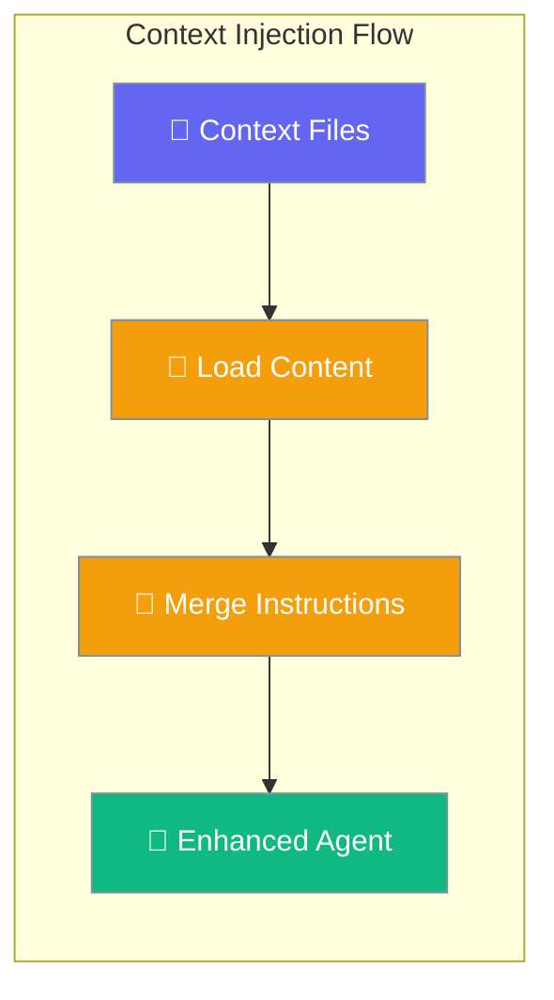
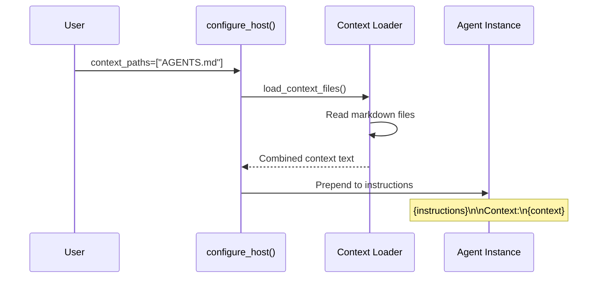

Context files allow you to automatically inject markdown content into your agent's instructions using AGENTS.md-style files.



## Quick Start

<Steps>
<Step title="Create Context Files">

Create markdown files with context information:

```markdown
# AGENTS.md
## Company Guidelines
- Always be professional and helpful
- Focus on customer satisfaction
- Use clear, concise language

## Product Information
Our main products include:
- AI Assistant Platform
- Workflow Automation Tools
- Data Analytics Dashboard
```

</Step>

<Step title="Configure Context Injection">

Use `context_paths` to inject the content:

```python
from praisonaiagents import Agent
from praisonai.integration import configure_host

agent = Agent(
    name="Customer Support",
    instructions="Help customers with their questions"
)

configure_host(
    agents=[agent],
    context_paths=["AGENTS.md", "STYLE.md"],
    style="dashboard"
)
```

</Step>
</Steps>

---

## How It Works

Context files are merged into agent instructions during host configuration:



The content is merged using this pattern:

```
{original_instructions}

Context:
{context_file_content}
```

---

## Configuration Options

### Default File Discovery

If no `context_paths` specified, these files are automatically checked:

| Path | Description |
|------|-------------|
| `AGENTS.md` | Primary agent context file |
| `agents.md` | Alternative naming |
| `.agents/AGENTS.md` | Hidden directory structure |

### Custom Context Paths

Specify your own context files:

```python
configure_host(
    context_paths=[
        "docs/guidelines.md",
        "config/style-guide.md", 
        "knowledge/product-info.md"
    ]
)
```

### Context Loading Behavior

```python
# Silent fallback when module unavailable
try:
    from praisonai.integration.context_files import load_context_files
    context = load_context_files(paths)
except ImportError:
    # No-op when context_files not available
    context = ""
```

---

## File Structure Examples

### Basic AGENTS.md

```markdown
# Agent Context

## Role Definition
You are a customer support specialist with deep knowledge of our products.

## Communication Style
- Be friendly and professional
- Use active voice
- Keep responses under 150 words unless detailed explanation needed

## Knowledge Areas
- Product features and pricing
- Technical troubleshooting
- Account management procedures
```

### Multi-File Setup

```
project/
├── AGENTS.md          # Primary context
├── STYLE.md           # Communication guidelines  
├── docs/
│   └── products.md    # Product information
└── .agents/
    └── internal.md    # Internal guidelines
```

```python
configure_host(
    context_paths=[
        "AGENTS.md",
        "STYLE.md", 
        "docs/products.md",
        ".agents/internal.md"
    ]
)
```

---

## Common Patterns

### Environment-Specific Context

```python
import os

context_files = ["AGENTS.md"]

# Add environment-specific context
env = os.getenv("ENVIRONMENT", "development")
if env == "production":
    context_files.append("production-guidelines.md")
else:
    context_files.append("dev-guidelines.md")

configure_host(context_paths=context_files)
```

### Conditional Context Loading

```python
def get_context_files(agent_type):
    base_files = ["AGENTS.md"]
    
    if agent_type == "support":
        base_files.append("support-protocols.md")
    elif agent_type == "sales":
        base_files.append("sales-playbook.md")
    
    return base_files

configure_host(
    context_paths=get_context_files("support")
)
```

### Hierarchical Context

```markdown
# base-context.md
## Universal Guidelines
All agents should follow these principles...

# specialized-context.md
## Support-Specific Guidelines
When handling support tickets...

# team-context.md  
## Team Information
Our support team includes...
```

---

## Best Practices

<AccordionGroup>

<Accordion title="File Organization">
Structure your context files for maintainability:

```
context/
├── base/
│   ├── guidelines.md     # Universal principles
│   └── style.md         # Communication style
├── roles/
│   ├── support.md       # Role-specific context
│   └── sales.md         # Role-specific context  
└── knowledge/
    ├── products.md      # Product information
    └── policies.md      # Company policies
```
</Accordion>

<Accordion title="Content Structure">
Keep context files focused and well-organized:

```markdown
# Context File Template

## Core Role
Brief description of the agent's primary function

## Guidelines  
- Key behavioral guidelines
- Communication principles
- Quality standards

## Knowledge Areas
Relevant domain knowledge the agent should reference

## Examples
Sample interactions or responses when helpful
```
</Accordion>

<Accordion title="Content Management">
Version control your context files:

```bash
# Track context changes
git add AGENTS.md STYLE.md
git commit -m "Update agent communication guidelines"

# Review context impact
git diff HEAD~1 context/
```
</Accordion>

<Accordion title="Testing Context Changes">
Validate context injection in development:

```python
# Test context loading
from praisonai.integration.context_files import load_context_files

context = load_context_files(["AGENTS.md", "STYLE.md"])
print("Loaded context length:", len(context))
print("Preview:", context[:200])
```
</Accordion>

</AccordionGroup>

---

## Related

<CardGroup cols={2}>
<Card title="Host Integration" icon="plug" href="/docs/features/host-integration">
  Configure context injection
</Card>
<Card title="Integration Patterns" icon="diagram-project" href="/docs/features/integration-patterns">
  Deployment patterns
</Card>
</CardGroup>