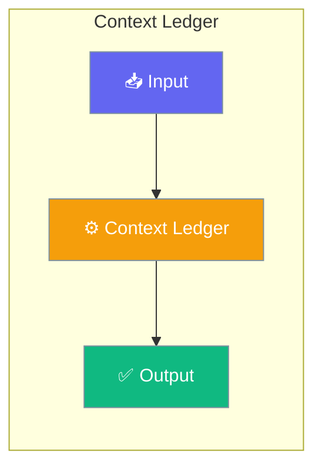

# Context Ledger

The Context Ledger tracks token usage across different context segments, enabling precise budget monitoring and optimization decisions.




## Quick Start


<Steps>
<Step title="Quick Start">
```python
from praisonaiagents import ContextLedgerManager

# Create ledger
ledger = ContextLedgerManager()

# Track different segments
ledger.track_system_prompt("You are a helpful AI assistant.")
ledger.track_history([
    {"role": "user", "content": "Hello"},
    {"role": "assistant", "content": "Hi there!"},
])

# Get totals
total = ledger.get_total()
print(f"Total tokens: {total}")
```
</Step>
</Steps>


## Best Practices

<AccordionGroup>
  <Accordion title="Start simple">
    Enable the feature with a single parameter before adding configuration. Verify it works, then layer in options.
  </Accordion>
  <Accordion title="Use environment variables for secrets">
    Never hardcode API keys or tokens. Use `os.getenv("KEY_NAME")` to read from environment variables.
  </Accordion>
  <Accordion title="Test with minimal examples first">
    Copy the Quick Start example, run it, then extend it. This confirms your environment is set up correctly.
  </Accordion>
  <Accordion title="Check the logs">
    Set `verbose=True` on your agent to see detailed execution logs when debugging unexpected behavior.
  </Accordion>
</AccordionGroup>

## Related

<CardGroup cols={2}>
  <Card title="Features Overview" icon="grid-2" href="/docs/features">
    Browse all PraisonAI features
  </Card>
  <Card title="Quick Start" icon="rocket" href="/docs/introduction">
    Get started with PraisonAI agents
  </Card>
</CardGroup>
