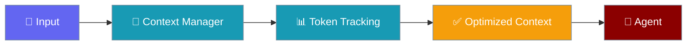

The Context Ledger tracks token usage across different context segments, enabling precise budget monitoring and optimization decisions.




## Quick Start

<Steps>
<Step title="Basic Usage">
```python
from praisonaiagents import ContextLedgerManager

# Create ledger
ledger = ContextLedgerManager()

# Track different segments
ledger.track_system_prompt("You are a helpful AI assistant.")
ledger.track_history([
    {"role": "user", "content": "Hello"},
    {"role": "assistant", "content": "Hi there!"},
])

# Get totals
total = ledger.get_total()
print(f"Total tokens: {total}")
```
</Step>
</Steps>


## Tracked Segments

| Segment | Description |
|---------|-------------|
| `system_prompt` | Agent instructions |
| `rules` | Workspace rules (.praisonrules) |
| `skills` | Skill definitions |
| `memory` | Persistent memory context |
| `tools_schema` | Tool/function definitions |
| `history` | Conversation messages |
| `tool_outputs` | Tool call results |
| `buffer` | Safety margin |

## API Reference

### Track Segments

```python
ledger = ContextLedgerManager()

# Track system prompt
ledger.track_system_prompt("You are helpful.")

# Track rules
ledger.track_rules("Always be concise.")

# Track skills
ledger.track_skills("Skill: code-review...")

# Track memory
ledger.track_memory("User prefers Python.")

# Track tools
ledger.track_tools([{"name": "read_file", ...}])

# Track history
ledger.track_history(messages)

# Track tool outputs
ledger.track_tool_output("File contents here...")
```

### Get Totals

```python
# Total tokens
total = ledger.get_total()

# Get underlying ledger data
ledger_data = ledger.get_ledger()
print(f"System: {ledger_data.system_prompt}")
print(f"History: {ledger_data.history}")
print(f"Tools: {ledger_data.tools_schema}")
```

### Reset

```python
# Reset all counts
ledger.reset()

# Reset specific segment
ledger.reset_history()
```

## ContextLedger Data Class

```python
from praisonaiagents import ContextLedger

ledger = ContextLedger(
    system_prompt=500,
    rules=100,
    skills=200,
    memory=300,
    tools_schema=1000,
    history=5000,
    tool_outputs=2000,
    buffer=500,
)

# Get total
total = ledger.total  # 9600

# Convert to dict
data = ledger.to_dict()
```

## Multi-Agent Ledger

For multi-agent scenarios, use `MultiAgentLedger` for per-agent isolation:

```python
from praisonaiagents import MultiAgentLedger

multi_ledger = MultiAgentLedger()

# Get ledger for each agent
researcher = multi_ledger.get_agent_ledger("researcher")
writer = multi_ledger.get_agent_ledger("writer")

# Track independently
researcher.track_system_prompt("You are a researcher.")
writer.track_system_prompt("You are a writer.")

# Get per-agent totals
print(f"Researcher: {researcher.get_total()}")
print(f"Writer: {writer.get_total()}")

# Get combined total
total = multi_ledger.get_combined_total()
```

## CLI Usage

```bash
# View ledger stats in session
/context stats
```

Output:
```
Token Ledger
────────────────────────────────
System Prompt:     1,250 tokens
Rules:               320 tokens
Skills:                0 tokens
Memory:              450 tokens
Tools Schema:      1,800 tokens
History:          45,000 tokens
Tool Outputs:     18,000 tokens
────────────────────────────────
TOTAL:            66,820 tokens
```

## Integration with Budgeter

```python
from praisonaiagents import ContextBudgeter, ContextLedgerManager

budgeter = ContextBudgeter(model="gpt-4o-mini")
budget = budgeter.allocate()

ledger = ContextLedgerManager()
# ... track segments ...

# Check utilization
current = ledger.get_total()
utilization = budgeter.get_utilization(current)

if utilization > 0.8:
    print("Warning: Approaching context limit!")
```

## Next Steps

- [Context Budgeter](/docs/features/context-budgeter) - Set up budgets
- [Context Optimizer](/docs/features/optimizer) - Reduce when over budget
## Best Practices

<AccordionGroup>
<Accordion title="Set budgets before overflowing">
Configure context budgets proactively — waiting until the context window fills causes silent truncation or errors.
</Accordion>
<Accordion title="Use compression for long sessions">
Enable context compression for conversations expected to exceed 50% of the model's context window.
</Accordion>
<Accordion title="Monitor token counts">
Use the context monitor during development to understand real usage before deploying to production.
</Accordion>
</AccordionGroup>

## Related

<CardGroup cols={2}>
<Card title="Context Monitor" icon="chart-line" href="/docs/features/context-monitor">
  Monitor token usage
</Card>
<Card title="Context Budgeter" icon="gauge" href="/docs/features/context-budgeter">
  Budget tokens
</Card>
</CardGroup>
