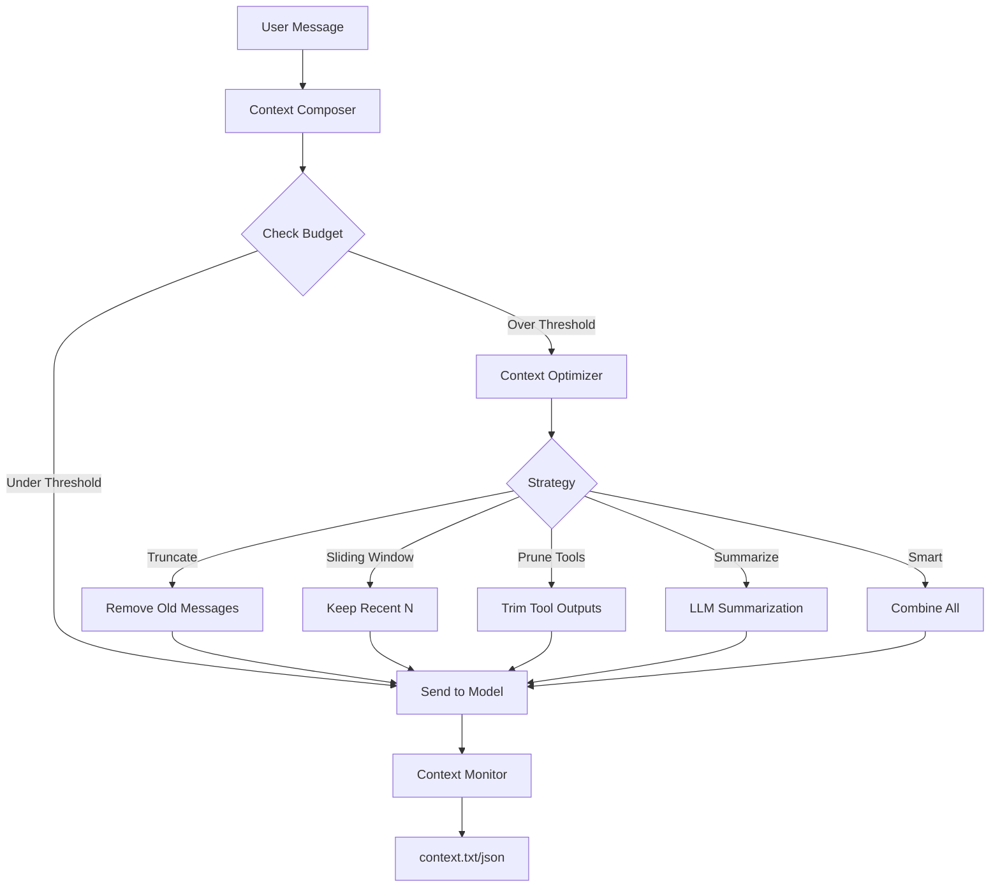

# Context Management

PraisonAI provides a complete context management system that prevents context overflow, optimizes token usage, and provides real-time visibility into what's being sent to the model.

## Overview



## Core Components

| Component | Purpose |
|-----------|---------|
| **Token Estimation** | Fast offline token counting |
| **Context Ledger** | Token accounting per segment |
| **Context Budgeter** | Model limits and budget allocation |
| **Context Composer** | Message assembly with limits |
| **Context Optimizer** | Compaction strategies |
| **Context Monitor** | Real-time disk snapshots |

## Agent-Centric Quick Start

The simplest way to enable context management is with the `context=` parameter:

```python
from praisonaiagents import Agent

# Enable context management with safe defaults
agent = Agent(
    instructions="You are a helpful assistant.",
    context=True,  # Enable with defaults
)

# The agent now automatically:
# - Tracks token usage
# - Optimizes when approaching limits (80% threshold)
# - Uses smart optimization strategy

response = agent.chat("Hello!")
```

### Custom Configuration

```python
from praisonaiagents import Agent
from praisonaiagents.context import ManagerConfig

# Custom context configuration
config = ManagerConfig(
    auto_compact=True,
    compact_threshold=0.7,  # Trigger at 70%
    strategy="smart",
    monitor_enabled=True,
    monitor_path="./context.txt",
)

agent = Agent(
    instructions="You are helpful.",
    context=config,
)
```

### Low-Level API (Advanced)

```python
from praisonaiagents.context import (
    ContextBudgeter,
    ContextLedgerManager,
    get_optimizer,
    OptimizerStrategy,
)

# Create budgeter for your model
budgeter = ContextBudgeter(model="gpt-4o-mini")
budget = budgeter.allocate()
print(f"Usable context: {budget.usable:,} tokens")

# Track token usage
ledger = ContextLedgerManager()
ledger.track_system_prompt("You are a helpful assistant.")
ledger.track_history(messages)
print(f"Total used: {ledger.get_total()} tokens")

# Optimize when needed
optimizer = get_optimizer(OptimizerStrategy.SMART)
optimized, stats = optimizer.optimize(messages, target_tokens=50000)
```

### CLI Interactive Mode

```bash
# Enable context monitoring
praisonai chat --context-monitor

# Use specific optimization strategy
praisonai chat --context-strategy smart --context-threshold 0.8

# View context stats in session
/context stats
/context budget
/context dump
```

## Features

<CardGroup cols={2}>
  <Card title="Token Estimation" icon="calculator" href="/docs/features/context-token-estimation">
    Fast offline token counting with heuristic fallback
  </Card>
  <Card title="Context Ledger" icon="book" href="/docs/features/context-ledger">
    Per-segment token accounting
  </Card>
  <Card title="Context Budgeter" icon="coins" href="/docs/features/context-budgeter">
    Model limits and budget allocation
  </Card>
  <Card title="Context Optimizer" icon="compress" href="/docs/features/context-optimizer">
    6 optimization strategies
  </Card>
  <Card title="Context Monitor" icon="eye" href="/docs/features/context-monitor">
    Real-time context snapshots
  </Card>
  <Card title="CLI Commands" icon="terminal" href="/docs/features/context-api">
    /context commands and flags
  </Card>
</CardGroup>

## CLI Flags

| Flag | Description | Default |
|------|-------------|---------|
| `--context-auto-compact` | Enable automatic compaction | `true` |
| `--context-strategy` | Optimization strategy | `smart` |
| `--context-threshold` | Trigger threshold (0.0-1.0) | `0.8` |
| `--context-monitor` | Enable monitoring | `false` |
| `--context-monitor-path` | Output file path | `./context.txt` |
| `--context-monitor-format` | Output format | `human` |
| `--context-output-reserve` | Reserve for output | `8000` |

## Environment Variables

```bash
PRAISONAI_CONTEXT_AUTO_COMPACT=true
PRAISONAI_CONTEXT_STRATEGY=smart
PRAISONAI_CONTEXT_THRESHOLD=0.8
PRAISONAI_CONTEXT_MONITOR=true
PRAISONAI_CONTEXT_MONITOR_PATH=./context.txt
PRAISONAI_CONTEXT_MONITOR_FORMAT=human
PRAISONAI_CONTEXT_REDACT=true
```

## Interactive Commands

| Command | Description |
|---------|-------------|
| `/context` | Show context stats |
| `/context show` | Summary + budgets |
| `/context stats` | Token ledger table |
| `/context budget` | Budget allocation |
| `/context dump` | Write snapshot now |
| `/context on` | Enable monitoring |
| `/context off` | Disable monitoring |
| `/context compact` | Trigger optimization |

## Multi-Agent Support

```python
from praisonaiagents.context import MultiAgentLedger, MultiAgentMonitor

# Per-agent context isolation
multi_ledger = MultiAgentLedger()
researcher = multi_ledger.get_agent_ledger("researcher")
writer = multi_ledger.get_agent_ledger("writer")

# Per-agent monitoring
multi_monitor = MultiAgentMonitor(base_path="./context/")
```

## Next Steps

- [Token Estimation](/docs/features/context-token-estimation) - Learn about fast token counting
- [Context Optimizer](/docs/features/context-optimizer) - Explore optimization strategies
- [Context Monitor](/docs/features/context-monitor) - Set up real-time monitoring
