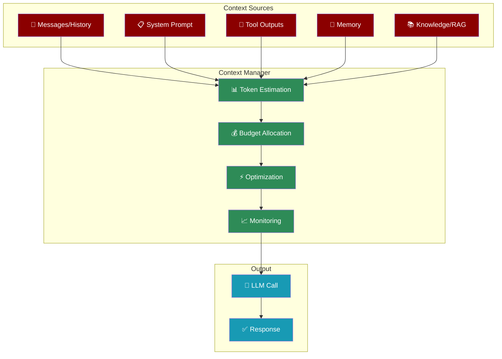

# AI Agents with Context Management

<Tip>
**Looking for codebase analysis and PRP generation?** See [ContextAgent](/agents/context-agent) for Context Engineering.
This page covers **Context Window Management** - token budgeting, compaction, and overflow prevention.
</Tip>

PraisonAI provides **industry-leading context management** with features no other framework offers: LLM-driven compression with session lineage and intelligent conversation compaction.


```mermaid
flowchart TB
    subgraph "Context Sources"
        direction TB
        MSG[💬 Messages/History]
        SYS[📋 System Prompt]
        TOOL[🔧 Tool Outputs]
        MEM[🧠 Memory]
        RAG[📚 Knowledge/RAG]
    end

    subgraph "Context Manager"
        direction TB
        EST[📊 Token Estimation]
        BUD[💰 Budget Allocation]
        OPT[⚡ Optimization]
        MON[📈 Monitoring]
    end

    subgraph "Output"
        direction TB
        LLM[🤖 LLM Call]
        RES[✅ Response]
    end

    MSG --> EST
    SYS --> EST
    TOOL --> EST
    MEM --> EST
    RAG --> EST

    EST --> BUD
    BUD --> OPT
    OPT --> MON
    MON --> LLM
    LLM --> RES

    style MSG fill:#8B0000,color:#fff
    style SYS fill:#8B0000,color:#fff
    style TOOL fill:#8B0000,color:#fff
    style MEM fill:#8B0000,color:#fff
    style RAG fill:#8B0000,color:#fff
    style EST fill:#2E8B57,color:#fff
    style BUD fill:#2E8B57,color:#fff
    style OPT fill:#2E8B57,color:#fff
    style MON fill:#2E8B57,color:#fff
    style LLM fill:#189AB4,color:#fff
    style RES fill:#189AB4,color:#fff
```

| Feature | PraisonAI | LangChain | CrewAI | Agno |
|---------|:---------:|:---------:|:------:|:----:|
| Smart Defaults | ✅ | ❌ | ❌ | ❌ |
| Lazy Loading (0ms overhead) | ✅ | ❌ | ❌ | ❌ |
| 6 Compaction Strategies | ✅ | ❌ | ❌ | ❌ |
| Benefit Checking | ✅ | ❌ | ❌ | ❌ |
| Auto-Compaction | ✅ | ❌ | ❌ | ❌ |
| Per-Tool Token Budgets | ✅ | ❌ | ❌ | ❌ |
| Session Deduplication | ✅ | ❌ | ❌ | ⚠️ |
| LLM Summarization | ✅ | ⚠️ | ❌ | ❌ |
| Session Tracking | ✅ | ❌ | ❌ | ✅ |
| Multi-Memory Aggregation | ✅ | ❌ | ✅ | ❌ |

## Quick Start


<Steps>
<Step title="Simple Usage">
<CodeGroup>
```python Basic
from praisonaiagents import Agent

# Enable context management with defaults
agent = Agent(
    instructions="You are a helpful assistant",
    context=True  # Auto-compact at 80% utilization
)
```
</Step>

<Step title="With Configuration">
```python Custom Config
from praisonaiagents import Agent, ContextConfig

# Custom configuration
agent = Agent(
    instructions="You are a helpful assistant",
    context=ContextConfig(
        auto_compact=True,
        compact_threshold=0.8,
        keep_recent_turns=5,
        session_tracking=True,      # Track goal/plan/progress
        aggregate_memory=True,      # Concurrent multi-memory fetch
    )
)
```
</CodeGroup>

### With Workflows (Python)

```python
from praisonaiagents import AgentFlow, Task, ContextConfig

# Workflow with context management
workflow = AgentFlow(
    steps=[...],
    context=True,  # Enable with defaults
)

# Or with custom config
workflow = AgentFlow(
    steps=[...],
    context=ContextConfig(
        auto_compact=True,
        compact_threshold=0.8,
        strategy="smart",
        tool_output_max=10000,  # Limit tool outputs (e.g., search results)
    ),
)
```

### With YAML Workflows

```yaml
name: Research Workflow
context: true  # Enable auto-compaction

# Or detailed config
context:
  auto_compact: true
  compact_threshold: 0.8
  strategy: smart
  tool_output_max: 10000

agents:
  researcher:
    role: Researcher
    tools:
      - tavily_search

steps:
  - agent: researcher
    action: "Research {{topic}}"
```

<Tip>
**For tool-heavy workflows**: Always enable `context: true` to prevent token overflow from large search results.
</Tip>

---
</Step>
</Steps>


## Best Practices

<AccordionGroup>
  <Accordion title="Start simple">
    Enable the feature with a single parameter before adding configuration. Verify it works, then layer in options.
  </Accordion>
  <Accordion title="Use environment variables for secrets">
    Never hardcode API keys or tokens. Use `os.getenv("KEY_NAME")` to read from environment variables.
  </Accordion>
  <Accordion title="Test with minimal examples first">
    Copy the Quick Start example, run it, then extend it. This confirms your environment is set up correctly.
  </Accordion>
  <Accordion title="Check the logs">
    Set `verbose=True` on your agent to see detailed execution logs when debugging unexpected behavior.
  </Accordion>
</AccordionGroup>

## Related

<CardGroup cols={2}>
  <Card title="Features Overview" icon="grid-2" href="/docs/features">
    Browse all PraisonAI features
  </Card>
  <Card title="Quick Start" icon="rocket" href="/docs/introduction">
    Get started with PraisonAI agents
  </Card>
</CardGroup>
