# AI Agents with Context Management

<Tip>
**Looking for codebase analysis and PRP generation?** See [ContextAgent](/agents/context-agent) for Context Engineering.
This page covers **Context Window Management** - token budgeting, compaction, and overflow prevention.
</Tip>

PraisonAI provides **industry-leading context management** with features no other framework offers.

```mermaid
flowchart TB
    subgraph "Context Sources"
        direction TB
        MSG[💬 Messages/History]
        SYS[📋 System Prompt]
        TOOL[🔧 Tool Outputs]
        MEM[🧠 Memory]
        RAG[📚 Knowledge/RAG]
    end

    subgraph "Context Manager"
        direction TB
        EST[📊 Token Estimation]
        BUD[💰 Budget Allocation]
        OPT[⚡ Optimization]
        MON[📈 Monitoring]
    end

    subgraph "Output"
        direction TB
        LLM[🤖 LLM Call]
        RES[✅ Response]
    end

    MSG --> EST
    SYS --> EST
    TOOL --> EST
    MEM --> EST
    RAG --> EST

    EST --> BUD
    BUD --> OPT
    OPT --> MON
    MON --> LLM
    LLM --> RES

    style MSG fill:#8B0000,color:#fff
    style SYS fill:#8B0000,color:#fff
    style TOOL fill:#8B0000,color:#fff
    style MEM fill:#8B0000,color:#fff
    style RAG fill:#8B0000,color:#fff
    style EST fill:#2E8B57,color:#fff
    style BUD fill:#2E8B57,color:#fff
    style OPT fill:#2E8B57,color:#fff
    style MON fill:#2E8B57,color:#fff
    style LLM fill:#189AB4,color:#fff
    style RES fill:#189AB4,color:#fff
```



| Feature | PraisonAI | LangChain | CrewAI | Agno |
|---------|-----------|-----------|--------|------|
| 6 compaction strategies | ✅ | ❌ | ❌ | ❌ |
| Benefit checking | ✅ | ❌ | ❌ | ❌ |
| Auto-compaction | ✅ | ❌ | ❌ | ❌ |
| Per-tool token budgets | ✅ | ❌ | ❌ | ❌ |
| Session tracking | ✅ | ❌ | ❌ | ✅ |
| Multi-memory aggregation | ✅ | ❌ | ✅ | ❌ |

## Quick Start

<CodeGroup>
```python Basic
from praisonaiagents import Agent

# Enable context management with defaults
agent = Agent(
    instructions="You are a helpful assistant",
    context=True  # Auto-compact at 80% utilization
)
```

```python Custom Config
from praisonaiagents import Agent, ContextConfig

# Custom configuration
agent = Agent(
    instructions="You are a helpful assistant",
    context=ContextConfig(
        auto_compact=True,
        compact_threshold=0.8,
        keep_recent_turns=5,
        session_tracking=True,      # Track goal/plan/progress
        aggregate_memory=True,      # Concurrent multi-memory fetch
    )
)
```
</CodeGroup>

### With Workflows (Python)

```python
from praisonaiagents import Workflow, WorkflowStep, ContextConfig

# Workflow with context management
workflow = Workflow(
    steps=[...],
    context=True,  # Enable with defaults
)

# Or with custom config
workflow = Workflow(
    steps=[...],
    context=ContextConfig(
        auto_compact=True,
        compact_threshold=0.8,
        strategy="smart",
        tool_output_max=10000,  # Limit tool outputs (e.g., search results)
    ),
)
```

### With YAML Workflows

```yaml
name: Research Workflow
context: true  # Enable auto-compaction

# Or detailed config
context:
  auto_compact: true
  compact_threshold: 0.8
  strategy: smart
  tool_output_max: 10000

agents:
  researcher:
    role: Researcher
    tools:
      - tavily_search

steps:
  - agent: researcher
    action: "Research {{topic}}"
```

<Tip>
**For tool-heavy workflows**: Always enable `context: true` to prevent token overflow from large search results.
</Tip>

---

## How Context Decisions Are Made

The Context Manager automatically decides how to handle context based on utilization and strategy:


---

## Compaction Strategies

```mermaid
flowchart LR
    subgraph "Choose Strategy Based On..."
        direction TB
        SPEED[⚡ Speed Priority] --> TRUNCATE[TRUNCATE]
        RECENT[📜 Recency Priority] --> SLIDING[SLIDING_WINDOW]
        QUALITY[🎯 Quality Priority] --> SUMMARIZE[SUMMARIZE]
        BALANCE[⚖️ Balance] --> SMART[SMART]
        TOOLS[🔧 Large Tool Outputs] --> PRUNE[PRUNE_TOOLS]
        SAFE[🛡️ Safety First] --> NONDEST[NON_DESTRUCTIVE]
    end

    style SPEED fill:#8B0000,color:#fff
    style RECENT fill:#8B0000,color:#fff
    style QUALITY fill:#8B0000,color:#fff
    style BALANCE fill:#8B0000,color:#fff
    style TOOLS fill:#8B0000,color:#fff
    style SAFE fill:#8B0000,color:#fff
```



| Strategy | Description | Best For |
|----------|-------------|----------|
| `TRUNCATE` | Remove oldest messages | Speed, simple conversations |
| `SLIDING_WINDOW` | Keep last N turns | Recency-focused tasks |
| `SUMMARIZE` | LLM summarizes old context | Quality preservation |
| `SMART` | Importance-based (combines strategies) | General use (default) |
| `PRUNE_TOOLS` | Truncate old tool outputs | Tool-heavy agents |
| `NON_DESTRUCTIVE` | Only prune tools, keep history | Safety-critical |

```python
from praisonaiagents import Agent, ContextConfig, OptimizerStrategy

agent = Agent(
    instructions="You are a helpful assistant",
    context=ContextConfig(
        strategy=OptimizerStrategy.SLIDING_WINDOW,
        keep_recent_turns=10,
    )
)
```

---

## Session Tracking

Track conversation state (goal, plan, progress) across turns - inspired by Agno's SessionContextStore:

```mermaid
flowchart TB
    subgraph "Session Lifecycle"
        direction TB
        INIT[🚀 Initialize Session] --> GOAL[🎯 Set Goal]
        GOAL --> PLAN[📋 Define Plan]
        PLAN --> EXEC[⚡ Execute Steps]
        EXEC --> PROGRESS[✅ Track Progress]
        PROGRESS --> EXEC
        PROGRESS --> DONE[🏁 Complete]
    end

    subgraph "Session State"
        direction TB
        S_SUMMARY[📝 Summary]
        S_GOAL[🎯 Goal]
        S_PLAN[📋 Plan Steps]
        S_PROGRESS[✅ Completed]
    end

    INIT --> S_SUMMARY
    GOAL --> S_GOAL
    PLAN --> S_PLAN
    EXEC --> S_PROGRESS

    style INIT fill:#8B0000,color:#fff
    style GOAL fill:#8B0000,color:#fff
    style PLAN fill:#8B0000,color:#fff
    style EXEC fill:#2E8B57,color:#fff
    style PROGRESS fill:#2E8B57,color:#fff
    style DONE fill:#189AB4,color:#fff
```



```python
from praisonaiagents.context import SessionContextTracker

# Create tracker
tracker = SessionContextTracker(
    session_id="user123",
    track_summary=True,
    track_goal=True,
    track_plan=True,
    track_progress=True,
)

# Update state
tracker.update_goal("Build a Python web app")
tracker.update_plan([
    "1. Create Flask project",
    "2. Add routes",
    "3. Add database",
    "4. Deploy"
])

# Mark progress
tracker.add_progress("Created Flask project")
tracker.add_progress("Added routes")

# Get context for prompt
context = tracker.to_system_prompt_section()
print(context)
```

**Output:**
```xml
<session_context>
This is a continuation of an ongoing session. Here's where things stand:

**User's Goal**: Build a Python web app

**Plan**:
  1. Create Flask project
  2. Add routes
  3. Add database
  4. Deploy

**Progress**:
  ✓ Created Flask project
  ✓ Added routes

<session_context_guidelines>
Use this context to maintain continuity:
- Reference earlier decisions and conclusions naturally
- Don't re-ask questions that have already been answered
- Build on established understanding rather than starting fresh
</session_context_guidelines>
</session_context>
```

---

## Multi-Memory Aggregation

Fetch context from multiple sources concurrently - inspired by CrewAI's ContextualMemory:

```mermaid
flowchart TB
    QUERY[🔍 Query] --> AGG[📦 Context Aggregator]
    
    AGG --> |concurrent| MEM[🧠 Short-term Memory]
    AGG --> |concurrent| KNOW[📚 Knowledge Base]
    AGG --> |concurrent| RAG[🔍 RAG Retrieval]
    
    MEM --> MERGE[🔀 Merge & Truncate]
    KNOW --> MERGE
    RAG --> MERGE
    
    MERGE --> TOKEN{Tokens<br/>≤ Budget?}
    TOKEN -->|Yes| OUT[✅ Aggregated Context]
    TOKEN -->|No| TRUNC[✂️ Truncate by Priority]
    TRUNC --> OUT

    style QUERY fill:#8B0000,color:#fff
    style AGG fill:#2E8B57,color:#fff
    style MEM fill:#189AB4,color:#fff
    style KNOW fill:#189AB4,color:#fff
    style RAG fill:#189AB4,color:#fff
    style MERGE fill:#2E8B57,color:#fff
    style OUT fill:#189AB4,color:#fff
```



```python
from praisonaiagents.context import ContextAggregator
import asyncio

# Create aggregator
aggregator = ContextAggregator(max_tokens=4000)

# Register sources with priorities (lower = higher priority)
aggregator.register_source("memory", memory.search_short_term, priority=10)
aggregator.register_source("knowledge", knowledge.search, priority=20)
aggregator.register_source("rag", rag.retrieve, priority=30)

# Aggregate (async)
async def get_context(query):
    result = await aggregator.aggregate(query)
    print(f"Sources: {result.sources_used}")
    print(f"Tokens: {result.tokens_used}")
    return result.context

# Or sync
result = aggregator.aggregate_sync("user question")
print(result.context)
```

---

## ContextConfig Options

| Parameter | Type | Default | Description |
|-----------|------|---------|-------------|
| `auto_compact` | bool | `True` | Enable automatic compaction |
| `compact_threshold` | float | `0.8` | Trigger at 80% utilization |
| `strategy` | OptimizerStrategy | `SMART` | Compaction strategy |
| `output_reserve` | int | `8000` | Tokens reserved for output |
| `history_ratio` | float | `0.6` | History budget ratio |
| `tool_output_max` | int | `10000` | Max tokens per tool output |
| `keep_recent_turns` | int | `5` | Recent turns to always keep |
| `session_tracking` | bool | `False` | Enable goal/plan/progress |
| `aggregate_memory` | bool | `False` | Enable multi-memory fetch |

---

## Monitoring Context Usage

```python
from praisonaiagents import Agent
from praisonaiagents.context import ContextConfig, MonitorConfig

# Enable context monitoring
agent = Agent(
    instructions="You are a helpful assistant",
    context=ContextConfig(
        monitor=MonitorConfig(
            enabled=True,
            path="./context_logs/",
            format="human",  # or "json"
            frequency="turn",  # or "tool_call", "overflow"
            redact_sensitive=True,
        )
    )
)
```

---

## Migration from ContextAgent

<Warning>
`ContextAgent` has been removed. Use the `context=` parameter instead.
</Warning>

**Before (removed):**
```python
# DON'T DO THIS - ContextAgent is removed
from praisonaiagents import ContextAgent
agent = ContextAgent(...)  # ❌ ImportError
```

**After (correct):**
```python
from praisonaiagents import Agent
from praisonaiagents.context import ContextConfig

agent = Agent(
    instructions="You are helpful",
    context=ContextConfig(
        session_tracking=True,
        aggregate_memory=True,
    )
)
```

---

## Code Search (FastContextAgent)

For fast code search with parallel execution, use `FastContextAgent`:

```python
from praisonaiagents.context.fast import FastContextAgent

# Create agent for code search
with FastContextAgent(
    workspace_path="/path/to/project",
    max_parallel=8,
    model="gpt-4o-mini"
) as agent:
    # Simple pattern search
    result = agent.search_simple("def main")
    
    # Intelligent LLM-powered search
    result = agent.search("Find all database connection handling")
    
    for match in result.matches[:5]:
        print(f"{match.file}:{match.line_number}")
```

---

## API Reference

### ContextConfig

Complete configuration for context management.

### SessionContextTracker

Tracks session state across turns:

| Method | Description |
|--------|-------------|
| `update_summary(str)` | Update conversation summary |
| `update_goal(str)` | Update user's objective |
| `update_plan(List[str])` | Update plan steps |
| `add_progress(str)` | Add completed step |
| `to_context_string()` | Get context as string |
| `to_system_prompt_section()` | Get formatted prompt section |

### ContextAggregator

Aggregates context from multiple sources:

| Method | Description |
|--------|-------------|
| `register_source(name, fn, priority)` | Register a context source |
| `aggregate(query, sources, max_tokens)` | Async aggregate |
| `aggregate_sync(query, sources, max_tokens)` | Sync aggregate |

### FastContextAgent

Fast parallel code search:

| Method | Description |
|--------|-------------|
| `search(query)` | LLM-powered intelligent search |
| `search_simple(query)` | Direct pattern search |
| `search_async(query)` | Async version |

---

## Next Steps

<CardGroup cols={2}>
  <Card title="Memory" icon="brain" href="/concepts/memory">
    Learn about memory types and storage options
  </Card>
  <Card title="Knowledge" icon="book" href="/concepts/knowledge">
    Add knowledge bases to your agents
  </Card>
  <Card title="RAG" icon="search" href="/rag/rag">
    Retrieval-Augmented Generation
  </Card>
  <Card title="Agents" icon="robot" href="/concepts/agents">
    Core agent concepts
  </Card>
</CardGroup>
