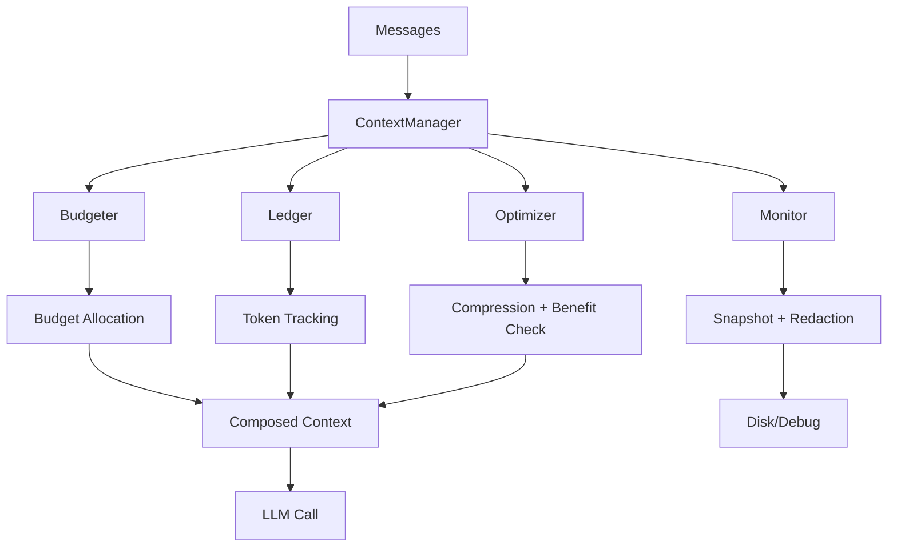

The `ContextManager` is the main entry point for context management in PraisonAI. It orchestrates budgeting, composition, optimization, and monitoring through a single unified interface.

## Quick Start

```python
from praisonaiagents.context import ContextManager, ManagerConfig

# Create manager with defaults
manager = ContextManager(model="gpt-4o-mini")

# Process messages through pipeline
result = manager.process(
    messages=conversation_history,
    system_prompt="You are a helpful assistant.",
    tools=tool_schemas,
)

# Get optimized messages
optimized = result["messages"]
print(f"Tokens saved: {result['tokens_saved']}")
```

## Architecture



## Configuration

### ManagerConfig

```python
from praisonaiagents.context import ManagerConfig, EstimationMode

config = ManagerConfig(
    # Auto-compaction
    auto_compact=True,
    compact_threshold=0.8,
    strategy="smart",
    
    # Compression benefit check
    compression_min_gain_pct=5.0,
    compression_max_attempts=3,
    
    # Budget
    output_reserve=8000,
    default_tool_output_max=10000,
    
    # Estimation
    estimation_mode=EstimationMode.HEURISTIC,
    log_estimation_mismatch=False,
    
    # Monitoring
    monitor_enabled=False,
    monitor_path="./context.txt",
    monitor_format="human",
    monitor_write_mode="sync",
    redact_sensitive=True,
)

manager = ContextManager(model="gpt-4o-mini", config=config)
```

### Environment Variables

| Variable | Default | Description |
|----------|---------|-------------|
| `PRAISONAI_CONTEXT_AUTO_COMPACT` | `true` | Enable auto-compaction |
| `PRAISONAI_CONTEXT_THRESHOLD` | `0.8` | Compact threshold (0-1) |
| `PRAISONAI_CONTEXT_STRATEGY` | `smart` | Optimization strategy |
| `PRAISONAI_CONTEXT_MONITOR` | `false` | Enable monitoring |
| `PRAISONAI_CONTEXT_ESTIMATION_MODE` | `heuristic` | Token estimation mode |

### Config Precedence

```
CLI flags > Environment variables > config.yaml > defaults
```

## Core Methods

### process()

Process messages through the full context pipeline:

```python
result = manager.process(
    messages=messages,
    system_prompt="System prompt",
    tools=tools,
    trigger="turn",  # turn, tool_call, manual, overflow
)

# Result contains:
# - messages: Optimized message list
# - optimized: bool - whether optimization occurred
# - tokens_before: int
# - tokens_after: int
# - tokens_saved: int
# - utilization: float (0-1)
# - warnings: List[str]
# - optimization_result: OptimizationResult or None
```

### capture_llm_boundary()

Capture exact state at LLM call boundary for debugging:

```python
hook_data = manager.capture_llm_boundary(messages, tools)

print(f"Message hash: {hook_data.message_hash}")
print(f"Tools hash: {hook_data.tools_hash}")
```

### get_stats()

Get current context statistics:

```python
stats = manager.get_stats()
print(f"Utilization: {stats['utilization']*100:.1f}%")
print(f"Warnings: {stats['warnings']}")
```

### get_resolved_config()

Get fully resolved configuration with source info:

```python
resolved = manager.get_resolved_config()
print(f"Source: {resolved['config']['source']}")
print(f"Precedence: {resolved['precedence']}")
```

### get_history()

Get optimization event history:

```python
history = manager.get_history()
for event in history:
    print(f"{event['timestamp']}: {event['event_type']}")
```

## Per-Tool Budgets

Set custom token budgets per tool:

```python
# Set budget for specific tool
manager.set_tool_budget("file_read", max_tokens=5000, protected=True)

# Get budget for tool
budget = manager.get_tool_budget("file_read")  # 5000

# Truncate output according to budget
truncated = manager.truncate_tool_output("file_read", large_output)
```

## Token Estimation

```python
# Basic estimation
tokens, metrics = manager.estimate_tokens(text)

# With validation (compares heuristic vs accurate)
tokens, metrics = manager.estimate_tokens(text, validate=True)

if metrics:
    print(f"Error: {metrics.error_pct:.1f}%")
```

## Snapshot Callbacks

Register callbacks for LLM boundary snapshots:

```python
def on_snapshot(hook_data):
    print(f"Snapshot at {hook_data.timestamp}")
    print(f"Messages: {len(hook_data.messages)}")

manager.register_snapshot_callback(on_snapshot)
```

## CLI Integration

```bash
# Show context stats
praisonai chat
> /context

# Show optimization history
> /context history

# Show resolved config
> /context config

# Trigger manual compaction
> /context compact
```

## Factory Function

Use `create_context_manager` for proper config precedence:

```python
from praisonaiagents.context import create_context_manager

manager = create_context_manager(
    model="gpt-4o-mini",
    config_file="config.yaml",
    cli_overrides={"auto_compact": False},
)
```
