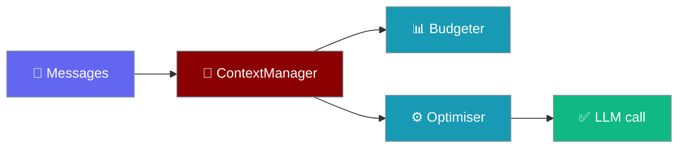
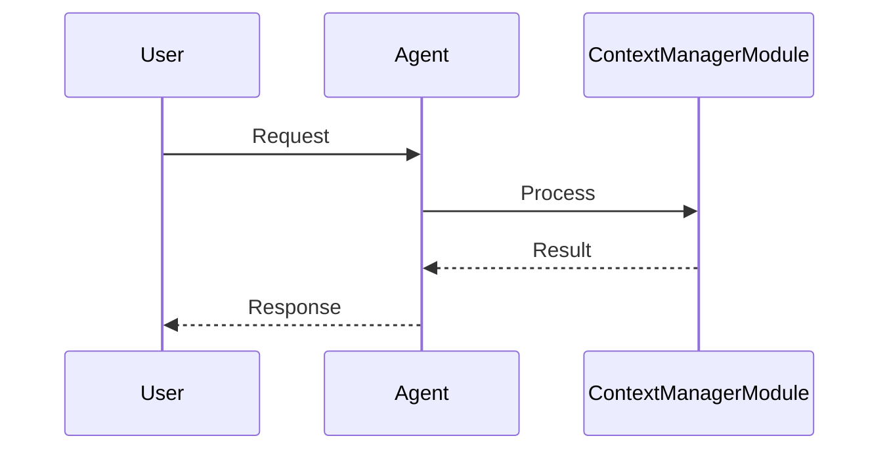
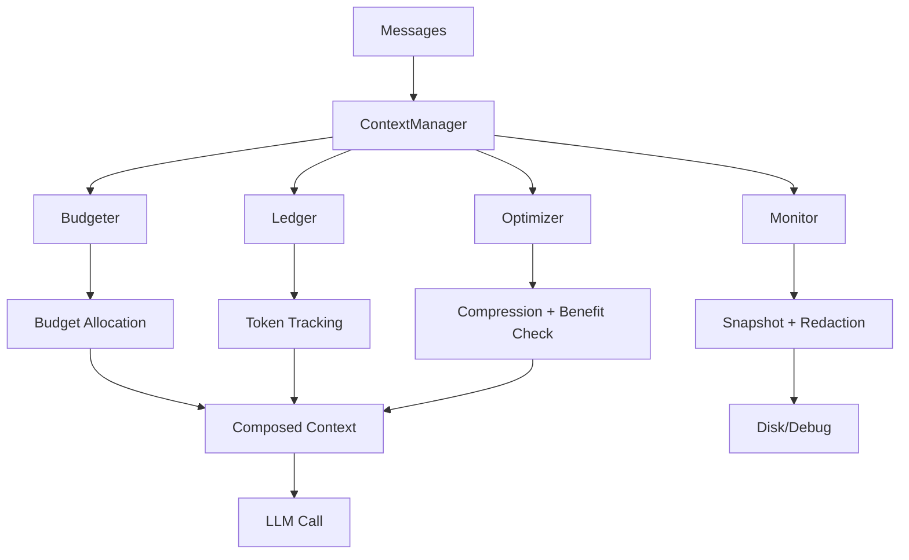

```python
from praisonaiagents import Agent

agent = Agent(
    name="managed-agent",
    instructions="Use the context manager module for precise control.",
    context_window=16000,
)
agent.start("Process this document while managing context carefully.")
```


The `ContextManager` orchestrates budgeting, composition, optimisation, and monitoring through one interface.

The user sends a large thread; the context manager budgets tokens and returns an optimised message list for the next LLM call.



```mermaid
graph LR
    Messages[💬 Messages] --> CM[🧠 ContextManager]
    CM --> Budget[📊 Budgeter]
    CM --> Opt[⚙️ Optimiser]
    Opt --> LLM[✅ LLM call]

    classDef agent fill:#8B0000,stroke:#7C90A0,color:#fff
    classDef tool fill:#189AB4,stroke:#7C90A0,color:#fff
    classDef ok fill:#10B981,stroke:#7C90A0,color:#fff
    classDef input fill:#6366F1,stroke:#7C90A0,color:#fff
    classDef agent fill:#8B0000,color:#fff
    classDef tool fill:#189AB4,color:#fff
    class Messages input
    class CM agent
    class Budget,Opt tool
    class LLM ok
```

## How It Works


```mermaid
sequenceDiagram
    participant User
    participant Agent
    participant ContextManagerModule

    User->>Agent: Request
    Agent->>ContextManagerModule: Process
    ContextManagerModule-->>Agent: Result
    Agent-->>User: Response
```


## Quick Start

<Steps>
  <Step title="Create a manager">
    ```python
    from praisonaiagents import ContextManager

    manager = ContextManager(model="gpt-4o-mini")
    ```
  </Step>
  <Step title="Process messages">
    ```python
    result = manager.process(
        messages=conversation_history,
        system_prompt="You are a helpful assistant.",
        tools=tool_schemas,
    )
    optimized = result["messages"]
    print(f"Tokens saved: {result['tokens_saved']}")
    ```
  </Step>
  <Step title="Inspect utilisation">
    ```python
    stats = manager.get_stats()
    print(f"Utilisation: {stats['utilization']*100:.1f}%")
    ```
  </Step>
</Steps>

## Architecture


```mermaid
graph TD
    A[Messages] --> B[ContextManager]
    B --> C[Budgeter]
    B --> D[Ledger]
    B --> E[Optimizer]
    B --> F[Monitor]
    C --> G[Budget Allocation]
    D --> H[Token Tracking]
    E --> I[Compression + Benefit Check]
    F --> J[Snapshot + Redaction]
    G --> K[Composed Context]
    H --> K
    I --> K
    J --> L[Disk/Debug]
    K --> M[LLM Call]
```

## Configuration

### ManagerConfig

```python
from praisonaiagents import ManagerConfig, EstimationMode

config = ManagerConfig(
    # Auto-compaction
    auto_compact=True,
    compact_threshold=0.8,
    strategy="smart",
    
    # Compression benefit check
    compression_min_gain_pct=5.0,
    compression_max_attempts=3,
    
    # Budget
    output_reserve=8000,
    default_tool_output_max=10000,
    
    # Estimation
    estimation_mode=EstimationMode.HEURISTIC,
    log_estimation_mismatch=False,
    
    # Monitoring
    monitor_enabled=False,
    monitor_path="./context.txt",
    monitor_format="human",
    monitor_write_mode="sync",
    redact_sensitive=True,
)

manager = ContextManager(model="gpt-4o-mini", config=config)
```

### Environment Variables

| Variable | Default | Description |
|----------|---------|-------------|
| `PRAISONAI_CONTEXT_AUTO_COMPACT` | `true` | Enable auto-compaction |
| `PRAISONAI_CONTEXT_THRESHOLD` | `0.8` | Compact threshold (0-1) |
| `PRAISONAI_CONTEXT_STRATEGY` | `smart` | Optimization strategy |
| `PRAISONAI_CONTEXT_MONITOR` | `false` | Enable monitoring |
| `PRAISONAI_CONTEXT_ESTIMATION_MODE` | `heuristic` | Token estimation mode |

### Config Precedence

```
CLI flags > Environment variables > config.yaml > defaults
```

## Core Methods

### process()

Process messages through the full context pipeline:

```python
result = manager.process(
    messages=messages,
    system_prompt="System prompt",
    tools=tools,
    trigger="turn",  # turn, tool_call, manual, overflow
)

# Result contains:
# - messages: Optimized message list
# - optimized: bool - whether optimization occurred
# - tokens_before: int
# - tokens_after: int
# - tokens_saved: int
# - utilization: float (0-1)
# - warnings: List[str]
# - optimization_result: OptimizationResult or None
```

### capture_llm_boundary()

Capture exact state at LLM call boundary for debugging:

```python
hook_data = manager.capture_llm_boundary(messages, tools)

print(f"Message hash: {hook_data.message_hash}")
print(f"Tools hash: {hook_data.tools_hash}")
```

### get_stats()

Get current context statistics:

```python
stats = manager.get_stats()
print(f"Utilization: {stats['utilization']*100:.1f}%")
print(f"Warnings: {stats['warnings']}")
```

### get_resolved_config()

Get fully resolved configuration with source info:

```python
resolved = manager.get_resolved_config()
print(f"Source: {resolved['config']['source']}")
print(f"Precedence: {resolved['precedence']}")
```

### get_history()

Get optimization event history:

```python
history = manager.get_history()
for event in history:
    print(f"{event['timestamp']}: {event['event_type']}")
```

## Per-Tool Budgets

Set custom token budgets per tool:

```python
# Set budget for specific tool
manager.set_tool_budget("file_read", max_tokens=5000, protected=True)

# Get budget for tool
budget = manager.get_tool_budget("file_read")  # 5000

# Truncate output according to budget
truncated = manager.truncate_tool_output("file_read", large_output)
```

## Token Estimation

```python
# Basic estimation
tokens, metrics = manager.estimate_tokens(text)

# With validation (compares heuristic vs accurate)
tokens, metrics = manager.estimate_tokens(text, validate=True)

if metrics:
    print(f"Error: {metrics.error_pct:.1f}%")
```

## Snapshot Callbacks

Register callbacks for LLM boundary snapshots:

```python
def on_snapshot(hook_data):
    print(f"Snapshot at {hook_data.timestamp}")
    print(f"Messages: {len(hook_data.messages)}")

manager.register_snapshot_callback(on_snapshot)
```

## CLI Integration

```bash
# Show context stats
praisonai chat
> /context

# Show optimization history
> /context history

# Show resolved config
> /context config

# Trigger manual compaction
> /context compact
```

## Factory Function

Use `create_context_manager` for proper config precedence:

```python
from praisonaiagents import create_context_manager

manager = create_context_manager(
    model="gpt-4o-mini",
    config_file="config.yaml",
    cli_overrides={"auto_compact": False},
)
```

---

## Best Practices

<AccordionGroup>
  <Accordion title="Enable auto-compact for long sessions">
    Set `auto_compact=True` and `compact_threshold=0.8` so context stays within model limits without manual `/context compact`.
  </Accordion>
  <Accordion title="Set per-tool output budgets">
    Use `set_tool_budget()` on noisy tools like file reads before they flood the context window.
  </Accordion>
  <Accordion title="Turn on monitoring for debugging">
    Enable `monitor_enabled` and write snapshots to disk when tracing compaction decisions.
  </Accordion>
  <Accordion title="Use create_context_manager for precedence">
    Prefer the factory when mixing CLI flags, env vars, and `config.yaml` overrides.
  </Accordion>
</AccordionGroup>

---

## Related

<CardGroup cols={2}>
  <Card icon="file" href="/features/context-files" title="Context Files">
    Inject project files into agent context alongside the manager pipeline.
  </Card>
  <Card icon="gauge" href="/features/context-per-tool-budgets" title="Per-Tool Budgets">
    Cap individual tool outputs before they reach the manager.
  </Card>
  <Card icon="compress" href="/features/optimizer" title="Optimiser">
    Compression strategies used inside `ContextManager.process()`.
  </Card>
  <Card icon="users" href="/features/context-multi-agent-policies" title="Multi-Agent Policies">
    Per-agent isolation and handoff sharing rules.
  </Card>
</CardGroup>
