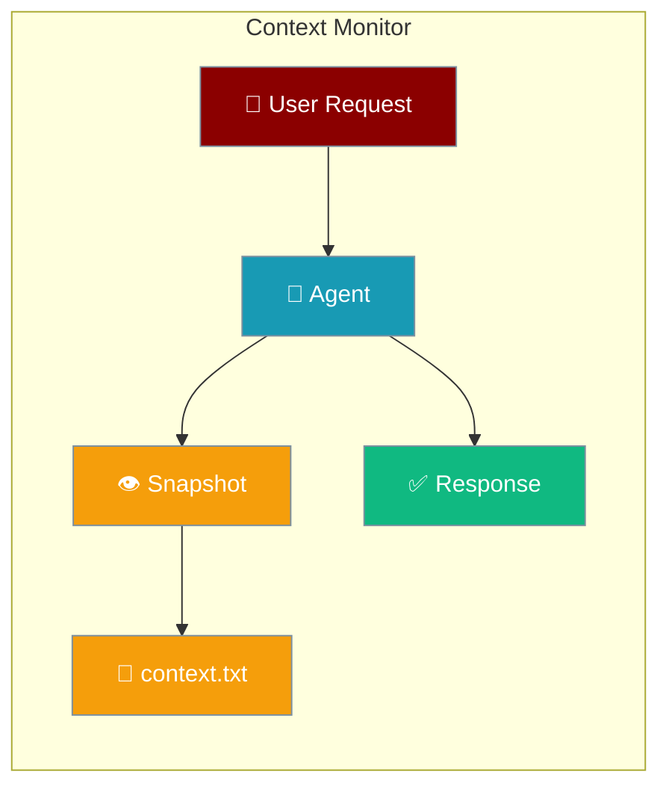
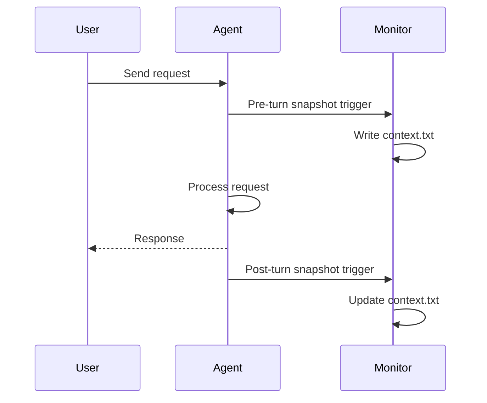

```python
from praisonaiagents import Agent, ManagerConfig

agent = Agent(
    name="monitored-agent",
    instructions="You are helpful.",
    context=ManagerConfig(monitor_enabled=True, monitor_path="./context.txt"),
)
agent.start("Hello — log what context you send to the model.")
```

# Context Monitor

The Context Monitor writes runtime context snapshots to disk, providing visibility into exactly what's being sent to the model.


The user enables context monitoring on an agent; each turn writes a snapshot so they can inspect exactly what reached the model.




## Quick Start

<Steps>
<Step title="Enable via Agent config">

```python
from praisonaiagents import Agent
from praisonaiagents import ManagerConfig

agent = Agent(
    instructions="You are helpful.",
    context=ManagerConfig(
        monitor_enabled=True,
        monitor_path="./context.txt",
        monitor_format="human",
    ),
)
agent.start("Hello — log what context you send to the model.")
```

</Step>

<Step title="Use the monitor API directly">

```python
from praisonaiagents import ContextMonitor

monitor = ContextMonitor(enabled=True, path="./context.txt", format="human")
monitor.snapshot(ledger=ledger_data, budget=budget_data, messages=messages, trigger="turn")
```

</Step>
</Steps>

## CLI Usage

```bash
# Enable monitoring when starting chat
praisonai chat --context-monitor

# Custom path and format
praisonai chat --context-monitor --context-monitor-path ./debug/context.json --context-monitor-format json

# In-session commands
/context on          # Enable monitoring
/context off         # Disable monitoring
/context dump        # Write snapshot now
/context path ./ctx  # Change output path
/context format json # Change format
```

## Output Formats

### Human-Readable (context.txt)

```
================================================================================
PRAISONAI CONTEXT SNAPSHOT
================================================================================
Timestamp: 2025-01-07T19:30:45Z
Session ID: abc123
Agent: CodeAssistant
Model: gpt-4o-mini
Model Limit: 128,000 tokens
Output Reserve: 8,000 tokens
Usable Budget: 120,000 tokens

--------------------------------------------------------------------------------
TOKEN LEDGER
--------------------------------------------------------------------------------
Component          | Tokens  | Budget  | % Used
-------------------|---------|---------|--------
System Prompt      |    1250 |    2000 |  62.5%
History            |   45000 |   72000 |  62.5%
Tool Outputs       |   18000 |   20000 |  90.0%
-------------------|---------|---------|--------
TOTAL              |   66820 |  120000 |  55.7%

--------------------------------------------------------------------------------
CONVERSATION HISTORY (12 turns)
--------------------------------------------------------------------------------
[Turn 1] USER: Help me refactor the authentication module
[Turn 2] ASSISTANT: I'll help you refactor...
...
================================================================================
```

### JSON (context.json)

```json
{
  "timestamp": "2025-01-07T19:30:45Z",
  "session_id": "abc123",
  "agent_name": "CodeAssistant",
  "model_name": "gpt-4o-mini",
  "budget": {
    "model_limit": 128000,
    "output_reserve": 8000,
    "usable": 120000
  },
  "ledger": {
    "system_prompt": 1250,
    "history": 45000,
    "tool_outputs": 18000,
    "total": 66820
  },
  "utilization": 0.557,
  "messages": [...],
  "warnings": []
}
```

## Update Frequency

| Frequency | Trigger | Use Case |
|-----------|---------|----------|
| `turn` | After each user/assistant turn | General monitoring |
| `tool_call` | Before/after each tool call | Debug tool output growth |
| `manual` | Only via `/context dump` | On-demand inspection |
| `overflow` | When budget exceeded | Alert-based |

```python
monitor = ContextMonitor(
    enabled=True,
    frequency="tool_call",  # Write on every tool call
)
```

## Sensitive Data Redaction

By default, sensitive data is redacted in snapshots:

```python
from praisonaiagents import redact_sensitive

text = "API key: sk-proj-abc123..."
redacted = redact_sensitive(text)
# Output: "API key: [REDACTED]"
```

Patterns redacted:
- API keys (`sk-`, `api_key`, etc.)
- Passwords
- Tokens
- Connection strings

```bash
# Disable redaction (not recommended)
praisonai chat --context-monitor --no-context-redact
```

## Multi-Agent Monitoring

```python
from praisonaiagents import MultiAgentMonitor

# Create per-agent monitors
multi_monitor = MultiAgentMonitor(base_path="./context/")

# Get monitor for each agent
researcher_monitor = multi_monitor.get_agent_monitor("researcher")
writer_monitor = multi_monitor.get_agent_monitor("writer")

# Enable all
multi_monitor.enable_all()
```

Output files:
```
context/
├── context_researcher.txt
├── context_writer.txt
└── context_combined.txt
```

## Safety Features

1. **Opt-in by default**: Monitoring is disabled unless explicitly enabled
2. **Redaction**: Sensitive data redacted by default
3. **Atomic writes**: Uses temp file + rename to prevent corruption
4. **Respects ignore rules**: Honors `.praisonignore` for file content

## Configuration

```yaml
# config.yaml
context:
  monitor:
    enabled: false
    path: ./context.txt
    format: human
    frequency: turn
    redact_sensitive: true
```

## Environment Variables

```bash
PRAISONAI_CONTEXT_MONITOR=true
PRAISONAI_CONTEXT_MONITOR_PATH=./context.txt
PRAISONAI_CONTEXT_MONITOR_FORMAT=human
PRAISONAI_CONTEXT_MONITOR_FREQUENCY=turn
PRAISONAI_CONTEXT_REDACT=true
```

## How It Works



---

## Best Practices

<AccordionGroup>
  <Accordion title="Enable only while debugging">
    Context monitors add I/O overhead — disable in production unless you need audit trails.
  </Accordion>
  <Accordion title="Choose human vs JSON format deliberately">
    Human snapshots are for local debugging; JSON suits automated diffing in CI.
  </Accordion>
  <Accordion title="Redact before sharing snapshots">
    Review files before attaching them to tickets — secrets should appear as `[REDACTED]`.
  </Accordion>
  <Accordion title="Snapshot on overflow events">
    Capture state when compaction triggers to reproduce what the model actually saw.
  </Accordion>
</AccordionGroup>

## Related

<CardGroup cols={2}>
<Card title="Context Management" icon="layer-group" href="/docs/features/context-management">
  Overview of context management
</Card>
<Card title="Context Optimizer" icon="compress" href="/docs/features/optimizer">
  Reduce context size automatically
</Card>
</CardGroup>
