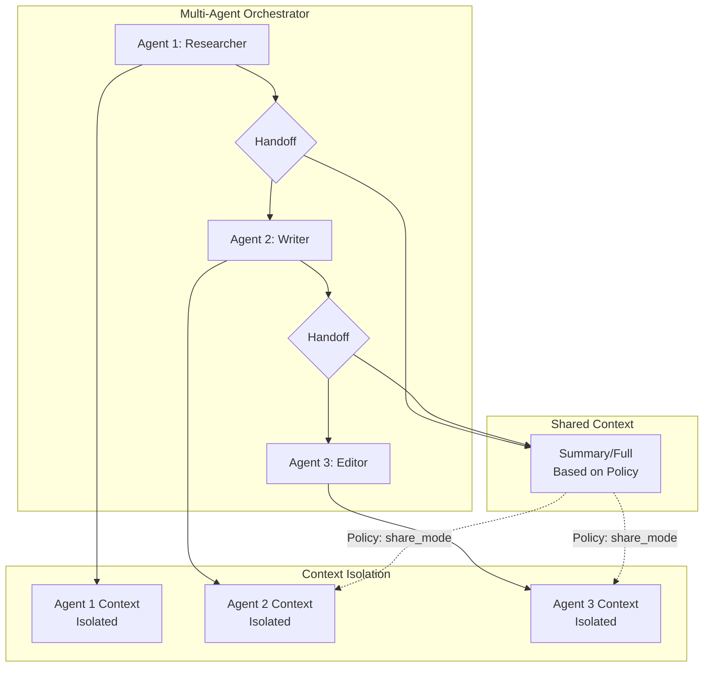

The `MultiAgentContextManager` provides per-agent context isolation with controlled sharing policies for multi-agent workflows.

## Quick Start

```python
from praisonaiagents import (
    MultiAgentContextManager,
    ContextPolicy,
    ContextShareMode,
    ToolShareMode,
)

# Create multi-agent manager
manager = MultiAgentContextManager()

# Get per-agent managers
agent1_ctx = manager.get_agent_manager("researcher")
agent2_ctx = manager.get_agent_manager("writer")

# Set sharing policy for handoffs
policy = ContextPolicy(
    share=True,
    share_mode=ContextShareMode.SUMMARY,
    max_tokens=5000,
)
manager.set_agent_policy("writer", policy)
```

## Architecture



## Context Policy

### Share Modes

| Mode | Description | Use Case |
|------|-------------|----------|
| `NONE` | No context shared | Independent agents |
| `SUMMARY` | Summarized context | Reduce token usage |
| `FULL` | Full context (bounded) | Continuity needed |

### Tool Share Modes

| Mode | Description |
|------|-------------|
| `NONE` | No tools shared |
| `SAFE` | Only safe tools shared |
| `FULL` | All tools shared |

### Policy Configuration

```python
from praisonaiagents import ContextPolicy, ContextShareMode

policy = ContextPolicy(
    share=True,                           # Enable sharing
    share_mode=ContextShareMode.SUMMARY,  # Share as summary
    max_tokens=5000,                      # Cap shared tokens
    tools_share=ToolShareMode.SAFE,       # Share safe tools
    preserve_system=True,                 # Keep system prompts
    preserve_recent_turns=3,              # Keep last 3 turns
)
```

## Handoff Preparation

```python
# Prepare context for handoff
shared_context = manager.prepare_handoff(
    from_agent="researcher",
    to_agent="writer",
    messages=researcher_messages,
    policy=policy,  # Optional override
)

# shared_context contains messages to pass to writer
writer_ctx = manager.get_agent_manager("writer")
result = writer_ctx.process(
    messages=shared_context + writer_messages,
    system_prompt=writer_system_prompt,
)
```

## Per-Agent Isolation

Each agent has isolated:
- Token budget
- Conversation history
- Optimization state
- Monitoring output

```python
# Each agent tracks independently
agent1_ctx.process(messages=agent1_messages)
agent2_ctx.process(messages=agent2_messages)

# Get combined stats
stats = manager.get_combined_stats()
print(f"Agent 1 tokens: {stats['agents']['researcher']['ledger']['total']}")
print(f"Agent 2 tokens: {stats['agents']['writer']['ledger']['total']}")
```

## Preventing Context Blow-up

Default policies prevent multiplicative context growth:

```python
# Default: no sharing
default_policy = ContextPolicy()  # share=False

# With sharing, always bounded
bounded_policy = ContextPolicy(
    share=True,
    share_mode=ContextShareMode.SUMMARY,  # Compressed
    max_tokens=5000,                       # Hard limit
    preserve_recent_turns=3,               # Only recent
)
```

## Integration with Workflow

```python
from praisonaiagents import AgentManager
from praisonaiagents import MultiAgentContextManager

# Create context manager
ctx_manager = MultiAgentContextManager()

# Create agents with context awareness
agents = AgentManager(
    agents=[researcher, writer, editor],
    process="sequential",
)

# Context is managed per-agent automatically
# Handoffs use configured policies
```

## CLI Usage

```bash
# View multi-agent context stats
praisonai run agents.yaml
> /context stats

# Shows per-agent breakdown
```

## Best Practices

1. **Default to isolation** - Only share when necessary
2. **Use summaries** - Full context sharing is expensive
3. **Set token limits** - Always bound shared context
4. **Protect recent turns** - Keep last few turns for continuity
5. **Monitor per-agent** - Track each agent's usage separately
