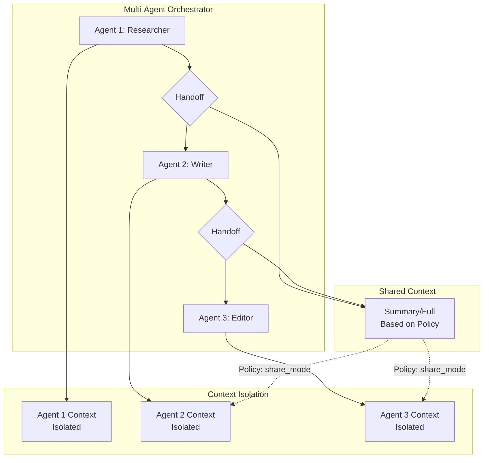

`MultiAgentContextManager` gives each agent isolated context with controlled sharing on handoffs.


```mermaid
graph LR
    A1[🤖 Researcher] --> Handoff[↔️ Handoff policy]
    Handoff --> A2[🤖 Writer]
    A2 --> Shared[📋 Shared summary]
    Shared --> A2

    classDef agent fill:#8B0000,stroke:#7C90A0,color:#fff
    classDef tool fill:#189AB4,stroke:#7C90A0,color:#fff
    classDef ok fill:#10B981,stroke:#7C90A0,color:#fff
    class A1,A2 agent
    class Handoff tool
    class Shared ok
```

## Quick Start

<Steps>
  <Step title="Create the manager">
    ```python
    from praisonaiagents import MultiAgentContextManager

    manager = MultiAgentContextManager()
    researcher_ctx = manager.get_agent_manager("researcher")
    writer_ctx = manager.get_agent_manager("writer")
    ```
  </Step>
  <Step title="Set a handoff policy">
    ```python
    from praisonaiagents import ContextPolicy, ContextShareMode

    policy = ContextPolicy(
        share=True,
        share_mode=ContextShareMode.SUMMARY,
        max_tokens=5000,
    )
    manager.set_agent_policy("writer", policy)
    ```
  </Step>
  <Step title="Prepare handoff context">
    ```python
    shared = manager.prepare_handoff(
        from_agent="researcher",
        to_agent="writer",
        messages=researcher_messages,
    )
    result = writer_ctx.process(messages=shared + writer_messages)
    ```
  </Step>
</Steps>

## Architecture


```mermaid
graph TD
    subgraph "Multi-Agent Orchestrator"
        A[Agent 1: Researcher] --> B{Handoff}
        B --> C[Agent 2: Writer]
        C --> D{Handoff}
        D --> E[Agent 3: Editor]
    end
    
    subgraph "Context Isolation"
        F[Agent 1 Context<br/>Isolated]
        G[Agent 2 Context<br/>Isolated]
        H[Agent 3 Context<br/>Isolated]
    end
    
    subgraph "Shared Context"
        I[Summary/Full<br/>Based on Policy]
    end
    
    A --> F
    C --> G
    E --> H
    B --> I
    D --> I
    I -.->|Policy: share_mode| G
    I -.->|Policy: share_mode| H
```

## Context Policy

### Share Modes

| Mode | Description | Use Case |
|------|-------------|----------|
| `NONE` | No context shared | Independent agents |
| `SUMMARY` | Summarized context | Reduce token usage |
| `FULL` | Full context (bounded) | Continuity needed |

### Tool Share Modes

| Mode | Description |
|------|-------------|
| `NONE` | No tools shared |
| `SAFE` | Only safe tools shared |
| `FULL` | All tools shared |

### Policy Configuration

```python
from praisonaiagents import ContextPolicy, ContextShareMode

policy = ContextPolicy(
    share=True,                           # Enable sharing
    share_mode=ContextShareMode.SUMMARY,  # Share as summary
    max_tokens=5000,                      # Cap shared tokens
    tools_share=ToolShareMode.SAFE,       # Share safe tools
    preserve_system=True,                 # Keep system prompts
    preserve_recent_turns=3,              # Keep last 3 turns
)
```

## Handoff Preparation

```python
# Prepare context for handoff
shared_context = manager.prepare_handoff(
    from_agent="researcher",
    to_agent="writer",
    messages=researcher_messages,
    policy=policy,  # Optional override
)

# shared_context contains messages to pass to writer
writer_ctx = manager.get_agent_manager("writer")
result = writer_ctx.process(
    messages=shared_context + writer_messages,
    system_prompt=writer_system_prompt,
)
```

## Per-Agent Isolation

Each agent has isolated:
- Token budget
- Conversation history
- Optimization state
- Monitoring output

```python
# Each agent tracks independently
agent1_ctx.process(messages=agent1_messages)
agent2_ctx.process(messages=agent2_messages)

# Get combined stats
stats = manager.get_combined_stats()
print(f"Agent 1 tokens: {stats['agents']['researcher']['ledger']['total']}")
print(f"Agent 2 tokens: {stats['agents']['writer']['ledger']['total']}")
```

## Preventing Context Blow-up

Default policies prevent multiplicative context growth:

```python
# Default: no sharing
default_policy = ContextPolicy()  # share=False

# With sharing, always bounded
bounded_policy = ContextPolicy(
    share=True,
    share_mode=ContextShareMode.SUMMARY,  # Compressed
    max_tokens=5000,                       # Hard limit
    preserve_recent_turns=3,               # Only recent
)
```

## Integration with Workflow

```python
from praisonaiagents import AgentTeam
from praisonaiagents import MultiAgentContextManager

# Create context manager
ctx_manager = MultiAgentContextManager()

# Create agents with context awareness
agents = AgentTeam(
    agents=[researcher, writer, editor],
    process="sequential",
)

# Context is managed per-agent automatically
# Handoffs use configured policies
```

## CLI Usage

```bash
# View multi-agent context stats
praisonai run agents.yaml
> /context stats

# Shows per-agent breakdown
```

---

## Best Practices

<AccordionGroup>
  <Accordion title="Default to isolation">
    Keep `share=False` until a handoff genuinely needs prior context — unbounded sharing multiplies tokens.
  </Accordion>
  <Accordion title="Prefer SUMMARY over FULL">
    `ContextShareMode.SUMMARY` keeps continuity without copying entire histories into every agent.
  </Accordion>
  <Accordion title="Always set max_tokens">
    Hard-cap shared context so downstream agents cannot inherit runaway message lists.
  </Accordion>
  <Accordion title="Preserve recent turns selectively">
    Use `preserve_recent_turns=3` for continuity while still compressing older turns.
  </Accordion>
</AccordionGroup>

---

## Related

<CardGroup cols={2}>
  <Card icon="arrow-right" href="/features/handoffs" title="Handoffs">
    Delegate tasks between agents with tool and context policies.
  </Card>
  <Card icon="layer-group" href="/features/context-manager-module" title="Context Manager">
    Single-agent budgeting and compaction facade.
  </Card>
  <Card icon="diagram-project" href="/features/multi-agent-pipelines" title="Multi-Agent Pipelines">
    Sequential and parallel orchestration patterns.
  </Card>
  <Card icon="users" href="/features/workflows" title="Workflows">
    Route, parallel, and loop patterns for agent teams.
  </Card>
</CardGroup>
